--- 
title: "STA 444/5 - Introductory Data Science using R"
author: "Derek L. Sonderegger"
date: "September 02, 2020"
site: bookdown::bookdown_site
output: bookdown::gitbook
documentclass: book
bibliography: [book.bib, packages.bib]
biblio-style: apalike
link-citations: yes
github-repo: dereksonderegger/444
cover-image: "images/Cover1.png"
description: ""
---

# Preface {-}
This book is intended to provide students with a resource for learning R while using it during an introductory statistics course. The *Introduction* section covers common issues that students in a typical statistics course will encounter and provides a simple examples and does not attempt to be exhaustive. The *Deeper Details* section addresses issues that commonly arise in many data wrangling situations and is intended to give students a deep enough understanding of R that they will be able to use it as their primary computing resource to manipulate, graph and model data.


## Other Resources{-}
There are a great number of very good online and physical resources for learning R. Hadley Wickham is the creator of many of the foundational packages we'll use in this course and he has worked on a number of wonderful teaching resources:

* Hadley Wickham and Garrett Grolemund's free online book [R for Data Science](https://r4ds.had.co.nz). This is a wonderful introduction to the `tidyverse` and is free.  If there is any book I'd recommend buying, this would be it. Many of the topics my book covers are perhaps better covered in Hadley and Garrett's book. However, I think it is better to triangulate on a concept utilizing multiple sources so I've presented my taking on teaching these concepts.
* Hadley Wickham and Jenny Bryan have a whole book on [R packages](https://r-pkgs.org) to effectively manage large projects.
* Finally Hadley Wickham also has a book about [Advanced R programming](https://adv-r.hadley.nz) and is quite helpful in understanding deeper issues relating to Object Oriented program in R, Environments, Namespaces, and function evaluation.

There are a number of other resources out there that quite good as well:

* Michael Freeman's book [Programming Skills for Data Science](https://www.amazon.com/Programming-Skills-Data-Science-Addison-Wesley/dp/0135133106). This book covers much of what we'll do in this class and is quite readable.
* Roger Peng also has an online book [R programming for Data Science](https://bookdown.org/rdpeng/rprogdatascience/) introducing R


## Acknowledgments {-}
I am grateful for the emotional and co-parenting support of my wife Aubrey, and without whom this book would not be possible. 


<!--chapter:end:index.Rmd-->

# (PART\*) Introduction {-}
# Familiarization


As always, there is a [Video Lecture](https://youtu.be/7_kK4QdoA4k) that accompanies this chapter.

R is a open-source program that is commonly used in statistics and machine learning. It runs on almost every platform and is completely free and is available at [www.r-project.org](www.r-project.org). Most cutting-edge statistical research is first available on R. 

The basic editor that comes with R works fairly well, but but it is *strongly* recommended that you run R through the program RStudio which is available at [rstudio.com](http://www.rstudio.org). This is a completely free Integrated Development Environment that works on Macs, Windows and a couple of flavors of Linux. It simplifies a bunch of more annoying aspects of the standard R GUI and supports useful things like tab completion.

R is a script based language, and there isn't a point-and-click interface for data wrangling and statistical modeling. While initially painful, writing scripts leaves a clear and reproducible description of exactly what steps were performed. This is a critical aspect of sharing your methods and results with other students, colleagues, and the world at-large.

## Working within an Rmarkdown File

The first step in any new analysis or project is to create a new Rmarkdown file. This can be done by selecting the 
`File -> New File -> R Markdown...` dropdown option and a menu will appear asking you for the document title, author, and preferred output type. In order to create a PDF, you'll need to have LaTeX installed, but the HTML output nearly always works and I've had good luck with the MS Word output as well.


Once you've created a new Rmarkdown file, you'll be presented with four different panes that you can interact with. 

|  Pane          | Location   | Description                 |
|:-----|:----|------------------------------|
|  Editor        | Top Left    | Where you edit the script. This is where you should write most all of your R code. You should write your code, then execute it from this pane. Because nobody writes code correctly the first time, you'll inevitably make some change, and then execute the code again. This will be repeated until the code finally does what you want.   |
|  Console       | Bottom Left | You can execute code directly in this pane, but the code you write won't be saved. I recommend only writing stuff here if you don't want to keep it. I only type commands in the console when using R as a calculator and I don't want to refer to the result ever again. | 
| Environment    | Top Right   | This displays the current objects that are available to you. I typically keep the `data.frame` I'm working with opened here so that I can see the column names.
|  Miscellaneous | Bottom Left | This pane gives access to the help files, the files in your current working directory, and your plots (if you have it set up to show here.) |


The R Markdown is an implementation of the Markdown syntax. It is reasonable to think of a Markdown document as just a text file with some basic structure so that it can easily be converted into either a webpage, pdf, or MS Word document. This syntax was extended to allow use to embed R commands directly into the document. 

Whenever you create a new Rmarkdown document, it is populated with code and comments that attempts to teach new users how to work with Rmarkdown. Critically there are two types of regions:

| Region Type |  Description      |
|:-----------:|:--------------------------------|
| Commentary  | These are the areas with a white background. You can write nearly anything here and in your final document it will be copied over. I typically use these spaces to write commentary and interpretation of my data analysis project.  |
| Code Chunk  |  These are the grey areas. This is where your R code will go. When knitting the document, each code chunk will be run sequentially and the code in each chunk must run. |


The R code in my document is nicely separated from my regular text using the three backticks and an instruction that it is R code that needs to be evaluated. The output of this document looks good as a HTML, PDF, or MS Word document. I have actually created this entire book using RMarkdown. To see what the the Rmarkdown file looks like for any chapter, just click on the pencil icon at the top of the online notes.

While writing an Rmarkdown file, each of the code chunks can be executed in a couple of different ways. 

1. Press the green arrow at the top of the code chunk to run the entire chunk.
2. The run button has several options has several options.
3. There are keyboard shortcuts, on the Mac it is Cmd-Return.

To insert a new code chunk, a user can type it in directly, use the green Insert button, or the keyboard shortcut.

Often we want to produce a nice output document that combines the code, output, and commentary. To do this, you'll "knit" the document which causes all of the R code to be run in a new R session, and then weave together the output into your document. This can be done using the knit button at the top of the Editor Window.


## R file Types

One of the worst things about a pocket calculator is there is no good way to go several steps and easily see what you did or fix a mistake (there is nothing more annoying than re-typing something because of a typo. To avoid these issues I always work with RMarkdown (or script) files instead of typing directly into the console. You will quickly learn that it is impossible to write R code correctly the first time and you'll save yourself a huge amount of work by just embracing this from the beginning. Furthermore, having an R file fully documents how you did your analysis, which can help when writing the methods section of a paper. Finally, having a file makes it easy to re-run an analysis after a change in the data (additional data values, transformed data, or removal of outliers).

There are three common ways to store R commands in some file: scripts, notebooks, and Rmarkdown files. The distinction between the R scripts and the other two is substantial as R scripts just store R commands, but don't make any attempt to save the results in any distinct format.  Both notebooks and Rmarkdown files save the results of an analysis and present the results in a nice readable fashion. I encourage people to use Rmarkdown files over notebooks because the Rmarkdown knitting enforces a reproducible work-flow whereas notebooks can be run out of order. Rmarkdown files are written in a way to combine the R commands, commentary, and the command outputs all together into one coherent document. For most people that use R to advance their research, using Rmarkdown is the most useful.


### R Scripts (.R files)

The first type of file that we'll discuss is a traditional script file. To create a new .R script in RStudio go to `File -> New File -> R Script`. This opens a new window in RStudio where you can type commands and functions as a common text editor. Type whatever you like in the script window and then you can execute the code line by line (using the run button or its keyboard shortcut to run the highlighted region or whatever line the curser is on) or the entire script (using the source button). Other options for what piece of code to run are available under the Code dropdown box.

It often makes your R files more readable if you break a single command up into multiple lines. R scripts will disregard all whitespace (including line breaks) so you can safely spread your command over as multiple lines. Finally, it is useful to leave comments in the script for things such as explaining a tricky step, who wrote the code and when, or why you chose a particular name for a variable. The `#` sign will denote that the rest of the line is a comment and R will ignore it.

An R script for a homework assignment might look something like this:


```r
# Problem 1 
# Calculate the log of a couple of values and make a plot
# of the log function from 0 to 3
log(0)
log(1)
log(2)
x <- seq(.1,3, length=1000)
plot(x, log(x))

# Problem 2
# Calculate the exponential function of a couple of values
# and make a plot of the function from -2 to 2
exp(-2)
exp(0)
exp(2)
x <- seq(-2, 2, length=1000)
plot(x, exp(x))
```
This looks perfectly acceptable as a way of documenting what you did, but this script file doesn't contain the actual results of commands I ran, nor does it show you the plots. Also anytime I want to comment on some output, it needs to be offset with the commenting character `#`. It would be nice to have both the commands and the results merged into one document. This is what the R Markdown file does for us.


### R Markdown (.Rmd files)

When I was a graduate student, I had to tediously copy and past tables of output from the R console and figures I had made into my Microsoft Word document. Far too often I would realize I had made a small mistake in part (b) of a problem and would have to go back, correct my mistake, and then redo all the laborious copying. I often wished that I could write both the code for my statistical analysis and the long discussion about the interpretation all in the same document so that I could just re-run the analysis with a click of a button and all the tables and figures would be updated by magic. Fortunately that magic now exists.

To create a new R Markdown document, we use the `File -> New File -> R Markdown...` dropdown option and a menu will appear asking you for the document title, author, and preferred output type. In order to create a PDF, you'll need to have LaTeX installed, but the HTML output nearly always works and I've had good luck with the MS Word output as well.

The R Markdown is an implementation of the Markdown syntax that makes it extremely easy to write webpages and give instructions for how to do typesetting sorts of things. This syntax was extended to allow use to embed R commands directly into the document. Perhaps the easiest way to understand the syntax is to look at an at the [RMarkdown website](http://rmarkdown.rstudio.com).

The R code in my document is nicely separated from my regular text using the three backticks and an instruction that it is R code that needs to be evaluated. The output of this document looks good as a HTML, PDF, or MS Word document. I have actually created this entire book using RMarkdown. To see what the the Rmarkdown file looks like for any chapter, just click on the pencil icon at the top of the online notes.

While writing an Rmarkdown file, each of the code chunks can be executed in a couple of different ways. 

    1. Press the green arrow at the top of the code chunk to run the entire chunk.
    2. The run button has several options has several options.
    3. There are keyboard shortcuts, on the Mac it is Cmd-Return.

To insert a new code chunk, a user can type it in directly, use the green Insert button, or the keyboard shortcut.

To produce a final output document that you'll present to your boss/colleagues/client where you want to combine the code, output, and commentary you'll "knit" the document which causes all of the R code to be run in a new R session, and then weave together the output into your document. This can be done using the knit button at the top of the Editor Window.


### R Notebooks (.Rmd files)

Notebooks are just very specialized types of Rmarkdown file. Here, the result of each code chunk that is run manually is saved, but when previewing the output, all of the R code is NOT re-run. Therefore it is possible to run the code, then modify the code, and then produce a document where the written code and output do not match up. As a result of this "feature" I strongly discourage the use of notebooks in favor of the standard Rmarkdown files.


## R as a simple calculator

Assuming that you have started R on whatever platform you like, you can use R as a simple calculator. In either your Rmarkdown file code chunk (or just run this in the console), run the following

```r
# Some simple addition
2+3
```

```
## [1] 5
```

In this fashion you can use R as a very capable calculator.


```r
6*8
```

```
## [1] 48
```

```r
4^3
```

```
## [1] 64
```

```r
exp(1)   # exp() is the exponential function
```

```
## [1] 2.718282
```

R has most constants and common mathematical functions you could ever want. `sin()`, `cos()`, and other trigonometry functions are available, as are the exponential and log functions `exp()`, `log()`. The absolute value is given by `abs()`, and `round()` will round a value to the nearest integer. 


```r
pi     # the constant 3.14159265...
```

```
## [1] 3.141593
```

```r
sin(0)
```

```
## [1] 0
```

```r
log(5) # unless you specify the base, R will assume base e
```

```
## [1] 1.609438
```

```r
log(5, base=10)  # base 10
```

```
## [1] 0.69897
```

Whenever I call a function, there will be some arguments that are mandatory, and some that are optional and the arguments are separated by a comma. In the above statements the function `log()` requires at least one argument, and that is the number(s) to take the log of. However, the base argument is optional. If you do not specify what base to use, R will use a default value. You can see that R will default to using base $e$ by looking at the help page (by typing `help(log)` or `?log` at the command prompt).

Arguments can be specified via the order in which they are passed or by naming the arguments. So for the `log()` function which has arguments `log(x, base=exp(1))`. If I specify which arguments are which using the named values, then order doesn't matter.


```r
# Demonstrating order does not matter if you specify
# which argument is which
log(x=5, base=10)   
```

```
## [1] 0.69897
```

```r
log(base=10, x=5)
```

```
## [1] 0.69897
```

But if we don't specify which argument is which, R will decide that `x` is the first argument, and `base` is the second.


```r
# If not specified, R will assume the second value is the base...
log(5, 10)
```

```
## [1] 0.69897
```

```r
log(10, 5)
```

```
## [1] 1.430677
```

When I specify the arguments, I have been using the `name=value` notation and a student might be tempted to use the `<-` notation here. Don't do that as the `name=value` notation is making an association mapping and not a permanent assignment.

## Assignment

We need to be able to assign a value to a variable to be able to use it later. R does this by using an arrow `<-` or an equal sign `=`. While R supports either, for readability, I suggest people pick one assignment operator and stick with it. I personally prefer to use the arrow. Variable names cannot start with a number, may not include spaces, and are case sensitive.


```r
tau <- 2*pi       # create two variables
my.test.var = 5   # notice they show up in 'Environment' tab in RStudio!
tau
```

```
## [1] 6.283185
```

```r
my.test.var
```

```
## [1] 5
```

```r
tau * my.test.var
```

```
## [1] 31.41593
```

As your analysis gets more complicated, you'll want to save the results to a variable so that you can access the results later. *If you don't assign the result to a variable, you have no way of accessing the result.* 

## Vectors

While single values are useful, it is very important that we are able to make groups of values. The most fundamental aggregation of values is called a *vector*. In R, we will require vectors to always be of the same type (e.g. all integers or all character strings). To create a vector, we just need to use the *collection* function `c()`.


```r
x <- c('A','A','B','C')
x
```

```
## [1] "A" "A" "B" "C"
```

```r
y <- c( 4, 3, 8, 10 )
y
```

```
## [1]  4  3  8 10
```

It is very common to have to make sequences of integers, and R has a shortcut to do this. The notation `A:B` will produce a vector starting with A and incrementing by one until we get to B.


```r
2:6
```

```
## [1] 2 3 4 5 6
```

## Packages
One of the greatest strengths about R is that so many people have devloped add-on packages to do some additional function. For example, plant community ecologists have a large number of multivariate methods that are useful but were not part of R.  So Jari Oksanen got together with some other folks and put together a package of functions that they found useful.  The result is the package `vegan`. 

To download and install the package from the Comprehensive R Archive Network (CRAN), you just need to ask RStudio it to install it via the menu `Tools` -> `Install Packages...`. Once there, you just need to give the name of the package and RStudio will download and install the package on your computer. 

Many major analysis types are available via downloaded packages as well as problem sets from various books (e.g. `Sleuth3` or `faraway`) and can be easily downloaded and installed from CRAN via the menu.

Once a package is downloaded and installed on your computer, it is available, but it is not loaded into your current R session by default. The reason it isn't loaded is that there are thousands of packages, some of which are quite large and only used occasionally. So to improve overall performance only a few packages are loaded by default and the you must explicitly load packages whenever you want to use them. You only need to load them once per session/script.


```r
library(vegan)   # load the vegan library
```

For a similar performance reason, many packages do not automatically load their datasets unless explicitly asked. Therefore when loading datasets from a package, you might need to do a *two-step* process of loading the package and then loading the dataset.


```r
library(faraway)       # load the package into memory
```

```
## 
## Attaching package: 'faraway'
```

```
## The following object is masked from 'package:lattice':
## 
##     melanoma
```

```r
data("butterfat")      # load the dataset into memory
```

If you don't need to load any functions from a package and you just want the datasets, you can do it in one step.


```r
data('butterfat', package='faraway')   # just load the dataset, not anything else
butterfat[1:6, ]                       # print out the first 6 rows of the data
```

```
##   Butterfat    Breed    Age
## 1      3.74 Ayrshire Mature
## 2      4.01 Ayrshire  2year
## 3      3.77 Ayrshire Mature
## 4      3.78 Ayrshire  2year
## 5      4.10 Ayrshire Mature
## 6      4.06 Ayrshire  2year
```

Similarly, if I am not using many functions from a package, I might choose call the functions using the notation `package::function()`. This is particularly important when two packages both have functions with the same name and it gets confusing which function you want to use. For example the packages `mosaic` and `dplyr` both have a function `tally`. So if I've already loaded the `dplyr` package but want to use the `mosaic::tally()` function I would use the following:

```r
mosaic::tally( c(0,0,0,1,1,1,1,2) )
```

```
## Registered S3 method overwritten by 'mosaic':
##   method                           from   
##   fortify.SpatialPolygonsDataFrame ggplot2
```

```
## Warning: `data_frame()` is deprecated as of tibble 1.1.0.
## Please use `tibble()` instead.
## This warning is displayed once every 8 hours.
## Call `lifecycle::last_warnings()` to see where this warning was generated.
```

```
## X
## 0 1 2 
## 3 4 1
```

Finally, many researchers and programmers host their packages on GitHub (or equivalent site) and those packages can easily downloaded using tools from the `devtools` package, which can be downloaded from CRAN.


```r
devtools::install_github('dereksonderegger/SiZer')
```

## Finding Help

There are many complicated details about R and nobody knows everything about how each individual package works. As a result, a robust collection of resources has been developed and you are undoubtably not the first person to wonder how to do something. 

### How does this function work?
If you know the function you need, but just don't know how to use it, the built-in documentation is really quite good. Suppose I am interested in how the `rep` function works. We could access the `rep` help page by searching in the help window or from the console via `help(rep)`. The document that is displayed shows what arguments the function expects and what it will return. At the bottom of the help page is often a set of examples demonstrating different ways to use the function. As you get more proficient in R, these help files become quite handy, but initially they feel quite overwhelming. 

### How does this package work?
If a package author really wants their package to be used by a wide audience, they will provide a "vignette". These are a set of notes that explain enough of how a package works to get a user able to utilize the package effectively. This documentation is targetted towards people the know some R, but deep technical knowledge is not expected. Whenever I encounter a new package that might be applicable to me, the first thing I do is see if it has a vignette, and if so, I start reading it. If a package doesn't have a vignette, I'll google "R package XXXX" and that will lead to documentation on CRAN that gives a list of functions in the package.

### How do I do XXX?
Often I find myself asking how to do something but I don't know the function or package to use. In those cases, I will use the coding question and answer site [stackoverflow](http://stackoverflow.com). This is particularly effective and I encourage students to spend some time to understand the solutions presented instead of just copying working code. By digging into why a particular code chunk works, you'll learn all sorts of neat tricks and you'll find yourself utilizing the site less frequently.


## Exercises {#Exercises_Familiarization}

Create an RMarkdown file that solves the following exercises.

1. Calculate $\log\left(6.2\right)$ first using base $e$ and second using base $10$. To figure out how to do different bases, it might be helpful to look at the help page for the `log` function.

2. Calculate the square root of 2 and save the result as the variable named sqrt2. Have R display the decimal value of sqrt2. *Hint: use Google to find the square root function. Perhaps search on the keywords  "R square root function".*

3. This exercise walks you through installing a package with all the datasets used in the textbook *The Statistical Sleuth*.
    a) Install the package `Sleuth3` on your computer using RStudio. 
    b) Load the package using the `library()` command.
    c) Print out the dataset `case0101`


<!--chapter:end:01_Familiarization.Rmd-->


# Data Frames


```r
# Load my favorite packages: dplyr, ggplot2, forcats, readr, and stringr
library(tidyverse, quietly = TRUE)  
```

As always, there is a [Video Lecture](https://youtu.be/4IzqPTuHycc) that accompanies this chapter.

Data frames are the fundamental unit of data storage that casual users of R need to work with. Conceptually they are just like a single tab in a spreadsheet (e.g. Excel) file. There are multiple rows and columns and each column is of the same type of information (e.g. numerical values, dates, or character strings) and each row represents a single observation.

Because the columns have meaning and we generally give them column names, it is desirable to want to access an element by the name of the column as opposed to the column number. While writing formulas in large Excel spreadsheets I often get annoyed trying to remember which column something was in and muttering “Was total biomass in column P or Q?” A system where I could just name the column `Total_Biomass` and then always refer to it that way, is much nicer to work with and I make fewer dumb mistakes.

In this chapter we will briefly cover the minimal set of tools for working with data frames. First we discuss how to import data sets, both packages from packages and from appropriately formated Excel and .csv files. Finally we'll see how to create a data frame "by hand" and to access columns and do simple manipulations. 

In this chapter, we will focus on standard R data frame manipulations so that readers gain basic familiarity with non-tidyverse accessor methods. 


## Introduction to Importing Data 

### From a Package
For many students, they will be assigned homework that utilizes data sets that are stored in some package.  To access those, we would need to first install the package if we haven't already. Recall to do that, we can use the Rstudio menu bar "Tools -> Install Packages..." mouse action. 

Because we might have thousands of packages installed on a computer, and those packages might all have data sets associated with them, they aren't loaded into memory by default. Instead we have to go through a two-step process of making sure that the package is installed on the computer, and then load the desired data set into the running session of R. Once the package is installed, we can load the data into our session via the following command: 

```r
data('alfalfa', package='faraway')   # load the data set 'alfalfa' from the package 'faraway'
```

Because R tries to avoid loading datasets until it is sure that you need them, the object `alfalfa` isn't initially loaded as a `data.frame` but rather as a "promise" that it eventually will be loaded whenever you first use it.  So lets first access it by viewing it.


```r
View(alfalfa)
```

There are two ways to enter the view command. Either executing the `View()` function from the console, or clicking on either the white table or the object name in the `Environment` tab. 


```r
# Show the image of the environment tab with the white table highlighted
```

### Import from `.csv` or `.xls` files

Often times data is stored in a "Comma Separated Values" file (with the file suffix of .csv) where the rows in the file represent the data frame rows, and the columns are just separated by commas. The first row of the file is usually the column titles. 

Alternatively, the data might be stored in an Excel file and we just need to tell R where the file is and which worksheet tab to import.

The hardest part for people that are new to programming is giving the path to the data file. In this case, I recommend students use the data import wizard that RStudio includes which is accessed via 'File -> Import Dataset'. This will then give you a choice of file types to read from (.csv files are in the "Text" options). Once you have selected the file type to import, the user is presented with a file browser window where the desired file should be located. Once the file is chosen, we can import of the file.

Critically, we should notice that the import wizard generates R code that does the actual import. We MUST copy that code into our Rmarkdown file or else the import won't happen when we try to knit the Rmarkdown into an output document because knitting always occurs in a completely fresh R session.  So only use the import wizard to generate the import code! The code generated by the import wizard ends with a `View()` command and I typically remove that as it can interfer with the knitting process. The code that I'll paste into my RMarkdown file typically looks like this:

```r
library(readxl)
Melioid_IgG <- read_excel("~/Dropbox/NAU/MAGPIX serology/Data/Melioid_IgG.xlsx")
# View(Melioid_IgG)
```


## Data Types
Data frames are required that each column have the same type. That is to say, if a column is numeric, you can just change one value to a character string.  Below are the most common data types that are commonly used within R. 

1. Integers - These are the integer numbers $\left(\dots,-2,-1,0,1,2,\dots\right)$. To convert a numeric value to an integer you may use the function `as.integer()`.

2. Numeric - These could be any number (whole number or decimal). To convert another type to numeric you may use the function `as.numeric()`.

3. Strings - These are a collection of characters (example: Storing a student's last name). To convert another type to a string, use `as.character()`.

4. Factors - These are strings that can only values from a finite set. For example we might wish to store a variable that records home department of a student. Since the department can only come from a finite set of possibilities, I would use a factor. Factors are categorical variables, but R calls them factors instead of categorical variable. A vector of values of another type can always be converted to a factor using the `as.factor()` command. For converting numeric values to factors, I will often use the function `cut()`.

5. Logicals - This is a special case of a factor that can only take on the values `TRUE` and `FALSE`. (Be careful to always capitalize `TRUE` and `FALSE`. Because R is case-sensitive, TRUE is not the same as true.) Using the function `as.logical()` you can convert numeric values to `TRUE` and `FALSE` where `0` is `FALSE` and anything else is `TRUE`.

Depending on the command, R will coerce your data from one type to another if necessary, but it is a good habit to do the coercion yourself. If a variable is a number, R will automatically assume that it is continuous numerical variable. If it is a character string, then R will assume it is a factor when doing any statistical analysis. 


Most of these types are familiar to beginning R users except for factors. Factors are how R keeps track of categorical variables. R does this in a two step pattern. First it figures out how many categories there are and remembers which category an observation belongs two and second, it keeps a vector character strings that correspond to the names of each of the categories. 


```r
# A character vector
y <- c('B','B','A','A','C')
y
```

```
## [1] "B" "B" "A" "A" "C"
```

```r
# convert the vector of characters into a vector of factors 
z <- factor(y)
str(z)
```

```
##  Factor w/ 3 levels "A","B","C": 2 2 1 1 3
```

Notice that the vector `z` is actually the combination of group assignment vector `2,2,1,1,3` and the group names vector `“A”,”B”,”C”`. So we could convert z to a vector of numerics or to a vector of character strings.

```r
as.numeric(z)
```

```
## [1] 2 2 1 1 3
```

```r
as.character(z)
```

```
## [1] "B" "B" "A" "A" "C"
```

Often we need to know what possible groups there are, and this is done using the `levels()` command.


```r
levels(z)
```

```
## [1] "A" "B" "C"
```

Notice that the order of the group names was done alphabetically, which we did not chose. This ordering of the levels has implications when we do an analysis or make a plot and R will always display information about the factor levels using this order. It would be nice to be able to change the order. Also it would be really nice to give more descriptive names to the groups rather than just the group code in my raw data. Useful functions for controling the order and labels of the factor can be found in the `forcats` package which we use in a later chapter.


## Basic Manipulation
Occasionally I'll need to create a small data frame "by hand" to facilitate creating graphs in ggplot2. In this final section, we'll cover creating a data frame and doing simple manipulations using the base R commands and syntax.

To create a data frame, we have to squish together a bunch of columns vectors. The command `data.frame()` does exactly that. In the example below, I list the names, ages and heights (in inches) of my family.


```r
family <- data.frame(
  Names = c('Derek', 'Aubrey', 'Elise', 'Casey'),
  Age   = c(42, 39, 6, 3),
  Height.in = c(64, 66, 43, 39) 
)
family
```

```
##    Names Age Height.in
## 1  Derek  42        64
## 2 Aubrey  39        66
## 3  Elise   6        43
## 4  Casey   3        39
```

To access a particular column, we could use the `$` operator.  We could then do something like calculate the mean or standard deviation.

```r
family$Age
```

```
## [1] 42 39  6  3
```

```r
mean( family$Age )
```

```
## [1] 22.5
```

```r
sd( family$Age )
```

```
## [1] 20.85665
```

As an alternative to the "$" operator, we could use the `[row, column]` notation. To select a particular row or column, we can select them by either name or location.

```r
family[ , 'Age']    # all the rows, Age column
```

```
## [1] 42 39  6  3
```

```r
family[ 2, 'Age']  # age of person in row 2
```

```
## [1] 39
```

Next we could calculate everybodies height in centimeters by multiplying the heights by 2.54 and saving the result in column appropriately named.

```r
family$Height.cm <- family$Height.in * 2.54  # calculate the heights and save them!
family                                       # view our result!
```

```
##    Names Age Height.in Height.cm
## 1  Derek  42        64    162.56
## 2 Aubrey  39        66    167.64
## 3  Elise   6        43    109.22
## 4  Casey   3        39     99.06
```


## Exercises  {#Exercises_IntroDataFrames}
1. Create a data frame "by hand" with the names, ages, and heights of your own family. *If this feels excessively personal, feel free to make up people or include pets.*

2. Calculate the mean age among your family.

3. I have a spreadsheet file hosted on GitHub at https://raw.githubusercontent.com/dereksonderegger/570L/master/data-raw/Example_1.csv. Because the `readr` package doesn't care whether a file is on your local computer or on the Internet, we'll use this file. 
    a) Start the import wizard using: "File -> Import Dataset -> From Text (readr) ..." and input the above web URL. Click the update button near the top to cause the wizard to preview the result.
    b) Save the generated code to your Rmarkdown file and show the first few rows using the `head()` command.

<!--chapter:end:02_Intro_to_DataFrames.Rmd-->

# Graphing


```r
library(tidyverse)   # loading ggplot2 and dplyr
```

As always, there is a [Video Lecture](https://youtu.be/eJT9EdiWlEg) that accompanies this chapter.

There are three major “systems” of making graphs in R. The basic plotting commands in R are quite effective but the commands do not have a way of being combined in easy ways. Lattice graphics (which the `mosaic` package uses) makes it possible to create some quite complicated graphs but it is very difficult to do make non-standard graphs. The last package, `ggplot2` tries to not anticipate what the user wants to do, but rather provide the mechanisms for pulling together different graphical concepts and the user gets to decide which elements to combine. 

To make the most of `ggplot2` it is important to wrap your mind around “The Grammar of Graphics”. Briefly, the act of building a graph can be broken down into three steps. 

1. Define what data set we are using. 

2. What is the major relationship we wish to examine? 

3. In what way should we present that relationship? These relationships can be presented in multiple ways, and the process of creating a good graph relies on building layers upon layers of information. For example, we might start with printing the raw data and then overlay a regression line over the top. 

Next, it should be noted that `ggplot2` is designed to act on data frames. It is actually hard to just draw three data points and for simple graphs it might be easier to use the base graphing system in R. However for any real data analysis project, the data will already be in a data frame and this is not an annoyance.

These notes are sufficient for creating simple graphs using `ggplot2`, but are not intended to be exhaustive. There are many places online to get help with `ggplot2`. One very nice resource is the website, [http://www.cookbook-r.com/Graphs/](http://www.cookbook-r.com/Graphs/), which gives much of the information available in the book R Graphics Cookbook which I highly recommend. Second is just googling your problems and see what you can find on websites such as StackExchange.

One way that `ggplot2` makes it easy to form very complicated graphs is that it provides a large number of basic building blocks that, when stacked upon each other, can produce extremely complicated graphs. A full list is available at [http://docs.ggplot2.org/current/](http://docs.ggplot2.org/current/) but the following list gives some idea of different building blocks. These different geometries are different ways to display the relationship between variables and can be combined in many interesting ways.

|  Geom	           |    Description                                     |   Required Aesthetics  |
|------------------|----------------------------------------------------|------------------------|
| `geom_histogram` | A histogram                                        | `x`    |
| `geom_bar`       | A barplot (y is number of rows)                    | `x`    |
| `geom_col`       | A barplot (y is given by a column)                 | `x, y` |
| `geom_density`   | A density plot of data. (smoothed histogram)       | `x`    |
| `geom_boxplot`   | Boxplots                                           | `x, y` |
| `geom_line`      | Draw a line (after sorting x-values)               | `x, y` |
| `geom_path`      | Draw a line (without sorting x-values)             | `x, y` |
| `geom_point`     | Draw points (for a scatterplot)                    | `x, y`                 |
| `geom_smooth`	   |  Add a ribbon that summarizes a scatterplot        | `x, y`                 |
| `geom_ribbon`	   | Enclose a region, and color the interior           | `ymin, ymax` |
| `geom_errorbar`  | Error bars                                         | `ymin, ymax` |
| `geom_text`      |  Add text to a graph                               | `x, y, label` |
| `geom_label`     | Add text to a graph                                | `x, y, label`          |
| `geom_tile`      |  Create Heat map                                   | `x, y, fill`           |


A graph can be built up layer by layer, where:

* Each layer corresponds to a `geom`, each of which requires a dataset and a mapping between an aesthetic and a column of the data set.
    * If you don't specify either, then the layer inherits everything defined in the `ggplot()` command.
    * You can have different datasets for each layer!
* Layers can be added with a `+`, or you can define two plots and add them together (second one over-writes anything that conflicts).


## Basic Graphs


### Scatterplots

To start with, we'll make a very simple scatterplot using the `iris` dataset. The `iris` dataset contains observations on three species of iris plants where we've measured the length and width of both the petals and sepals.  We will make a scatterplot of `Sepal.Length` versus `Petal.Length`, which are two columns in the dataset.


```r
data(iris)  # load the iris dataset that comes with R
str(iris)   # what columns do we have to play with...
```

```
## 'data.frame':	150 obs. of  5 variables:
##  $ Sepal.Length: num  5.1 4.9 4.7 4.6 5 5.4 4.6 5 4.4 4.9 ...
##  $ Sepal.Width : num  3.5 3 3.2 3.1 3.6 3.9 3.4 3.4 2.9 3.1 ...
##  $ Petal.Length: num  1.4 1.4 1.3 1.5 1.4 1.7 1.4 1.5 1.4 1.5 ...
##  $ Petal.Width : num  0.2 0.2 0.2 0.2 0.2 0.4 0.3 0.2 0.2 0.1 ...
##  $ Species     : Factor w/ 3 levels "setosa","versicolor",..: 1 1 1 1 1 1 1 1 1 1 ...
```


```r
ggplot( data=iris, aes(x=Sepal.Length, y=Petal.Length) ) +  
	geom_point(  ) 
```

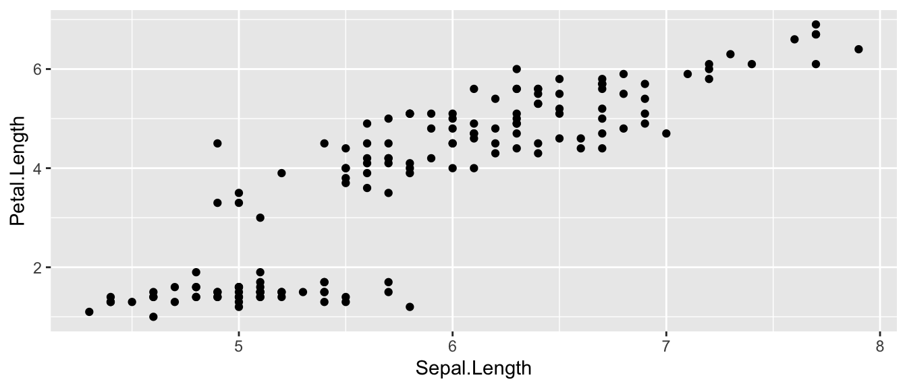

1. The data set we wish to use is specified using `data=iris`.
2. The relationship we want to explore is `x=Sepal.Length` and `y=Petal.Length`. This means the x-axis will be the Sepal Length and the y-axis will be the Petal Length.
3. The way we want to display this relationship is through graphing 1 point for every observation.

We can define other attributes that might reflect other aspects of the data. For example, we might want for the color of the data point to change dynamically based on the species of iris. 


```r
ggplot( data=iris, aes(x=Sepal.Length, y=Petal.Length) ) +  
	geom_point( aes(color=Species) )
```

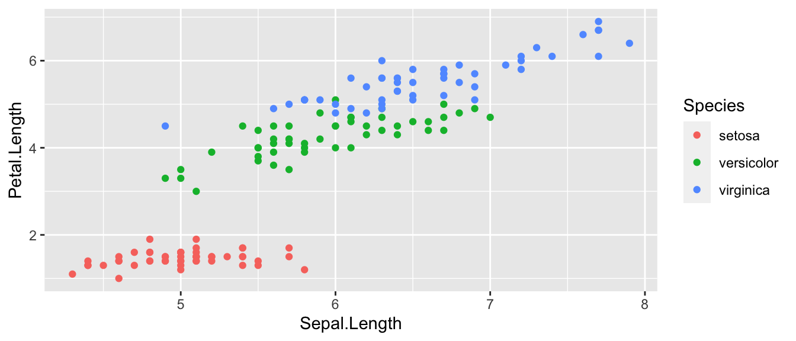

The `aes()` command inside the previous section of code is quite mysterious. The way to think about the `aes()` is that it gives you a way to define relationships that are data dependent. In the previous graph, the x-value and y-value for each point was defined dynamically by the data, as was the color. If we just wanted all the data points to be colored blue and larger, then the following code would do that


```r
ggplot( data=iris, aes(x=Sepal.Length, y=Petal.Length) ) +  
	geom_point( color='blue', size=4 )
```

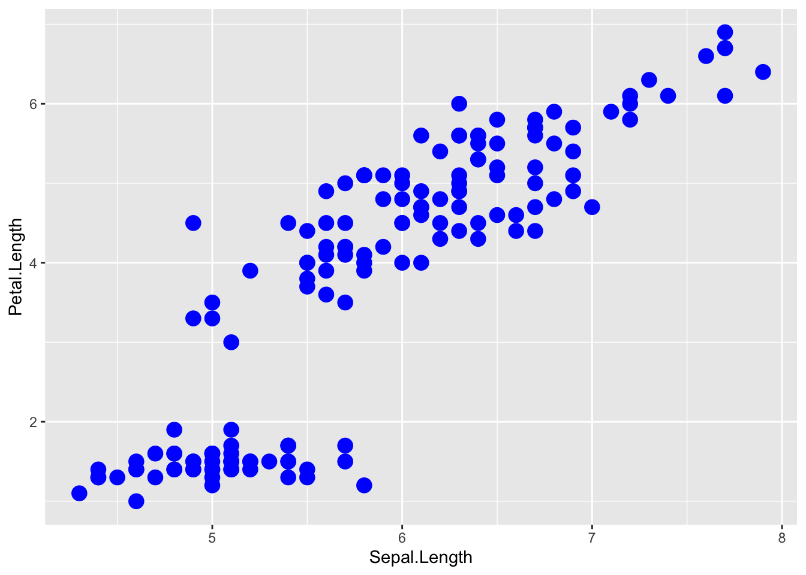


The important part isn't that color and size were defined in the `geom_point()` but that they were defined outside of an `aes()` function! 

1. Anything set inside an `aes()` command will be of the form `attribute=Column_Name` and will change based on the data.
2. Anything set outside an `aes()` command will be in the form `attribute=value` and will be fixed. 


### Box Plots 

Boxplots are a common way to show a categorical variable on the x-axis and continuous on the y-axis. 

```r
ggplot(iris, aes(x=Species, y=Petal.Length)) +
  geom_boxplot() 
```

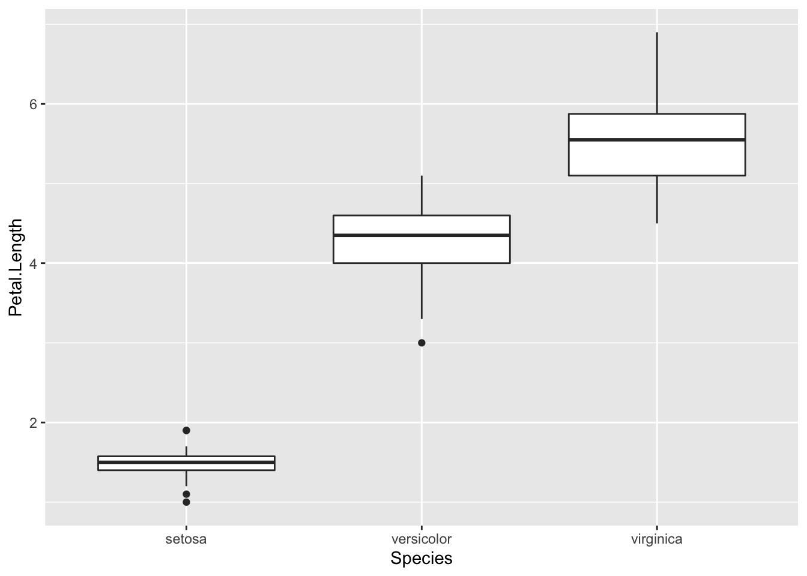

The boxes show the $25^{th}$, $50^{th}$, and $75^{th}$ percentile and the lines coming off the box extend to the smallest and largest non-outlier observation.  


## Faceting

The goal with faceting is to make many panels of graphics where each panel represents the same relationship between variables, but something changes between each panel. For example using the `iris` dataset we could look at the relationship between `Sepal.Length` and `Petal.Length` either with all the data in one graph, or one panel per species.


```r
library(ggplot2)
ggplot(iris, aes(x=Sepal.Length, y=Petal.Length)) +
  geom_point() +
  facet_grid( . ~ Species )
```

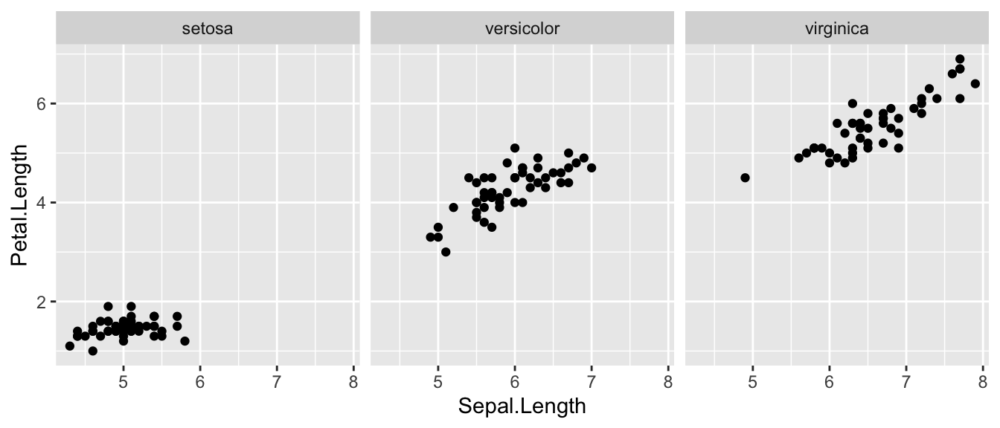

The line `facet_grid( formula )` tells `ggplot2` to make panels, and the formula tells how to orient the panels. In R formulas are always interpretated in the order `y ~ x`. Because I want the species to change as we go across the page, but don't have anything I want to change vertically we use `. ~ Species` to represent that. If we had wanted three graphs stacked then we could use `Species ~ .`. 

For a second example, we look at a dataset that examines the amount a waiter was tipped by 244 parties. Covariates that were measured include the day of the week, size of the party, total amount of the bill, amount tipped, whether there were smokers in the group and the gender of the person paying the bill


```r
data(tips, package='reshape')
head(tips)
```

```
##   total_bill  tip    sex smoker day   time size
## 1      16.99 1.01 Female     No Sun Dinner    2
## 2      10.34 1.66   Male     No Sun Dinner    3
## 3      21.01 3.50   Male     No Sun Dinner    3
## 4      23.68 3.31   Male     No Sun Dinner    2
## 5      24.59 3.61 Female     No Sun Dinner    4
## 6      25.29 4.71   Male     No Sun Dinner    4
```

It is easy to look at the relationship between the size of the bill and the percent tipped.


```r
ggplot(tips, aes(x = total_bill, y = tip / total_bill )) +
  geom_point()
```

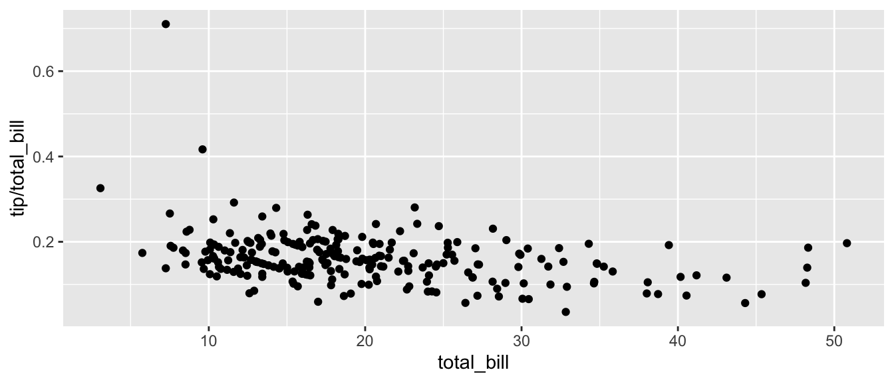

Next we ask if there is a difference in tipping percent based on gender or day of the week by plotting this relationship for each combination of gender and day.


```r
ggplot(tips, aes(x = total_bill, y = tip / total_bill, color=time )) +
  geom_point() +
  facet_grid( sex ~ day )
```

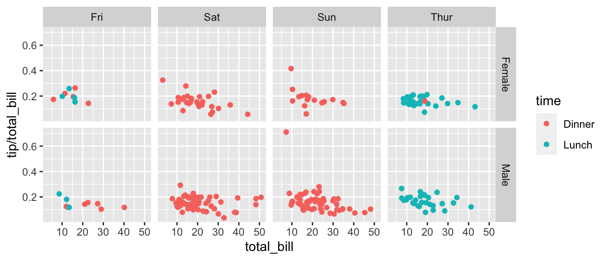

```r
#  facet_grid( day ~ sex )  # changing orientation emphasizes certain comparisons!
```

Sometimes we want multiple rows and columns of the facets, but there is only one categorical variable with many levels. In that case we use facet_wrap which takes a one-sided formula.

```r
ggplot(tips, aes(x = total_bill, y = tip / total_bill )) +
  geom_point() +
#  facet_grid( . ~ day)  # Four graphs in a row, Too Squished left/right!
  facet_wrap( ~ day )   # spread graphs out both left/right and up/down.
```

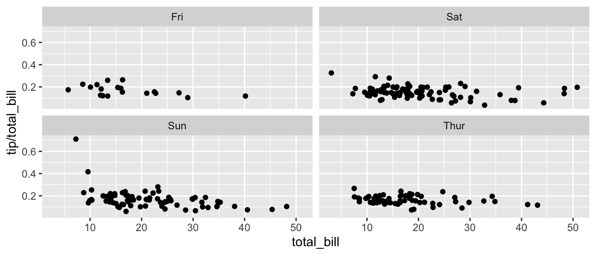


Finally we can allow the x and y scales to vary between the panels by setting “free”, “free_x”, or “free_y”. In the following code, the y-axis scale changes between the gender groups.

```r
ggplot(tips, aes(x = total_bill, y = tip / total_bill )) +
  geom_point() +
  facet_grid( sex ~ day, scales="free_y" )
```


## Annotation 

### Axis Labels and Titles
To make a graph more understandable, it is necessary to tweak the axis labels and add a main title and such. Here we'll adjust labels in a graph, including the legend labels.

```r
# Save the graph before I add more to it.
P <-
  ggplot( data=iris, aes(x=Sepal.Length, y=Petal.Length, color=Species) ) +  
	geom_point( aes(color=Species)  ) +
  labs( title='Sepal Length vs Petal Length' ) +
  labs( x="Sepal Length (cm)", y="Petal Length (cm)" ) +
  labs( color="Species Name")  + 
  labs( caption = "Iris data from Edgar Anderson (1935)" )

# Print out the plot
P
```

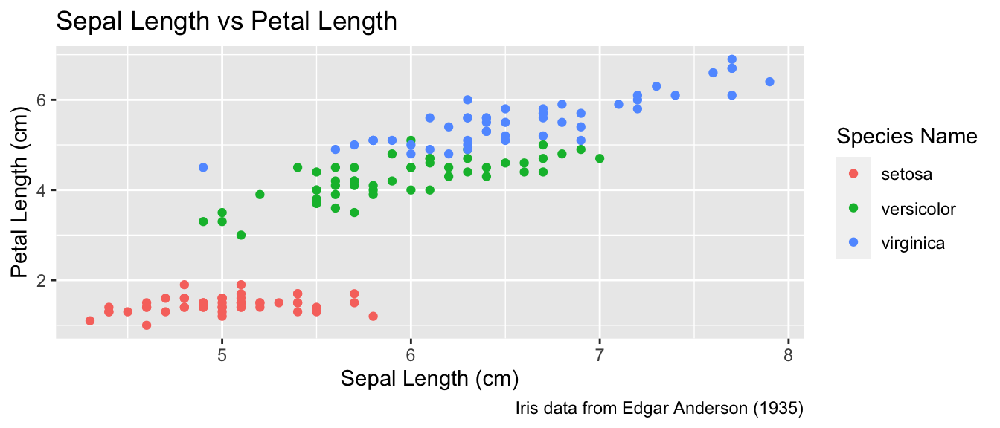

You could either call the `labs()` command repeatedly with each label, or you could provide multiple arguments to just one `labs()` call.  

### Text Labels
One way to improve the clarity of a graph is to remove the legend and label the points directly on the graph. For example, we could instead have the species names near the cloud of data points for the species. 

Usually our annotations aren't stored in the `data.frame` that contains our data of interest. So we need to either create a new (usually small) `data.frame` that contains all the information needed to create the annotation or we need to set the necessary information in-place. Either way, we need to specify the `x` and `y` coordinates, the `label` to be printed as well as any other attribute that is set in the global `aes()` command. That means if `color` has been set globally, the annotation layer also needs to address the `color` attribute.

#### Using a `data.frame`
To do this in ggplot, we need to make a data frame that has the columns `Sepal.Length` and `Petal.Length` so that we can specify where each label should go, as well as the label that we want to print. Also, because color is matched to the `Species` column, this small dataset should also have a the `Species` column.

This step always requires a bit of fussing with the graph because the text size and location should be chosen based on the size of the output graphic and if I rescale the image it often looks awkward. Typically I leave this step until the figure is being prepared for final publication.


```r
# create another data frame that has the text labels I want to add to the graph.
annotation.data <- data.frame(
  Sepal.Length = c(4.5,  6.5,  7.0),  # Figured out the label location by eye.
  Petal.Length = c(2.25, 3.75, 6.5),  # If I rescale the graph, I would redo this step.
  Species = c('setosa', 'versicolor', 'virginica'),
  Text = c('SETOSA', 'VERSICOLOR', 'VIRGINICA')
)

# Use the previous plot I created, along with the 
# aes() options already defined.
P +
  geom_text( data=annotation.data, aes(label=Text), size=2.5) +   # write the labels
  theme( legend.position = 'none' )                               # remove the legend
```

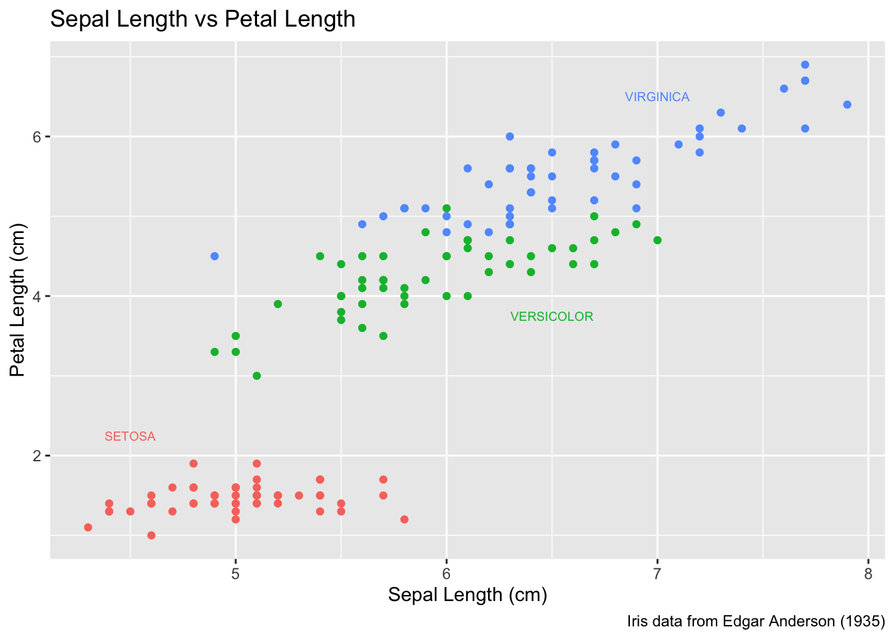


#### Setting attributes in-line
Instead of creating a new data frame, we could just add a new layer and just set all of the graph attributes manually. To do this, we have to have one layer for each text we want to add to the graph. The `annotate` function takes a geom layer type and the necessary inputs an allows us to avoid the annoyance of building a labels data frame.

```r
P +
  annotate('text', x=4.5, y=2.25, size=6, color='#F8766D', label='SETOSA'     ) +
  annotate('text', x=6.5, y=3.75, size=6, color='#00BA38', label='VERSICOLOR' ) +
  annotate('text', x=7.0, y=6.50, size=6, color='#619CFF', label='VIRGINICA'  ) +
  theme(legend.position = 'none')
```

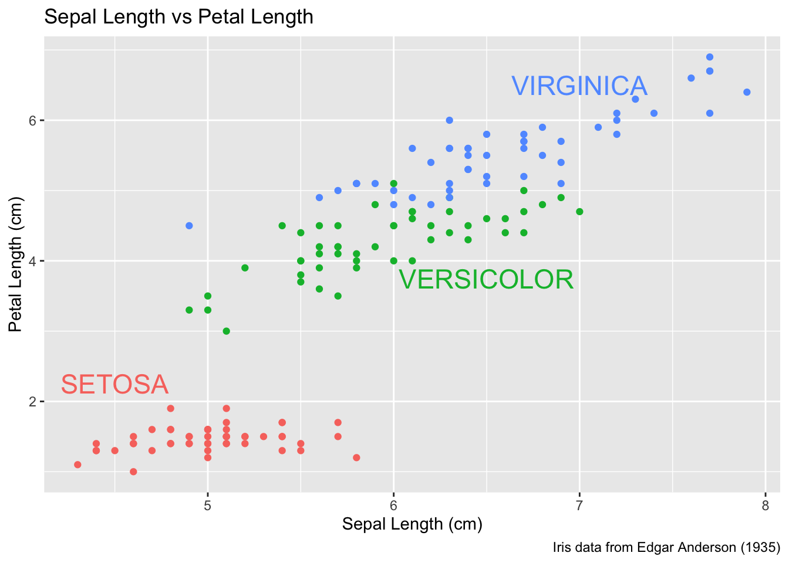


Finally there is a `geom_label` layer that draws a nice box around what you want to print.


```r
P +
  annotate('label', x=4.5, y=2.25, size=6, color='#F8766D', label='SETOSA'     ) +
  annotate('label', x=6.5, y=3.50, size=6, color='#00BA38', label='VERSICOLOR' ) +
  annotate('label', x=7.0, y=6.75, size=6, color='#619CFF', label='VIRGINICA'  ) +
  theme(legend.position = 'none')
```

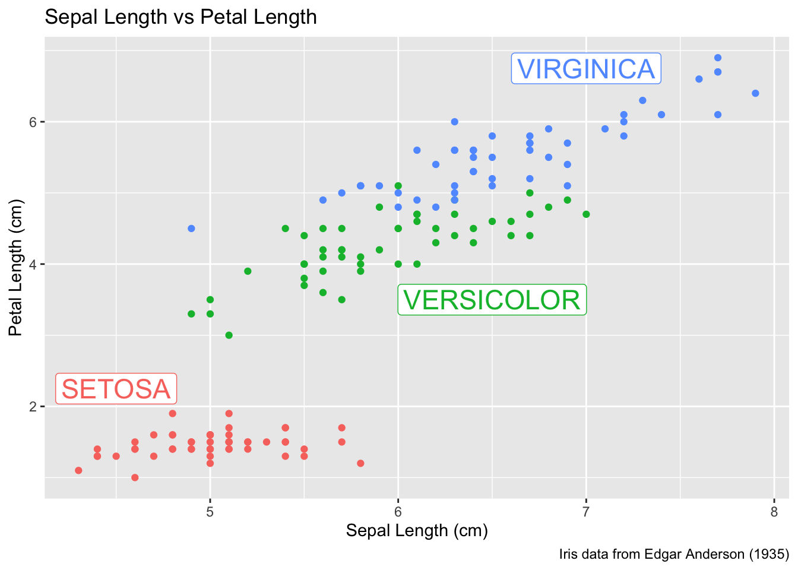

My recommendation is to just set the `x`, `y`, and `label` attributes manually inside an `annotate()` call if you have one or two annotations to print on the graph. If you have many annotations to print, the create a data frame that contains all of them and use `data=` argument in the geom to use that created annotation data set.

## Exercises  {#Exercises_IntroGraphing}

1. Examine the dataset `trees`, which should already be pre-loaded. Look at the help file using `?trees` for more information about this data set. We wish to build a scatterplot that compares the height and girth of these cherry trees to the volume of lumber that was produced.  
    a) Create a graph using ggplot2 with Height on the x-axis, Volume on the y-axis, and Girth as the either the size of the data point or the color of the data point. Which do you think is a more intuitive representation?
    b) Add appropriate labels for the main title and the x and y axes.
    c) The R-squared value for a regression through these points is 0.36 and the p-value for the statistical significance of height is 0.00038.  Add text labels "R-squared = 0.36" and "p-value = 0.0004" somewhere on the graph. 
    
2. Consider the following small dataset that represents the number of times per day my wife played "Ring around the Rosy” with my daughter relative to the number of days since she has learned this game. The column `yhat` represents the best fitting line through the data, and `lwr` and `upr` represent a 95% confidence interval for the predicted value on that day. *Because these questions ask you to produce several graphs and evaluate which is better and why, please include each graph and response with each sub-question.*
    
    ```r
    Rosy <- data.frame(
      times = c(15, 11, 9, 12, 5, 2, 3),
      day   = 1:7,
      yhat  = c(14.36, 12.29, 10.21, 8.14, 6.07, 4.00,  1.93),
      lwr   = c( 9.54,  8.5,   7.22, 5.47, 3.08, 0.22, -2.89),
      upr   = c(19.18, 16.07, 13.2, 10.82, 9.06, 7.78,  6.75))
    ```
    
    a) Using `ggplot()` and `geom_point()`, create a scatterplot with `day` along the x-axis and `times` along the y-axis.
    
    b) Add a line to the graph where the x-values are the `day` values but now the y-values are the predicted values which we've called `yhat`. Notice that you have to set the aesthetic y=times for the points and y=yhat for the line. Because each `geom_` will accept an `aes()` command, you can specify the `y` attribute to be different for different layers of the graph.
    
    c) Add a ribbon that represents the confidence region of the regression line. The `geom_ribbon()` function requires an `x`, `ymin`, and `ymax` columns to be defined. For examples of using `geom_ribbon()` see the online documentation: [http://docs.ggplot2.org/current/geom_ribbon.html](http://docs.ggplot2.org/current/geom_ribbon.html).
        
        ```r
        ggplot(Rosy, aes(x=day)) +
          geom_point(aes(y=times)) +
          geom_line( aes(y=yhat)) +
          geom_ribbon( aes(ymin=lwr, ymax=upr), fill='salmon')
        ```
    d) What happened when you added the ribbon? Did some points get hidden? If so, why?
    e) Reorder the statements that created the graph so that the ribbon is on the bottom and the data points are on top and the regression line is visible.
    f) The color of the ribbon fill is ugly. Use Google to find a list of named colors available to `ggplot2`. For example, I googled “ggplot2 named colors” and found the following link: [http://sape.inf.usi.ch/quick-reference/ggplot2/colour](http://sape.inf.usi.ch/quick-reference/ggplot2/colour). Choose a color for the fill that is pleasing to you.
    g) Add labels for the x-axis and y-axis that are appropriate along with a main title.


3. We'll next make some density plots that relate several factors towards the birth weight of a child. *Because these questions ask you to produce several graphs and evaluate which is better and why, please include each graph and response with each sub-question.*
    a) The `MASS` package contains a dataset called `birthwt` which contains information about 189 babies and their mothers. In particular there are columns for the mother's race and smoking status during the pregnancy. Load the `birthwt` by either using the `data()` command or loading the `MASS` library. 
    b) Read the help file for the dataset using `MASS::birthwt`. The covariates `race` and `smoke` are not stored in a user friendly manner. For example, smoking status is labeled using a 0 or a 1. Because it is not obvious which should represent that the mother smoked, we'll add better labels to the `race` and `smoke` variables. For more information about dealing with factors and their levels, see the `Factors` chapter in these notes.
        
        ```r
        library(tidyverse)
        data('birthwt', package='MASS')
        birthwt <- birthwt %>% mutate(
          race  = factor(race,  labels=c('White','Black','Other')),
          smoke = factor(smoke, labels=c('No Smoke', 'Smoke')))
        ```
    c) Graph a histogram of the birth weights `bwt` using `ggplot(birthwt, aes(x=bwt)) + geom_histogram()`.
    d) Make separate graphs that denote whether a mother smoked during pregnancy by appending `+ facet_grid()` command to your original graphing command.
    e) Perhaps race matters in relation to smoking. Make our grid of graphs vary with smoking status changing vertically, and race changing horizontally (that is the formula in `facet_grid()` should have smoking be the y variable and race as the x).
    f) Remove `race` from the facet grid, (so go back to the graph you had in part d). I'd like to next add an estimated density line to the graphs, but to do that, I need to first change the y-axis to be density (instead of counts), which we do by using `aes(y=..density..)` in the `ggplot()` aesthetics command.
    g) Next we can add the estimated smooth density using the `geom_density()` command.
    h) To really make this look nice, lets change the fill color of the histograms to be something less dark, lets use `fill='cornsilk'` and `color='grey60'`. To play with different colors that have names, check out the following: [http://www.stat.columbia.edu/~tzheng/files/Rcolor.pdf].
    i) Change the order in which the histogram and the density line are added to the plot. Does it matter and which do you prefer?
    j) Finally consider if you should have the histograms side-by-side or one ontop of the other (i.e. `. ~ smoke` or `smoke ~ .`). Which do you think better displayes the decrease in mean birthweight and why?

4. Load the dataset `ChickWeight` which comes preloaded in R and get the background on the dataset by reading the manual page `?ChickWeight`. *Because these questions ask you to produce several graphs and evaluate which is better and why, please include each graph and response with each sub-question.*
    a) Produce a separate scatter plot of weight vs age for each chick. Use color to distinguish the four different `Diet` treatments.
    b) We could examine this data by producing a scatterplot for each diet. Most of the code below is readable, but if we don't add the `group` aesthetic the lines would not connect the dots for each Chick but would instead connect the dots across different chicks.
        
        ```r
        data(ChickWeight)
        ggplot(ChickWeight, aes(x=Time, y=weight, group=Chick )) +
          geom_point() + geom_line() +
          facet_grid( ~ Diet) 
        ```
  


<!--chapter:end:03_Intro_to_Graphing.Rmd-->

# Data Wrangling


```r
library(tidyverse, quietly = TRUE)    # loading ggplot2 and dplyr
options(dplyr.summarise.inform=FALSE) # Don't annoy me with summaris messages
```

As always, there is a [Video Lecture](https://youtu.be/99Q7AunWuk0) that accompanies this chapter.
  
Many of the tools to manipulate data frames in R were written without a consistent syntax and are difficult use together. To remedy this, Hadley Wickham (the writer of `ggplot2`) introduced a package called plyr which was quite useful. As with many projects, his first version was good but not great and he introduced an improved version that works exclusively with data.frames called `dplyr` which we will investigate. The package `dplyr` strives to provide a convenient and consistent set of functions to handle the most common data frame manipulations and a mechanism for chaining these operations together to perform complex tasks. 

The Dr Wickham has put together a very nice introduction to the package that explains in more detail how the various pieces work and I encourage you to read it at some point. [http://cran.rstudio.com/web/packages/dplyr/vignettes/introduction.html].

One of the aspects about the `data.frame` object is that R does some simplification for you, but it does not do it in a consistent manner. Somewhat obnoxiously character strings are always converted to factors and subsetting might return a `data.frame` or a `vector` or a `scalar`.  This is fine at the command line, but can be problematic when programming. Furthermore, many operations are pretty slow using `data.frame`. To get around this, Dr Wickham introduced a modified version of the `data.frame` called a `tibble`. A `tibble` is a `data.frame` but with a few extra bits. For now we can ignore the differences.

The pipe command `%>%` allows for very readable code. The idea is that the `%>%` operator works by translating the command `a %>% f(b)` to the expression `f(a,b)`. This operator works on any function and was introduced in the `magrittr` package. The beauty of this comes when you have a suite of functions that takes input arguments of the same type as their output. 

For example, if we wanted to start with `x`, and first apply function `f()`, then `g()`, and then `h()`, the usual R command would be `h(g(f(x)))` which is hard to read because you have to start reading at the *innermost* set of parentheses. Using the pipe command `%>%`, this sequence of operations becomes `x %>% f() %>% g() %>% h()`.


|     Written         |  Meaning       |
|:-------------------:|:--------------:|
| `a %>% f(b)`        |   `f(a,b)`     |
| `b %>% f(a, .)`     |   `f(a, b)`    |
| `x %>% f() %>% g()` |  `g( f(x) )`   |


```r
# This code is not particularly readable because
# the order of summing vs taking absolute value isn't 
# completely obvious. 
sum(abs(c(-1,0,1)))
```

```
## [1] 2
```

```r
# But using the pipe function, it is blatantly obvious
# what order the operations are done in. 
c( -1, 0, 1) %>%  # take a vector of values
  abs()  %>%      # take the absolute value of each
  sum()           # add them up.
```

```
## [1] 2
```


In `dplyr`, all the functions below take a _data set as its first argument_ and _outputs an appropriately modified data set_. This will allow me to chain together commands in a readable fashion. The pipe command works with any function, not just the `dplyr` functions and I often find myself using it all over the place.


## Verbs

The foundational operations to perform on a data set are:

* Adding rows 
    - `add_row` - Add an additional single row of data, specified by cell
    - `bind_rows` - Add additional rows of data, specified by a single data frame.

* Subsetting - Returns a data set with particular columns or rows

    – `select` - Selecting a subset of columns by name or column number.

    – `filter` - Selecting a subset of rows from a data frame based on logical expressions.

    – `slice` - Selecting a subset of rows by row number.

* `arrange` - Re-ordering the rows of a data frame.

* `mutate` - Add a new column that is some function of other columns.

* `summarise` - calculate some summary statistic of a column of data. This collapses a set of rows into a single row.

Each of these operations is a function in the package `dplyr`. These functions all have a similar calling syntax, the first argument is a data set, subsequent arguments describe what to do with the input data frame and you can refer to the columns without using the `df$column` notation. All of these functions will return a data set.


To demonstrate all of these actions, we will consider a tiny dataset of a gradebook of doctors at a Sacred Heart Hospital.


```r
# Create a tiny data frame that is easy to see what is happening
Mentors <- tribble(
  ~l.name, ~Gender, ~Exam1, ~Exam2, ~Final,
  'Cox',     'M',     93,     98,     96,
  'Kelso',   'M',     80,     82,     81)
Residents <- tribble(
  ~l.name, ~Gender, ~Exam1, ~Exam2, ~Final,
  'Dorian',  'M',     89,     70,     85,
  'Turk',    'M',     70,     85,     92)
```


### `add_row`
Suppose that we want to add a row to our dataset. We can give it as much or as little information as we want and any missing information will be denoted as missing using a `NA` which stands for *N*ot *A*vailable.

```r
Residents  %>% 
  add_row( l.name='Reid', Exam1=95, Exam2=92)
```

```
## # A tibble: 3 x 5
##   l.name Gender Exam1 Exam2 Final
##   <chr>  <chr>  <dbl> <dbl> <dbl>
## 1 Dorian M         89    70    85
## 2 Turk   M         70    85    92
## 3 Reid   <NA>      95    92    NA
```

Because we didn't assign the result of our previous calculation to any object name, R just printed the result. Instead, lets add all of Dr Reid's information and save the result by *overwritting* the `grades` data.frame with the new version.

```r
Residents <- Residents %>%
  add_row( l.name='Reid', Gender='F', Exam1=95, Exam2=92, Final=100)
Residents
```

```
## # A tibble: 3 x 5
##   l.name Gender Exam1 Exam2 Final
##   <chr>  <chr>  <dbl> <dbl> <dbl>
## 1 Dorian M         89    70    85
## 2 Turk   M         70    85    92
## 3 Reid   F         95    92   100
```

### `bind_rows`
To combine two data frames together, we'll bind them together using `bind_rows()`. We just need to specify the order to stack them. 

```r
# now to combine two data frames by stacking Mentors first and then Residents
grades <- Mentors %>%
  bind_rows(Residents)

grades
```

```
## # A tibble: 5 x 5
##   l.name Gender Exam1 Exam2 Final
##   <chr>  <chr>  <dbl> <dbl> <dbl>
## 1 Cox    M         93    98    96
## 2 Kelso  M         80    82    81
## 3 Dorian M         89    70    85
## 4 Turk   M         70    85    92
## 5 Reid   F         95    92   100
```


### Subsetting

These function allows you select certain columns and rows of a data frame.

#### `select()`

Often you only want to work with a small number of columns of a data frame and want to be able to *select* a subset of columns or perhaps remove a subset. The function to do that is `dplyr::select()`. 

I could select the columns Exam columns by hand, or by using an extension of the `:` operator

```r
# select( grades,  Exam1, Exam2 )   # from `grades`, select columns Exam1, Exam2
grades %>% select( Exam1, Exam2 )   # Exam1 and Exam2
```

```
## # A tibble: 5 x 2
##   Exam1 Exam2
##   <dbl> <dbl>
## 1    93    98
## 2    80    82
## 3    89    70
## 4    70    85
## 5    95    92
```

```r
grades %>% select( Exam1:Final )    # Columns Exam1 through Final
```

```
## # A tibble: 5 x 3
##   Exam1 Exam2 Final
##   <dbl> <dbl> <dbl>
## 1    93    98    96
## 2    80    82    81
## 3    89    70    85
## 4    70    85    92
## 5    95    92   100
```

```r
grades %>% select( -Exam1 )         # Negative indexing by name drops a column
```

```
## # A tibble: 5 x 4
##   l.name Gender Exam2 Final
##   <chr>  <chr>  <dbl> <dbl>
## 1 Cox    M         98    96
## 2 Kelso  M         82    81
## 3 Dorian M         70    85
## 4 Turk   M         85    92
## 5 Reid   F         92   100
```

```r
grades %>% select( 1:2 )            # Can select column by column position
```

```
## # A tibble: 5 x 2
##   l.name Gender
##   <chr>  <chr> 
## 1 Cox    M     
## 2 Kelso  M     
## 3 Dorian M     
## 4 Turk   M     
## 5 Reid   F
```

The `select()` command has a few other tricks. There are functional calls that describe the columns you wish to select that take advantage of pattern matching. I generally can get by with `starts_with()`, `ends_with()`, and `contains()`, but there is a final operator `matches()` that takes a regular expression.

```r
grades %>% select( starts_with('Exam') )   # Exam1 and Exam2
```

```
## # A tibble: 5 x 2
##   Exam1 Exam2
##   <dbl> <dbl>
## 1    93    98
## 2    80    82
## 3    89    70
## 4    70    85
## 5    95    92
```

```r
grades %>% select( starts_with('Exam'), starts_with('F') )
```

```
## # A tibble: 5 x 3
##   Exam1 Exam2 Final
##   <dbl> <dbl> <dbl>
## 1    93    98    96
## 2    80    82    81
## 3    89    70    85
## 4    70    85    92
## 5    95    92   100
```

The `dplyr::select` function is quite handy, but there are several other packages out there that have a `select` function and we can get into trouble with loading other packages with the same function names.  If I encounter the `select` function behaving in a weird manner or complaining about an input argument, my first remedy is to be explicit about it is the `dplyr::select()` function by appending the package name at the start. 

#### `filter()`

It is common to want to select particular rows where we have some logical expression to pick the rows. 

```r
# select students with Final grades greater than 90
grades %>% filter(Final > 90)
```

```
## # A tibble: 3 x 5
##   l.name Gender Exam1 Exam2 Final
##   <chr>  <chr>  <dbl> <dbl> <dbl>
## 1 Cox    M         93    98    96
## 2 Turk   M         70    85    92
## 3 Reid   F         95    92   100
```

You can have multiple logical expressions to select rows and they will be logically combined so that only rows that satisfy all of the conditions are selected. The logicals are joined together using `&` (and) operator or the `|` (or) operator and you may explicitly use other logicals. For example a factor column type might be used to select rows where type is either one or two via the following: `type==1 | type==2`.

```r
# select students with Final grades above 90 and
# average score also above 90
grades %>% filter(Exam2 > 90, Final > 90)
```

```
## # A tibble: 2 x 5
##   l.name Gender Exam1 Exam2 Final
##   <chr>  <chr>  <dbl> <dbl> <dbl>
## 1 Cox    M         93    98    96
## 2 Reid   F         95    92   100
```

```r
# we could also use an "and" condition
grades %>% filter(Exam2 > 90 & Final > 90)
```

```
## # A tibble: 2 x 5
##   l.name Gender Exam1 Exam2 Final
##   <chr>  <chr>  <dbl> <dbl> <dbl>
## 1 Cox    M         93    98    96
## 2 Reid   F         95    92   100
```

#### `slice()`

When you want to filter rows based on row number, this is called slicing.

```r
# grab the first 2 rows
grades %>% slice(1:2)
```

```
## # A tibble: 2 x 5
##   l.name Gender Exam1 Exam2 Final
##   <chr>  <chr>  <dbl> <dbl> <dbl>
## 1 Cox    M         93    98    96
## 2 Kelso  M         80    82    81
```

### `arrange()`

We often need to re-order the rows of a data frame. For example, we might wish to take our grade book and sort the rows by the average score, or perhaps alphabetically. The `arrange()` function does exactly that. The first argument is the data frame to re-order, and the subsequent arguments are the columns to sort on. The order of the sorting column determines the precedent... the first sorting column is first used and the second sorting column is only used to break ties.

```r
grades %>% arrange(l.name)
```

```
## # A tibble: 5 x 5
##   l.name Gender Exam1 Exam2 Final
##   <chr>  <chr>  <dbl> <dbl> <dbl>
## 1 Cox    M         93    98    96
## 2 Dorian M         89    70    85
## 3 Kelso  M         80    82    81
## 4 Reid   F         95    92   100
## 5 Turk   M         70    85    92
```

The default sorting is in ascending order, so to sort the grades with the highest scoring person in the first row, we must tell arrange to do it in descending order using `desc(column.name)`.

```r
grades %>% arrange(desc(Final))
```

```
## # A tibble: 5 x 5
##   l.name Gender Exam1 Exam2 Final
##   <chr>  <chr>  <dbl> <dbl> <dbl>
## 1 Reid   F         95    92   100
## 2 Cox    M         93    98    96
## 3 Turk   M         70    85    92
## 4 Dorian M         89    70    85
## 5 Kelso  M         80    82    81
```

We can also order a data frame by multiple columns.

```r
# Arrange by Gender first, then within each gender, order by Exam2
grades %>% arrange(Gender, desc(Exam2))  
```

```
## # A tibble: 5 x 5
##   l.name Gender Exam1 Exam2 Final
##   <chr>  <chr>  <dbl> <dbl> <dbl>
## 1 Reid   F         95    92   100
## 2 Cox    M         93    98    96
## 3 Turk   M         70    85    92
## 4 Kelso  M         80    82    81
## 5 Dorian M         89    70    85
```


### mutate()

The mutate command either creates a *new* column in the data frame or *updates* an already existing column.

I often need to create a new column that is some function of the old columns. In the `dplyr` package, this is a `mutate` command. To do ths, we give a `mutate( NewColumn = Function of Old Columns )` command. You can do multiple calculations within the same `mutate()` command, and you can even refer to columns that were created in the same `mutate()` command.

```r
grades <- grades %>% mutate( 
  average = (Exam1 + Exam2 + Final)/3,
  grade = cut(average, c(0, 60, 70, 80, 90, 100),  # cut takes numeric variable
                       c( 'F','D','C','B','A')) )  # and makes a factor
grades
```

```
## # A tibble: 5 x 7
##   l.name Gender Exam1 Exam2 Final average grade
##   <chr>  <chr>  <dbl> <dbl> <dbl>   <dbl> <fct>
## 1 Cox    M         93    98    96    95.7 A    
## 2 Kelso  M         80    82    81    81   B    
## 3 Dorian M         89    70    85    81.3 B    
## 4 Turk   M         70    85    92    82.3 B    
## 5 Reid   F         95    92   100    95.7 A
```

If we want to update some column information we will also use the `mutate` command, but we need some mechanism to select the rows to change, while keeping all the other row values the same. The functions `if_else()` and `case_when()` are ideal for this task. 

The `if_else` syntax is `if_else( logical.expression, TrueValue, FalseValue )`. We can use this to update a score in our gradebook.


```r
# Update Doctor Reids Final Exam score to be a 98, leave everybody else's the same.
grades <- grades %>%
  mutate( Final = if_else(l.name == 'Reid', 98, Final ) )
grades
```

```
## # A tibble: 5 x 7
##   l.name Gender Exam1 Exam2 Final average grade
##   <chr>  <chr>  <dbl> <dbl> <dbl>   <dbl> <fct>
## 1 Cox    M         93    98    96    95.7 A    
## 2 Kelso  M         80    82    81    81   B    
## 3 Dorian M         89    70    85    81.3 B    
## 4 Turk   M         70    85    92    82.3 B    
## 5 Reid   F         95    92    98    95.7 A
```

We could also use this to modify all the rows. For example, perhaps we want to change the `gender` column information to have levels `Male` and `Female`.


```r
# Update the Gender column labels
grades <- grades %>%
  mutate( Gender = if_else(Gender == 'M', 'Male', 'Female' ) )
grades
```

```
## # A tibble: 5 x 7
##   l.name Gender Exam1 Exam2 Final average grade
##   <chr>  <chr>  <dbl> <dbl> <dbl>   <dbl> <fct>
## 1 Cox    Male      93    98    96    95.7 A    
## 2 Kelso  Male      80    82    81    81   B    
## 3 Dorian Male      89    70    85    81.3 B    
## 4 Turk   Male      70    85    92    82.3 B    
## 5 Reid   Female    95    92    98    95.7 A
```


To do something similar for the case where we have 3 or more categories, we could use the `ifelse()` command repeatedly to address each category level separately. However because the `ifelse` command is limited to just two cases, it would be nice if there was a generalization to multiple categories. The  `dplyr::case_when` function is that generalization. The syntax is `case_when( logicalExpression1~Value1, logicalExpression2~Value2, ... )`. We can have as many `LogicalExpression ~ Value` pairs as we want. 

Consider the following data frame that has name, gender, and political party affiliation of six individuals. In this example, we've coded male/female as 1/0 and political party as 1,2,3 for democratic, republican, and independent. 


```r
people <- data.frame(
  name = c('Barack','Michelle', 'George', 'Laura', 'Bernie', 'Deborah'),
  gender = c(1,0,1,0,1,0),
  party = c(1,1,2,2,3,3)
)
people
```

```
##       name gender party
## 1   Barack      1     1
## 2 Michelle      0     1
## 3   George      1     2
## 4    Laura      0     2
## 5   Bernie      1     3
## 6  Deborah      0     3
```

Now we'll update the gender and party columns to code these columns in a readable fashion.

```r
people <- people %>%
  mutate( gender = if_else( gender == 0, 'Female', 'Male') ) %>%
  mutate( party = case_when( party == 1 ~ 'Democratic', 
                             party == 2 ~ 'Republican', 
                             party == 3 ~ 'Independent',
                             TRUE       ~ 'None Stated' ) )
people
```

```
##       name gender       party
## 1   Barack   Male  Democratic
## 2 Michelle Female  Democratic
## 3   George   Male  Republican
## 4    Laura Female  Republican
## 5   Bernie   Male Independent
## 6  Deborah Female Independent
```

Often the last case is a catch all case where the logical expression will ALWAYS evaluate to TRUE and this is the value for all other input.


As another alternative to the problem of recoding factor levels, we could use the command `forcats::fct_recode()` function.  See the Factors chapter in this book for more information about factors.


### summarise()

By itself, this function is quite boring, but will become useful later on. Its purpose is to calculate summary statistics using any or all of the data columns. Notice that we get to chose the name of the new column. The way to think about this is that we are collapsing information stored in multiple rows into a single row of values.


```r
# calculate the mean of exam 1
grades %>% summarise( mean.E1=mean(Exam1) )
```

```
## # A tibble: 1 x 1
##   mean.E1
##     <dbl>
## 1    85.4
```

We could calculate multiple summary statistics if we like.

```r
# calculate the mean and standard deviation 
grades %>% summarise( mean.E1=mean(Exam1), stddev.E1=sd(Exam1) )
```

```
## # A tibble: 1 x 2
##   mean.E1 stddev.E1
##     <dbl>     <dbl>
## 1    85.4      10.4
```


## Split, apply, combine

Aside from unifying the syntax behind the common operations, the major strength of the `dplyr` package is the ability to split a data frame into a bunch of sub-data frames, apply a sequence of one or more of the operations we just described, and then combine results back together. We'll consider data from an experiment from spinning wool into yarn. This experiment considered two different types of wool (A or B) and three different levels of tension on the thread. The response variable is the number of breaks in the resulting yarn. For each of the 6 `wool:tension` combinations, there are 9 replicated observations per `wool:tension` level.

```r
data(warpbreaks)
str(warpbreaks)
```

```
## 'data.frame':	54 obs. of  3 variables:
##  $ breaks : num  26 30 54 25 70 52 51 26 67 18 ...
##  $ wool   : Factor w/ 2 levels "A","B": 1 1 1 1 1 1 1 1 1 1 ...
##  $ tension: Factor w/ 3 levels "L","M","H": 1 1 1 1 1 1 1 1 1 2 ...
```

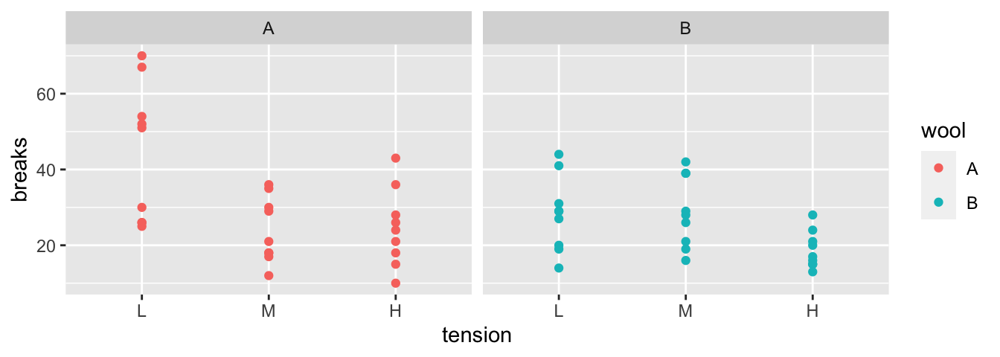


The first we must do is to create a data frame with additional information about how to break the data into sub-data frames. In this case, I want to break the data up into the 6 wool-by-tension combinations. Initially we will just figure out how many rows are in each wool-by-tension combination.

```r
# group_by:  what variable(s) shall we group on.
# n() is a function that returns how many rows are in the 
#   currently selected sub-dataframe
warpbreaks %>% 
  group_by( wool, tension) %>%    # grouping
  summarise(n = n() )             # how many in each group
```

```
## # A tibble: 6 x 3
## # Groups:   wool [2]
##   wool  tension     n
##   <fct> <fct>   <int>
## 1 A     L           9
## 2 A     M           9
## 3 A     H           9
## 4 B     L           9
## 5 B     M           9
## 6 B     H           9
```


The `group_by` function takes a data.frame and returns the same data.frame, but with some extra information so that any subsequent function acts on each unique combination defined in the `group_by`.  If you wish to remove this behavior, use `group_by()` to reset the grouping to have no grouping variable.

Using the same `summarise` function, we could calculate the group mean and standard deviation for each wool-by-tension group.

```r
summary_table <- 
  warpbreaks %>% 
  group_by(wool, tension) %>%
  summarise( n           = n() ,             # I added some formatting to show the
             mean.breaks = mean(breaks),     # reader I am calculating several
             sd.breaks   = sd(breaks) )      # statistics.
```

If instead of summarizing each split, we might want to just do some calculation and the output should have the same number of rows as the input data frame. In this case I'll tell `dplyr` that we are mutating the data frame instead of summarizing it. For example, suppose that I want to calculate the residual value $$e_{ijk}=y_{ijk}-\bar{y}_{ij\cdot}$$ where $\bar{y}_{ij\cdot}$ is the mean of each `wool:tension` combination.

```r
warpbreaks %>% 
   group_by(wool, tension) %>%                 # group by wool:tension
   mutate(resid = breaks - mean(breaks)) %>%   # mean(breaks) of the group!
   head(  )                                    # show the first couple of rows
```

```
## # A tibble: 6 x 4
## # Groups:   wool, tension [1]
##   breaks wool  tension  resid
##    <dbl> <fct> <fct>    <dbl>
## 1     26 A     L       -18.6 
## 2     30 A     L       -14.6 
## 3     54 A     L         9.44
## 4     25 A     L       -19.6 
## 5     70 A     L        25.4 
## 6     52 A     L         7.44
```


## Exercises  {#Exercises_IntroDataWrangling}

1. The dataset `ChickWeight` tracks the weights of 48 baby chickens (chicks) feed four different diets. *Feel free to complete all parts of the exercise in a single R pipeline at the end of the problem.*
    a. Load the dataset using  
        
        ```r
        data(ChickWeight)
        ```
    b. Look at the help files for the description of the columns.
    c) Remove all the observations except for observations from day 10 or day 20. The tough part in this instruction is distinguishing between "and" and "or".  Obviously there are no observations that occur from both day 10 AND day 20.  Google 'R logical operators' to get an introduction to those.
    d) Calculate the mean and standard deviation of the chick weights for each diet group on days 10 and 20. 

2. The OpenIntro textbook on statistics includes a data set on body dimensions. Instead of creating an R chunk for each step of this problem, create a single R pipeline that performs each of the following tasks.  Y 
    a) Load the file using 
        
        ```r
        Body <- read.csv('http://www.openintro.org/stat/data/bdims.csv')
        ```
    b) The column sex is coded as a 1 if the individual is male and 0 if female. This is a non-intuitive labeling system. Create a new column `sex.MF` that uses labels Male and Female. _Hint: the ifelse() command will be very convenient here. The ifelse() command in R functions similarly to the same command in Excel. Feel free to complete all parts of the exercise in a single R pipeline at the end of the problem.*_
    c) The columns `wgt` and `hgt` measure weight and height in kilograms and centimeters (respectively). Use these to calculate the Body Mass Index (BMI) for each individual where 
    $$BMI=\frac{Weight\,(kg)}{\left[Height\,(m)\right]^{2}}$$ 
    d) Double check that your calculated BMI column is correct by examining the summary statistics of the column (e.g. `summary(Body)`). BMI values should be between 18 to 40 or so.  Did you make an error in your calculation?  
    e) The function `cut` takes a vector of continuous numerical data and creates a factor based on your give cut-points. 
        
        ```r
        # Define a continuous vector to convert to a factor
        x <- 1:10
        
        # divide range of x into three groups of equal length
        cut(x, breaks=3)
        ```
        
        ```
        ##  [1] (0.991,4] (0.991,4] (0.991,4] (0.991,4] (4,7]     (4,7]     (4,7]    
        ##  [8] (7,10]    (7,10]    (7,10]   
        ## Levels: (0.991,4] (4,7] (7,10]
        ```
        
        ```r
        # divide x into four groups, where I specify all 5 break points 
        cut(x, breaks = c(0, 2.5, 5.0, 7.5, 10))
        ```
        
        ```
        ##  [1] (0,2.5]  (0,2.5]  (2.5,5]  (2.5,5]  (2.5,5]  (5,7.5]  (5,7.5]  (7.5,10]
        ##  [9] (7.5,10] (7.5,10]
        ## Levels: (0,2.5] (2.5,5] (5,7.5] (7.5,10]
        ```
        
        ```r
        # (0,2.5] (2.5,5] means 2.5 is included in first group
        # right=FALSE changes this to make 2.5 included in the second  
        
        # divide x into 3 groups, but give them a nicer
        # set of group names
        cut(x, breaks=3, labels=c('Low','Medium','High'))
        ```
        
        ```
        ##  [1] Low    Low    Low    Low    Medium Medium Medium High   High   High  
        ## Levels: Low Medium High
        ```
        Create a new column of in the data frame that divides the age into decades (10-19, 20-29, 30-39, etc). Notice the oldest person in the study is 67.
        
        ```r
        Body <- Body %>%
          mutate( Age.Grp = cut(age,
                                breaks=c(10,20,30,40,50,60,70),
                                right=FALSE))
        ```
    f) Find the average BMI for each `Sex` by `Age.Grp` combination.
    
    

<!--chapter:end:04_Intro_to_Data_Wrangling.Rmd-->

# Statistical Models


```r
library(tidyverse, quietly = TRUE)   # loading ggplot2 and dplyr

options(tibble.width = Inf)   # Print all the columns of a tibble (data.frame)
```

As always, there is a [Video Lecture](https://youtu.be/9RCo2ByHTgY) that accompanies this chapter.


While R is a full programming language, it was first developed by statisticians for statisticians. There are several functions to do common statistical tests but because those functions were developed early in R's history, there is some inconsistency in how those functions work. There have been some attempts to standardize modeling object interfaces, but there were always be a little weirdness.

## Formula Notation
Most statistical modeling functions rely on a formula based interface. The primary purpose is to provide a consistent way to designate which columns in a data frame are the response variable and which are the explanatory variables.  In particular the notation is

$$\underbrace{y}_{\textrm{LHS response}} \;\;\; 
\underbrace{\sim}_{\textrm{is a function of}} \;\;\; 
\underbrace{x}_{\textrm{RHS explanatory}}$$

Mathematicians often refer to these terms as the *Left Hand Side* (LHS) and *Right Hand Side* (RHS). The LHS is always the response and the RHS contains the explanatory variables.

In R, the LHS is usually just a single variable in the data. However the RHS can contain multiple variables and in complicated relationships.

+-------------------------------+-------------------------------------------------------+
|  **Right Hand Side Terms**    |  Meaning                                              |
+-------------------------------+-------------------------------------------------------+
|   `x1 + x2`                   | Both `x1` and `x2` are additive explanatory variables.|
|                               | In this format, we are adding only the *main effects* |
|                               | of the `x1` and `x2` variables.                       |
+-------------------------------+-------------------------------------------------------+
| ` x1:x2`                      | This is the interaction term between `x1` and `x2`    | 
+-------------------------------+-------------------------------------------------------+
| `x1 * x2`                     | Because whenever we add an interaction term to a      |
|                               | model, we want to also have the main effects. So this |
|                               | is a short cut for adding the main effect of `x1` and |
|                               | `x2` and also the interaction term `x1:x2`.           |
+-------------------------------+-------------------------------------------------------+
| `(x1 + x2 + x3)^2`            | This is the main effects of `x1`, `x2`, and `x3` and  |
|                               | also all of the second order interactions.            |
+-------------------------------+-------------------------------------------------------+
| `poly(x, degree=2)`           | This fits the degree 2 polynomial. When fit like this,|
|                               | R produces an orthogonal basis for the polynomial,    |
|                               | which is more computationally stable, but won't be    |
|                               | appropiate for interpreting the polynomial            |
|                               | coefficients.                                         |
+------------------------+--------------------------------------------------------------+
| `poly(x, degree=2, raw=TRUE)` | This fits the degree 2 polynomial using               |
|                               | $\beta_0 + \beta_1 x + \beta_2 x^2$ and the polynomial|   
|                               | polynomial coefficients are suitable for              |  
|                               | interpretation.                                       |
+-------------------------------+-------------------------------------------------------+
| `I( x^2 )`                    |  *Ignore* the usual rules for interpreting formulas   |
|                               | and do the mathematical calculation. This is not      |
|                               | necessary for things like `sqrt(x)` or `log(x)` but   |
|                               | required if there is a conflict between mathematics   |
|                               | and the formula interpretation.                       |
+-------------------------------+-------------------------------------------------------+

## Basic Models
The most common statistical models are generally referred to as *linear models* and the R function for creating a linear model is `lm()`. This section will introduce how to fit the model to data in a data frame as well as how to fit very specific t-test models.

###  t-tests
There are several varients on T-tests depending on the question of interest, but they all require a continuous response and a categorical explanatory variable with two levels. If there is an obvious pairing between an observation in the first level of the explanatory variable with an observation in the second level, then it is a *paired* t-test, otherwise it is a *two-sample* t-test.

#### Two Sample t-tests
First we'll import data from the `Lock5Data` package that gives SAT scores and gender from 343 students in an introductory statistics class. We'll also recode the `GenderCode` column to be more descriptive than 0 or 1. We'll do a t-test to examine if there is evidence that males and females have a different SAT score at the college these data were take.

```r
data('GPAGender', package='Lock5Data')
GPAGender <- GPAGender %>%
  mutate( Gender = ifelse(GenderCode == 1, 'Male', 'Female'))
ggplot(GPAGender, aes(x=Gender, y=SAT)) +
  geom_boxplot()
```

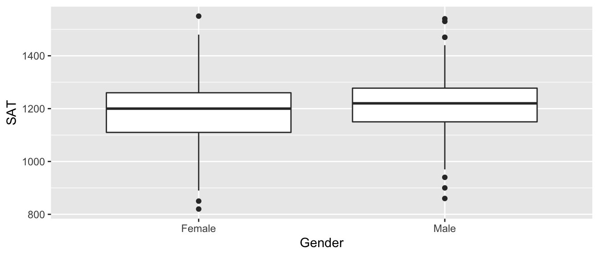

We'll use the function `t.test()` using the formula interface for specifying the response and the explantory variables. The usual practice should be to save the output of the `t.test` function call (typically as an object named `model` or `model_1` or similar). Once the model has been fit, all of the important quantities have been calculated and saved and we just need to ask for them. Unfortunately, the base functions in R don't make this particularly easy, but the `tidymodels` group of packages for building statistical models allows us to wrap all of the important information into a data frame with one row. In this case we will use the `broom::tidy()` function to extract all the important model results information.

```r
model <- t.test(SAT ~ Gender, data=GPAGender)

print(model) # print the summary information to the screen
```

```
## 
## 	Welch Two Sample t-test
## 
## data:  SAT by Gender
## t = -1.4135, df = 323.26, p-value = 0.1585
## alternative hypothesis: true difference in means is not equal to 0
## 95 percent confidence interval:
##  -44.382840   7.270083
## sample estimates:
## mean in group Female   mean in group Male 
##             1195.702             1214.258
```

```r
broom::tidy(model) # all that information as a data frame
```

```
## # A tibble: 1 x 10
##   estimate estimate1 estimate2 statistic p.value parameter conf.low conf.high
##      <dbl>     <dbl>     <dbl>     <dbl>   <dbl>     <dbl>    <dbl>     <dbl>
## 1    -18.6     1196.     1214.     -1.41   0.158      323.    -44.4      7.27
##   method                  alternative
##   <chr>                   <chr>      
## 1 Welch Two Sample t-test two.sided
```

In the `t.test` function, the default behavior is to perform a test with a two-sided alternative and to calculate a 95% confidence interval. Those can be adjusted using the `alternative` and `conf.level` arguments. See the help documentation for `t.test()` function to see how to adust those.

The `t.test` function can also be used without using a formula by inputing a vector of response variables for the first group and a vector of response variables for the second. The following results in the same model as the formula based interface.

```r
male_SATs   <- GPAGender %>% filter( Gender ==   'Male' ) %>% pull(SAT)
female_SATs <- GPAGender %>% filter( Gender == 'Female' ) %>% pull(SAT)

model <- t.test( male_SATs, female_SATs )
broom::tidy(model) # all that information as a data frame
```

```
## # A tibble: 1 x 10
##   estimate estimate1 estimate2 statistic p.value parameter conf.low conf.high
##      <dbl>     <dbl>     <dbl>     <dbl>   <dbl>     <dbl>    <dbl>     <dbl>
## 1     18.6     1214.     1196.      1.41   0.158      323.    -7.27      44.4
##   method                  alternative
##   <chr>                   <chr>      
## 1 Welch Two Sample t-test two.sided
```


#### Paired t-tests

In a paired t-test, there is some mechanism for pairing observations in the two categories. For example, perhaps we observe the maximum weight lifted by a strongman competitor while wearing a weight belt vs not wearing the belt. Then we look at the difference between the weights lifted for each athlete. In the example we'll look at here, we have the ages of 100 randomly selected married heterosexual couples from St. Lawerence County, NY. For any given man in the study, the obvious woman to compare his age to is his wife's. So a paired test makes sense to perform.

```r
data('MarriageAges', package='Lock5Data')
str(MarriageAges)
```

```
## 'data.frame':	105 obs. of  2 variables:
##  $ Husband: int  53 38 46 30 31 26 29 48 65 29 ...
##  $ Wife   : int  50 34 44 36 23 31 25 51 46 26 ...
```

```r
ggplot(MarriageAges, aes(x=Husband, y=Wife)) +
  geom_point() + labs(x="Husband's Age", y="Wife's Age")
```

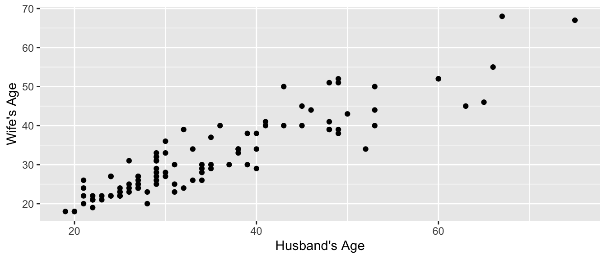

To do a paired t-test, all we need to do is calculate the difference in age for each couple and pass that into the `t.test()` function.

```r
MarriageAges <- MarriageAges %>%
  mutate( Age_Diff = Husband - Wife)

t.test( MarriageAges$Age_Diff)
```

```
## 
## 	One Sample t-test
## 
## data:  MarriageAges$Age_Diff
## t = 5.8025, df = 104, p-value = 7.121e-08
## alternative hypothesis: true mean is not equal to 0
## 95 percent confidence interval:
##  1.861895 3.795248
## sample estimates:
## mean of x 
##  2.828571
```

Alternatively, we could pass the vector of Husband ages and the vector of Wife ages into the `t.test()` function and tell it that the data is paired so that the first husband is paired with the first wife.

```r
t.test( MarriageAges$Husband, MarriageAges$Wife, paired=TRUE )
```

```
## 
## 	Paired t-test
## 
## data:  MarriageAges$Husband and MarriageAges$Wife
## t = 5.8025, df = 104, p-value = 7.121e-08
## alternative hypothesis: true difference in means is not equal to 0
## 95 percent confidence interval:
##  1.861895 3.795248
## sample estimates:
## mean of the differences 
##                2.828571
```

Either way that the function is called, the `broom::tidy()` function could convert the printed output into a nice data frame which can then be used in further analysis.


###  lm objects

The general linear model function `lm` is more widely used than `t.test` because `lm` can be made to perform a t-test and the general linear model allows for fitting more than one explanatory variable and those variables could be either categorical or continuous.

The general workflow will be to:

1. Visualize the data
2. Call `lm()` using a formula to specify the model to fit.
3. Save the results of the `lm()` call to some object (usually I name it `model`)
4. Use accessor functions to ask for pertainent quantities that have already been calculated.
5. Store prediction values and model confidence intervals for each data point in the original data frame.
6. Graph the original data along with prediction values and model confidence intervals.


To explore this topic we'll use the `iris` data set to fit a regression model to predict petal length using sepal length.


```r
ggplot(iris, aes(x=Sepal.Length, y=Petal.Length, color=Species)) +
  geom_point() 
```

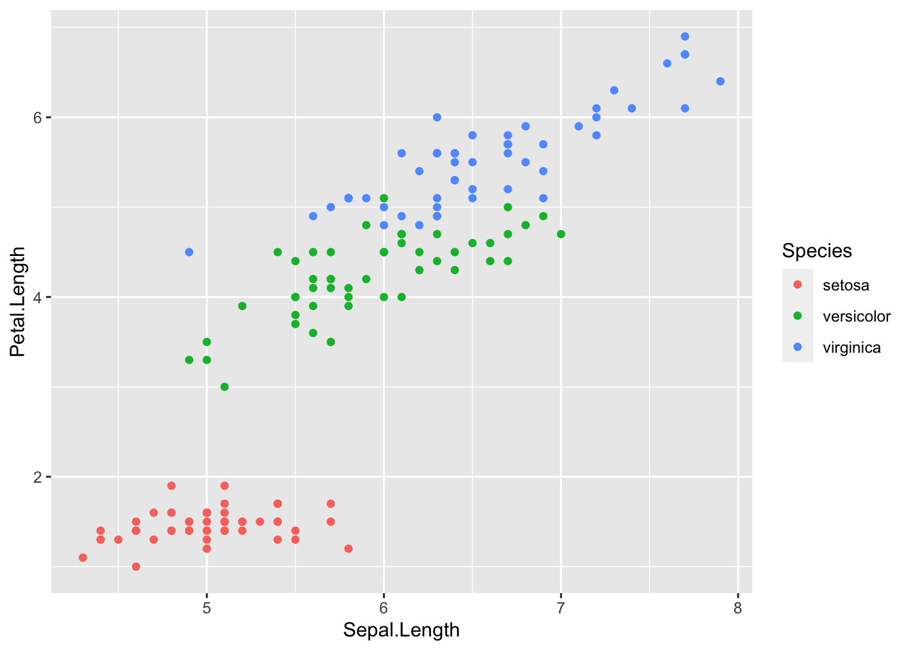

Now suppose we want to fit a regression model to these data and allow each species to have its own slope. We would fit the interaction model

```r
model <- lm( Petal.Length ~ Sepal.Length * Species, data = iris ) 
```

## Accessor function 
Once a model has been fit, we want to obtain a variety of information from the model object. The way that we get most all of this information using base R commands is to call the `summary()` function which returns a list and then grab whatever we want out of that. Typically for a report, we could just print out all of the summary information and let the reader pick out the information.


```r
summary(model)
```

```
## 
## Call:
## lm(formula = Petal.Length ~ Sepal.Length * Species, data = iris)
## 
## Residuals:
##      Min       1Q   Median       3Q      Max 
## -0.68611 -0.13442 -0.00856  0.15966  0.79607 
## 
## Coefficients:
##                                Estimate Std. Error t value Pr(>|t|)    
## (Intercept)                      0.8031     0.5310   1.512    0.133    
## Sepal.Length                     0.1316     0.1058   1.244    0.216    
## Speciesversicolor               -0.6179     0.6837  -0.904    0.368    
## Speciesvirginica                -0.1926     0.6578  -0.293    0.770    
## Sepal.Length:Speciesversicolor   0.5548     0.1281   4.330 2.78e-05 ***
## Sepal.Length:Speciesvirginica    0.6184     0.1210   5.111 1.00e-06 ***
## ---
## Signif. codes:  0 '***' 0.001 '**' 0.01 '*' 0.05 '.' 0.1 ' ' 1
## 
## Residual standard error: 0.2611 on 144 degrees of freedom
## Multiple R-squared:  0.9789,	Adjusted R-squared:  0.9781 
## F-statistic:  1333 on 5 and 144 DF,  p-value: < 2.2e-16
```

But if we want to make a nice graph that includes the model's $R^2$ value on it, we need to code some way of grabbing particular bits of information from the model fit and wrestling into a format that we can easily manipulate it.

|       Goal                     |      Base R command                     |    `tidymodels` version               |
|:------------------------------:|:----------------------------------------|:--------------------------------------| 
| Summary table of Coefficients  | `summary(model)$coef`                   | `broom::tidy(model)`                  |
| Parameter Confidence Intervals | `confint(model)`                        | `broom::tidy(model, conf.int=TRUE)`   |
| Rsq and Adj-Rsq                | `summary(model)$r.squared`              | `broom::glance(model)`                | 
| Model predictions              | `predict(model)`                        | `broom::augment(model, data)`         |
| Model residuals                | `resid(model)`                          | `broom::augment(model, data)`         |
| Model predictions w/ CI        | `predict(model, interval='confidence')` |                                       |
| Model predictions w/ PI        | `predict(model, interval='prediction')` |                                       |
| ANOVA table of model fit       | `anova(model)`                          |                                       |


The package `broom` has three ways to interact with a model. 

* The `tidy` command gives a nice table of the model coefficents. 
* The `glance` function gives information about how well the model fits the data overall. 
* The `augment` function adds the fitted values, residuals, and other diagnostic information to the original data frame used to generate the model. Unfortunately it does not have a way of adding the lower and upper confidence intervals for the predicted values.

Most of the time, I use the base R commands for accessing information from a model and only resort to the `broom` commands when I need to access very specific quantities.


```r
head(iris)
```

```
##   Sepal.Length Sepal.Width Petal.Length Petal.Width Species
## 1          5.1         3.5          1.4         0.2  setosa
## 2          4.9         3.0          1.4         0.2  setosa
## 3          4.7         3.2          1.3         0.2  setosa
## 4          4.6         3.1          1.5         0.2  setosa
## 5          5.0         3.6          1.4         0.2  setosa
## 6          5.4         3.9          1.7         0.4  setosa
```

```r
# Remove any previous model prediction values that I've added,
# and then add the model predictions 
iris <- iris %>%
  select( -matches('fit'), -matches('lwr'), -matches('upr') ) %>%
  cbind( predict(model, newdata=., interval='confidence') )       

head(iris, n=3)
```

```
##   Sepal.Length Sepal.Width Petal.Length Petal.Width Species      fit      lwr
## 1          5.1         3.5          1.4         0.2  setosa 1.474373 1.398783
## 2          4.9         3.0          1.4         0.2  setosa 1.448047 1.371765
## 3          4.7         3.2          1.3         0.2  setosa 1.421721 1.324643
##        upr
## 1 1.549964
## 2 1.524329
## 3 1.518798
```

Now that the fitted values that define the regression lines and the associated confidence interval band information has been added to my `iris` data set, we can now plot the raw data and the regression model predictions.


```r
ggplot(iris, aes(x=Sepal.Length, y=Petal.Length, color=Species)) +
  geom_point() +
  geom_line( aes(y=fit) ) +
  geom_ribbon( aes( ymin=lwr, ymax=upr, fill=Species), alpha=.3 )   # alpha is the ribbon transparency
```

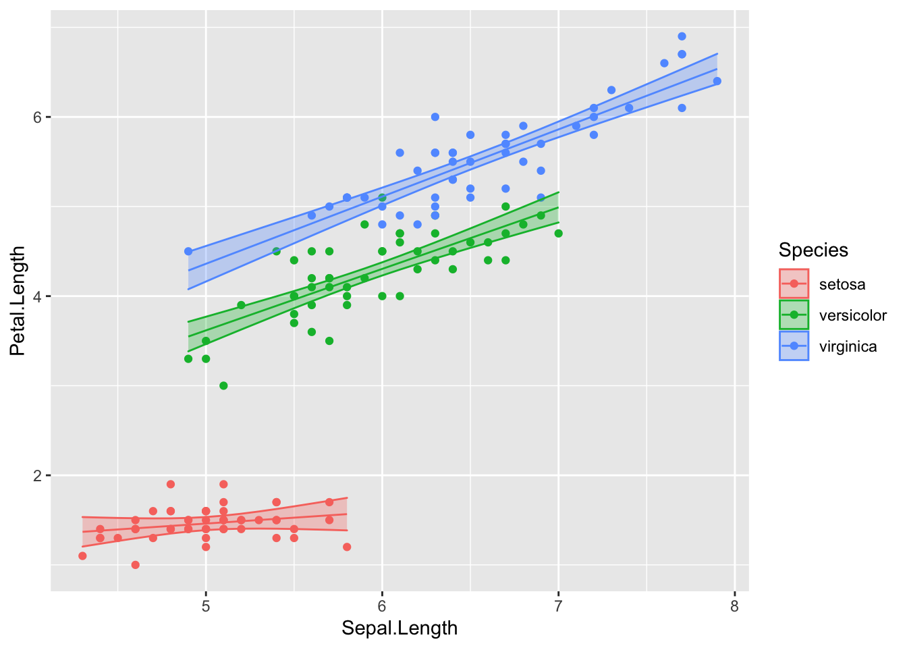

Now to add the R-squared value to the graph, we need to add a simple text layer. To do that, I'll make a data frame that has the information, and then add the x and y coordinates for where it should go.


```r
Rsq_string <- 
  broom::glance(model) %>%
  select(r.squared) %>%
  mutate(r.squared = round(r.squared, digits=3)) %>%   # only 3 digits of precision
  mutate(r.squared = paste('Rsq =', r.squared)) %>%    # append some text before
  pull(r.squared)           

ggplot(iris, aes(x=Sepal.Length, y=Petal.Length, color=Species)) +
  geom_point(  ) +
  geom_line( aes(y=fit)  ) +
  geom_ribbon( aes( ymin=lwr, ymax=upr), alpha=.3 ) +   # alpha is the ribbon transparency
  annotate('label', label=Rsq_string, x=7, y=2, size=7)
```

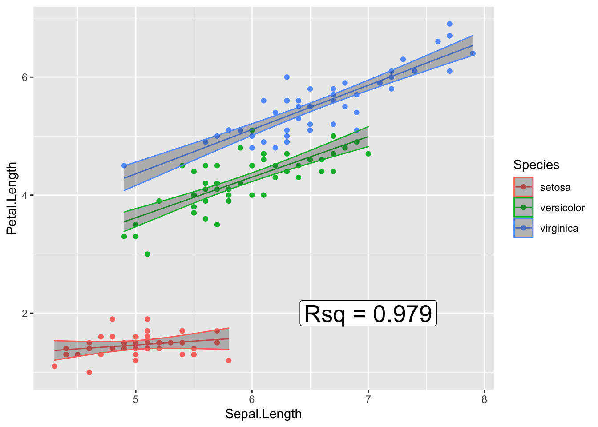

## Exercises  {#Exercises_ModelBuilding}

1. Using the `trees` data frame that comes pre-installed in R, fit the regression model that uses the tree `Height` to explain the `Volume` of wood harvested from the tree.
    a) Graph the data
    b) Fit a `lm` model using the command `model <- lm(Volume ~ Height, data=trees)`.
    c) Print out the table of coefficients estimate names, estimated value, standard error, and upper and lower 95% confidence intervals.
    d) Add the model fitted values to the `trees` data frame along with the regression model confidence intervals.
    e) Graph the data and fitted regression line and uncertainty ribbon.
    f) Add the R-squared value as an annotation to the graph.
  
2. The data set `phbirths` from the `faraway` package contains information birth weight, gestational length, and smoking status of mother. We'll fit a quadratic model to predict infant birth weight using the gestational time.
    a) Create two scatter plots of gestational length and birthweight, one for each smoking status.
    b) Remove all the observations that are premature (less than 36 weeks). For the remainder of the problem, only use these full-term babies.
    c) Fit the quadratic model 
        
        ```r
        model <- lm(grams ~ poly(gestate,2) * smoke, data=phbirths)
        ```
    d) Add the model fitted values to the `phbirths` data frame along with the regression model confidence intervals.
    e) On your two scatterplots from part (a), add layers for the model fits and ribbon of uncertainty for the model fits.
    f) Create a column for the residuals in the `phbirths` data set using any of the following:
      
      ```r
      phbirths$residuals = resid(model)
      phbirths <- phbirths %>% mutate( residuals = resid(model) )
      phbirths <- broom::augment(model, phbirths)
      ```
    g) Create a histogram of the residuals.


<!--chapter:end:05_Model_Building.Rmd-->

# Flow Control


```r
library(tidyverse, quietly = TRUE)   # loading ggplot2 and dplyr
```

As always, there is a [Video Lecture](https://youtu.be/bPZKP_yYFLo) that accompanies this chapter.


Often it is necessary to write scripts that perform different action depending on the data or to automate a task that must be repeated many times. To address these issues we will introduce the `if` statement and its closely related cousin `if else`. To address repeated tasks we will define two types of loops, a `while` loop and a `for` loop. 

## Logical Expressions

The most common logical expressions are the numerical expressions `<`, `<=`, `==`, `!=`, `>=`, `>`. These are the usual logical comparisons from mathematics, with `!=` being the *not equal* comparison. For any logical value or vector of values, the `!` flips the logical values. 

```r
df <- data.frame(A=1:6, B=5:10)
df
```

```
##   A  B
## 1 1  5
## 2 2  6
## 3 3  7
## 4 4  8
## 5 5  9
## 6 6 10
```

```r
df %>% mutate(`A==3?`         =  A == 3,
              `A<=3?`         =  A <= 3,
              `A!=3?`         =  A != 3,
              `Flip Previous` = ! `A!=3?` )
```

```
##   A  B A==3? A<=3? A!=3? Flip Previous
## 1 1  5 FALSE  TRUE  TRUE         FALSE
## 2 2  6 FALSE  TRUE  TRUE         FALSE
## 3 3  7  TRUE  TRUE FALSE          TRUE
## 4 4  8 FALSE FALSE  TRUE         FALSE
## 5 5  9 FALSE FALSE  TRUE         FALSE
## 6 6 10 FALSE FALSE  TRUE         FALSE
```

I find that it is preferable to write logical comparisons using `<` or `<=` rather than the "greater than" versions because the number line is read left to right, so it is much easier to have the smaller value on the left.

```r
df %>% mutate( `A < B`  =  A < B)
```

```
##   A  B A < B
## 1 1  5  TRUE
## 2 2  6  TRUE
## 3 3  7  TRUE
## 4 4  8  TRUE
## 5 5  9  TRUE
## 6 6 10  TRUE
```


If we have two (or more) vectors of of logical values, we can do two *pairwise* operations. The "and" operator `&` will result in a TRUE value if all elements are TRUE.  The "or" operator will result in a TRUE value if either the left hand side or right hand side is TRUE. 

```r
df %>% mutate(C = A>=0,  D = A<=5) %>%
  mutate( result1_and = C & D,          #    C and D both true
          result2_and =  A>=0 & A<=5,   #    directly calculated
          result3_and =  0 <= A & A<=5, #    more readable 0 <= A <= 5
          result4_or  =  A<=0 | 5<=A)   #    A not in [0,5] range    
```

```
##   A  B    C     D result1_and result2_and result3_and result4_or
## 1 1  5 TRUE  TRUE        TRUE        TRUE        TRUE      FALSE
## 2 2  6 TRUE  TRUE        TRUE        TRUE        TRUE      FALSE
## 3 3  7 TRUE  TRUE        TRUE        TRUE        TRUE      FALSE
## 4 4  8 TRUE  TRUE        TRUE        TRUE        TRUE      FALSE
## 5 5  9 TRUE  TRUE        TRUE        TRUE        TRUE       TRUE
## 6 6 10 TRUE FALSE       FALSE       FALSE       FALSE       TRUE
```


Next we can summarize a vector of logical values using `any()`, `all()`, and `which()`. These functions do exactly what you would expect them to do.

```r
any(6:10 <= 7 )   # Should return TRUE because there are two TRUE results
```

```
## [1] TRUE
```

```r
all(6:10 <= 7 )   # Should return FALSE because there is at least one FALSE result
```

```
## [1] FALSE
```

```r
which( 6:10 <= 7) # return the indices of the TRUE values
```

```
## [1] 1 2
```


Finally, I often need to figure out if a character string is in some set of values. 

```r
df <- data.frame( Type = rep(c('A','B','C','D'), each=2), Value=rnorm(8) )
df
```

```
##   Type      Value
## 1    A -0.6878011
## 2    A  1.4318415
## 3    B  0.9007165
## 4    B  1.6073233
## 5    C -0.9910861
## 6    C -0.1150684
## 7    D  1.6793248
## 8    D  1.3810519
```

```r
# df %>% filter( Type == 'A' | Type == 'B' )
df %>% filter( Type %in% c('A','B') )   # Only rows with Type == 'A' or Type =='B'
```

```
##   Type      Value
## 1    A -0.6878011
## 2    A  1.4318415
## 3    B  0.9007165
## 4    B  1.6073233
```


## Decision statements

### In `dplyr` wrangling

A very common task within a data wrangling pipeline is to create a new column that recodes information in another column.  Consider the following data frame that has name, gender, and political party affiliation of six individuals. In this example, we've coded male/female as 1/0 and political party as 1,2,3 for democratic, republican, and independent. 


```r
people <- data.frame(
  name = c('Barack','Michelle', 'George', 'Laura', 'Bernie', 'Deborah'),
  gender = c(1,0,1,0,1,0),
  party = c(1,1,2,2,3,3)
)
people
```

```
##       name gender party
## 1   Barack      1     1
## 2 Michelle      0     1
## 3   George      1     2
## 4    Laura      0     2
## 5   Bernie      1     3
## 6  Deborah      0     3
```

The command `ifelse()` works quite well within a `dplyr::mutate()` command and it responds correctly to vectors. The syntax is `ifelse( logical.expression, TrueValue, FalseValue )`.


```r
people <- people %>%
  mutate( gender2 = ifelse( gender == 0, 'Female', 'Male') )
people
```

```
##       name gender party gender2
## 1   Barack      1     1    Male
## 2 Michelle      0     1  Female
## 3   George      1     2    Male
## 4    Laura      0     2  Female
## 5   Bernie      1     3    Male
## 6  Deborah      0     3  Female
```

To do something similar for the case where we have 3 or more categories, we could use the `ifelse()` command repeatedly to address each category level separately. However because the `ifelse` command is limited to just two cases, it would be nice if there was a generalization to multiple categories. The  `dplyr::case_when` function is that generalization. The syntax is `case_when( logicalExpression1~Value1, logicalExpression2~Value2, ... )`. We can have as many `LogicalExpression ~ Value` pairs as we want. 


```r
people <- people %>%
  mutate( party2 = case_when( party == 1 ~ 'Democratic', 
                              party == 2 ~ 'Republican', 
                              party == 3 ~ 'Independent',
                              TRUE       ~ 'None Stated' ) )
people
```

```
##       name gender party gender2      party2
## 1   Barack      1     1    Male  Democratic
## 2 Michelle      0     1  Female  Democratic
## 3   George      1     2    Male  Republican
## 4    Laura      0     2  Female  Republican
## 5   Bernie      1     3    Male Independent
## 6  Deborah      0     3  Female Independent
```

Often the last case is a catch all case where the logical expression will ALWAYS evaluate to TRUE and this is the value for all other input.

As another alternative to the problem of recoding factor levels, we could use the command `forcats::fct_recode()` function.  See the Factors chapter in this book for more information about factors.

### General `if else`
While programming, I often need to perform expressions that are more complicated than what the `ifelse()` command can do. The general format of an `if` or and `if else` is presented here.


```r
# Simplest version
if( logical.test ){
  expression        # can be many lines of code
}

# Including the optional else
if( logical.test ){
  expression
}else{
  expression
}
```

where the else part is optional. 

Suppose that I have a piece of code that generates a random variable from the Binomial distribution with one sample (essentially just flipping a coin) but I'd like to label it head or tails instead of one or zero.

What is happening is that the test expression inside the `if()` is evaluated and if it is true, then the subsequent statement is executed. If the test expression is false, the next statement is skipped. The way the R language is defined, only the first statement after the if statement is executed (or skipped) depending on the test expression. If we want multiple statements to be executed (or skipped), we will wrap those expressions in curly brackets `{ }`. I find it easier to follow the `if else` logic when I see the curly brackets so I use them even when there is only one expression to be executed. Also notice that the RStudio editor indents the code that might be skipped to try help give you a hint that it will be conditionally evaluated.


```r
# Flip the coin, and we get a 0 or 1
result <- rbinom(n=1, size=1, prob=0.5)
result
```

```
## [1] 0
```

```r
# convert the 0/1 to Tail/Head
if( result == 0 ){
  result <- 'Tail'
  print(" in the if statement, got a Tail! ")
}else{
  result <- 'Head'
  print("In the else part!") 
}
```

```
## [1] " in the if statement, got a Tail! "
```

```r
result
```

```
## [1] "Tail"
```

Run this code several times until you get both cases several times. Notice that in the Environment tab in RStudio, the value of the variable `result` changes as you execute the code repeatedly.


To provide a more statistically interesting example of when we might use an if else statement, consider the calculation of a p-value in a 1-sample t-test with a two-sided alternative. Recall the calculate was:

* If the test statistic t is negative, then p-value = $2*P\left(T_{df} \le t \right)$
 
* If the test statistic t is positive, then p-value = $2*P\left(T_{df} \ge t \right)$. 
  

```r
# create some fake data
n  <- 20   # suppose this had a sample size of 20
x  <- rnorm(n, mean=2, sd=1)

# testing H0: mu = 0  vs Ha: mu =/= 0
t  <- ( mean(x) - 0 ) / ( sd(x)/sqrt(n) )
df <- n-1
if( t < 0 ){
  p.value <- 2 * pt(t, df)
}else{
  p.value <- 2 * (1 - pt(t, df))
}

# print the resulting p-value
p.value
```

```
## [1] 3.013015e-08
```

This sort of logic is necessary for the calculation of p-values and so something similar is found somewhere inside the `t.test()` function.


Finally we can nest if else statements together to allow you to write code that has many different execution routes.


```r
# randomly grab a number between 0,5 and round it up to 1,2, ..., 5
birth.order <- ceiling( runif(1, 0,5) )  
if( birth.order == 1 ){
  print('The first child had more rules to follow')
}else if( birth.order == 2 ){
  print('The second child was ignored')
}else if( birth.order == 3 ){
  print('The third child was spoiled')
}else{
  # if birth.order is anything other than 1, 2 or 3
  print('No more unfounded generalizations!')
}
```

```
## [1] "No more unfounded generalizations!"
```


## Loops

It is often desirable to write code that does the same thing over and over, relieving you of the burden of repetitive tasks. To do this we'll need a way to tell the computer to repeat some section of code over and over. However we'll usually want something small to change each time through the loop and some way to tell the computer how many times to run the loop or when to stop repeating.

### `while` Loops

The basic form of a `while` loop is as follows:


```r
# while loop with multiple lines to be repeated
while( logical.test ){
  expression1      # multiple lines of R code
  expression2
}
```


The computer will first evaluate the test expression. If it is true, it will execute the code once. It will then evaluate the test expression again to see if it is still true, and if so it will execute the code section a third time. The computer will continue with this process until the test expression finally evaluates as false. 


```r
x <- 2
while( x < 100 ){
  print( paste("In loop and x is now:", x) )  # print out current value of x
  x <- 2*x
}
```

```
## [1] "In loop and x is now: 2"
## [1] "In loop and x is now: 4"
## [1] "In loop and x is now: 8"
## [1] "In loop and x is now: 16"
## [1] "In loop and x is now: 32"
## [1] "In loop and x is now: 64"
```


It is very common to forget to update the variable used in the test expression. In that case the test expression will never be false and the computer will never stop. This unfortunate situation is called an *infinite loop*.

```r
# Example of an infinite loop!  Do not Run!
x <- 1
while( x < 10 ){
  print(x)
}
```


### `for` Loops

Often we know ahead of time exactly how many times we should go through the loop. We could use a `while` loop, but there is also a second construct called a `for` loop that is quite useful.

The format of a for loop is as follows: 

```r
for( index in vector ){
  expression1
  expression2
}
```

where the `index` variable will take on each value in `vector` in succession and then statement will be evaluated. As always, statement can be multiple statements wrapped in curly brackets {}.

```r
for( i in 1:5 ){
  print( paste("In the loop and current value is i =", i) )
}
```

```
## [1] "In the loop and current value is i = 1"
## [1] "In the loop and current value is i = 2"
## [1] "In the loop and current value is i = 3"
## [1] "In the loop and current value is i = 4"
## [1] "In the loop and current value is i = 5"
```


What is happening is that `i` starts out as the first element of the vector `c(1,2,3,4,5)`, in this case, `i` starts out as 1. After `i` is assigned, the statements in the curly brackets are then evaluated. Once we get to the end of those statements, i is reassigned to the next element of the vector `c(1,2,3,4,5)`. This process is repeated until `i` has been assigned to each element of the given vector. It is somewhat traditional to use `i` and `j` and the index variables, but they could be anything.

While the recipe above is the minimal definition of a `for` loop, there is often a bit more set up to create a result vector or data frame that will store the steps of the `for` loop.


```r
N <- 10 
result <- NULL     # Make a place to store each step of the for loop
for( i in 1:N ){
  # Perhaps some code that calculates something
  result[i] <-  # something 
}
```


We can use this loop to calculate the first $10$ elements of the Fibonacci sequence. Recall that the Fibonacci sequence is defined by $F_{n}=F_{n-1}+F_{n-2}$ where $F_{1}=0$ and $F_{2}=1$.


```r
N <- 10                # How many Fibonacci numbers to create
F <- rep(0, N)         # initialize a vector of zeros
F[1] <- 0              # F[1]  should be zero
F[2] <- 1              # F[2]  should be 1
print(F)               # Show the value of F before the loop 
```

```
##  [1] 0 1 0 0 0 0 0 0 0 0
```

```r
for( n in 3:N ){
  F[n] <- F[n-1] + F[n-2] # define based on the prior two values
  print(F)                # show F at each step of the loop
}
```

```
##  [1] 0 1 1 0 0 0 0 0 0 0
##  [1] 0 1 1 2 0 0 0 0 0 0
##  [1] 0 1 1 2 3 0 0 0 0 0
##  [1] 0 1 1 2 3 5 0 0 0 0
##  [1] 0 1 1 2 3 5 8 0 0 0
##  [1]  0  1  1  2  3  5  8 13  0  0
##  [1]  0  1  1  2  3  5  8 13 21  0
##  [1]  0  1  1  2  3  5  8 13 21 34
```

For a more statistical case where we might want to perform a loop, we can consider the creation of the bootstrap estimate of a sampling distribution. The bootstrap distribution is created by repeatedly re-sampling with replacement from our original sample data, running the analysis for each re-sample, and then saving the statistic of interest.


```r
library(dplyr)
library(ggplot2)

# bootstrap from the trees dataset.
SampDist <- data.frame(xbar=NULL) # Make a data frame to store the means 
for( i in 1:1000 ){
  ## Do some stuff
  boot.data <- trees %>% dplyr::sample_frac(replace=TRUE)  
  boot.stat <- boot.data %>% dplyr::summarise(xbar=mean(Height)) # 1x1 data frame
  
  ## Save the result as a new row in the output data frame
  SampDist <- rbind( SampDist, boot.stat )
}

# Check out the structure of the result
str(SampDist)
```

```
## 'data.frame':	1000 obs. of  1 variable:
##  $ xbar: num  74.5 76 76.8 74.9 74.1 ...
```

```r
# Plot the output
ggplot(SampDist, aes(x=xbar)) + 
  geom_histogram( binwidth=0.25) +
  labs(title='Trees Data: Bootstrap distribution of xbar')
```

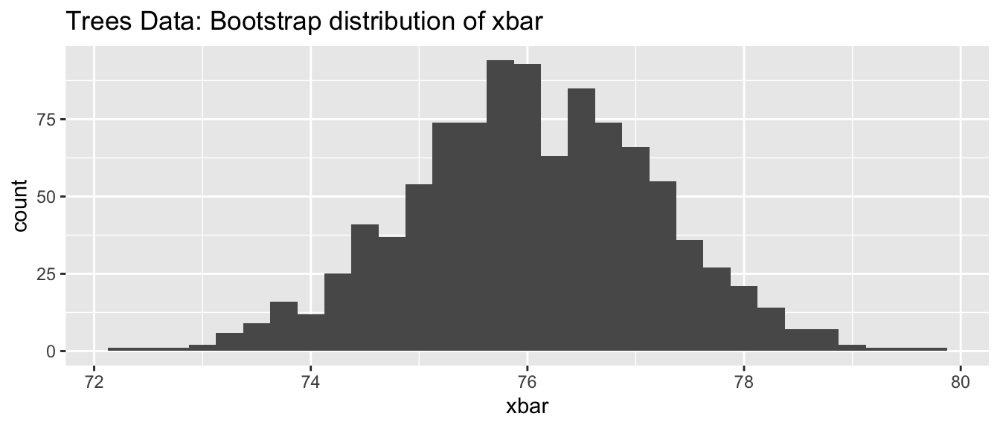

### `mosaic::do()` loops

Many times when using a `for` loop, we want to save some quantity for each pass through the `for` loop. Because this is such a common tasks, the `mosaic::do()` function automates the creation of the output data frame and the saving each repetition. This function is intended to hide the coding steps that often trips up new programmers.  


```r
# Same Loop 
SampDist <- mosaic::do(1000) * {
  trees %>% dplyr::sample_frac(replace=TRUE)  %>%
    dplyr::summarise(xbar=mean(Height)) %>%       # 1x1 data frame
    pull(xbar)                                    # Scalar 
}

# Structure of the SampDist object 
str(SampDist)
```

```
## Classes 'do.data.frame' and 'data.frame':	1000 obs. of  1 variable:
##  $ result: num  74.9 75.3 76.9 75.6 77.3 ...
##  - attr(*, "lazy")=Class 'formula'  language ~{     trees %>% dplyr::sample_frac(replace = TRUE) %>% dplyr::summarise(xbar = mean(Height)) %>%  ...
##   .. ..- attr(*, ".Environment")=<environment: R_GlobalEnv> 
##  - attr(*, "culler")=function (object, ...)
```

```r
# Plot the output
ggplot(SampDist, aes(x=result)) + 
  geom_histogram( binwidth=0.25) +
  labs(title='Trees Data: Bootstrap distribution of xbar')
```


## Functions
It is very important to be able to define a piece of programming logic that is repeated often. For example, I don't want to have to always program the mathematical code for calculating the sample variance of a vector of data. Instead I just want to call a function that does everything for me and I don't have to worry about the details. 

While hiding the computational details is nice, fundamentally writing functions allows us to think about our problems at a higher layer of abstraction. For example, most scientists just want to run a t-test on their data and get the appropriate p-value out; they want to focus on their problem and not how to calculate what the appropriate degrees of freedom are. 
Another statistical example where functions are important is a bootstrap data analysis where we need to define a function that calculates whatever statistic the research cares about.

The format for defining your own function is 

```r
function.name <- function(arg1, arg2, arg3){
  statement1
  statement2
}
```

where `arg1` is the first argument passed to the function and `arg2` is the second.

To illustrate how to define your own function, we will define a variance calculating function.


```r
# define my function
my.var <- function(x){
  n <- length(x)                # calculate sample size
  xbar <- mean(x)               # calculate sample mean
  SSE <- sum( (x-xbar)^2 )      # calculate sum of squared error
  v <- SSE / ( n - 1 )          # "average" squared error
  return(v)                     # result of function is v
}
```


```r
# create a vector that I wish to calculate the variance of
test.vector <- c(1,2,2,4,5)

# calculate the variance using my function
calculated.var <- my.var( test.vector )
calculated.var
```

```
## [1] 2.7
```

Notice that even though I defined my function using `x` as my vector of data, and passed my function something named `test.vector`, R does the appropriate renaming. If my function doesn't modify its input arguments, then R just passes a pointer to the inputs to avoid copying large amounts of data when you call a function. If your function modifies its input, then R will take the input data, copy it, and then pass that new copy to the function. This means that a function cannot modify its arguments. In Computer Science parlance, R does not allow for procedural side effects. Think of the variable `x` as a placeholder, with it being replaced by whatever gets passed into the function.

When I call a function, the function might cause something to happen (e.g. draw a plot) or it might do some calculates the result is returned by the function and we might want to save that. Inside a function, if I want the result of some calculation saved, I return the result as the output of the function. The way I specify to do this is via the `return` statement. (Actually R doesn't completely require this. But the alternative method is less intuitive and I strongly recommend using the `return()` statement for readability.)

By writing a function, I can use the same chunk of code repeatedly. This means that I can do all my tedious calculations inside the function and just call the function whenever I want and happily ignore the details. Consider the function `t.test()` which we have used to do all the calculations in a t-test. We could write a similar function using the following code:


```r
# define my function
one.sample.t.test <- function(input.data, mu0){
  n    <- length(input.data)
  xbar <- mean(input.data)
  s    <- sd(input.data)
  t    <- (xbar - mu0)/(s / sqrt(n))
  if( t < 0 ){
    p.value <- 2 * pt(t, df=n-1)
  }else{
    p.value <- 2 * (1-pt(t, df=n-1))
  }
  # we haven't addressed how to print things in a organized 
  # fashion, the following is ugly, but works...
  # Notice that this function returns a character string
  # with the necessary information in the string.
  return( paste('t =', round(t, digits=3), ' and p.value =', round(p.value, 3)) )
}
```


```r
# create a vector that I wish apply a one-sample t-test on.
test.data <- c(1,2,2,4,5,4,3,2,3,2,4,5,6)
one.sample.t.test( test.data, mu0=2 )
```

```
## [1] "t = 3.157  and p.value = 0.008"
```

Nearly every function we use to do data analysis is written in a similar fashion. Somebody decided it would be convenient to have a function that did an ANOVA analysis and they wrote something similar to the above function, but is a bit grander in scope. Even if you don't end up writing any of your own functions, knowing how to will help you understand why certain functions you use are designed the way they are. 

## Exercises  {#Exercises_FlowControl}

1. I've created a dataset about presidential candidates for the 2020 US election and it is available on the github website for my STA 141 

    
    ```r
    prez <- readr::read_csv('https://raw.githubusercontent.com/dereksonderegger/444/master/data-raw/Prez_Candidate_Birthdays')
    prez
    ```
    
    ```
    ## # A tibble: 11 x 5
    ##    Candidate        Gender Birthday   Party AgeOnElection
    ##    <chr>            <chr>  <date>     <chr>         <dbl>
    ##  1 Pete Buttigieg   M      1982-01-19 D                38
    ##  2 Andrew Yang      M      1975-01-13 D                45
    ##  3 Juilan Castro    M      1976-09-16 D                44
    ##  4 Beto O'Rourke    M      1972-09-26 D                48
    ##  5 Cory Booker      M      1969-04-27 D                51
    ##  6 Kamala Harris    F      1964-10-20 D                56
    ##  7 Amy Klobucher    F      1960-05-25 D                60
    ##  8 Elizabeth Warren F      1949-06-22 D                71
    ##  9 Donald Trump     M      1946-06-14 R                74
    ## 10 Joe Biden        M      1942-11-20 D                77
    ## 11 Bernie Sanders   M      1941-09-08 D                79
    ```
    a) Re-code the Gender column to have Male and Female levels. Similarly convert the party variable to be Democratic or Republican.
    b) Bernie Sanders was registered as an Independent up until his 2016 presidential run. Change his political party value into 'Independent'.

2. The $Uniform\left(a,b\right)$ distribution is defined on x $\in [a,b]$ and represents a random variable that takes on any value of between `a` and `b` with equal probability. Technically since there are an infinite number of values between `a` and `b`, each value has a probability of 0 of being selected and I should say each interval of width $d$ has equal probability. It has the density function 
    $$f\left(x\right)=\begin{cases}
    \frac{1}{b-a} & \;\;\;\;a\le x\le b\\
    0 & \;\;\;\;\textrm{otherwise}
    \end{cases}$$

    The R function `dunif()` evaluates this density function for the above defined values of x, a, and b. Somewhere in that function, there is a chunk of code that evaluates the density for arbitrary values of $x$. Run this code a few times and notice sometimes the result is $0$ and sometimes it is $1/(10-4)=0.16666667$.
    
    
    ```r
    a <- 4      # The min and max values we will use for this example
    b <- 10     # Could be anything, but we need to pick something
    
    x <- runif(n=1, 0,10)  # one random value between 0 and 10 
    
    # what is value of f(x) at the randomly selected x value?  
    dunif(x, a, b)
    ```
    
    ```
    ## [1] 0
    ```

    
    We will write a sequence of statements that utilizes an if statements to appropriately calculate the density of x assuming that `a`, `b` , and `x` are given to you, but your code won't know if `x` is between `a` and `b`. That is, your code needs to figure out if it is and give either `1/(b-a)` or `0`.

    a. We could write a set of if/else statements 
        
        ```r
        a <- 4
        b <- 10
        x <- runif(n=1, 0,10)  # one random value between 0 and 10 
        
        if( x < a ){
          result <- ???
        }else if( x <= b ){
          result <- ???
        }else{
          result <- ???
        }
        print(paste('x=',round(x,digits=3), '  result=', round(result,digits=3)))
        ```
        Replace the `???` with the appropriate value, either 0 or $1/\left(b-a\right)$. Run the code repeatedly until you are certain that it is calculating the correct density value.
        

    b. We could perform the logical comparison all in one comparison. Recall that we can use `&` to mean “and” and `|` to mean “or”. In the following two code chunks, replace the `???` with either `&` or `|` to make the appropriate result.

        i. 
            
            ```r
            x <- runif(n=1, 0,10)  # one random value between 0 and 10 
            if( (a<=x) ??? (x<=b) ){
              result <- 1/(b-a)
            }else{
              result <- 0
            }
            print(paste('x=',round(x,digits=3), '  result=', round(result,digits=3)))
            ```
        ii. 
            
            ```r
            x <- runif(n=1, 0,10)  # one random value between 0 and 10 
            if( (x<a) ??? (b<x) ){
              result <- 0
            }else{
              result <- 1/(b-a)
            }
            print(paste('x=',round(x,digits=3), '  result=', round(result,digits=3)))
            ```
        iii.
            
            ```r
            x <- runif(n=1, 0,10)  # one random value between 0 and 10 
            result <- ifelse( a<x & x<b, ???, ??? )
            print(paste('x=',round(x,digits=3), '  result=', round(result,digits=3)))
            ```


3. I often want to repeat some section of code some number of times. For example, I might want to create a bunch plots that compare the density of a t-distribution with specified degrees of freedom to a standard normal distribution. 

    
    ```r
    library(ggplot2)
    df <- 4
    N <- 1000
    x <- seq(-4, 4, length=N)
    data <- data.frame( 
      x = c(x,x),
      y = c(dnorm(x), dt(x, df)),
      type = c( rep('Normal',N), rep('T',N) ) )
    
    # make a nice graph
    myplot <- ggplot(data, aes(x=x, y=y, color=type, linetype=type)) +
      geom_line() +
      labs(title = paste('Std Normal vs t with', df, 'degrees of freedom'))
    
    # actually print the nice graph we made
    print(myplot) 
    ```
    
    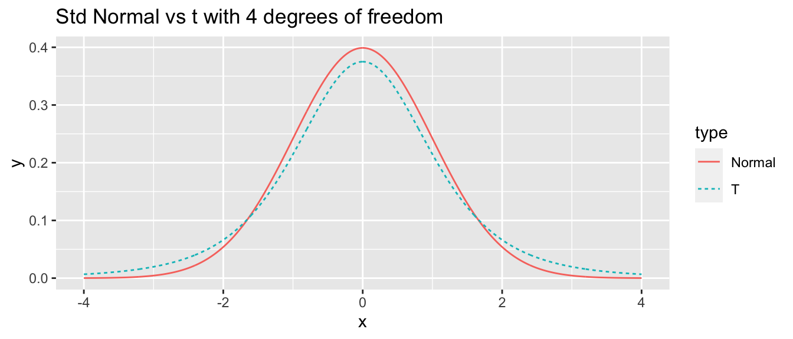

    a) Use a `for` loop to create similar graphs for degrees of freedom $2,3,4,\dots,29,30$. 

    b) In retrospect, perhaps we didn't need to produce all of those. Rewrite your loop so that we only produce graphs for $\left\{ 2,3,4,5,10,15,20,25,30\right\}$ degrees of freedom. *Hint: you can just modify the vector in the `for` statement to include the desired degrees of freedom.*


<!--chapter:end:06_FlowControl.Rmd-->

# Factors


```r
library(tidyverse)   # loading ggplot2 and dplyr
options(dplyr.summarise.inform=FALSE) # Don't annoy me with summarise messages
```

As always, there is a [Video Lecture](https://youtu.be/ID2hx2ySAEE) that accompanies this chapter.

In R we can store categorical information as either strings or as factors. To a casual user, it often doesn't matter how the information is stored because the modeling and graphing programs happily convert strings into factors whenever necessary. However a deeper understanding of how factors are stored and manipulated allows a user much finer control in the modeling and graphing.

We will be interested in the following broad classes of manipulations:

#### Edit Factor Labels{-}

| Goal                             |  `forcats` function                                  |
|:---------------------------------|:-----------------------------------------------------|
| Manually change the label(s)     | `fct_recode(f, new_label = "old_label")`             |
| Systematically change all labels | `fct_relabel(f, function)`                           |


#### Reorder Levels {-}

| Goal                             |  `forcats` function                                  |
|:---------------------------------|:-----------------------------------------------------|
| Set order manually                                  | `fct_relevel(f, 'b', 'a', 'c')`   |
| Set order based on another vector                        | `fct_reorder(f, x)`          |
| Set order based on which category is most frequent       | `fct_infreq(f)`              |
| Set order based on when they first appear                | `fct_inorder(f)`             |
| Reverse factor order                                     | `fct_rev(f)`                 |
| Rotate order left or right                               | `fct_shift(f, steps)`        |


#### Add or Subtract Levels {-}

| Goal                             |  `forcats` function                                    |
|:---------------------------------|:-------------------------------------------------------|
| Manually select categories to collapse into one |  `fct_collapse(f, other = c('a','b')) ` |
| Add a new factor level           | `fct_expand(f, 'new level')`                           |


## Creation and Structure
R stores factors as a combination of a vector of category labels and vector of integers representing which category a data value belongs to. For example, lets create a vector of data relating to what soft drinks my siblings prefer.

```r
# A vector of character strings.
drinks <- c('DietCoke', 'Coke', 'Coke', 'Sprite', 'Pepsi')
str(drinks)
```

```
##  chr [1:5] "DietCoke" "Coke" "Coke" "Sprite" "Pepsi"
```

```r
# convert the vector of character strings into a factor vector
drinks <- factor(drinks)

# Levels and Label mapping table
data.frame( Levels=1:4, Labels=levels(drinks))
```

```
##   Levels   Labels
## 1      1     Coke
## 2      2 DietCoke
## 3      3    Pepsi
## 4      4   Sprite
```

```r
as.integer(drinks) # Print the category assignments
```

```
## [1] 2 1 1 4 3
```

Notice that the factor has levels "Coke", "DietCoke", "Pepsi", and "Sprite" and that the order of these levels is very important because each observation is saved as an *integer* which denotes which category the observation belongs to. Because it takes less memory to store a single integer instead of potentially very long character string, factors are much more space efficient than storing the same data as strings.

Whenever we do anything that sorts on this factor, the order of the labels in this mapping table determine the sort orders. In order to modify factor labels and levels, we basically need to modify this mapping table.  We don't do this directly, but rather using functions in the `forcats` package.


## Change Labels
To demonstrate the `forcats` functions, we will consider two datasets. The first consists of a dataset of a small US highschool with observations for each student and we record their year and gender.

```r
Students <- 
  expand.grid(Year='freshman', Gender=1, rep=1:23) %>%
  add_row(Year='freshman', Gender=0, rep=1:25) %>%
  add_row(Year='junior',   Gender=1, rep=1:30) %>%
  add_row(Year='junior',   Gender=0, rep=1:32) %>%
  add_row(Year='senior',   Gender=1, rep=1:18) %>%
  add_row(Year='senior',   Gender=0, rep=1:19) %>%
  add_row(Year='sophomore', Gender=1, rep=1:10) %>%
  add_row(Year='sophomore', Gender=0, rep=1:12)

# Variables that are character strings are coerced to factors.
# Variables that are numeric are not, and should be explicitly turned to factors.
Students <- Students %>% 
  mutate( Gender = factor(Gender) )

Students %>%
  ggplot( aes(x=Year, fill=Gender)) + 
  geom_bar() + coord_flip()
```

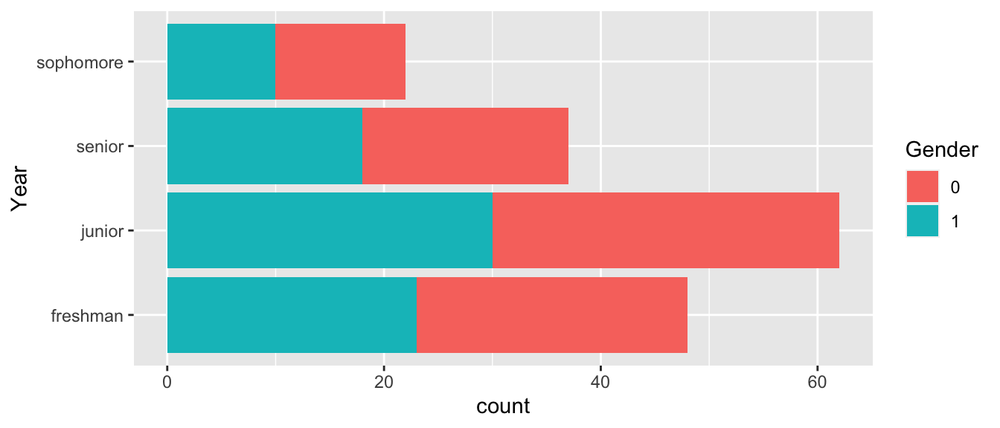

The first thing we ought to consider is how to change the factor labels for `Gender`. To do this we'll use the `fct_recode()` function.

```r
# Change Gender from 0/1  to Female/Male
Students <- Students %>%
  mutate( Gender = fct_recode(Gender, Male='1'),
          Gender = fct_recode(Gender, Female='0') )

# Change "Freshman" to the gender neutral "First Year" 
Students <- Students %>%
  mutate( Year = fct_recode(Year, `first year` = 'freshman'))
  
Students %>%
  ggplot( aes(x=Year, fill=Gender)) + geom_bar() + coord_flip()
```

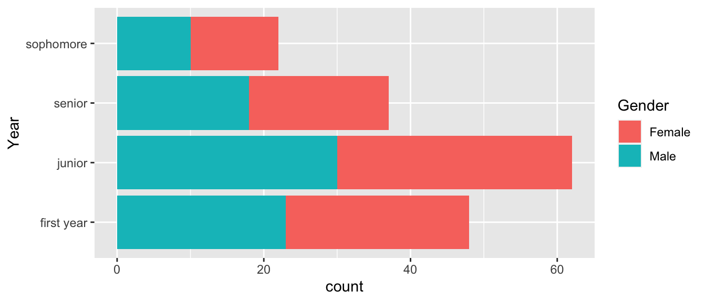

We might want to apply some function to all the labels. Perhaps we want to remove white space or perhaps we want to capitalize all the labels. To apply a function to each of the labels, we use the `fct_relabel()` function. 


```r
Students %>%
  mutate( Year = fct_relabel(Year, stringr::str_to_upper) ) %>%
  ggplot( aes(x=Year, fill=Gender)) + geom_bar() + coord_flip()
```

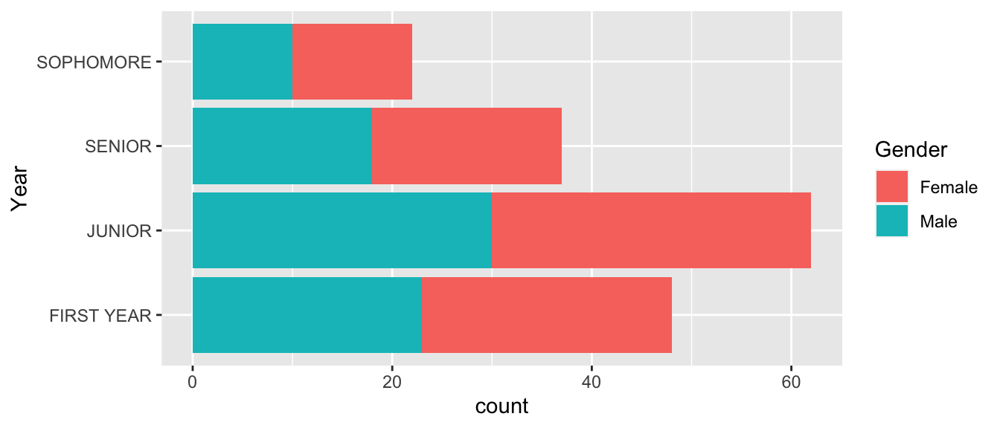


## Reorder Levels
Once the factor labels are set, the next most common thing to do is to rearrange the factors. In our `Students` example, the order is messed up because it chose to order them in the same order that they appear in the data set.  That is not appropriate and in this case, it makes sense to change the order to the chronological order First Year, Sophmore, Junior, Senior.

To change the ordering manually, we use the `fct::relevel()` command. This function takes as many levels as you give it and leaves the unaccounted for levels in the same order as they were.


```r
# Seniors first, leave the rest in the order they already were
Students %>%
  mutate( Year = fct_relevel(Year, 'senior') ) %>%
  ggplot( aes(x=Year, fill=Gender)) + geom_bar() + coord_flip()
```

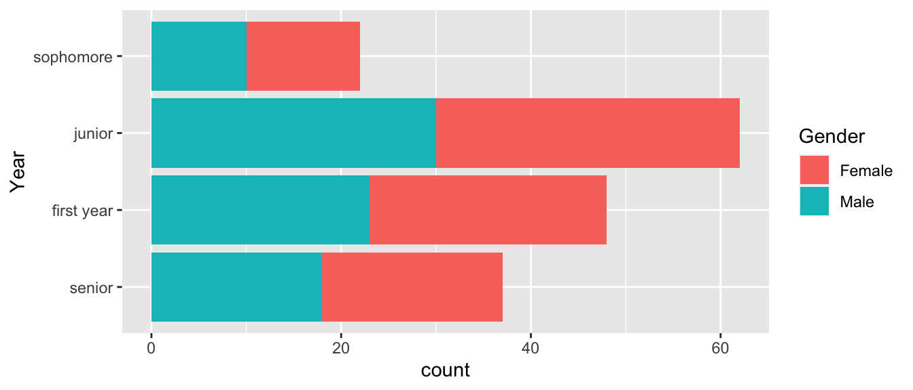

```r
# reset all the levels orders
Students %>%
  mutate( Year = fct_relevel(Year, 'senior', 'junior','sophomore','first year') ) %>%
  ggplot( aes(x=Year, fill=Gender)) + geom_bar() + coord_flip()
```

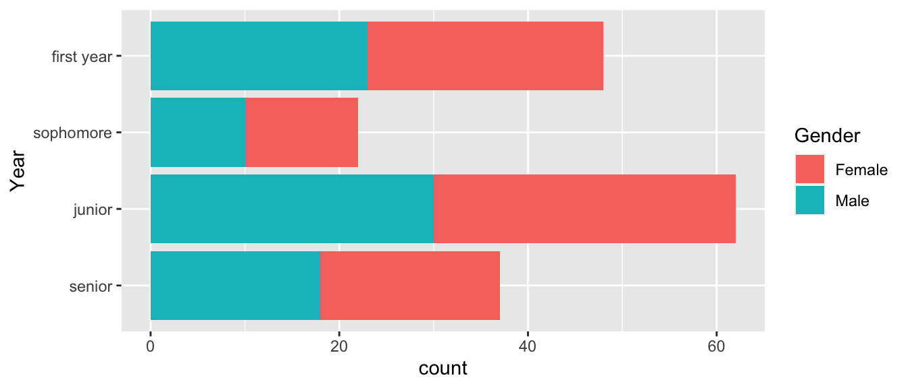

```r
# Reverse order of what I already had
Students %>%
  mutate( Year = fct_relevel(Year, 'senior', 'junior','sophomore','first year') ) %>%
  mutate( Year = fct_rev(Year) ) %>%
  ggplot( aes(x=Year, fill=Gender)) + geom_bar() + coord_flip()
```

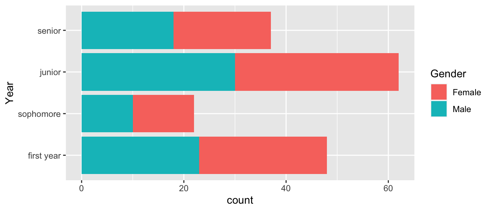

```r
# Sometimes it is useful to rotate using + or - the number of shift steps
# positive values move the first to the end. Negative values move the end to the front.
Students %>%
  mutate( Year = fct_relevel(Year, 'senior', 'junior','sophomore','first year') ) %>%
  mutate( Year = fct_rev(Year) ) %>%
  mutate( Year = fct_shift(Year, -1) ) %>%
  ggplot( aes(x=Year, fill=Gender)) + geom_bar() + coord_flip()
```

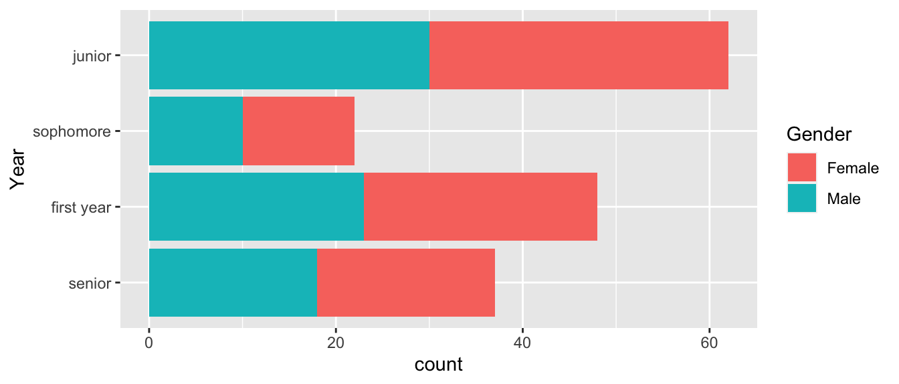

```r
# In the order of the most number of records
Students %>%
  mutate( Year = fct_infreq(Year) ) %>%
  ggplot( aes(x=Year, fill=Gender)) + geom_bar() + coord_flip()
```

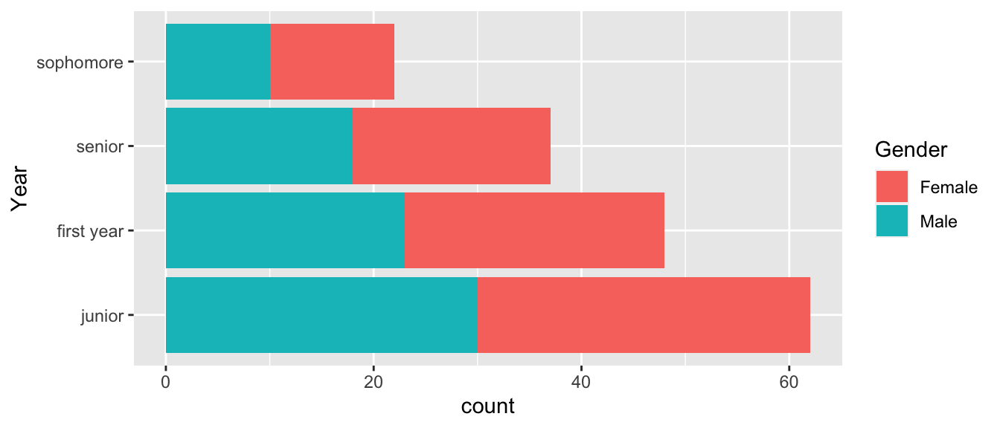


For a second example data set, consider a September 2019  [poll](https://www.monmouth.edu/polling-institute/reports/monmouthpoll_NH_092419/) 
from Monmouth University of New Hampshire Democrats and Independents.

```r
Dems <- tribble(
  ~Candidate, ~Percent, ~AgeOnElection,
'Elizabeth Warren',	27, 71,
'Joe Biden',	25, 77,
'Bernie Sanders',	12, 79,
'Pete Buttigieg',	10, 38,
'Kamala Harris',	3, 56,
'Cory Booker',	2, 51,
'Tulsi Gabbard',	2, 39,
'Amy Klobuchar',	2, 60, 
'Tom Steyer',	2, 63,
'Andrew Yang',	2, 45, 
'Other',	3, NA,
'No one',	1, NA,
'Undecided',	9, NA)
```


We now want to first arrange the 2020 Democratic candidates for US president by their support.

```r
# Reorder Candidates based on the polling percent. The order of Smallest to largest 
# results in 'No one' at the bottom and Elizabeth Warren at the top. 
Dems %>%
  mutate( Candidate = fct_reorder(Candidate, Percent) ) %>%
  ggplot( aes(x=Candidate, y=Percent)) + geom_col() + coord_flip()
```

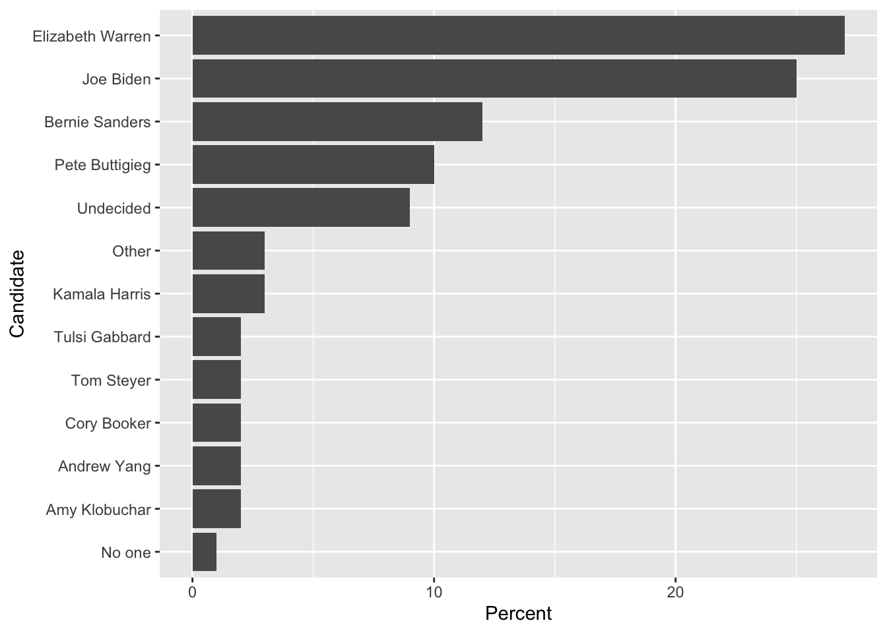

We might consider moving the `Other` and `Undecided` categories as the first categories before "No one". 

```r
Dems %>%
  mutate( Candidate = fct_reorder(Candidate, Percent) ) %>%
  mutate( Candidate = fct_relevel(Candidate, 'Other', after=0) ) %>%
  mutate( Candidate = fct_relevel(Candidate, 'Undecided', after=0) ) %>%
  ggplot( aes(x=Candidate, y=Percent)) + geom_col() + coord_flip()
```

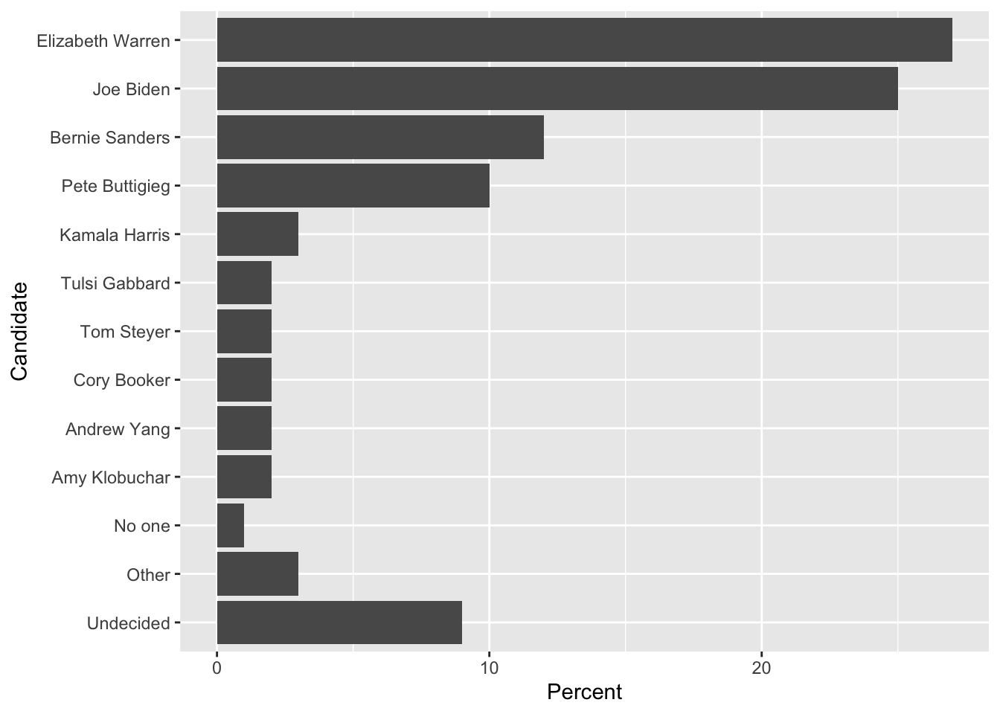


## Add or substract Levels
Often we find that it is necessary to collapse several categories into one. In the Democratic candidate example, we might want to collapse `No one`, `Other` and `Undecided` into a single `Other` category.


```r
# This collapses the factor levels but I still have 3 rows of "other"
Dems %>%
  mutate( Candidate = fct_collapse(Candidate, other = c('No one', 'Other', 'Undecided')) )
```

```
## # A tibble: 13 x 3
##    Candidate        Percent AgeOnElection
##    <fct>              <dbl>         <dbl>
##  1 Elizabeth Warren      27            71
##  2 Joe Biden             25            77
##  3 Bernie Sanders        12            79
##  4 Pete Buttigieg        10            38
##  5 Kamala Harris          3            56
##  6 Cory Booker            2            51
##  7 Tulsi Gabbard          2            39
##  8 Amy Klobuchar          2            60
##  9 Tom Steyer             2            63
## 10 Andrew Yang            2            45
## 11 other                  3            NA
## 12 other                  1            NA
## 13 other                  9            NA
```

```r
# Collopse the factor, then summarize by adding up the percentages  
Dems %>%
  mutate( Candidate = fct_collapse(Candidate, other = c('No one', 'Other', 'Undecided')) ) %>%
  group_by(Candidate) %>% summarize(Percent = sum(Percent)) %>%
  mutate( Candidate = fct_reorder(Candidate, Percent) ) %>%
  mutate( Candidate = fct_relevel(Candidate, 'other', after=0) ) %>%
  ggplot( aes(x=Candidate, y=Percent)) + geom_col() + coord_flip()
```

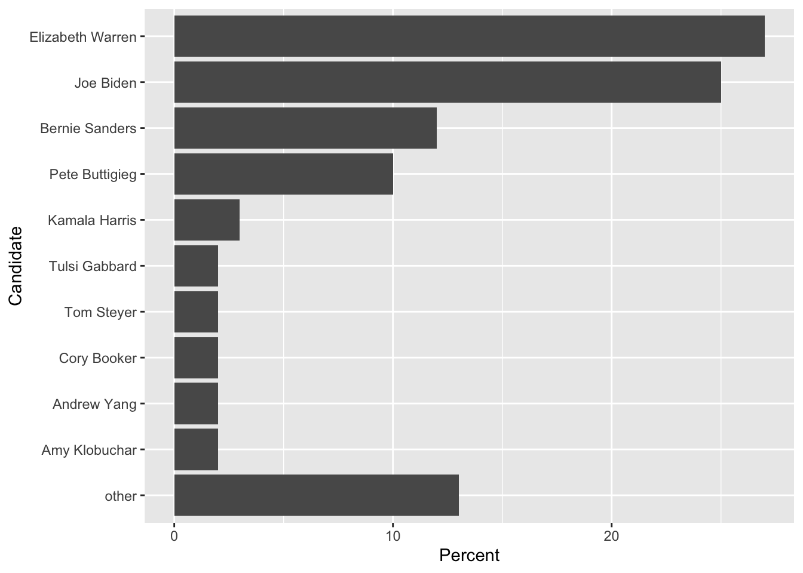


*I need to add the case where we are updating a column of factors and I want to replace a single observations level with another.  To do this we do something like this:*

```r
data <- data.frame( Name=c('Alice','Bruce','Charlie'), Grade = c('A','B','B') ) %>%
  mutate( Grade = factor(Grade) ) %>%
  mutate( Grade = fct_expand(Grade, 'C')) %>%
  mutate( Grade = if_else(Name == 'Charlie', factor('C', levels=levels(Grade)), Grade ) )
data  
```

```
##      Name Grade
## 1   Alice     A
## 2   Bruce     B
## 3 Charlie     C
```

*The key idea is that both the TRUE and the FALSE outputs have to have the same type (which is a factor), and both factors have to have a compatible set of levels.*

## Exercises  {#Exercises_Factors}

1. In the package `Lock5Data` there is a dataset `FloridaLakes` which contains water sample measurements from 53 lakes in Florida, produce a bar graph shows the `Lake` and `AvgMercury` variables and make sure that the lakes are ordered by Average Mercury content.

2. In the package `Lock5Data`, there is a dataset `FootballBrain` that has brain measurements for 75 individuals. The `Group` variable has three levels: `Control` is somebody that did not play football, `FBNoConcuss` is a football player with no history of concussions, or `FBConcuss` which is a football player with concussion history. The variable `Cogniton` measures their testing composite reaction time score. Make a box-plot graph of the groups vs cognition, but change the `Group` labels to something that would make sense to a reader. *Because there is no data for the `Control` group, don't show it on your resulting graph. Also notice that the original data set column name misspells "cognition".*

3. In the package `Lock5Data`, there is a dataset `RestaurantTips` which gives tip data from the restaurant First Crush Bistro in Potsdam, NY. Graph the `Bill` versus the `PctTip` for each `Day` of the week where we use `Day` as the variable to facet_grid or facet_wrap on. Make sure the `Day` variable has conventional days. Also include information about if the bill was paid via credit card and also make sure the credit card labels are either `Credit Card` or `Cash`.

<!--chapter:end:07_Factors.Rmd-->

# (PART\*) Miscellaneous{-}

# Statistical Tables{-}


```r
library(tidyverse)
```

Statistics makes use of a wide variety of distributions and before the days of personal computers, every statistician had books with hundreds and hundreds of pages of tables allowing them to look up particular values. Fortunately in the modern age, we don't need those books and tables, but we do still need to access those values. To make life easier and consistent for R users, every distribution is accessed in the same manner. 

## Example Distributions{-}

+--------------+-------------+---------------+------------------------------------+
| Distribution |  R Stem     | Parameters    | Parameter Interpretation           |
+==============+=============+===============+====================================+
| Binomial     | `binom`     | `size` <br>   | Number of Trials                   |
|              |             | `prob`        | Probability of Success (per Trial) |
+--------------+-------------+---------------+------------------------------------+
| Exponential  | `exp`       | `rate`        | Mean of the distribution           |
+--------------+-------------+---------------+------------------------------------+
| Normal       | `norm`      | `mean=0`      | Center of the distribution         |
|              |             | `sd=1`        | Standard deviation                 |
+--------------+-------------+---------------+------------------------------------+
| Uniform      | `unif`      | `min=0`       | Minimum of the distribution        |
|              |             | `max=1`       | Maximum of the distribution        | 
+--------------+-------------+---------------+------------------------------------+
| t            | `t`         | `df`          | Degrees of freedom                 |
+--------------+-------------+---------------+------------------------------------+
| F            | `f`         | `df1`  <br>   | Numerator Degrees of freedom       |
|              |             | `df2`         | Denominator Degrees of freedom     |
+--------------+-------------+---------------+------------------------------------+


All of the functions in R to manipulate distributions have a similar naming scheme. They begin with a `d`,`p`,`q`, or `r` and then the stem of the distribution.  For example, I might use a function called `pnorm()`. The above table lists the most common distributions you might see in an introductory statistics course.

## `mosaic::plotDist()` function{-}

The `mosaic` package provides a very useful routine for understanding a distribution. The `plotDist()` function takes the R name of the distribution along with whatever parameters are necessary for that function and show the distribution. For reference below is a list of common distributions and their R name and a list of necessary parameters.

For example, to see the normal distribution with mean $\mu=10$ and standard deviation $\sigma=2$, we use

```r
mosaic::plotDist('norm', mean=10, sd=2)
```

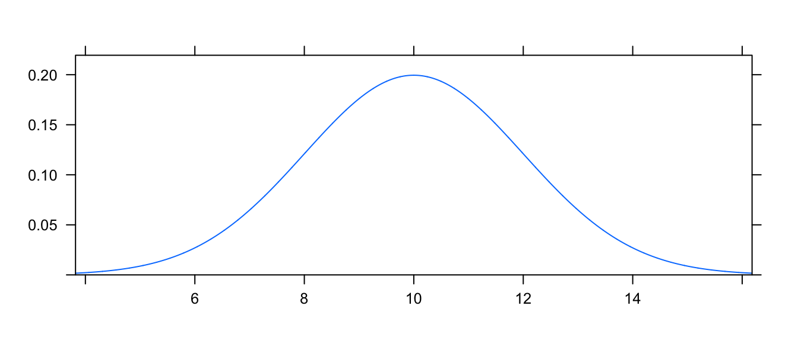

This function works for discrete distributions as well.

```r
mosaic::plotDist('binom', size=10, prob=.3)
```

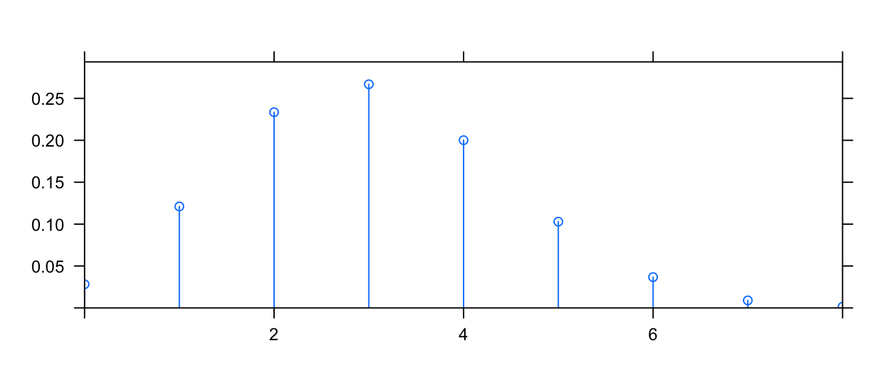


## Base R functions{-}

All the probability distributions available in R are accessed in exactly the same way, using a `d`-function, `p`-function, `q`-function, and `r`-function. For the rest of this section suppose that $X$ is a random variable from the distribution of interest and $x$ is some possible value that $X$ could take on. Notice that the `p`-function is the inverse of the `q`-function. 


+--------------------+-------------------------------------------------------------------+
| Function           |    Result                                                         |
+====================+===================================================================+
| `d`-function(x)    | The distance from the x-axis to the curve at a given $x$.         |
+--------------------+-------------------------------------------------------------------+
| `p`-function(x)    |  Probability of an outcome less than or equal to `x`              |
+--------------------+-------------------------------------------------------------------+
| `q`-function(q)    |  The `q` quantile of the distribution (opposite of p-function).   |
+--------------------+-------------------------------------------------------------------+
| `r`-function(n)    |  Generate $n$ random observations from the distribution           |
+--------------------+-------------------------------------------------------------------+

For each distribution in R, there will be this set of functions but we replace the “-function” with the distribution name or a shortened version. `norm`, `exp`, `binom`, `t`, `f` are the names for the normal, exponential, binomial, T and F distributions. Furthermore, most distributions have additional parameters that define the distribution and will also be passed as arguments to these functions, although, if a reasonable default value for the parameter exists, there will be a default.

### d-function{-}

The purpose of the d-function is to calculate the distance from the x-axis to the density curve or height of a probability mass function. The “d” actually stands for density.  Notice that for discrete distributions, this is the probability of observing that particular value, while for continuous distributions, the height doesn't have a nice physical interpretation.

We start with an example of the Binomial distribution. For $X\sim Binomial\left(n=10,\pi=.2\right)$ suppose we wanted to know $P(X=0)$? We know the probability mass function is 
$$P\left(X=x\right)={n \choose x}\pi^{x}\left(1-\pi\right)^{n-x}$$ 
thus 
$$P\left(X=0\right)	=	{10 \choose 0}\,0.2^{0}\left(0.8\right)^{10} =	1\cdot1\cdot0.8^{10} \approx	0.107$$
but that calculation is fairly tedious. To get R to do the same calculation, we just need the height of the probability mass function at $0$. To do this calculation, we need to know the x
  value we are interested in along with the distribution parameters $n$
  and $\pi$.

The first thing we should do is check the help file for the binomial distribution functions to see what parameters are needed and what they are named.

```r
?dbinom
```

The help file shows us the parameters $n$ and $\pi$ are called size and prob respectively. So to calculate the probability that $X=0$ we would use the following command:

```r
dbinom(0, size=10, prob=.2)
```

```
## [1] 0.1073742
```


### p-function{-}

Often we are interested in the probability of observing some value or anything less (In probability theory, we call this the cumulative density function or CDF). P-values will be calculated this way, so we want a nice easy way to do this.

To start our example with the binomial distribution, again let $X\sim Binomial\left(n=10,\pi=0.2\right)$. Suppose I want to know what the probability of observing a 0, 1, or 2? That is, what is $P\left(X\le2\right)$? I could just find the probability of each and add them up.

```r
dbinom(0, size=10, prob=.2)   +       #   P(X==0) +
  dbinom(1, size=10, prob=.2) +       #     P(X==1) +
  dbinom(2, size=10, prob=.2)         #     P(X==2)
```

```
## [1] 0.6777995
```

but this would get tedious for binomial distributions with a large number of trials. The shortcut is to use the `pbinom()` function.

```r
pbinom(2, size=10, prob=.2)
```

```
## [1] 0.6777995
```

For discrete distributions, you must be careful because R will give you the probability of less than or equal to 2. If you wanted less than two, you should use `dbinom(1,10,.2)`. 

The normal distribution works similarly. Suppose for $Z\sim N\left(0,1\right)$
  and we wanted to know $P\left(Z\le-1\right)$? 
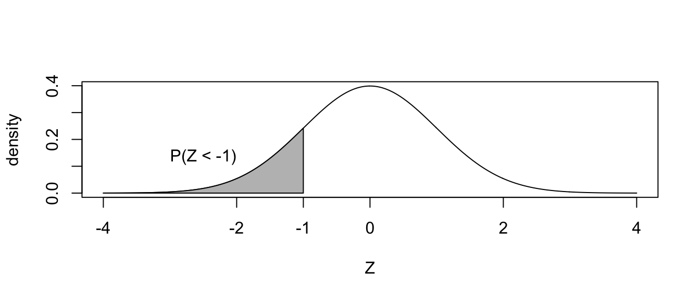

The answer is easily found via `pnorm()`. 

```r
pnorm(-1)
```

```
## [1] 0.1586553
```

Notice for continuous random variables, the probability $P\left(Z=-1\right)=0$ so we can ignore the issue of “less than” vs “less than or equal to”.

Often times we will want to know the probability of greater than some value. That is, we might want to find $P\left(Z \ge -1\right)$. For the normal distribution, there are a number of tricks we could use. Notably 
$$P\left(Z\ge-1\right)	=	P\left(Z\le1\right)=1-P\left(Z<-1\right)$$
but sometimes I'm lazy and would like to tell R to give me the area to the right instead of area to the left (which is the default). This can be done by setting the argument $lower.tail=FALSE$.

The `mosaic` package includes an augmented version of the `pnorm()` function called `xpnorm()` that calculates the same number but includes some extra information and produces a pretty graph to help us understand what we just calculated and do the tedious “1 minus” calculation to find the upper area. Fortunately this x-variant exists for the Normal, Chi-squared, F, Gamma continuous distributions and the discrete Poisson, Geometric, and Binomial distributions.


```r
mosaic::xpnorm(-1)
```

```
## 
```

```
## If X ~ N(0, 1), then
```

```
## 	P(X <= -1) = P(Z <= -1) = 0.1587
```

```
## 	P(X >  -1) = P(Z >  -1) = 0.8413
```

```
## 
```

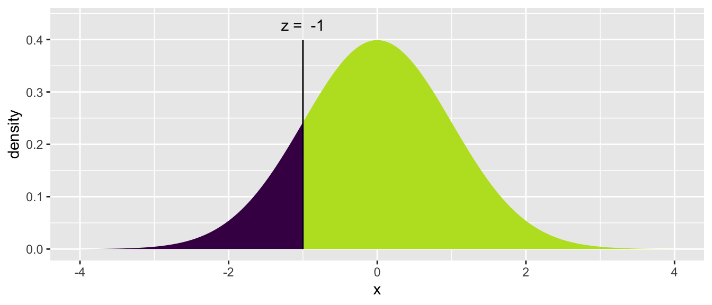

```
## [1] 0.1586553
```


### `q`-function{-}

In class, we will also find ourselves asking for the quantiles of a distribution. Percentiles are by definition 1/100, 2/100, etc but if I am interested in something that isn't and even division of 100, we get fancy can call them quantiles. This is a small semantic quibble, but we ought to be precise. That being said, I won't correct somebody if they call these percentiles. For example, I might want to find the 0.30 quantile, which is the value such that 30\% of the distribution is less than it, and 70\% is greater. Mathematically, I wish to find the value $z$ such that $P(Z<z)=0.30$.

To find this value in the tables in a book, we use the table in reverse. R gives us a handy way to do this with the `qnorm()` function and the mosaic package provides a nice visualization using the augmented `xqnorm()`. 

Below, I specify that I'm using a function in the `mosaic` package by specifying it via `PackageName::FunctionName()` format because I haven't loaded the `mosaic` package because some of its functions conflict with `dplyr`. 


```r
mosaic::xqnorm(0.30)   # Give me the value along with a pretty picture
```

```
## 
```

```
## If X ~ N(0, 1), then
```

```
## 	P(X <= -0.5244005) = 0.3
```

```
## 	P(X >  -0.5244005) = 0.7
```

```
## 
```

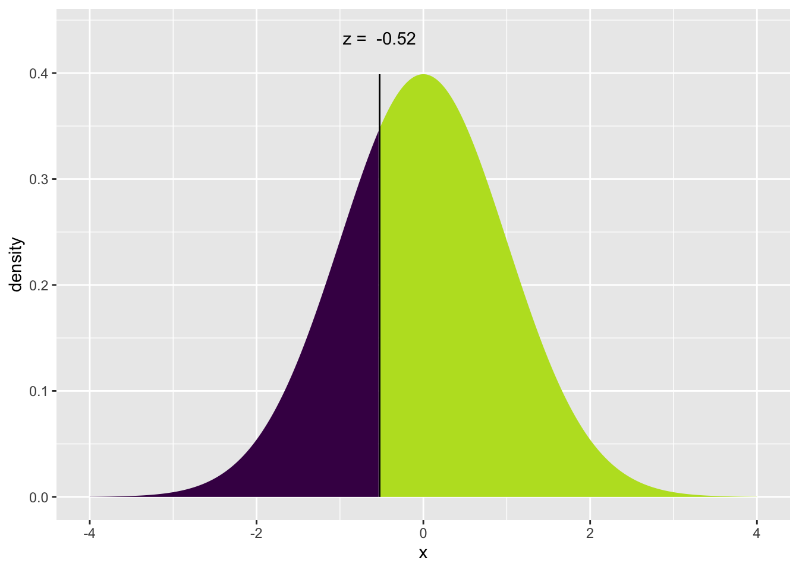

```
## [1] -0.5244005
```

```r
qnorm(.30)             # No pretty picture, just the value
```

```
## [1] -0.5244005
```


### r-function{-}

Finally, I often want to be able to generate random data from a particular distribution. R does this with the r-function. The first argument to this function the number of random variables to draw and any remaining arguments are the parameters of the distribution.

```r
rnorm(5, mean=20, sd=2)
```

```
## [1] 18.53873 17.91767 20.82364 18.86364 18.63586
```

```r
rbinom(4, size=10, prob=.8)
```

```
## [1] 6 8 8 9
```


## Exercises  {-#Exercises_Statistical_Tables}

1. We will examine how to use the probability mass functions (a.k.a. d-functions) and cumulative probability function (a.k.a. p-function) for the Poisson distribution.
    a) Create a graph of the distribution of a Poisson random variable with rate parameter $\lambda=2$ using the mosaic function `plotDist()`.
    b) Calculate the probability that a Poisson random variable (with rate parameter $\lambda=2$
 ) is exactly equal to 3 using the `dpois()` function. Be sure that this value matches the graphed distribution in part (a).
    c) For a Poisson random variable with rate parameter $\lambda=2$, calculate the probability it is less than or equal to 3, by summing the four values returned by the Poisson `d`-function.
    d) Perform the same calculation as the previous question but using the cumulative probability function `ppois()`.

2. We will examine how to use the cumulative probability functions (a.k.a. p-functions) for the normal and exponential distributions.
    a) Use the mosaic function `plotDist()` to produce a graph of the standard normal distribution (that is a normal distribution with mean $\mu=0$ and standard deviation $\sigma=1$.
    b) For a standard normal, use the `pnorm()` function or its `mosaic` augmented version `xpnorm()` to calculate
        i. $P\left(Z<-1\right)$
        ii. $P\left(Z\ge1.5\right)$
    c) Use the mosaic function `plotDist()` to produce a graph of an exponential distribution with rate parameter 2.
    d) Suppose that $Y\sim Exp\left(2\right)$, as above, use the `pexp()` function to calculate $P\left(Y \le 1 \right)$. (Unfortunately there isn't a mosaic augmented `xpexp()` function.)

3. We next examine how to calculate quantile values for the normal and exponential distributions using R's q-functions.
    a) Find the value of a standard normal distribution ($\mu=0$, $\sigma=1$) such that 5% of the distribution is to the left of the value using the `qnorm()` function or the mosaic augmented version `xqnorm()`.
    b) Find the value of an exponential distribution with rate 2 such that 60% of the distribution is less than it using the `qexp()` function.

4. Finally we will look at generating random deviates from a distribution.
    a) Generate a single value from a uniform distribution with minimum 0, and maximum 1 using the `runif()` function. Repeat this step several times and confirm you are getting different values each time.
    b) Generate a sample of size 20 from the same uniform distribution and save it as the vector `x` using the following:
        
        ```r
        x <- runif(20, min=0, max=1)
        ```
        Then produce a histogram of the sample using the function `hist()` or `geom_histogram`
        
        ```r
        data.frame(x=x) %>% 
          ggplot(aes(x=x)) + 
          geom_histogram(bins=10)
        ```
    c) Generate a sample of 2000 from a normal distribution with `mean=10` and standard deviation `sd=2` using the `rnorm()` function. Create a histogram the the resulting sample.
    

<!--chapter:end:11_StatisticalTables.Rmd-->

# Rmarkdown Tricks{-}


```r
# as always, I'm loading the tidyverse.
library(tidyverse)
```


We have been using RMarkdown files to combine the analysis and discussion into one nice document that contains all the analysis steps so that your research is  reproducible. 

There are many resources on the web about Markdown and the variant that RStudio uses (called RMarkdown), but the easiest reference is to just use the RStudio help tab to access the help.  I particular like `Help -> Cheatsheets -> RMarkdown Reference Guide` because it gives me the standard Markdown information but also a bunch of information about the options I can use to customize the behavior of individual R code chunks.

Most of what is presented here isn't primarily about how to use R, but rather how to work with tools in RMarkdown so that the final product is neat and tidy. While you could print out your RMarkdown file and then clean it up in MS Word, sometimes there is a good to want as nice a starting point as possible. 

## Chunk Options{-}
Within an Rmarkdown file, we usually have some R chunk and there are many things we could to tweak how the results are displayed.


```text
```{r, echo=FALSE, fig.height=4, fig.width=6}
plot(cars)
```
```

In this example, I've shown what a code chunk might look like when I include different chunk options.  In this case I've set the figure output height/width in inches and using the `echo=FALSE`, I've specified that the code is to be run and the output to be shown, but we don't want to see the R-code that produces the output.


The comprehensive set of R chunk options is available by the knitr package author Yihui Xie at the `knitr` [website](https://yihui.name/knitr/options/). However, below I'll list my favorite and most used options. I've grabbed these definitions from the [Rmarkdown reference guide](https://www.rstudio.com/wp-content/uploads/2015/03/rmarkdown-reference.pdf) that the RStudio folks created.

|  Option       |  Default     |  Description
|:-------------:|:------------:|:-----------------------------------------------------------------------------------|
| `echo`        |  `TRUE`      |  If FALSE, knitr will not display the code in the code chunk above it’s results in the final document. |
| `results`     |  `'markup'`  | If `'hide'`, knitr will not display the code’s results in the final document. If `'hold'`, knitr will delay displaying all output pieces until the end of the chunk. If `'asis'`, knitr will pass through results without reformatting them, useful if results return raw HTML, etc.) |
| `error`       | `TRUE`       | If `FALSE`, knitr will not display any error messages generated by the code. |
| `message`     | `TRUE`       | If `FALSE`, knitr will not display any messages generated by the code. |
| `warning`     | `TRUE`       | If `FALSE`, knitr will not display any warning messages generated by the code.  |
| `fig.height`  |  7           | The height to use in R for plots created by the chunk (in inches).  |
| `fig.width`   |  7           |  The height to use in R for plots created by the chunk (in inches).  |


To set the chuck options for ALL chunks, which can be overwritten on a case by case basis, we can use the global options.


```r
# I usually include a chunk like this at the beginning of any Rmarkdown
# file to set global chunk options, like a default figure size and alignment.
knitr::opts_chunk$set(fig.height=3, fig.align='center')
```


## Verbatim & List Environments{-} 

The way that Markdown starts a *verbatim* environment is to indent your text with 4 spaces. If you have the following code in your Rmarkdown file:


```text
    This is text that will be printed verbatim.
```

Then you'll see the following output:

    This is text that will be printed verbatim.
    
Notice the Markdown verbatim environment is exactly how your R code chunks get displayed exactly how your wrote them. This is a necessary and handy trick for producing really nice knitted output.

Markdown unfortunately ALSO uses four spaces to denote an indented list environment.


```text
1. Problem definition. This problem defintion spans several lines. On
    the second line, I'll indent 4 spaces to keep ourselves in the list 
    environment.
    a) Part number a. This might be very long. To keep ourselves in this
        list element, we indent 8 spaces.  (4 for problem 1, and four for part a).
    b) Part number b
```

Produces the following output:

1. Problem definition. This problem defintion spans several lines. On
    the second line, I'll indent 4 spaces to keep ourselves in the list 
    environment.
    a) Part number a. This might be very long. To keep ourselves in this
        list element, we indent 8 spaces.  (4 for problem 1, and four for part a).
    b) Part number b

But notice what happens if I insert R code chunk between part a) and b) and critically, there is no four spaces that indents the R chunk.


```text
1. Problem definition.
    a) Part number a
```{r}
2+3
```
    b) Part number b
```


Without the four spaces on the code chunk between parts (a) and (b), we fall out of the nested list environment and begin a verbatim environment.

1. Problem definition.
    a) Part number a

```r
2+3
```

```
## [1] 5
```

    b) Part number b
    
    
So to keep ourselves in the nested list environment, we need to indent the R chunk 4 (or 8) spaces. If we indent it 4 spaces, then the R code and output will be aligned with the a), if we use 8 spaces, it will be indented from the a).

```text
1. Problem definition.
    a) Part number a
        ```{r}
        2+3
        ```
        
    b) Part number b
```

1. Problem definition.
    a) Part number a
        
        ```r
        2+3
        ```
        
        ```
        ## [1] 5
        ```
        
    b) Part number b


I really like the code indented from the a) header, but then the code editor doesn't do highlighting because on first blush, it looks like the verbatim environment and RStudio isn't smart enough to realize that we aren't in the verbatim.  So my solution is to get the R code working and *then* indent it the 8 spaces. 

Finally, I often leave a blank line separating my response in part (a) to the problem definition for part (b). Again the RStudio editor isn't smart enough to realize that we are writing an R chunk.  Unfortunately I don't have a clever hack to keep the editor from thinking that you are in the verbatim environment. Fortunately, when we knit, it will all be fine.


## Mathematical expressions{-}

The primary way to insert a mathematical expression is to use a markup language 
called LaTeX. This is a very powerful system and it is what most Mathematicians 
use to write their documents. The downside is that there is a lot to learn. 
However, you can get most of what you need pretty easily. 

For RMarkdown to recognize you are writing math using LaTeX, you need to 
enclose the LaTeX with dollar signs ($). Some examples of common LaTeX patterns 
are given below:

|   Goal       |   LaTeX      |   Output    |   LaTeX       |  Output        |
|:------------:|:----------------:|:-----------:|:-------------:|:--------------:|
|   power      | ``` $x^2$ ```    |  $x^2$      |  ``` $y^{0.95}$ ``` |  $y^{0.95}$    |
|  Subscript   | ``` $x_i$ ```        |  $x_i$  |  ``` $t_{24}$ ```       | $t_{24}$       |
|  Greek       | ``` $\alpha$ $\beta$ ``` | $\alpha$ $\beta$ | ``` $\theta$ $\Theta$ ``` | $\theta$ $\Theta$ |
|  Bar         | ``` $\bar{x}$ ```      | $\bar{x}$    | ``` $\bar{mu}_i$ ```    | $\bar{\mu}_i$    |
|  Hat         | ``` $\hat{mu}$ ```     | $\hat{\mu}$   | ``` $\hat{y}_i$ ```     | $\hat{y}_i$     |
| Star         | ``` $y^*$ ```           | $y^*$         | ``` $\hat{\mu}^*_i$ ```   | $\hat{\mu}^*_i$  |
| Centered Dot | ``` $\cdot$ ```        | $\cdot$       | ``` $\bar{y}_{i\cdot}$ ``` | $\bar{y}_{i\cdot}$ |
| Sum          | ``` $\sum x_i$ ```     | $\sum x_i$    | ``` $\sum_{i=0}^N x_i$ ``` | $\sum_{i=0}^N x_i$ |
||||||
| Square Root  | ``` $\sqrt{a}$ ```     | $\sqrt{a}$    | ``` $\sqrt{a^2 + b^2}$ ``` | $\sqrt{a^2 + b^2}$  |
||||||
| Fractions    | ``` $\frac{a}{b}$ ```  | $\frac{a}{b}$ | ``` $\frac{x_i - \bar{x}{s/\sqrt{n}$ ```| $\frac{x_i - \bar{x}}{s/\sqrt{n}}$ |

Within your RMarkdown document, you can include LaTeX code by enclosing it with 
dollar signs. So you might write ``` $\alpha=0.05$ ```  in your text, but 
after it is knitted to a pdf, html, or Word, you'll see $\alpha=0.05$.
If you want your mathematical equation to be on its own line, all by itself, 
enclose it with double dollar signs. So 

``` $$z_i = \frac{z_i-\bar{x}}{\sigma / \sqrt{n}}$$ ``` 

would be displayed as 

$$ z_{i}=\frac{x_{i}-\bar{X}}{\sigma/\sqrt{n}} $$
 
Unfortunately RMarkdown is a little picky about spaces near the `$` and `$$` signs 
and you can't have any spaces between them and the LaTeX command. For a more 
information about all the different symbols you can use, google 
'LaTeX math symbols'.

## Tables {-}
For the following descriptions of the simple, grid, and pipe tables, I've 
shamelessly stolen from the Pandoc documentation. 
[http://pandoc.org/README.html#tables]

One way to print a table is to just print in in R and have the table presented 
in the code chunk. For example, suppose I want to print out the first 4 rows 
of the trees dataset.


```r
data <- trees[1:4, ]
data
```

```
##   Girth Height Volume
## 1   8.3     70   10.3
## 2   8.6     65   10.3
## 3   8.8     63   10.2
## 4  10.5     72   16.4
```

Usually this is sufficient, but suppose you want something a bit nicer because 
you are generating tables regularly and you don't want to have to clean them up 
by hand. Tables in RMarkdown follow the table conventions from the Markdown class 
with a few minor exceptions. Markdown provides 4 ways to define a table and 
RMarkdown supports 3 of those.

### Simple Tables
Simple tables look like this (Notice I don't wrap these dollar signs or anything,
just a blank line above and below the table): 


```r
Right   Left     Center   Default 
------- ------ ---------- ------- 
     12 12        hmmm        12 
    123 123        123       123 
      1 1            1         1
```

and would be rendered like this:

Right   Left     Center   Default 
------- ------ ---------- ------- 
     12 12        hmmm        12 
    123 123        123       123 
      1 1            1         1

The headers and table rows must each fit on one line. Column alignments are 
determined by the position of the header text relative to the dashed line below
it.

If the dashed line is flush with the header text on the right side but extends 
beyond it on the left, the column is right-aligned. If the dashed line is flush
with the header text on the left side but extends beyond it on the right, the 
column is left-aligned. If the dashed line extends beyond the header text on 
both sides, the column is centered. If the dashed line is flush with the header 
text on both sides, the default alignment is used (in most cases, this will be 
left). The table must end with a blank line, or a line of dashes followed by a 
blank line.

### Grid Tables
Grid tables are a little more flexible and each cell can take an arbitrary 
Markdown block elements (such as lists).


```r
+---------------+---------------+--------------------+
| Fruit         | Price         | Advantages         |
+===============+===============+====================+
| Bananas       | $1.34         | - built-in wrapper |
|               |               | - bright color     |
+---------------+---------------+--------------------+
| Oranges       | $2.10         | - cures scurvy     |
|               |               | - tasty            |
+---------------+---------------+--------------------+
```
which is rendered as the following:

+---------------+---------------+--------------------+
| Fruit         | Price         | Advantages         |
+===============+===============+====================+
| Bananas       | $1.34         | - built-in wrapper |
|               |               | - bright color     |
+---------------+---------------+--------------------+
| Oranges       | $2.10         | - cures scurvy     |
|               |               | - tasty            |
+---------------+---------------+--------------------+

Grid table doesn't support Left/Center/Right alignment. Both Simple tables and 
Grid tables require you to format the blocks nicely inside the RMarkdown file and 
that can be a bit annoying if something changes and you have to fix the spacing 
in the rest of the table. Both Simple and Grid tables don't require column headers.

### Pipe Tables
Pipe tables look quite similar to grid tables but Markdown isn't as picky about the 
pipes lining up. However, it does require a header row (which you could leave
the elements blank in).


```r
| Right | Left | Default | Center |
|------:|:-----|---------|:------:|
|   12  |  12  |    12   |    12  |
|  123  |  123 |   123   |   123  |
|    1  |    1 |     1   |     1  |
```
which will render as the following:

| Right | Left | Default | Center |
|------:|:-----|---------|:------:|
|   12  |  12  |    12   |    12  |
|  123  |  123 |   123   |   123  |
|    1  |    1 |     1   |     1  |

In general I prefer to use the pipe tables because it seems a little less
picky about getting everything correct. However it is still pretty
annoying to get the table laid out correctly.

In all of these tables, you can use the regular RMarkdown formatting tricks
for italicizing and bolding. So I could have a table such as the following:


```r
|   Source    |  df  |   Sum of Sq   |    Mean Sq    |    F   |  $Pr(>F_{1,29})$    |
|:------------|-----:|--------------:|--------------:|-------:|--------------------:|
|  Girth      |  *1* |  7581.8       |  7581.8       | 419.26 |  **< 2.2e-16**      |
|  Residual   |  29  |  524.3        |   18.1        |        |                     |
```
and have it look like this:

|   Source    |  df  |   Sum of Sq   |    Mean Sq    |    F   |  $Pr(>F_{1,29})$    |
|:------------|-----:|--------------:|--------------:|-------:|--------------------:|
|  Girth      |  *1* |  7581.8       |  7581.8       | 419.26 |  **< 2.2e-16**      |
|  Residual   |  29  |  524.3        |   18.1        |        |                     |

The problem with all of this is that I don't want to create these by hand. Instead
I would like functions that take a data frame or matrix and spit out the RMarkdown
code for the table.

## R functions to produce table code.{-}
There are a couple of different packages that convert a data frame to 
simple/grid/pipe table.  We will explore a couple of these, starting with the
most basic and moving to the more complicated. The general idea is that we'll 
produce the appropriate simple/grid/pipe table syntax in R, and when it gets
knitted, then RMarkdown will turn our simple/grid/pipe table into something pretty.


### `knitr::kable`{-}
The `knitr` package includes a function that produces simple tables. It doesn't
have much customize-ability,  but it gets the job done. One nice aspect about `kable` compared to `pander` is that we don't need to set any additional chunk options.

```r
knitr::kable( data )
```


| Girth| Height| Volume|
|-----:|------:|------:|
|   8.3|     70|   10.3|
|   8.6|     65|   10.3|
|   8.8|     63|   10.2|
|  10.5|     72|   16.4|

### Package `pander`{-}
The package `pander` seems to be a nice compromise between customization
and not having to learn too much. It is relatively powerful in that it will
take `summary()` and `anova()` output and produce tables for them. By default 
`pander` will produce simple tables, but you can ask for Grid or Pipe tables.


```r
pander::pander( data, style='rmarkdown' )   # style is pipe tables...
```


| Girth | Height | Volume |
|:-----:|:------:|:------:|
|  8.3  |   70   |  10.3  |
|  8.6  |   65   |  10.3  |
|  8.8  |   63   |  10.2  |
| 10.5  |   72   |  16.4  |

The `pander` package deals with summary and anova tables from
a variety of different analyses. So you can simply ask for a
nice looking version using the following:


```r
# a simple regression model
model <- lm( Volume ~ Girth, data=trees )         

model %>% 
  summary() %>%      # the usual summary table
  pander::pander()   # make the table print *pretty*
```


---------------------------------------------------------------
     &nbsp;        Estimate   Std. Error   t value   Pr(>|t|)  
----------------- ---------- ------------ --------- -----------
 **(Intercept)**    -36.94      3.365      -10.98    7.621e-12 

    **Girth**       5.066       0.2474      20.48    8.644e-19 
---------------------------------------------------------------


--------------------------------------------------------------
 Observations   Residual Std. Error   $R^2$    Adjusted $R^2$ 
-------------- --------------------- -------- ----------------
      31               4.252          0.9353       0.9331     
--------------------------------------------------------------

Table: Fitting linear model: Volume ~ Girth

```r
model %>% 
  anova() %>%                 # The usual anoval table
  pander::pander(missing='')  # Make the table print *pretty*
```


-------------------------------------------------------------
    &nbsp;       Df   Sum Sq   Mean Sq   F value    Pr(>F)   
--------------- ---- -------- --------- --------- -----------
   **Girth**     1     7582     7582      419.4    8.644e-19 

 **Residuals**   29   524.3     18.08                        
-------------------------------------------------------------

Table: Analysis of Variance Table

The `missing=''` argument causes pander to print a blank instead of `NA` for any missing values in the table.

## Code Appendix {-}
Some people prefer to not be distracted by having all of the R code embedded within a document and just want to see the resulting output tables and graphs. This can easily be done by including `echo=FALSE` in the header of each code chunk, or in the initial global chunk options via `knitr::opts_chunk$set(echo=FALSE)`. This will cause the code to be executed and the results shown, but the R code used to produce those results will not be shown.

Another preference is to not show the code at each step, but to show the R code only at the very end. For example, perhaps we want a *Code Appendix* that gives all of the code.  The naive approach would be to just copy all the code and create duplicate code chunks and then don't evaluate them. However, this violates the rule of reproducible research that the code used to produce the result must be the code that is advertised as having created it. 

Instead, we'll set the default behavior for all code chunks be to not show the R code,

```r
knitr::opts_chunk$set( echo=FALSE )
```

Then at the end of the document, create a code-chunk that isn't evaluated but is echoed, and copies from all of the previous code chunks in the document.  The `documentation=1` adds the code chunk headers (if specified) as comments.

```
### Code Appendix 
```{r, ref.label=knitr::all_labels(), echo=TRUE, eval=FALSE, documentation=1}
```
```


<!--chapter:end:12_RMarkdownTricks.Rmd-->

# Data Wrangling Process{-}


```r
# Chapter packages we will use
library(tidyverse)
```

## Introduction
The process of data wrangling often seems very situation dependent and there isn't a unifying process. However this isn't completely true. The process can be thought of as having four distinct steps.

| **Step**  |  **Result Name** | Description                    |
|:---------:|:-----------:|:------------------------------------------------------------------------|
| Import    | `data_raw`   | Get the data into R somehow. The structure of the data is just however it came in. |
| Tidy      | `data_tidy`  | Restructure the data so that each row is an observation, and each column is a variable.|
| Clean     | `data`       | Correct variable types, consistent and useful labels, validation and correction.   |
| Use       | `data_small` | Sub-setting the full data into a smaller set that addresses a particular question. |


I tend to break my data cleaning scripts into three chunks and the cleaning script looks something like this:

```r
# Script for reading in Flagstaff Weather Data
Weather_raw <- read_csv('~/GitHub/444/data-raw/Flagstaff_Temp.csv')

Weather_tidy <- Weather_raw %>% ...

Weather <- Weather_tidy %>% ...
```

In the above script the `...` represent a bunch commands that I pipe together. The clean data set doesn't include any `_modifier` tag because that clean data set is the one that I want to save and then subsequently use in any analysis. 

In many real world examples, the data wrangling work is concentrated in only one or two of the first three steps. Typically you might be able to skip one or more steps, but I would encourage using the naming convention above so that it is clear where the skipped steps are and what step you are on.

## Import
Obviously getting the data into R is an obvious first step. Often this is a simple step of reading a `.csv` file, but more complicated scenarios such as messy excel files, importing data tables from a database, or pulling data out of web pages or pdf documents are common.  Another case is when the data is spread across a bunch of files (e.g. one excel file per month of data) and we need to read multiple files and squish them together before proceeding to the next step.

## Tidying 

The terminology of "tidy data" popularized by Hadley Wickham and his introduction to the concept lives in a [vignette](https://cran.r-project.org/web/packages/tidyr/vignettes/tidy-data.html) in the `tidyr` package. I highly recommend reading Hadley's introduction as well as what I present here. 

Data is usually described as "tidy" if it satisfies the following:

1. Each row represents an observation.
2. Each column represents a variable.
3. Each table of data represents a different type of observational unit.

The difficult part is recognizing what constitutes an observation and what constitutes a variable. Often I like to think that the observations represent a noun and each now has multiple variables that adjectives that describe the noun. In particular I think that the attributes should be applicable to every single observation. If your data has a large number of `NA` values, that is a symptom of storing the data in a messy (non-tidy) format. 

Suppose I have an address book where I keep email addresses, phone numbers, and other contact information.  However, because different people have several different types of contact information, it would be a bad idea to have one row per person because then we'd need a column for work email, personal email, home phone, work phone, cell phone, twitter handle, reddit user name, etc. Instead, store the information with a single row representing a particular contact.


```
## # A tibble: 5 x 3
##   Person Type       Value                    
##   <chr>  <chr>      <chr>                    
## 1 Derek  Work Email derek.sonderegger@nau.edu
## 2 Derek  Cell Phone 970-867-5309             
## 3 Derek  Twitter    @D_Sonderegger           
## 4 Derek  Github     dereksonderegger         
## 5 Mom    Home Phone 555-867-5309
```

For a more challenging example, suppose we have grade book where we've stored students scores for four different homework assignments.


```
##      name HW.1 HW.2 HW.3 HW.4
## 1  Alison    8    5    8    4
## 2 Brandon    5    3    6    9
## 3 Charles    9    7    9   10
```

In this case we are considering each row to represent a student and each variable represents homework score. An alternative representation would be for each row to represent a single score.


```
##       name Assignment Score
## 1   Alison       HW.1     8
## 2  Brandon       HW.1     5
## 3  Charles       HW.1     9
## 4   Alison       HW.2     5
## 5  Brandon       HW.2     3
## 6  Charles       HW.2     7
## 7   Alison       HW.3     8
## 8  Brandon       HW.3     6
## 9  Charles       HW.3     9
## 10  Alison       HW.4     4
## 11 Brandon       HW.4     9
## 12 Charles       HW.4    10
```

Either representation is fine in this case, because each student should have the same number of assignments. However, if I was combining grade books from multiple times I've taught the course, the first option won't work because sometimes I assign projects and sometimes not. So the tidy version of the data would be to have a table `scores` where each row represents a single assignment from a particular student.

## Cleaning

The cleaning step is usually highly dependent on the data set content. This step involves 

1. Making sure every variable has the right type. For example, make sure that dates are dates, not character strings. 
2. Fix factor labels and sort order.
3. Verify numeric values are reasonable. I often do this by examining summary statistics and/or histograms for each column.
4. Create any calculated variables we need.

Most of our data frame manipulation tools are designed to work with tidy data. As a result, cleaning is most easily done after the data set structure has been tidied. Therefore,I recommend first performing the reshaping tidying step and *then* perform the cleaning. 


## Use
In the previous three steps, we tried to keep all of the data present and not filter anything out. In this step we transition to using data to build a much deeper understanding. 

In the simplest case, we just take the full dataset and pass it into a graph or statistical model. But in a more complicated situation, we might want to filter out a bunch of data and focus on a particular subset. For example, we might make a graph for a particular subgroup comparing two covariates. 

In this step, the data manipulation is often to just filter the final cleaned up data. Because I often want to consider many different small filtered sets, it can be convenient to not actually save these sets, but rather just pipe them into the graphing or modeling function.


<!--chapter:end:13_DataWrangling_Process.Rmd-->

# (PART\*) Deeper Details {-}

# Data Structures


```r
library(tidyverse)
```

In the introduction section of these notes, we concentrated on `data.frame`s created and manipulated using `dplyr`. There are other data structures that are used in R and it is useful to learn how to manipulate those other data structures. Furthermore, it is also useful to be able to use base R functionality to do certain manipulations on `data.frame`s.


## Vectors
R operates on vectors where we think of a vector as a collection of objects, usually numbers. The first thing we need to be able to do is define an arbitrary collection using the `c()` function. The “c” stands for collection.


```r
# Define the vector of numbers 1, ..., 4
c(1,2,3,4)
```

```
## [1] 1 2 3 4
```

There are many other ways to define vectors. The function `rep(x, times)` just repeats `x` a the number times specified by `times`.


```r
rep(2, 5)              # repeat 2 five times... 2 2 2 2 2
```

```
## [1] 2 2 2 2 2
```

```r
rep( c('A','B'), 3 )   # repeat A B three times  A B A B A B
```

```
## [1] "A" "B" "A" "B" "A" "B"
```

Finally, we can also define a sequence of numbers using the `seq(from, to, by, length.out)` function which expects the user to supply 3 out of 4 possible arguments. The possible arguments are `from`, `to`, `by`, and `length.out`. From is the starting point of the sequence, to is the ending point, by is the difference between any two successive elements, and `length.out` is the total number of elements in the vector.


```r
seq(from=1, to=4, by=1)
```

```
## [1] 1 2 3 4
```

```r
seq(1,4)        # 'by' has a default of 1   
```

```
## [1] 1 2 3 4
```

```r
1:4             # a shortcut for seq(1,4)
```

```
## [1] 1 2 3 4
```

```r
seq(1,5, by=.5)
```

```
## [1] 1.0 1.5 2.0 2.5 3.0 3.5 4.0 4.5 5.0
```

```r
seq(1,5, length.out=11) 
```

```
##  [1] 1.0 1.4 1.8 2.2 2.6 3.0 3.4 3.8 4.2 4.6 5.0
```

If we have two vectors and we wish to combine them, we can again use the `c()` function.


```r
vec1 <- c(1,2,3)
vec2 <- c(4,5,6)
vec3 <- c(vec1, vec2)
vec3
```

```
## [1] 1 2 3 4 5 6
```

### Accessing Vector Elements

Suppose I have defined a vector


```r
foo <- c('A', 'B', 'C', 'D', 'F')
```

and I am interested in accessing whatever is in the first spot of the vector. Or perhaps the 3rd or 5th element. To do that we use the `[]` notation, where the square bracket represents a subscript.


```r
foo[1]  # First element in vector foo
```

```
## [1] "A"
```

```r
foo[4]  # Fourth element in vector foo
```

```
## [1] "D"
```

This sub-scripting notation can get more complicated. For example I might want the 2nd and 3rd element or the 3rd through 5th elements.


```r
foo[c(2,3)]  # elements 2 and 3
```

```
## [1] "B" "C"
```

```r
foo[ 3:5 ]   # elements 3 to 5
```

```
## [1] "C" "D" "F"
```

Finally, I might be interested in getting the entire vector except for a certain element. To do this, R allows us to use the square bracket notation with a negative index number. 

```r
foo[-1]          # everything but the first element
```

```
## [1] "B" "C" "D" "F"
```

```r
foo[ -1*c(1,2) ] # everything but the first two elements
```

```
## [1] "C" "D" "F"
```

Now is a good time to address what is the `[1]` doing in our output? Because vectors are often very long and might span multiple lines, R is trying to help us by telling us the index number of the left most value. If we have a very long vector, the second line of values will start with the index of the first value on the second line.

```r
# The letters vector is a vector of all 26 lower-case letters
letters
```

```
##  [1] "a" "b" "c" "d" "e" "f" "g" "h" "i" "j" "k" "l" "m" "n" "o" "p" "q" "r" "s"
## [20] "t" "u" "v" "w" "x" "y" "z"
```
Here the `[1]` is telling me that `a` is the first element of the vector and the `[18]` is telling me that `r` is the 18th element of the vector.

### Scalar Functions Applied to Vectors

It is very common to want to perform some operation on all the elements of a vector simultaneously. For example, I might want take the absolute value of every element. Functions that are inherently defined on single values will almost always apply the function to each element of the vector if given a vector. 

```r
x <- -5:5
x
```

```
##  [1] -5 -4 -3 -2 -1  0  1  2  3  4  5
```

```r
abs(x)
```

```
##  [1] 5 4 3 2 1 0 1 2 3 4 5
```

```r
exp(x)
```

```
##  [1] 6.737947e-03 1.831564e-02 4.978707e-02 1.353353e-01 3.678794e-01
##  [6] 1.000000e+00 2.718282e+00 7.389056e+00 2.008554e+01 5.459815e+01
## [11] 1.484132e+02
```

### Vector Algebra

All algebra done with vectors will be done element-wise by default.For matrix and vector multiplication as usually defined by mathematicians, use `%*%` instead of `*`.  So two vectors added together result in their individual elements being summed. 

```r
x <- 1:4
y <- 5:8
x + y
```

```
## [1]  6  8 10 12
```

```r
x * y
```

```
## [1]  5 12 21 32
```

R does another trick when doing vector algebra. If the lengths of the two vectors don't match, R will recycle the elements of the shorter vector to come up with vector the same length as the longer. This is potentially confusing, but is most often used when adding a long vector to a vector of length 1.

```r
x <- 1:4
x + 1
```

```
## [1] 2 3 4 5
```

### Commonly Used Vector Functions

 
Function       | Result
-------------- | ------------------------
`min(x)`       | Minimum value in vector x
`max(x)`       | Maximum value in vector x
`length(x)`    | Number of elements in vector x
`sum(x)`       | Sum of all the elements in vector x
`mean(x)`      | Mean of the elements in vector x
`median(x)`    | Median of the elements in vector x
`var(x)`      | Variance of the elements in vector x
`sd(x)`        | Standard deviation of the elements in x

Putting this all together, we can easily perform tedious calculations with ease. To demonstrate how scalars, vectors, and functions of them work together, we will calculate the variance of 5 numbers. Recall that variance is defined as 
$$ Var\left(x\right)=\frac{\sum_{i=1}^{n}\left(x_{i}-\bar{x}\right)^{2}}{n-1} $$

```r
x <- c(2,4,6,8,10)
xbar <- mean(x)         # calculate the mean
xbar
```

```
## [1] 6
```

```r
x - xbar                # calculate the errors 
```

```
## [1] -4 -2  0  2  4
```

```r
(x-xbar)^2
```

```
## [1] 16  4  0  4 16
```

```r
sum( (x-xbar)^2 )
```

```
## [1] 40
```

```r
n <- length(x)          # how many data points do we have
n
```

```
## [1] 5
```

```r
sum((x-xbar)^2)/(n-1)   # calculating the variance by hand
```

```
## [1] 10
```

```r
var(x)                  # Same thing using the built-in variance function
```

```
## [1] 10
```

## Matrices

We often want to store numerical data in a square or rectangular format and mathematicians will call these “matrices”. These will have two dimensions, rows and columns. To create a matrix in R we can create it directly using the `matrix()` command which requires the data to fill the matrix with, and optionally, some information about the number of rows and columns:


```r
W <- matrix( c(1,2,3,4,5,6), nrow=2, ncol=3 )
W
```

```
##      [,1] [,2] [,3]
## [1,]    1    3    5
## [2,]    2    4    6
```
Notice that because we only gave it six values, the information the number of columns is redundant and could be left off and R would figure out how many columns are needed.  Next notice that the order that R chose to fill in the matrix was to fill in the first column then the second, and then the third. If we wanted to fill the matrix in order of the rows first, then we'd use the optional `byrow=TRUE` argument.


```r
W <- matrix( c(1,2,3,4,5,6), nrow=2, byrow=TRUE )
W
```

```
##      [,1] [,2] [,3]
## [1,]    1    2    3
## [2,]    4    5    6
```


The alternative to the `matrix()` command  is we could create two columns as individual vectors and just push them together. Or we could have made three rows and lump them by rows instead. To do this we'll use a group of functions that bind vectors together. To join two column vectors together, we'll use `cbind` and to bind rows together we'll use the `rbind` function 

```r
a <- c(1,2,3)
b <- c(4,5,6)
cbind(a,b)  # Column Bind:  a,b are columns in resultant matrix 
```

```
##      a b
## [1,] 1 4
## [2,] 2 5
## [3,] 3 6
```

```r
rbind(a,b)  # Row Bind:     a,b are   rows  in resultant matrix    
```

```
##   [,1] [,2] [,3]
## a    1    2    3
## b    4    5    6
```


Notice that doing this has provided R with some names for the individual rows and columns. I can change these using the commands `colnames()` and `rownames()`. 


```r
M <- matrix(1:6, nrow=3, ncol=2, byrow=TRUE) 
colnames(M) <- c('Column1', 'Column2')       # set column labels
rownames(M) <- c('Row1', 'Row2','Row3')      # set row labels
M
```

```
##      Column1 Column2
## Row1       1       2
## Row2       3       4
## Row3       5       6
```

This is actually a pretty peculiar way of setting the *attributes* of the object `M` because it looks like we are evaluating a function and assigning some value to the function output.  Yes it is weird, but R was developed in the 70s and it seemed like a good idea at the time.

Accessing a particular element of a matrix is done in a similar manner as with vectors, using the `[ ]` notation, but this time we must specify which row and which column. Notice that this scheme always is `[row, col]`.


```r
M1 <- matrix(1:6, nrow=3, ncol=2)
M1
```

```
##      [,1] [,2]
## [1,]    1    4
## [2,]    2    5
## [3,]    3    6
```

```r
M1[1,2]     # Grab row 1, column 2 value
```

```
## [1] 4
```

```r
M1[1, 1:2]  # Grab row 1, and columns 1 and 2.
```

```
## [1] 1 4
```


I might want to grab a single row or a single column out of a matrix, which is sometimes referred to as taking a slice of the matrix. I could figure out how long that vector is, but often I'm too lazy. Instead I can just specify the specify the particular row or column I want.


```r
M1
```

```
##      [,1] [,2]
## [1,]    1    4
## [2,]    2    5
## [3,]    3    6
```

```r
M1[1, ]    # grab the 1st row 
```

```
## [1] 1 4
```

```r
M1[ ,2]    # grab second column (the spaces are optional...)
```

```
## [1] 4 5 6
```


## Data Frames

Matrices are great for mathematical operations, but I also want to be able to store data that is numerical. For example I might want to store a categorical variable such as manufacturer brand. To generalize our concept of a matrix to include these types of data, we will create a structure called a `data.frame`. These are very much like a simple Excel spreadsheet where each column represents a different trait or measurement type and each row will represent an individual.

Perhaps the easiest way to create a data frame is to just type the columns of data


```r
data <- data.frame(
  Name  = c('Bob','Jeff','Mary'), 	
  Score = c(90, 75, 92)
)
# Show the data.frame 
data
```

```
##   Name Score
## 1  Bob    90
## 2 Jeff    75
## 3 Mary    92
```

Because a data frame feels like a matrix, R also allows matrix notation for accessing particular values. 

  Format  |   Result
--------- | --------------------------------------
`[a,b]`   |  Element in row `a` and column `b`
`[a,]`    |  All of row `a`
`[,b]`    |  All of column `b`

Because the columns have meaning and we have given them column names, it is desirable to want to access an element by the name of the column as opposed to the column number.In large Excel spreadsheets I often get annoyed trying to remember which column something was in and muttering “Was total biomass in column P or Q?” A system where I could just name the column `Total.Biomass` and be done with it is much nicer to work with and I make fewer dumb mistakes.


```r
data$Name       # The $-sign means to reference a column by its label
```

```
## [1] "Bob"  "Jeff" "Mary"
```

```r
data$Name[2]    # Notice that data$Name results in a vector, which I can manipulate
```

```
## [1] "Jeff"
```

I can mix the `[ ]` notation with the column names. The following is also acceptable:


```r
data[, 'Name']   # Grab the column labeled 'Name'
```

```
## [1] "Bob"  "Jeff" "Mary"
```


The next thing we might wish to do is add a new column to a preexisting data frame. There are two ways to do this. First, we could use the `cbind()` function to bind two data frames together. Second we could reference a new column name and assign values to it.


```r
Second.score <- data.frame(Score2=c(41,42,43))  # another data.frame
data <-  cbind( data, Second.score )            # squish them together
data
```

```
##   Name Score Score2
## 1  Bob    90     41
## 2 Jeff    75     42
## 3 Mary    92     43
```

```r
# if you assign a value to a column that doesn't exist, R will create it
data$Score3 <- c(61,62,63) # the Score3 column will created
data
```

```
##   Name Score Score2 Score3
## 1  Bob    90     41     61
## 2 Jeff    75     42     62
## 3 Mary    92     43     63
```

Data frames are very commonly used and many commonly used functions will take a `data=` argument and all other arguments are assumed to be in the given data frame. Unfortunately this is not universally supported by all functions and you must look at the help file for the function you are interested in.

Data frames are also very restrictive in that the shape of the data must be rectangular. If I try to create a new column that doesn't have enough rows, R will complain.


```r
data$Score4 <- c(1,2)
```

```
## Error in `$<-.data.frame`(`*tmp*`, Score4, value = c(1, 2)): replacement has 2 rows, data has 3
```


### `data.frames` vs `tibbles`
Previously we've been using `data.frame` and `tibble` objects interchangeably, but now is a good time make a distinction. Essentially a `tibble` is a `data.frame` that does more type checking and less coercion during creation and manipulation. So a `tibble` does less (automatically) and complains more. The rational for this is that while coercion between data types can be helpful, it often disguises errors that take a long time to track down. On the whole, is better to force the user to do the coercion explicitly rather than hope that R magically does the right thing.

Second, the printing methods for `tibbles` prevent it from showing too many rows or columns. This is a very convenient and more user-friendly way to show the data. We can control how many rows or columns are printed using the `options()` command, which sets all of the global options.

|  Options            |    Result                           |
|:--------------------------------------:|:-----------------|
| `options(tibble.print_max = n, tibble.print_min = m)`  | if there are more than `n` rows, print only the first `m`. 
| `options(tibble.print_max = Inf)` |  Always print all the rows. |
| `options(tibble.width = Inf)` | Always print all columns, regardless of the width of the display device. |

Third, `tibbles` support column names that would be rejected by a data frame.  For example, a data frame will not allow columns to begin with a number, nor can column names contain a space. These are allowable by `tibbles`, although they are required to be enclosed by back-quotes when referring to them.


```r
# the tribble() function just creates a tibble, but specifying the information
# in rows. This can be beneficial in creating small data sets by hand.
example <- tribble(
  ~'1984', ~"Is Awesome",
  'George',   20,
  'Orwell',   87)

example %>% select( `1984`, `Is Awesome` )
```

```
## # A tibble: 2 x 2
##   `1984` `Is Awesome`
##   <chr>         <dbl>
## 1 George           20
## 2 Orwell           87
```


## Lists

Data frames are quite useful for storing data but sometimes we'll need to store a bunch of different pieces of information and it won't fit neatly as a data frame. The most general form of a data structure is called a list. This can be thought of as a vector of objects where there is no requirement for each element to be the same type of object.

Consider that I might need to store information about person. For example, suppose that I want make an object that holds information about my immediate family. This object should have my spouse's name (just one name) as well as my siblings. But because I have many siblings, I want the siblings to be a vector of names. Likewise I might also include my pets, but we don't want any requirement that the number of pets is the same as the number of siblings (or spouses!). 


```r
wife <- 'Aubrey'
sibs <- c('Tina','Caroline','Brandon','John')
pets <- c('Beau','Tess','Kaylee')
Derek <- list(Spouse=wife, Siblings=sibs, Pets=pets) # Create the list
str(Derek) # show the structure of object
```

```
## List of 3
##  $ Spouse  : chr "Aubrey"
##  $ Siblings: chr [1:4] "Tina" "Caroline" "Brandon" "John"
##  $ Pets    : chr [1:3] "Beau" "Tess" "Kaylee"
```

Notice that the object `Derek` is a list of three elements. The first is the single string containing my wife's name. The next is a vector of my siblings' names and it is a vector of length four. Finally the vector of pets' names is only of length three.

To access any element of this list we can use an indexing scheme similar to matrices and vectors. The only difference is that we'll use two square brackets instead of one.


```r
Derek[[ 1 ]]    # First element of the list is Spouse!
```

```
## [1] "Aubrey"
```

```r
Derek[[ 3 ]]    # Third element of the list is the vector of pets
```

```
## [1] "Beau"   "Tess"   "Kaylee"
```


There is a second way I can access elements. For data frames it was convenient to use the notation `DataFrame$ColumnName` and we will use the same convention for lists. Actually a data frame is just a list with the requirement that each list element is a vector and all vectors are of the same length. To access my pets names we can use the following notation:


```r
Derek$Pets         # Using the '$' notation
```

```
## [1] "Beau"   "Tess"   "Kaylee"
```

```r
Derek[[ 'Pets' ]]  # Using the '[[ ]]' notation
```

```
## [1] "Beau"   "Tess"   "Kaylee"
```


To add something new to the list object, we can just make an assignment in a similar fashion as we did for `data.frame` and just assign a value to a slot that doesn't (yet!) exist.


```r
Derek$Spawn <- c('Elise', 'Casey')
```


We can also add extremely complicated items to my list. Here we'll add a `data.frame` as another list element.


```r
# Recall that we previous had defined a data.frame called "data"
Derek$RandomDataFrame <- data  # Assign it to be a list element
str(Derek)
```

```
## List of 5
##  $ Spouse         : chr "Aubrey"
##  $ Siblings       : chr [1:4] "Tina" "Caroline" "Brandon" "John"
##  $ Pets           : chr [1:3] "Beau" "Tess" "Kaylee"
##  $ Spawn          : chr [1:2] "Elise" "Casey"
##  $ RandomDataFrame:'data.frame':	3 obs. of  4 variables:
##   ..$ Name  : chr [1:3] "Bob" "Jeff" "Mary"
##   ..$ Score : num [1:3] 90 75 92
##   ..$ Score2: num [1:3] 41 42 43
##   ..$ Score3: num [1:3] 61 62 63
```

Now we see that the list `Derek` has five elements and some of those elements are pretty complicated.  In fact, I could happily have lists of lists and have a very complicated nesting structure.

The place that most users will run into lists is that the output of many statistical procedures will return the results in a list object. When a user asks R to perform a regression, the output returned is a list object, and we'll need to grab particular information from that object afterwards. For example, the output from a t-test in R is a list:


```r
x <- c(5.1, 4.9, 5.6, 4.2, 4.8, 4.5, 5.3, 5.2)   # some toy data
results <- t.test(x, alternative='less', mu=5)   # do a t-test
str(results)                                     # examine the resulting object
```

```
## List of 10
##  $ statistic  : Named num -0.314
##   ..- attr(*, "names")= chr "t"
##  $ parameter  : Named num 7
##   ..- attr(*, "names")= chr "df"
##  $ p.value    : num 0.381
##  $ conf.int   : num [1:2] -Inf 5.25
##   ..- attr(*, "conf.level")= num 0.95
##  $ estimate   : Named num 4.95
##   ..- attr(*, "names")= chr "mean of x"
##  $ null.value : Named num 5
##   ..- attr(*, "names")= chr "mean"
##  $ stderr     : num 0.159
##  $ alternative: chr "less"
##  $ method     : chr "One Sample t-test"
##  $ data.name  : chr "x"
##  - attr(*, "class")= chr "htest"
```


We see that result is actually a list with 9 elements in it. To access the p-value we could use:

```r
results$p.value
```

```
## [1] 0.3813385
```

If I ask R to print the object `results`, it will hide the structure from you and print it in a “pretty” fashion because there is a `print` function defined specifically for objects created by the `t.test()` function.


```r
results
```

```
## 
## 	One Sample t-test
## 
## data:  x
## t = -0.31399, df = 7, p-value = 0.3813
## alternative hypothesis: true mean is less than 5
## 95 percent confidence interval:
##      -Inf 5.251691
## sample estimates:
## mean of x 
##      4.95
```


## Exercises  {#Exercises_DataStructures}
1. Create a vector of three elements (2,4,6) and name that vector `vec_a`. Create a second vector, `vec_b`, that contains (8,10,12). Add these two vectors together and name the result `vec_c`.

2. Create a vector, named `vec_d`, that contains only two elements (14,20). Add this vector to `vec_a`. What is the result and what do you think R did (look up the recycling rule using Google)? What is the warning message that R gives you?

3. Next add 5 to the vector vec_a. What is the result and what did R do? Why doesn't in give you a warning message similar to what you saw in the previous problem?

4. Generate the vector of integers $\left\{ 1,2,\dots5\right\}$ in two different ways. 
    a) First using the `seq()` function 
    b) Using the `a:b` shortcut.

5. Generate the vector of even numbers $\left\{ 2,4,6,\dots,20\right\}$ 
    a) Using the seq() function and 
    b) Using the a:b shortcut and some subsequent algebra. *Hint: Generate the vector 1-10 and then multiple it by 2*.

6. Generate a vector of 21 elements that are evenly placed between 0 and 1 using the `seq()` command and name this vector `x`. 

7. Generate the vector $\left\{ 2,4,8,2,4,8,2,4,8\right\}$ 
  using the `rep()` command to replicate the vector c(2,4,8). 

8. Generate the vector $\left\{ 2,2,2,2,4,4,4,4,8,8,8,8\right\}$
  using the `rep()` command. You might need to check the help file for rep() to see all of the options that rep() will accept. In particular, look at the optional argument `each=`.

9. The vector `letters` is a built-in vector to R and contains the lower case English alphabet. 
    a) Extract the 9th element of the letters vector.
    b) Extract the sub-vector that contains the 9th, 11th, and 19th elements.
    c) Extract the sub-vector that contains everything except the last two elements.
    

10. In this problem, we will work with the matrix 

    \[ \left[\begin{array}{ccccc}
    2 & 4 & 6 & 8 & 10\\
    12 & 14 & 16 & 18 & 20\\
    22 & 24 & 26 & 28 & 30
    \end{array}\right]\]
    
    a) Create the matrix in two ways and save the resulting matrix as `M`.
        i. Create the matrix using some combination of the `seq()` and `matrix()` commands.
        ii. Create the same matrix by some combination of multiple `seq()` commands and either the `rbind()` or `cbind()` command. 

    b) Extract the second row out of `M`.
    c) Extract the element in the third row and second column of `M`.

11. Create and manipulate a data frame.
    a) Create a `data.frame` named `my.trees` that has the following columns:
        + Girth = {8.3, 8.6, 8.8, 10.5, 10.7, 10.8, 11.0}
        + Height= {70, 65, 63, 72, 81, 83, 66}
        + Volume= {10.3, 10.3, 10.2, 16.4, 18.8, 19.7, 15.6}
    b) Without using `dplyr` functions, extract the third observation (i.e. the third row)
    c) Without using `dplyr` functions, extract the Girth column referring to it by name (don't use whatever order you placed the columns in).
    d) Without using `dplyr` functions, print out a data frame of all the observations *except* for the fourth observation. (i.e. Remove the fourth observation/row.)
    e) Without using `dplyr` functions, use the `which()` command to create a vector of row indices that have a `girth` greater than 10. Call that vector `index`.
    f) Without using `dplyr` functions, use the `index` vector to create a small data set with just the large girth trees.
    g) Without using `dplyr` functions, use the `index` vector to create a small data set with just the small girth trees.

12. The following code creates a `data.frame` and then has two different methods for removing the rows with `NA` values in the column `Grade`. Explain the difference between the two.
    
    ```r
    df <- data.frame(name= c('Alice','Bob','Charlie','Daniel'),
                     Grade = c(6,8,NA,9))
    
    df[ -which(  is.na(df$Grade) ), ]
    df[  which( !is.na(df$Grade) ), ]
    ```
    
13. Creation of data frames is usually done by binding together vectors while using `seq` and `rep` commands. However often we need to create a data frame that contains all possible combinations of several variables. The function `expand.grid()` addresses this need.
    
    ```r
    expand.grid( F1=c('A','B'), F2=c('x','w','z'), replicate=1:2 )
    ```
    A fun example of using this function is making several graphs of the standard normal distribution versus the t-distribution. Use the `expand.grid` function to create a `data.frame` with all combinations of `x=seq(-4,4,by=.01)`, `dist=c('Normal','t')`, and `df=c(2,3,4,5,10,15,20,30)`. Use the `dplyr::mutate` command with the `if_else` command to generate the function heights `y` using either `dt(x,df)` or `dnorm(x)` depending on what is in the distribution column.
    
    ```r
    expand.grid( x=seq(-4,4,by=.01), 
                 dist=c('Normal','t'), 
                 df=c(2,3,4,5,10,15,20,30) ) %>%
      mutate( y = if_else(dist == 't', dt(x, df), dnorm(x) ) ) %>%
      ggplot( aes( x=x, y=y, color=dist) ) + 
      geom_line() + 
      facet_wrap(~df)
    ```
    
    
    

14. Create and manipulate a list.
    a) Create a list named my.test with elements
        + x = c(4,5,6,7,8,9,10)
        + y = c(34,35,41,40,45,47,51)
        + slope = 2.82
        + p.value = 0.000131
    b) Extract the second element in the list.
    c) Extract the element named `p.value` from the list.

15. The function `lm()` creates a linear model, which is a general class of model that includes both regression and ANOVA. We will call this on a data frame and examine the results. For this problem, there isn't much to figure out, but rather the goal is to recognize the data structures being used in common analysis functions.
    a) There are many data sets that are included with R and its packages. One of which is the `trees` data which is a data set of $n=31$ cherry trees. Load this dataset into your current workspace using the command:
    
    ```r
    data(trees)     # load trees data.frame
    ```
    b) Examine the data frame using the `str()` command. Look at the help file for the data using the command `help(trees)` or `?trees`.
    c) Perform a regression relating the volume of lumber produced to the girth and height of the tree using the following command
    
    ```r
    m <- lm( Volume ~ Girth + Height, data=trees)
    ```
    d) Use the str() command to inspect `m`. Extract the model coefficients from this list.


<!--chapter:end:18_MatricesDataFramesLists.Rmd-->

# Importing Data


Reading data from external sources is necessary. It is most common for data to be in a data-frame like storage, such as a MS Excel workbook, so we will concentrate on reading data into a `data.frame`. 

In the typical way data is organized, we think of each column of data representing some trait or variable that we might be interested in. In general, we might wish to investigate the relationship between variables. In contrast, the rows of our data represent a single object on which the column traits are measured. For example, in a grade book for recording students scores throughout the semester, their is one row for every student and columns for each assignment. A greenhouse experiment dataset will have a row for every plant and columns for treatment type and biomass.


## Working directory
One concept that will be important is to recognize that every time you start up RStudio, it picks an appropriate working directory. This is the directory where it will first look for script files or data files. By default when you double click on an R script or Rmarkdown file to launch RStudio, it will set the working directory to be the directory that the file was in. Similarly, when you knit an Rmarkdown file, the working directory will be set to the directory where the Rmarkdown file is. For both of these reasons, I always program my scripts assuming that paths to any data files will be relative to where where my Rmarkdown file is. To set the working directory explicitly, you can use the GUI tools `Session -> Set Working Directory...`.

The functions that we will use in this lab all accept a character string that denotes the location of the file. This location could be a web address, it could be an absolute path on your computer, or it could be a path relative to the location of your Rmarkdown file.

+-------------------------+----------------------------------------------------+
| `'MyFile.csv'`          | Look in the working directory for `MyFile.csv`.    |
+-------------------------+----------------------------------------------------+
| `'MyFolder/Myfile.csv'` | In the working directory, there is a subdirectory  |
|                         | called `MyFolder` and inside that folder there is  |
|                         | a filed called `MyFile.csv`.                       |
+-------------------------+----------------------------------------------------+


## Comma Separated Data

To consider how data might be stored, we first consider the simplest file format... the comma separated values file. In this file time, each of the “cells” of data are separated by a comma. For example, the data file storing scores for three students might be as follows:

    Able, Dave, 98, 92, 94
    Bowles, Jason, 85, 89, 91
    Carr, Jasmine, 81, 96, 97

Typically when you open up such a file on a computer with Microsoft Excel installed, Excel will open up the file assuming it is a spreadsheet and put each element in its own cell. However, you can also open the file using a more primitive program (say Notepad in Windows, TextEdit on a Mac) you'll see the raw form of the data.

Having just the raw data without any sort of column header is problematic (which of the three exams was the final??). Ideally we would have column headers that store the name of the column.  

    LastName, FirstName, Exam1, Exam2, FinalExam
    Able, Dave, 98, 92, 94
    Bowles, Jason, 85, 89, 91
    Carr, Jasmine, 81, 96, 97


To see another example, open the “Body Fat” dataset from the Lock$^{5}$ introductory text book at the website [http://www.lock5stat.com/datasets/BodyFat.csv]. 
The first few rows of the file are as follows:

    Bodyfat,Age,Weight,Height,Neck,Chest,Abdomen,Ankle,Biceps,Wrist
    32.3,41,247.25,73.5,42.1,117,115.6,26.3,37.3,19.7
    22.5,31,177.25,71.5,36.2,101.1,92.4,24.6,30.1,18.2
    22,42,156.25,69,35.5,97.8,86,24,31.2,17.4
    12.3,23,154.25,67.75,36.2,93.1,85.2,21.9,32,17.1
    20.5,46,177,70,37.2,99.7,95.6,22.5,29.1,17.7

To make R read in the data arranged in this format, we need to tell R three things:

1. Where does the data live? Often this will be the name of a file on your computer, but the file could just as easily live on the internet (provided your computer has internet access).

2. Is the first row data or is it the column names? 

3. What character separates the data? Some programs store data using tabs to distinguish between elements, some others use white space. R's mechanism for reading in data is flexible enough to allow you to specify what the separator is.

The primary function that we'll use to read data from a file and into R is the function `read.table()`. This function has many optional arguments but the most commonly used ones are outlined in the table below.

+--------------+-------------------+---------------------------------------------------+
|  Argument    |     Default       |    What it does                                   |
+==============+===================+===================================================+
| `file`       |                   | A character string denoting the file location     |
+--------------+-------------------+---------------------------------------------------+
| `header`     |   FALSE           | Is the first line column headers?                 |
+--------------+-------------------+---------------------------------------------------+
| `sep`        |    " "            | What character separates columns.                 |
|              |                   | " " == any whitespace                             |
+--------------+-------------------+---------------------------------------------------+
|              |                   | The number of lines to skip before reading data.  |
| `skip`       |     0             | This is useful when there are lines of text that  |
|              |                   | describe the data or aren't actual data           |
+--------------+-------------------+---------------------------------------------------+
| `na.strings` |  'NA'             | What values represent missing data. Can have      |
|              |                   | multiple. E.g.  `c('NA', -9999)`                  |
+--------------+-------------------+---------------------------------------------------+
|  `quote`     |  "  and '         | For character strings, what characters represent  |
|              |                   | quotes.                                           |
+--------------+-------------------+---------------------------------------------------+


To read in the “Body Fat” dataset we could run the R command:


```r
BodyFat <- read.table( 
  file   = 'http://www.lock5stat.com/datasets/BodyFat.csv',  # where the data lives
  header = TRUE,                                             # first line is column names
  sep    = ',' )                                             # Data is sparated by commas

str(BodyFat)
```

```
## 'data.frame':	100 obs. of  10 variables:
##  $ Bodyfat: num  32.3 22.5 22 12.3 20.5 22.6 28.7 21.3 29.9 21.3 ...
##  $ Age    : int  41 31 42 23 46 54 43 42 37 41 ...
##  $ Weight : num  247 177 156 154 177 ...
##  $ Height : num  73.5 71.5 69 67.8 70 ...
##  $ Neck   : num  42.1 36.2 35.5 36.2 37.2 39.9 37.9 35.3 42.1 39.8 ...
##  $ Chest  : num  117 101.1 97.8 93.1 99.7 ...
##  $ Abdomen: num  115.6 92.4 86 85.2 95.6 ...
##  $ Ankle  : num  26.3 24.6 24 21.9 22.5 22 23.7 21.9 24.8 25.2 ...
##  $ Biceps : num  37.3 30.1 31.2 32 29.1 35.9 32.1 30.7 34.4 37.5 ...
##  $ Wrist  : num  19.7 18.2 17.4 17.1 17.7 18.9 18.7 17.4 18.4 18.7 ...
```

Looking at the help file for `read.table()` we see that there are variants such as `read.csv()` that sets the default arguments to header and sep more intelligently. Also, there are many options to customize how R responds to different input.

## MS Excel

Commonly our data is stored as a MS Excel file. There are two approaches you could use to import the data into R.

1. From within Excel, export the worksheet that contains your data as a comma separated values (.csv) file and proceed using the tools in the previous section.

2. Use functions within R that automatically convert the worksheet into a .csv file and read it in. One package that works nicely for this is the `readxl` package. 

I generally prefer using option 2 because all of my collaborators can't live without Excel and I've resigned myself to this. However if you have complicated formulas in your Excel file, it is often times safer to export it as a .csv file to guarantee the data imported into R is correct. Furthermore, other spreadsheet applications (such as Google sheets) requires you to export the data as a .csv file so it is good to know both paths.

Because R can only import a complete worksheet, the desired data worksheet must be free of notes to yourself about how the data was collected, preliminary graphics, or other stuff that isn't the data. I find it very helpful to have a worksheet in which I describe the sampling procedure and describe what each column means (and give the units!), then a second worksheet where the actual data is, and finally a third worksheet where my “Excel Only” collaborators have created whatever plots and summary statistics they need. 

The simplest package for importing Excel files seems to be the package `readxl`. Another package that does this is the XLConnect which does the Excel -> .csv conversion using Java. Another package the works well is the `xlsx` package, but it also requires Java to be installed. The nice thing about these two packages is that they also allow you to write Excel files as well. The RODBC package allows R to connect to various databases and it is possible to make it consider an Excel file as an extremely crude database. 

The `readxl` package provides a function `read_exel()` that allows us to specify which sheet within the Excel file to read and what character specifies missing data (it assumes a blank cell is missing data if you don't specifying anything). One annoying change between `read.table()` and `read_excel()` is that the argument for specifying where the file is is different (`path=` instead of `file=`). Another difference between the two is that `read_excel()` does not yet have the capability of handling a path that is a web address. 

From GitHub, download the files `Example_1.xls`, `Example_2.xls`, `Example_3.xls` and `Example_4.xls` from the directory [https://github.com/dereksonderegger/570L/tree/master/data-raw]. Place these files in the same directory that you store your course work or make a subdirectory data to store the files in. Make sure that the working directory that RStudio is using is that same directory (Session -> Set Working Directory). 


```r
# load the library that has the read.xls function. 
library(readxl)

# Where does the data live relative to my current working location? 
#
# In my directory where this Rmarkdown file lives, I have made a subdirectory 
#    named 'data-raw' to store all the data files. So the path to my data
#    file will be 'data-raw/Example_1.xls'.
# If you stored the files in the same directory as your RMarkdown script, you
#    don't have to add any additional information and you can just tell it the
#    file name 'Example_1.xls'
# Alternatively I could give the full path to this file starting at the root
#    directory which, for me, is '~/GitHub/STA570L_Book/data-raw/Example_1.xls'
#    but for Windows users it might be 'Z:/570L/Lab7/Example_1.xls'. This looks
#    odd because Windows usually uses a backslash to represent the directory
#    structure, but a backslash has special meaning in R and so it wants 
#    to separate directories via forwardslashes.

# read the first worksheet of the Example_1 file
data.1 <- read_excel( 'data-raw/Example_1.xls'  )   # relative to this Rmarkdown file
data.1 <- read_excel('~/GitHub/570L/data-raw/Example_1.xls')  # absolute path

# read the second worksheet where the second worksheet is named 'data'
data.2 <- read_excel('data-raw/Example_2.xls', sheet=2     )   
data.2 <- read_excel('data-raw/Example_2.xls', sheet='data')   
```


There is one additional problem that shows up while reading in Excel files. Blank columns often show up in Excel files because at some point there was some text in a cell that got deleted but a space remains and Excel still thinks there is data in the column. To fix this, you could find the cell with the space in it, or you can select a bunch of columns at the edge and delete the entire columns. Alternatively, you could remove the column after it is read into R using tools we'll learn when we get to the *Manipulating Data* chapter.

Open up the file `Example_4.xls` in Excel and confirm that the data sheet has name columns out to carb. Read in the data frame using the following code:


```r
data.4 <- read_excel('./data-raw/Example_4.xls', sheet='data')   # Extra Column Example
```

```
## New names:
## * `` -> ...13
## * `` -> ...14
```

```r
str(data.4)
```

```
## tibble [34 × 14] (S3: tbl_df/tbl/data.frame)
##  $ model: chr [1:34] "Mazda RX4" "Mazda RX4 Wag" "Datsun 710" "Hornet 4 Drive" ...
##  $ mpg  : num [1:34] 21 21 22.8 21.4 18.7 18.1 14.3 24.4 22.8 19.2 ...
##  $ cyl  : num [1:34] 6 6 4 6 8 6 8 4 4 6 ...
##  $ disp : num [1:34] 160 160 108 258 360 ...
##  $ hp   : num [1:34] 110 110 93 110 175 105 245 62 95 123 ...
##  $ drat : num [1:34] 3.9 3.9 3.85 3.08 3.15 2.76 3.21 3.69 3.92 3.92 ...
##  $ wt   : num [1:34] 2.62 2.88 2.32 3.21 3.44 ...
##  $ qsec : num [1:34] 16.5 17 18.6 19.4 17 ...
##  $ vs   : num [1:34] 0 0 1 1 0 1 0 1 1 1 ...
##  $ am   : num [1:34] 1 1 1 0 0 0 0 0 0 0 ...
##  $ gear : num [1:34] 4 4 4 3 3 3 3 4 4 4 ...
##  $ carb : num [1:34] 4 4 1 1 2 1 4 2 2 4 ...
##  $ ...13: logi [1:34] NA NA NA NA NA NA ...
##  $ ...14: logi [1:34] NA NA NA NA NA NA ...
```

We notice that after reading in the data, there is an additional column that just has missing data (the NA stands for not available which means that the data is missing) and a row with just a single blank. Go back to the Excel file and go to row 4 column N and notice that the cell isn't actually blank, there is a space. Delete the space, save the file, and then reload the data into R. You should notice that the extra columns are now gone. 

## Multiple files
There are several cases where our data is stored in multiple files and we want to read them in.  If the data sources all have an identical column format, we can just stack the data frames together using the `rbind` command.


```r
files <- c('file1.csv', 'file2.csv', 'file3.csv')  # Files to be read in.
data <- NULL   # what will the output data frame be named
for( file in files){  # for each element of our files vector
  temp.data <- read.csv(file)     # read in the file 
  data <- rbind(data, temp.data)  # Append it to our final data set
}
```

In the example above, we might need to modify the `read.csv()` command, but fortunately it isn't too hard to combine a `for` loop with set of statements to read in the dataset. 

## Exercises  {#Exercises_DataImport}

1. Download from GitHub the data file `Example_5.xls`. Open it in Excel and figure out which sheet of data we should import into R. At the same time figure out how many initial rows need to be skipped. Import the data set into a data frame and show the structure of the imported data using the `str()` command. Make sure that your data has $n=31$ observations and the three columns are appropriately named. 


<!--chapter:end:20_Data_Import.Rmd-->

# Functions


```r
library(tidyverse)  
```


It is very important to be able to define a piece of programming logic that is repeated often. For example, I don't want to have to always program the mathematical code for calculating the sample variance of a vector of data. Instead I just want to call a function that does everything for me and I don't have to worry about the details. 

While hiding the computational details is nice, fundamentally writing functions allows us to think about our problems at a higher layer of abstraction. For example, most scientists just want to run a t-test on their data and get the appropriate p-value out; they want to focus on their problem and not how to calculate what the appropriate degrees of freedom are. Functions let us do that. 

## Basic function definition

In the course of your analysis, it can be useful to define your own functions. The format for defining your own function is 

```r
function.name <- function(arg1, arg2, arg3){
  statement1
  statement2
}
```

where `arg1` is the first argument passed to the function and `arg2` is the second.

To illustrate how to define your own function, we will define a variance calculating function.


```r
# define my function
my.var <- function(x){
  n <- length(x)                # calculate sample size
  xbar <- mean(x)               # calculate sample mean
  SSE <- sum( (x-xbar)^2 )      # calculate sum of squared error
  v <- SSE / ( n - 1 )          # "average" squared error
  return(v)                     # result of function is v
}
```


```r
# create a vector that I wish to calculate the variance of
test.vector <- c(1,2,2,4,5)

# calculate the variance using my function
calculated.var <- my.var( test.vector )
calculated.var
```

```
## [1] 2.7
```

Notice that even though I defined my function using `x` as my vector of data, and passed my function something named `test.vector`, R does the appropriate renaming.If my function doesn't modify its input arguments, then R just passes a pointer to the inputs to avoid copying large amounts of data when you call a function. If your function modifies its input, then R will take the input data, copy it, and then pass that new copy to the function. This means that a function cannot modify its arguments. In Computer Science parlance, R does not allow for procedural side effects. Think of the variable `x` as a placeholder, with it being replaced by whatever gets passed into the function.

When I call a function, the function might cause something to happen (e.g. draw a plot) or it might do some calculates the result is returned by the function and we might want to save that. Inside a function, if I want the result of some calculation saved, I return the result as the output of the function. The way I specify to do this is via the `return` statement. (Actually R doesn't completely require this. But the alternative method is less intuitive and I strongly recommend using the `return()` statement for readability.)

By writing a function, I can use the same chunk of code repeatedly. This means that I can do all my tedious calculations inside the function and just call the function whenever I want and happily ignore the details. Consider the function `t.test()` which we have used to do all the calculations in a t-test. We could write a similar function using the following code:


```r
# define my function
one.sample.t.test <- function(input.data, mu0){
  n    <- length(input.data)
  xbar <- mean(input.data)
  s    <- sd(input.data)
  t    <- (xbar - mu0)/(s / sqrt(n))
  if( t < 0 ){
    p.value <- 2 * pt(t, df=n-1)
  }else{
    p.value <- 2 * (1-pt(t, df=n-1))
  }
  # we haven't addressed how to print things in a organized 
  # fashion, the following is ugly, but works...
  # Notice that this function returns a character string
  # with the necessary information in the string.
  return( paste('t =', round(t, digits=3), ' and p.value =', round(p.value, 3)) )
}
```


```r
# create a vector that I wish apply a one-sample t-test on.
test.data <- c(1,2,2,4,5,4,3,2,3,2,4,5,6)
one.sample.t.test( test.data, mu0=2 )
```

```
## [1] "t = 3.157  and p.value = 0.008"
```

Nearly every function we use to do data analysis is written in a similar fashion. Somebody decided it would be convenient to have a function that did an ANOVA analysis and they wrote something similar to the above function, but is a bit grander in scope. Even if you don't end up writing any of your own functions, knowing how to will help you understand why certain functions you use are designed the way they are. 

## Parameter Defaults

When I define a function and can let it take as many arguments as I want and I can also give default values to the arguments. For example we can define the normal density function using the following code which gives a default mean of $0$ and default standard deviation of $1$.


```r
# a function that defines the shape of a normal distribution.
# by including mu=0, we give a default value that the function
# user can override
dnorm.alternate <- function(x, mu=0, sd=1){
  out <- 1 / (sd * sqrt(2*pi)) * exp( -(x-mu)^2 / (2 * sd^2) )
  return(out)
}
```


```r
# test the function to see if it works
dnorm.alternate(1)
```

```
## [1] 0.2419707
```

```r
dnorm.alternate(1, mu=1)
```

```
## [1] 0.3989423
```


```r
# Lets test the function a bit more by drawing the height
# of the normal distribution a lots of different points
# ... First the standard normal!
data.frame( x = seq(-3, 3, length=601) ) %>%
  mutate( y = dnorm.alternate(x) )       %>% # use default mu=0, sd=1
  ggplot( aes(x=x, y=y) ) + geom_line()
```

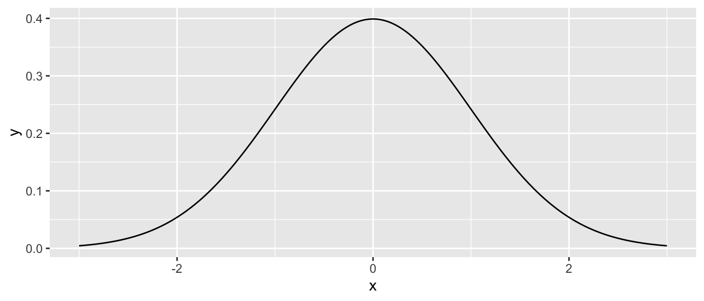


```r
# next a normal with mean 1, and standard deviation 1
data.frame( x = seq(-3, 3, length=601) ) %>%
  mutate( y = dnorm.alternate(x, mu=1) )       %>% # use mu=1, sd=1
  ggplot( aes(x=x, y=y) ) + geom_line()
```

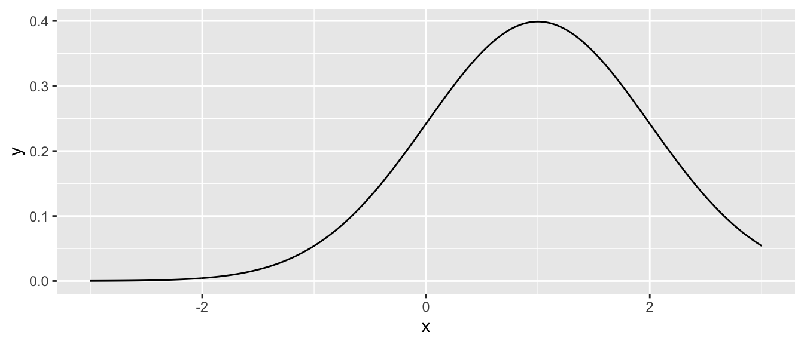

Many functions that we use have defaults that we don't normally mess with. For example, the function `mean()` has an option the specifies what it should do if your vector of data has missing data. The common solution is to remove those observations, but we might have wanted to say that the mean is unknown one component of it was unknown. 


```r
x <- c(1,2,3,NA)     # fourth element is missing
mean(x)              # default is to return NA if any element is missing
```

```
## [1] NA
```

```r
mean(x, na.rm=TRUE)  # Only average the non-missing data
```

```
## [1] 2
```

As you look at the help pages for different functions, you'll see in the function definitions what the default values are. For example, the function `mean` has another option, `trim`, which specifies what percent of the data to trim at the extremes. Because we would expect mean to not do any trimming by default, the authors have appropriately defined the default amount of trimming to be zero via the definition `trim=0`.

## Ellipses

When writing functions, I occasionally have a situation where I call function `a()` and function `a()` needs to call another function, say `b()`, and I want to pass an unusual parameter to that function. To do this, I'll use a set of three periods called an *ellipses*. What these do is represent a set of parameter values that will be passed along to a subsequent function.For example the following code takes the result of a simple linear regression and plots the data and the regression line and confidence region (basically I'm recreating a function that does the same thing as ggplot2's geom_smooth() layer). I might not want to specify (and give good defaults) to every single graphical parameter that the plot() function supports. Instead I'll just use the '...' argument and pass any additional parameters to the plot function.


```r
# a function that draws the regression line and confidence interval
# notice it doesn't return anything... all it does is draw a plot
show.lm <- function(m, interval.type='confidence', fill.col='light grey', ...){
  df <- data.frame(
    x = m$model[,2],     # extract the predictor variable
    y = m$model[,1]       # extract the response
  )
  df <- df %>% cbind( predict(m, interval=interval.type) )
  P <- ggplot(df, aes(x=x) ) +
    geom_ribbon( aes(ymin=lwr, ymax=upr), fill=fill.col ) +
    geom_line( aes(y=fit), ... ) +
    geom_point( aes(y=y), ... ) +
    labs(...)
  print(P)
} 
```

This function looks daunting, but we experiment to see what it does.


```r
# first define a simple linear model from our cherry tree data
m <- lm( Volume ~ Girth, data=trees )

# call the function with no extraneous parameters
show.lm( m )
```

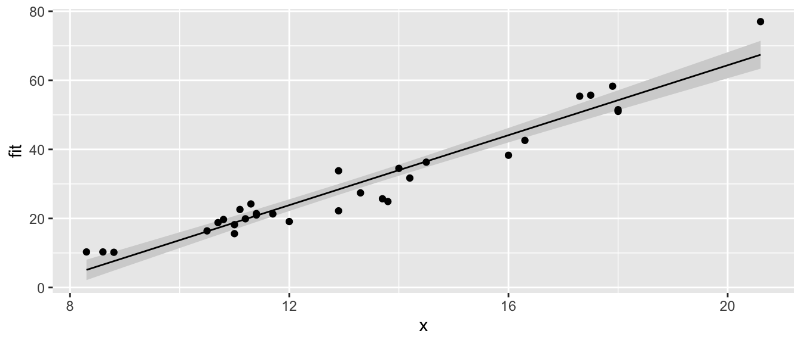


```r
# Pass arguments that will just be passed along to the geom layers 
show.lm( m, color='Red', title='Relationship between Girth and Volume')
```

```
## Warning: Ignoring unknown parameters: title

## Warning: Ignoring unknown parameters: title
```

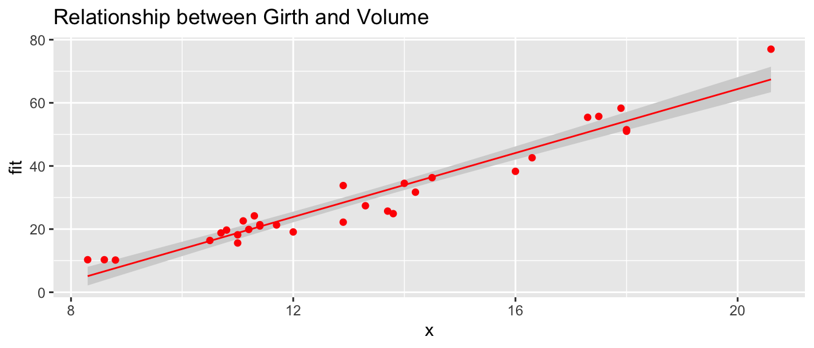

This type of trick is done commonly. Look at the help files for `hist()` and `qqnorm()` and you'll see the ellipses used to pass graphical parameters along to sub-functions. Functions like `lm()` use the ellipses to pass arguments to the low level regression fitting functions that do the actual calculations. By only including these parameters via the ellipses, must users won't be tempted to mess with the parameters, but experts who know the nitty-gritty details can still modify those parameters. 

## Function Overloading

Frequently the user wants to inspect the results of some calculation and display a variable or object to the screen. The `print()` function does exactly that, but it acts differently for matrices than it does for vectors. It especially acts different for lists that I obtained from a call like `lm()` or `aov()`. 

The reason that the print function can act differently depending on the object type that I pass it is because the function `print()` is *overloaded*. What this means is that there is a `print.lm()` function that is called whenever I call `print(obj)` when `obj` is the output of an `lm()` command.

Recall that we initially introduced a few different classes of data, Numerical, Factors, and Logicals. It turns out that I can create more types of classes.


```r
x <- seq(1:10)
y <- 3+2*x+rnorm(10)

h <- hist(y)  # h should be of class "Histogram"
```

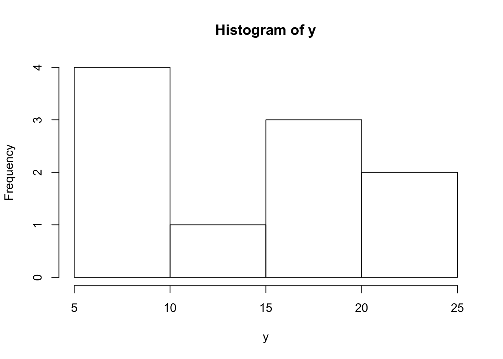

```r
class(h)
```

```
## [1] "histogram"
```

```r
model <- lm( y ~ x ) # model is something of class "lm"
class(model)
```

```
## [1] "lm"
```

Many common functions such as `plot()` are overloaded so that when I call the plot function with an object, it will in turn call `plot.lm()` or `plot.histogram()` as appropriate. When building statistical models I am often interested in different quantities and would like to get those regardless of the model I am using. Below are a list of functions that work whether I fit a model via `aov()`, `lm()`, `glm()`, or `gam()`. 

+----------------------+----------------------+
|    Quantity          |   Function Name      |
+======================+======================+
|  Residuals           |  `resid( obj )`      |
+----------------------+----------------------+
|  Model Coefficients  |  `coef( obj )`       |
+----------------------+----------------------+
|  Summary Table       |  `summary( obj )`    |
+----------------------+----------------------+
|  ANOVA Table         |  `anova( obj )`      |
+----------------------+----------------------+
|  AIC value           |  `AIC( obj )`        |
+----------------------+----------------------+

  
For the residual function, there exists a `resid.lm()` function, and `resid.gam()` and it is these functions are called when we run the command `resid( obj )`. 


## Debugging

When writing code, it is often necessary to figure out why the written code does not behave in the manner the writer expects. This process can be extremely challenging. Various types of tools have been developed and are incorporated in any reasonable integrated development environment (including RStudio!). All of the techniques we'll discuss are intended to help the developer understand exactly what the variable environment is like during the code execution.

RStudio has a [support article](https://support.rstudio.com/hc/en-us/articles/200713843) about using the debugger mode in a variety of situations so these notes won't go into extreme detail about different scenarios. Instead we'll focus on *how* to debug.

### Rmarkdown Recommendations
Because Rmarkdown documents are knitted using completely a completely fresh instance of R, I recommend that whenever you start up RStudio, it starts with a completely fresh instance of R. This means that it shouldn't load any history or previously created objects. To make this the default behavior, go to the `RStudio -> Preferences` on a Mac or `Tools -> Global Options` on a PC. On the `R General` section un-select all of the `Workspace` and `History` options. 

### Step-wise Execution
Often we can understand where an error is being introduced by simply running each step individually and inspecting the result. This is where the `Evironment` tab in the top right panel (unless you've moved it...) becomes helpful. By watching how the objects of interest change as we step through the code, we can more easily see where errors have occurred. For complicated objects such as `data.frames`, I find it helpful to have them opened in a `View` tab. 


```r
iris.summary <- iris %>%
  mutate(Sepal.Area = Sepal.Width * Sepal.Length,
         Petal.Area = Petal.Width * Petal.Length) %>%
  select(Species, Sepal.Area, Petal.Area) %>%
  group_by(Speces) %>%
  summarize( Mean.Sepal.Area = mean(Sepal.Area),
             Mean.Petal.Area = mean(Petal.Area) )
```

In this case, I would execute the `iris %>% ...` section of code and add one command after another until I finally found the line of code that produces the error. Once the line containing the error has been identified, I look for misspellings, misplaced parentheses, or a disconnect between what the input structure is versus what the code expects.


### Print Statements
Once we start writing code with loops and functions, a simple step-by-step evaluation won't suffice. An easy way to quickly see what the state of a variable is at some point in the code is to add a `print()` command that outputs some useful information about the environment.


```r
#' Compute a Factorial. e.g. 5! = 5*4*3*2*1 
#' @param n A positive integer
#' @return The value of n!
factorial <- function(n){
  output <- NULL
  for( i in 1:n ){
    output <- output*i
  }
  return(output)
}

factorial(5)
```

```
## integer(0)
```

In this case, I would add a few print statements such as the following:

```r
#' Compute a Factorial. e.g. 5! = 5*4*3*2*1 
#' @param n A positive integer
#' @return The value of n!
factorial <- function(n){
  output <- NULL
  print(paste('At Start and output = ', output))
  for( i in 1:n ){
    output <- output*i
    print(paste('In Loop and i = ', i,' and output = ', output))
  }
  return(output)
}

factorial(5)
```

```
## [1] "At Start and output =  "
## [1] "In Loop and i =  1  and output =  "
## [1] "In Loop and i =  2  and output =  "
## [1] "In Loop and i =  3  and output =  "
## [1] "In Loop and i =  4  and output =  "
## [1] "In Loop and i =  5  and output =  "
```

```
## integer(0)
```
Hopefully we can now see that multiplying a `NULL` value by anything else continues to result in NULL values. 

### `browser`
Debugging is best done by stepping through the code while paying attention to the current values of all the variables of interest. Modern developer environments include a debugger which allows you to step through your code, one command at a time, while simultaneously showing you the variables of interest. To get into this environment, we need to set a *breakpoint*. This can be done in R-scripts by clicking on the line number, but in Rmarkdown files, it is done by including the command `browser()` into your code.

In our factorial function, we can set a breakpoint via the following

```r
#' Compute a Factorial. e.g. 5! = 5*4*3*2*1 
#' @param n A positive integer
#' @return The value of n!
factorial <- function(n){
  browser()
  output <- NULL
  for( i in 1:n ){
    output <- output*i
  }
  return(output)
}

# Now run the function
factorial(5)
```

This allows us to step through the function while simultaneously keeping track of all the variables we are interested in.


## Scope

Consider the case where we make a function that calculates the trimmed mean. A good implementation of the function is given here.


```r
#' Define a function for the trimmed mean
#' @param x A vector of values to be averaged
#' @param k The number of elements to trim on either side
#' @return A scalar
trimmed.mean <- function(x, k=0){
  x <- sort(x)      # arrange the input according magnitude
  n <- length(x)    # n = how many observations
  if( k > 0){
    x <- x[c(-1*(1:k), -1*((n-k+1):n))]  # remove first k, last k
  }
  tm <- sum(x) / length(x)  # mean of the remaining observations
  return( tm )
} 

x <- c(10:1,50)                        # 10, 9, 8, ..., 1
output <- trimmed.mean(x, k=2)
output
```

```
## [1] 6
```

```r
x                                # notice x is unchanged
```

```
##  [1] 10  9  8  7  6  5  4  3  2  1 50
```

Notice that even though I passed `x` into the function and then sorted it, `x` remained unsorted outside the function. When I modified `x`, R made a copy of `x` and sorted the *copy* that belonged to the function so that I didn't modify a variable that was defined outside of the scope of my function. But what if I didn't bother with passing x and k. If I don't pass in the values of x and k, then R will try to find them in my current work space.


```r
# a horribly defined function that has no parameters
# but still accesses something called "x"
trimmed.mean <- function(){
  x <- sort(x)              # Access global x, sort and save in local environment
  n <- length(x)
  if( k > 0){               # Accessing the Global k
    x <- x[c(-1*(1:k), -1*((n-k+1):n))]
  }
  tm <- sum(x)/length(x)
  return( tm )
} 

x <- c( 50, 10:1 )    # data to trim
k <- 2

trimmed.mean()  # amazingly this still works
```

```
## [1] 6
```

```r
# but what if k wasn't defined?
rm(k)           # remove k 
trimmed.mean()  # now the function can't find anything named k and throws and error.
```

```
## Error in trimmed.mean(): object 'k' not found
```


So if I forget to pass some variable into a function, but it happens to be defined outside the function, R will find it. It is not good practice to rely on that because how do I take the trimmed mean of a vector named `z`? Worse yet, what if the variable `x` changes between runs of your function? What should be consistently giving the same result keeps changing. This is especially insidious when you have defined most of the arguments the function uses, but missed one. Your function happily goes to the next higher scope and sometimes finds it. 

When executing a function, R will have access to all the variables defined in the function, all the variables defined in the function that called your function and so on until the base work space. However, you should never let your function refer to something that is not either created in your function or passed in via a parameter.


## Exercises  {#Exercises_Functions}

1. Write a function that calculates the density function of a Uniform continuous variable on the interval $\left(a,b\right)$. The function is defined as 
    $$f\left(x\right)=\begin{cases}
    \frac{1}{b-a} & \;\;\;\textrm{if }a\le x\le b\\
    0 & \;\;\;\textrm{otherwise}
    \end{cases}$$
    which looks like this
    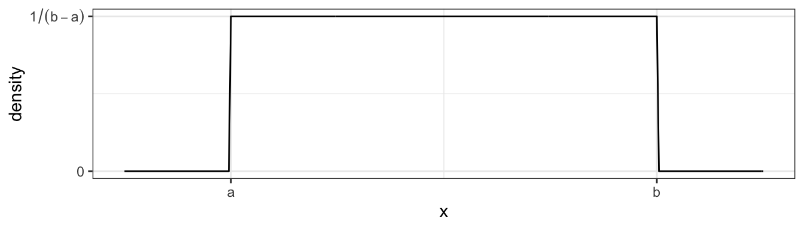
    We want to write a function `duniform(x, a, b)` that takes an arbitrary value of `x` and parameters a and b and return the appropriate height of the density function. For various values of `x`, `a`, and `b`, demonstrate that your function returns the correct density value. 
    a) Write your function without regard for it working with vectors of data. Demonstrate that it works by calling the function three times, once where x< a, once where a < x and x < b, and finally once where b < x.
    b) Next we force our function to work correctly for a vector of `x` values. Modify your function in part (a) so that the core logic is inside a `for` statement and the loop moves through each element of `x` in succession. Your function should look something like this:
        
        ```r
        duniform <- function(x, a, b){
          output <- NULL
          for( i in ??? ){  # Set the for loop to look at each element of x
            if( x[i] ??? ){  # What should this logical expression be?
              # ???  Something ought to be saved in output[i]
            }else{
              # ???  Something else ought to be saved in output[i]
            }
          }
          return(output)
        }
        ```
        Verify that your function works correctly by running the following code:
        
        ```r
        data.frame( x=seq(-1, 12, by=.001) ) %>%
          mutate( y = duniform(x, 4, 8) ) %>%
          ggplot( aes(x=x, y=y) ) +
          geom_step()
        ```
    c) Install the R package `microbenchmark`. We will use this to discover the average duration your function takes.
        
        ```r
        microbenchmark::microbenchmark( duniform( seq(-4,12,by=.0001), 4, 8) )
        ```
        In particular, look at the median time for evaluation.
    d) Instead of using a `for` loop, it might have been easier to use our standard `dplyr::mutate` command with an `ifelse()` command. Rewrite your function to run the `dplyr::mutate` command with an `ifelse()` command to produce a new results column and return that results column. Verify that your function works correctly by producing a plot, and also run the `microbenchmark()`.  Which version of your function was easier to write? Which ran faster?

2. I very often want to provide default values to a parameter that I pass to a function. For example, it is so common for me to use the `pnorm()` and `qnorm()` functions on the standard normal, that R will automatically use `mean=0` and `sd=1` parameters unless you tell R otherwise. To get that behavior, we just set the default parameter values in the definition. When the function is called, the user specified value is used, but if none is specified, the defaults are used. Look at the help page for the functions `dunif()`, and notice that there are a number of default parameters. For your `duniform()` function provide default values of `0` and `1` for `a` and `b`. Demonstrate that your function is appropriately using the given default values. 


3. A common data processing step is to *standardize* numeric variables by subtracting the mean and dividing by the standard deviation.  Create a function that takes a vector of numerical values and produces an output vector of the standardized values. We will then apply this function to each numeric column in a data frame using the `dplyr::mutate_if()` command. *This is often done in model algorithms that rely on numerical optimization methods to find a solution. By keeping the scales of different predictor covariates the same, the numerical optimization routines generally work better.*
    
    ```r
    standardize <- function(x){
      ## What goes here?
    }
    
    data( 'iris' )
    # Graph the pre-transformed data.
    ggplot(iris, aes(x=Sepal.Length, y=Sepal.Width, color=Species)) +
      geom_point() +
      labs(title='Pre-Transformation')
    
    # Standardize the numeric columns
    iris.z <- iris %>% mutate_if( is.numeric, standardize )
    
    # Graph the post-transformed data.
    ggplot(iris.z, aes(x=Sepal.Length, y=Sepal.Width, color=Species)) +
      geom_point() +
      labs(title='Post-Transformation')
    ```


4. In this example, we'll write a function that will output a  vector of the first $n$ terms in the child's game *Fizz Buzz*. The goal is to count as high as you can, but for any number evenly divisible by 3, substitute "Fizz" and any number evenly divisible by 5, substitute "Buzz", and if it is divisible by both, substitute "Fizz Buzz". So the sequence will look like 1, 2, Fizz, 4, Buzz, Fizz, 7, 8, Fizz, ... *Hint: The `paste()` function will squish strings together, the remainder operator is `%%` where it is used as `9 %% 3 = 0`. This problem was inspired by a wonderful YouTube [video](https://www.youtube.com/watch?v=QPZ0pIK_wsc) that describes how to write an appropriate loop to do this in JavaScript, but it should be easy enough to interpret what to do in R. I encourage you to try to write your function first before watching the video.*


5. A common statistical requirement is to create bootstrap confidence intervals for a model statistic. This is done by repeatedly re-sampling with replacement from our original sample data, running the analysis for each re-sample, and then saving the statistic of interest. Below is a function `boot.lm` that bootstraps the linear model using case re-sampling.
    
    ```r
    #' Calculate bootstrap CI for an lm object
    #' 
    #' @param model
    #' @param N
    boot.lm <- function(model, N=1000){
      data    <- model$model  # Extract the original data
      formula <- model$terms  # and model formula used
    
      # Start the output data frame with the full sample statistic
      output <- broom::tidy(model) %>% 
        select(term, estimate) %>% 
        spread(term, estimate)
    
      for( i in 1:N ){
        data <- data %>% sample_frac( replace=TRUE )
        model.boot <- lm( formula, data=data)
        coefs <- broom::tidy(model.boot) %>% 
          select(term, estimate) %>% 
          spread(term, estimate)
        output <- output %>% rbind( coefs )
      }  
      
      return(output)
    }
    
    # Run the function on a model
    m <- lm( Volume ~ Girth, data=trees )
    boot.dist <- boot.lm(m)
    
    # If boot.lm() works, then the following produces a nice graph
    boot.dist %>% gather('term','estimate') %>% 
      ggplot( aes(x=estimate) ) + 
      geom_histogram() + 
      facet_grid(.~term, scales='free')
    ```
    
    This code does not correctly calculate a bootstrap sample for the model coefficients. Figure out where the mistake is.  *Hint: Even if you haven't studied the bootstrap, my description above gives enough information about the bootstrap algorithm to figure this out.*


    

<!--chapter:end:21_Functions.Rmd-->

# String Manipulation


```r
library(tidyverse) 
library(stringr)   # tidyverse string functions, not loaded with tidyverse 
library(refinr)    # fuzzy string matching
```


Strings make up a very important class of data. Data being read into R often come in the form of character strings where different parts might mean different things. For example a sample ID of “R1_P2_C1_2012_05_28” might represent data from Region 1, Park 2, Camera 1, taken on May 28, 2012. It is important that we have a set of utilities that allow us to split and combine character strings in a easy and consistent fashion.

Unfortunately, the utilities included in the base version of R are somewhat inconsistent and were not designed to work nicely together. Hadley Wickham, the developer of `ggplot2` and `dplyr` has this to say: 

> "R provides a solid set of string operations, but because they have grown organically over time, they can be inconsistent and a little hard to learn. Additionally, they lag behind the string operations in other programming languages, so that some things that are easy to do in languages like Ruby or Python are rather hard to do in R." -- Hadley Wickham 

For this chapter we will introduce the most commonly used functions from the base version of R that you might use or see in other people's code. Second, we introduce Dr Wickham's `stringr` package that provides many useful functions that operate in a consistent manner. In his *R for Data Science* he has a nice chapter on
[strings](https://r4ds.had.co.nz/strings.html).

There are several white space characters that need to be represented in character strings such as tabs and returns. Most programming languages, including R, represent these using the *escape character* combined with another. For example in a character string `\t` represents a tab and `\n` represents a newline. However, because the backslash is the escape character, in order to have a backslash in the character string, the backslash needs to be escaped as well.  

## Base function

1.1.1 `paste()`

The most basic thing we will want to do is to combine two strings or to combine a string with a numerical value. The `paste()` command will take one or more R objects and converts them to character strings and then pastes them together to form one or more character strings. It has the form:


```r
paste( ..., sep = ' ', collapse = NULL )
```


The `...` piece means that we can pass any number of objects to be pasted together. The `sep` argument gives the string that separates the strings to be joined and the collapse argument that specifies if a simplification should be performed after being pasting together.

Suppose we want to combine the strings “Peanut butter” and “Jelly” then we could execute:


```r
paste( "PeanutButter", "Jelly" )
```

```
## [1] "PeanutButter Jelly"
```

Notice that without specifying the separator character, R chose to put a space between the two strings. We could specify whatever we wanted:


```r
paste( "Hello", "World", sep='_' )
```

```
## [1] "Hello_World"
```

Also we can combine strings with numerical values


```r
paste( "Pi is equal to", pi )
```

```
## [1] "Pi is equal to 3.14159265358979"
```

We can combine vectors of similar or different lengths as well. By default R assumes that you want to produce a vector of character strings as output.


```r
paste( "n =", c(5,25,100) )
```

```
## [1] "n = 5"   "n = 25"  "n = 100"
```

```r
first.names <- c('Robb','Stannis','Daenerys')
last.names <- c('Stark','Baratheon','Targaryen')
paste( first.names, last.names)
```

```
## [1] "Robb Stark"         "Stannis Baratheon"  "Daenerys Targaryen"
```

If we want `paste()` produce just a single string of output, use the `collapse=` argument to paste together each of the output vectors (separated by the `collapse` character).

```r
paste( "n =", c(5,25,100) )  # Produces 3 strings
```

```
## [1] "n = 5"   "n = 25"  "n = 100"
```

```r
paste( "n =", c(5,25,100), collapse=':' ) # collapses output into one string
```

```
## [1] "n = 5:n = 25:n = 100"
```

```r
paste(first.names, last.names, sep='.', collapse=' : ')
```

```
## [1] "Robb.Stark : Stannis.Baratheon : Daenerys.Targaryen"
```
Notice we could use the `paste()` command with the collapse option to combine a vector of character strings together.

```r
paste(first.names, collapse=':')
```

```
## [1] "Robb:Stannis:Daenerys"
```

## `stringr`: Basic operations

> The goal of `stringr` is to make a consistent user interface to a suite of functions to manipulate strings. “(stringr) is a set of simple wrappers that make R’s string functions more consistent, simpler and easier to use. It does this by ensuring that: function and argument names (and positions) are consistent, all functions deal with NA’s and zero length character appropriately, and the output data structures from each function matches the input data structures of other functions.” - Hadley Wickham

We'll investigate the most commonly used function but there are many we will ignore.

+----------------------+------------------------------------------------------------+
|     Function         |      Description                                           |
+======================+============================================================+
|  `str_c()`           |  string concatenation, similar to paste                    |
+----------------------+------------------------------------------------------------+
|  `str_length()`      |  number of characters in the string                        |
+----------------------+------------------------------------------------------------+
|  `str_sub()`         |  extract a substring                                       |
+----------------------+------------------------------------------------------------+
|  `str_trim()`        |  remove leading and trailing whitespace                    |
+----------------------+------------------------------------------------------------+
|  `str_pad()`         |  pad a string with empty space to make it a certain length |
+----------------------+------------------------------------------------------------+

### Concatenating with `str_c()` or `str_join()`

The first thing we do is to concatenate two strings or two vectors of strings similarly to the `paste()` command. The `str_c()` and `str_join()` functions are a synonym for the exact same function, but str_join() might be a more natural verb to use and remember. The syntax is:


```r
str_c( ..., sep='', collapse=NULL)
```

You can think of the inputs building a matrix of strings, with each input creating a column of the matrix. For each row, `str_c()` first joins all the columns (using the separator character given in `sep`) into a single column of strings. If the collapse argument is non-NULL, the function takes the vector and joins each element together using collapse as the separator character. 

```r
# envisioning the matrix of strings
cbind(first.names, last.names)
```

```
##      first.names last.names 
## [1,] "Robb"      "Stark"    
## [2,] "Stannis"   "Baratheon"
## [3,] "Daenerys"  "Targaryen"
```

```r
# join the columns together
full.names <- str_c( first.names, last.names, sep='.')
cbind( first.names, last.names, full.names)
```

```
##      first.names last.names  full.names          
## [1,] "Robb"      "Stark"     "Robb.Stark"        
## [2,] "Stannis"   "Baratheon" "Stannis.Baratheon" 
## [3,] "Daenerys"  "Targaryen" "Daenerys.Targaryen"
```

```r
# Join each of the rows together separated by collapse
str_c( first.names, last.names, sep='.', collapse=' : ')
```

```
## [1] "Robb.Stark : Stannis.Baratheon : Daenerys.Targaryen"
```

### Calculating string length with `str_length()`

The `str_length()` function calculates the length of each string in the vector of strings passed to it.


```r
text <- c('WordTesting', 'With a space', NA, 'Night')
str_length( text )
```

```
## [1] 11 12 NA  5
```

Notice that `str_length()` correctly interprets the missing data as missing and that the length ought to also be missing.

### Extracting substrings with `str_sub()`

If we know we want to extract the $3^{rd}$ through $6^{th}$ letters in a string, this function will grab them.

```r
str_sub(text, start=3, end=6)
```

```
## [1] "rdTe" "th a" NA     "ght"
```
If a given string isn't long enough to contain all the necessary indices, `str_sub()` returns only the letters that where there (as in the above case for “Night”

### Pad a string with `str_pad()`

Sometimes we to make every string in a vector the same length to facilitate display or in the creation of a uniform system of assigning ID numbers. The `str_pad()` function will add spaces at either the beginning or end of the of every string appropriately.

```r
str_pad(first.names, width=8)
```

```
## [1] "    Robb" " Stannis" "Daenerys"
```

```r
str_pad(first.names, width=8, side='right', pad='*')
```

```
## [1] "Robb****" "Stannis*" "Daenerys"
```

### Trim a string with `str_trim()`

This removes any leading or trailing white space where white space is defined as spaces ' ', tabs `\t` or returns `\n`.

```r
text <- ' Some text. \n  '
print(text)
```

```
## [1] " Some text. \n  "
```

```r
str_trim(text)
```

```
## [1] "Some text."
```

## `stringr`: Pattern Matching Tools

The previous commands are all quite useful but the most powerful string operation is take a string and match some pattern within it. The following commands are available within `stringr`.

+-----------------------+------------------------------------------------+
|   Function            |   Description                                  |
+=======================+================================================+
|  `str_detect()`       |  Detect if a pattern occurs in input string    |
+-----------------------+------------------------------------------------+
|  `str_locate()`       |  Locates the first (or all) positions of a     |
|  `str_locate_all()`   |  pattern.                                      |
+-----------------------+------------------------------------------------+
|  `str_extract()`      |  Extracts the first (or all) sub-strings       |
|  `str_extract_all()`  |  corresponding to a pattern                    |
+-----------------------+------------------------------------------------+
|  `str_replace()`      |  Replaces the matched sub-string(s) with       |
|  `str_replace_all()`  |  a new pattern                                 |
+-----------------------+------------------------------------------------+
|  `str_split()`        |  Splits the input string based on the          |
|  `str_split_fixed()`  |  input pattern                                 |
+-----------------------+------------------------------------------------+

We will first examine these functions using a very simple pattern matching algorithm where we are matching a specific pattern. For most people, this is as complex as we need. 

Suppose that we have a vector of strings that contain a date in the form “2012-May-27” and we want to manipulate them to extract certain information.

```r
strings <- c('2008-Feb-10', '2010-Sept-18', '2013-Jan-11', '2016-Jan-2')
```

### Detecting a pattern using str_detect()

Suppose we want to know which dates are in September. We want to detect if the pattern “Sept” occurs in the strings. 

```r
data.frame( string = strings ) %>%
  mutate( result = str_detect( string, pattern='Sept' ) )
```

```
##         string result
## 1  2008-Feb-10  FALSE
## 2 2010-Sept-18   TRUE
## 3  2013-Jan-11  FALSE
## 4   2016-Jan-2  FALSE
```

Here we see that the second string in the test vector included the sub-string “Sept” but none of the others did.

### Locating a pattern using str_locate()

To figure out where the “-” characters are, we can use the `str_locate()` function.

```r
str_locate(strings, pattern='-' )
```

```
##      start end
## [1,]     5   5
## [2,]     5   5
## [3,]     5   5
## [4,]     5   5
```
which shows that the first dash occurs as the $5^{th}$ character in each string. If we wanted all the dashes in the string the following works.

```r
str_locate_all(strings, pattern='-' )
```

```
## [[1]]
##      start end
## [1,]     5   5
## [2,]     9   9
## 
## [[2]]
##      start end
## [1,]     5   5
## [2,]    10  10
## 
## [[3]]
##      start end
## [1,]     5   5
## [2,]     9   9
## 
## [[4]]
##      start end
## [1,]     5   5
## [2,]     9   9
```

The output of `str_locate_all()` is a list of matrices that gives the start and end of each matrix. Using this information, we could grab the Year/Month/Day information out of each of the dates. We won't do that here because it will be easier to do this using `str_split()`.

### Replacing sub-strings using `str_replace()`

Suppose we didn't like using “-” to separate the Year/Month/Day but preferred a space, or an underscore, or something else. This can be done by replacing all of the “-” with the desired character. The `str_replace()` function only replaces the first match, but `str_replace_all()` replaces all matches.

```r
data.frame( string = strings ) %>%
  mutate(result = str_replace(string, pattern='-', replacement=':'))
```

```
##         string       result
## 1  2008-Feb-10  2008:Feb-10
## 2 2010-Sept-18 2010:Sept-18
## 3  2013-Jan-11  2013:Jan-11
## 4   2016-Jan-2   2016:Jan-2
```

```r
data.frame( string = strings ) %>%
  mutate(result = str_replace_all(string, pattern='-', replacement=':'))
```

```
##         string       result
## 1  2008-Feb-10  2008:Feb:10
## 2 2010-Sept-18 2010:Sept:18
## 3  2013-Jan-11  2013:Jan:11
## 4   2016-Jan-2   2016:Jan:2
```

### Splitting into sub-strings using `str_split()`

We can split each of the dates into three smaller sub-strings using the `str_split()` command, which returns a list where each element of the list is a vector containing pieces of the original string (excluding the pattern we matched on).

If we know that all the strings will be split into a known number of sub-strings (we have to specify how many sub-strings to match with the `n=` argument), we can use `str_split_fixed()` to get a matrix of sub-strings instead of list of sub-strings. 

```r
data.frame( string = strings ) %>%
  cbind( str_split_fixed(.$string, pattern='-', n=3) )
```

```
##         string    1    2  3
## 1  2008-Feb-10 2008  Feb 10
## 2 2010-Sept-18 2010 Sept 18
## 3  2013-Jan-11 2013  Jan 11
## 4   2016-Jan-2 2016  Jan  2
```

## Regular Expressions

The next section will introduce using regular expressions. Regular expressions are a way to specify very complicated patterns. Go look at https://xkcd.com/208/ to gain insight into just how geeky regular expressions are. 

Regular expressions are a way of precisely writing out patterns that are very complicated. The `stringr` package pattern arguments can be given using standard regular expressions (not perl-style!) instead of using fixed strings.

Regular expressions are extremely powerful for sifting through large amounts of text. For example, we might want to extract all of the 4 digit sub-strings (the years) out of our dates vector, or I might want to find all cases in a paragraph of text of words that begin with a capital letter and are at least 5 letters long. In another, somewhat nefarious example, spammers might have downloaded a bunch of text from web pages and want to be able to look for email addresses. So as a first pass, they want to match a pattern:
$$\underset{\textrm{1 or more letters}}{\underbrace{\texttt{Username}}}\texttt{@}\;\;\underset{\textrm{1 or more letter}}{\underbrace{\texttt{OrganizationName}}}\;\texttt{.\;}\begin{cases}
\texttt{com}\\
\texttt{org}\\
\texttt{edu}
\end{cases}$$
where the `Username` and `OrganizationName` can be pretty much anything, but a valid email address looks like this. We might get even more creative and recognize that my list of possible endings could include country codes as well. 

For most people, I don't recommend opening the regular expression can-of-worms, but it is good to know that these pattern matching utilities are available within R and you don't need to export your pattern matching problems to Perl or Python.

### Regular Expression Ingredients

Regular expressions use a select number of characters to signify further meaning in order to create recipes that might be matched within a character string. 
The special characters are  `[ \ ^ $ . | ? * + ()`. 

|  Character Types   |   Interpretation                                |
|:------------------:|:------------------------------------------------|
| `abc` 	           | Letters `abc` *exactly*                           |
| `123` 	           | Digits  `123` *exactly*                           |
| `\d`	             | Any Digit                                         |
| `\D`	             | Any Non-digit character                           |
| `\w`		           | Any Alphanumeric character                        |
| `\W`		           | Any Non-alphanumeric character                    |
| `\s`		           | Any White space                                   |
| `\S`		           | Any Non-white space character                     |
| `.`		             | Any Character (The wildcard!)                     |
| `^`                | Beginning of input string                         |
| `$`                | End of input string                               |


|  Grouping          |   Interpretation                                |
|:------------------:|:------------------------------------------------|
| `[abc]`		         | Only a, b, or c                                   |
| `[^abc]`	         | 	Not a, b, nor c                                  |
| `[a-z]`       	   | Characters a to z                                 |
| `[A-Z]`       	   | Characters A to Z                                 |
| `[0-9]`		         | Numbers 0 to 9                                    |
| `[a-zA-Z]`		     | Characters a to z or A to Z                       |
| `()`		           | Capture Group                                     |
| `(a(bc))`		       | Capture Sub-group                                 |
| `(abc|def)`		     | Matches `abc` or `def`                           |


|  Group Modifiers   |   Interpretation                                |
|:------------------:|:------------------------------------------------|
| `*`		             | Zero or more repetitions of previous            |
| `+`		             | One or more repetitions of previous             |
| `?`		             | Previous group is optional                      |
| `{m}`              | m repetitions of the previous                   |
| `{m,n}`            | Between m and n repetitions of the previous     |


The general idea is to make a recipe that combines one or more groups and add modifiers on the groups for how often the group is repeated.

### Matching a specific string
I might have a set of strings and I want to remove a specific string from them, or perhaps detect if a specific string is present. So long as the string of interest doesn't contain any special characters, you can just type out the string to be detected.


```r
# Replace 'John' from all of the strings with '****'
# The regular expression interpretation only comes in evaluating 'John'
strings <- c('John Sanderson', 'Johnathan Wilkes', 'Brendan Johnson', 'Bigjohn Smith')

data.frame( string=strings ) %>%
  mutate( result = str_replace(string, 'John', '****') )
```

```
##             string           result
## 1   John Sanderson   **** Sanderson
## 2 Johnathan Wilkes ****athan Wilkes
## 3  Brendan Johnson  Brendan ****son
## 4    Bigjohn Smith    Bigjohn Smith
```

Notice that this is case sensitive and we didn't replace the 'john'.

I might have special characters in my string that I want to replace. 

```r
# Remove the commas and the $ sign and convert to integers.
# Because $ is a special character, we need to use the escape character, \.
# However, because R uses the escape character as well, we have to use TWO
# escape characters. The first to escape R usual interpretation of the backslash,
# and the second to cause the regular expression to not use the usual 
# interpretation of the $ sign.
# 
strings <- c('$1,000,873', '$4.53', '$672')

data.frame( string=strings ) %>%
  mutate( result = str_remove_all(string, '\\$') )
```

```
##       string    result
## 1 $1,000,873 1,000,873
## 2      $4.53      4.53
## 3       $672       672
```

```r
# We can use the Or clause built into regular expressions to grab the 
# dollar signs and the commas using (Pattern1|Pattern2) notation
data.frame( string=strings ) %>%
  mutate( result = str_remove_all(string, '(\\$|,)') ) 
```

```
##       string  result
## 1 $1,000,873 1000873
## 2      $4.53    4.53
## 3       $672     672
```

### Matching arbitrary numbers
We might need to extract the numbers from a string. To do this, we want to grab 1 or more digits.

```r
strings <- c('I need 653 to fix the car', 
             'But I only have 432.34 in the bank', 
             'I could get .53 from the piggy bank') 

data.frame( string=strings ) %>%
  mutate( result = str_extract(string, '\\d+') ) 
```

```
##                                string result
## 1           I need 653 to fix the car    653
## 2  But I only have 432.34 in the bank    432
## 3 I could get .53 from the piggy bank     53
```

That isn't exactly what we wanted.  Instead of extracting the whole number, we left off the decimals. To fix this, we could have an optional part of the recipe for decimals. The way to enter into an optional section of the recipe is to use a `()?` and enclose the optional part inside the parentheses. 


```r
data.frame( string=strings ) %>%
  mutate( result = str_extract(string, '\\d+(\\.\\d+)?' )) 
```

```
##                                string result
## 1           I need 653 to fix the car    653
## 2  But I only have 432.34 in the bank 432.34
## 3 I could get .53 from the piggy bank     53
```

That fixed the issue for the second row, but still misses the third line. Lets have 3 different recipes and then 'or' them together. 


```r
data.frame( string=strings ) %>%
  mutate( result = str_extract(string, '(\\d+\\.\\d+|\\.\\d+|\\d+)' )) 
```

```
##                                string result
## 1           I need 653 to fix the car    653
## 2  But I only have 432.34 in the bank 432.34
## 3 I could get .53 from the piggy bank    .53
```


### Greedy matching
Regular expressions tries to match as much as it can. The modifiers `*` and `+` try to match as many characters as possible. While often this is what we want, it sometimes is not.  Consider the case where we are scanning HTML code and looking for markup tags which are of the form `<blah blah>`. The information inside the angled brackets will be important, but for now we just want to search the string for all instances of HTML tags.


```r
string <- 'A web page has <b>MANY</b> types of <em>awesome</em> tags!'
```

For now, we want to extract `<b>`, `</b>`, `<em>` and `</em>`. To do this, we might first consider the following:

```r
str_extract_all(string, '<.+>')
```

```
## [[1]]
## [1] "<b>MANY</b> types of <em>awesome</em>"
```

What the regular expression engine did was matched as many characters in the `.+` until it got to the very last ending angled bracket it could find. We can force the `+` and `*` modifiers to be lazy and match as few characters as possible to complete the match by adding a `?` suffix to the `+` or `*` modifier.


```r
str_extract_all(string, '<.+?>')
```

```
## [[1]]
## [1] "<b>"   "</b>"  "<em>"  "</em>"
```


## Fuzzy Pattern Matching

A common data wrangling task is to take a vector of strings that might be subtly different, but those differences aren't important. For example the address *321 S. Milton* should be the same as the address *321 South Milton*. These are easy for humans to recognize as being the same, but it is much harder for a computer.

The open source project [OpenRefine](http://openrefine.org) has a tool that does a very nice job doing fuzzy pattern grouping and several of the algorithms they created have been implemented in the R package `refinr`. In this section we will utilize these tools identify which strings represent the same items.

Much of the information (and examples) we present here are taken from the OpenRefine GitHub page on 
[Clustering in Depth](https://github.com/OpenRefine/OpenRefine/wiki/Clustering-In-Depth).


### Key Collision Merge

1. Remove leading and trailing white space
2. Change all characters to their lowercase representation
3. Remove all punctuation and control characters
4. Normalize extended western characters to their ASCII representation (for example "gödel" → "godel")
5. Split the string into white space separated tokens
6. Sort the tokens and remove duplicates
7. Join the tokens back together

From this algorithm, upper-case vs lower-case won't matter, nor will any punctuation. Furthermore, because we split the string into tokens on the internal white space, then the order of the words won't matter either. This algorithm is available from `refinr::key_collision_merge()`.


```r
strings <- c("Acme Pizza", "AcMe PiZzA", "   ACME PIZZA", 'Pizza, ACME')
data.frame(Input = strings, stringsAsFactors = FALSE) %>%
  mutate( Result = key_collision_merge(Input) )
```

```
##           Input        Result
## 1    Acme Pizza    ACME PIZZA
## 2    AcMe PiZzA    ACME PIZZA
## 3    ACME PIZZA    ACME PIZZA
## 4   Pizza, ACME    ACME PIZZA
```

The function `refinr::key_collision_merge()` also includes two options for ignoring tokens. First, the `ignore_strings` argument allows us to set up strings that should be ignored.  For example  the words `the`, `of` often are filler words that should be ignored.


```r
strings <- c("Northern Arizona University", "University of Northern Arizona", "The University of Northern Arizona")
data.frame(Input = strings, stringsAsFactors = FALSE) %>%
  mutate( Result = key_collision_merge(Input, ignore_strings = c('the','of') ) ) 
```

```
##                                Input                      Result
## 1        Northern Arizona University Northern Arizona University
## 2     University of Northern Arizona Northern Arizona University
## 3 The University of Northern Arizona Northern Arizona University
```

Finally, there are common business suffixes that should be ignored. For example `company`, `inc.`, `LLC` all mean similar things. The `key_collision_merge()` function has an `bus_suffix=TRUE` argument that indicates if the merging should be insensitive to these business suffixes.

### String Distances
Non-exact pattern matching requires some notion of *distance* between any two strings. One measure of this (called Optimal String Alignment distance)  is the number of changes it takes to transform one string to the other where the valid types of changes are deletion, insertion, substitution, and transposition. For example, the distance between `sarah` and `sara` is 1 because we only need to delete one character. But the distance between `sarah` and `syria` is 3 `sarah` -> `syrah` -> `syraa` -> `syria`.

There are other distance metrics to use and the full list available to the `stringdist` package is available in the documentation `help("stringdist-metrics")` 


```r
# Compare two strings
stringdist::stringdist('sarah', 'syria')
```

```
## [1] 3
```

With the idea of string distance, we could then match strings with small distances. 

### N-gram Merge
The `refinr::n_gram_merge` function will perform a similar algorithm as the `key_collision_merge` but will also match strings with small distances. 

1. Change all characters to their lowercase representation
2. Remove all punctuation, white space, and control characters
3. Obtain all the string n-grams
4. Sort the n-grams and remove duplicates
5. Join the sorted n-grams back together
6. Normalize extended western characters to their ASCII representation
7. Match strings with distance less than `edit_threshold` (defaults to 2)

Instead of creating tokens using white space, `n-grams` tokenize *every* collection of sequential n-letters. For example the 3-gram of "Frank" is:

1. frank
3. fra, ran, ank
4. ank, fra, ran
5. ankfraran


```r
strings <- c("Derek Sonderegger", 
             "Derk  Sondreger", 
             "Derek Sooonderegggggger",
             "John Sonderegger")
tibble(Input = strings) %>%
  mutate( Result = n_gram_merge(Input, numgram = 2, edit_threshold = 10) )
```

```
## # A tibble: 4 x 2
##   Input                   Result           
##   <chr>                   <chr>            
## 1 Derek Sonderegger       Derek Sonderegger
## 2 Derk  Sondreger         Derek Sonderegger
## 3 Derek Sooonderegggggger Derek Sonderegger
## 4 John Sonderegger        John Sonderegger
```


## Exercises  {#Exercises_Strings} 

1. For the following regular expression, explain in words what it matches on. Then add test strings to demonstrate that it in fact does match on the pattern you claim it does. Make sure that your test set of strings has several examples that match as well as several that do not. *If you copy the Rmarkdown code for these exercises directly from my source pages, make sure to remove the `eval=FALSE` from the R-chunk headers.*
    a) This regular expression matches:  *Insert your answer here...*
        
        ```r
        strings <- c()
        data.frame( string = strings ) %>%
          mutate( result = str_detect(string, 'a') )
        ```
    b) This regular expression matches:  *Insert your answer here...*
        
        ```r
        # This regular expression matches:  Insert your answer here...
        strings <- c()
        data.frame( string = strings ) %>%
          mutate( result = str_detect(string, 'ab') )
        ```
    c)  This regular expression matches:  *Insert your answer here...*
        
        ```r
        strings <- c()
        data.frame( string = strings ) %>%
          mutate( result = str_detect(string, '[ab]') )
        ```
    d)  This regular expression matches:  *Insert your answer here...*
        
        ```r
        strings <- c()
        data.frame( string = strings ) %>%
          mutate( result = str_detect(string, '^[ab]') )
        ```
    e)  This regular expression matches:  *Insert your answer here...*
        
        ```r
        strings <- c()
        data.frame( string = strings ) %>%
          mutate( result = str_detect(string, '\\d+\\s[aA]') )
        ```
    f)  This regular expression matches:  *Insert your answer here...*
        
        ```r
        strings <- c()
        data.frame( string = strings ) %>%
          mutate( result = str_detect(string, '\\d+\\s*[aA]') )
        ```
    g)  This regular expression matches:  *Insert your answer here...*
        
        ```r
        strings <- c()
        data.frame( string = strings ) %>%
          mutate( result = str_detect(string, '.*') )
        ```
    h) This regular expression matches: *Insert your answer here...*
        
        ```r
        strings <- c()
        data.frame( string = strings ) %>%
          mutate( result = str_detect(string, '^\\w{2}bar') )
        ```
    i) This regular expression matches: *Insert your answer here...*
        
        ```r
        strings <- c()
        data.frame( string = strings ) %>%
          mutate( result = str_detect(string, '(foo\\.bar)|(^\\w{2}bar)') )
        ```
    

2. The following file names were used in a camera trap study. The S number represents the site, P is the plot within a site, C is the camera number within the plot, the first string of numbers is the YearMonthDay and the second string of numbers is the HourMinuteSecond.
    
    ```r
    file.names <- c( 'S123.P2.C10_20120621_213422.jpg',
                     'S10.P1.C1_20120622_050148.jpg',
                     'S187.P2.C2_20120702_023501.jpg')
    ```
    Use a combination of `str_sub()` and `str_split()` to produce a data frame with columns corresponding to the `site`, `plot`, `camera`, `year`, `month`, `day`, `hour`, `minute`, and `second` for these three file names. So we want to produce code that will create the data frame:
    
    
    ```r
     Site Plot Camera Year Month Day Hour Minute Second
     S123   P2    C10 2012    06  21   21     34     22
      S10   P1     C1 2012    06  22   05     01     48
     S187   P2     C2 2012    07  02   02     35     01
    ```

3. The full text from Lincoln's Gettysburg Address is given below. Calculate the mean word length *Note: consider 'battle-field' as one word with 11 letters*).

```r
Gettysburg <- 'Four score and seven years ago our fathers brought forth on this 
continent, a new nation, conceived in Liberty, and dedicated to the proposition 
that all men are created equal.

Now we are engaged in a great civil war, testing whether that nation, or any 
nation so conceived and so dedicated, can long endure. We are met on a great 
battle-field of that war. We have come to dedicate a portion of that field, as 
a final resting place for those who here gave their lives that that nation might 
live. It is altogether fitting and proper that we should do this.

But, in a larger sense, we can not dedicate -- we can not consecrate -- we can 
not hallow -- this ground. The brave men, living and dead, who struggled here, 
have consecrated it, far above our poor power to add or detract. The world will 
little note, nor long remember what we say here, but it can never forget what 
they did here. It is for us the living, rather, to be dedicated here to the 
unfinished work which they who fought here have thus far so nobly advanced. It 
is rather for us to be here dedicated to the great task remaining before us -- 
that from these honored dead we take increased devotion to that cause for which 
they gave the last full measure of devotion -- that we here highly resolve that 
these dead shall not have died in vain -- that this nation, under God, shall 
have a new birth of freedom -- and that government of the people, by the people, 
for the people, shall not perish from the earth.'
```


4. Variable names in R may be and combination letters, digits, period, and underscore. However, they may not start with a digit and if they start with a period, they must not be followed by a digit.
    
    ```r
    strings <- c('foo15', 'Bar', '.resid', '_14s', 
                 '99_Bottles', '.9Arggh', 'Foo!','HIV Rate')
    ```
    The first four are valid variable names, but the last four are not. 
    a) First write a regular expression that determines if the string starts with a character (upper or lower case) or underscore and then is followed by zero or more numbers, letters, periods or underscores. *Notice I use the start/end of string markers. This is important so that we don't just match somewhere in the middle of the variable name.*
        
        ```r
        data.frame( string=strings ) %>%
          mutate( result = str_detect(string, '^(???what goes here???)$' )) 
        ```
    b)  Modify your regular expression so that the first group could be either `[a-zA-Z_]` as before or it could be a period followed by letters or an underscore.
    

<!--chapter:end:22_Strings.Rmd-->

# Dates and Times


```r
library(tidyverse)
library( lubridate )
```

Dates within a computer require some special organization because there are several competing conventions for how to write a date (some of them more confusing than others) and because the sort order should be in the order that the dates occur in time.

One useful tidbit of knowledge is that computer systems store a time point as the number of seconds from set point in time, called the epoch. So long as you always use the same epoch, you doesn't have to worry about when the epoch is, but if you are switching between software systems, you might run into problems if they use different epochs. In R, we use midnight on Jan 1, 1970. In Microsoft Excel, they use Jan 0, 1900. 

For many years, R users hated dealing with dates because it was difficult to remember how to get R to take a string that represents a date (e.g. “June 26, 1997”) because users were required to specify how the format was arranged using a relatively complex set of rules. For example `%y` represents the two digit year, `%Y` represents the four digit year, `%m` represents the month, but `%b` represents the month written as Jan or Mar. Into this mess came Hadley Wickham (of `ggplot2` and `dplyr` fame) and his student Garrett Grolemund. The internal structure of R dates and times is quite robust, but the functions we use to manipulate them are horrible. To fix this, Dr Wickham and his then PhD student Dr Grolemund introduced the `lubridate` package.

## Creating Date and Time objects

R gives a mechanism for getting the current date and time.

```r
lubridate::today()   # Today's date
```

```
## [1] "2020-09-02"
```

```r
base::Sys.Date()     # Today's date
```

```
## [1] "2020-09-02"
```

```r
base::Sys.time()     # Current Time and Date 
```

```
## [1] "2020-09-02 08:39:41 MST"
```


To create a `Date` object, we need to take a string or number that represents a date and tell the computer how to figure out which bits are the year, which are the month, and which are the day. The lubridate package uses the following functions:

+--------------------------+-----+-------------------------------+
|   Common Orders          |     |    Uncommon Orders            |
+==========================+=====+===============================+
| `ymd()`  Year Month Day  |     |  `dym()`  Day Year Month      |
+--------------------------+-----+-------------------------------+
| `mdy()`  Month Day Year  |     |  `myd()`  Month Year Day      |
+--------------------------+-----+-------------------------------+
| `dmy()`  Day Month Year  |     |  `ydm()`  Year Day Month      |
+--------------------------+-----+-------------------------------+

The uncommon orders aren't likely to be used, but the `lubridate` package includes them for completeness. Once the order has been specified, the `lubridate` package will try as many different ways to parse the date that make sense. As a result, so long as the order is consistent, all of the following will work:

```r
mdy( 'June 26, 1997', 'Jun 26 97', '6-26-97', '6-26-1997', '6/26/97', '6-26/97' )
```

```
## [1] "1997-06-26" "1997-06-26" "1997-06-26" "1997-06-26" "1997-06-26"
## [6] "1997-06-26"
```


```r
mdy('June 26, 0097', 'June 26, 97',  'June 26, 68', 'June 26, 69')
```

```
## [1] "0097-06-26" "1997-06-26" "2068-06-26" "1969-06-26"
```

This shows by default if you only specify the year using two digits, `lubridate` will try to do something clever. It will default to either a 19XX or 20XX and it picks whichever is the closer date. This illustrates that you should ALWAYS fully specify the year using four digits.

The `lubridate` functions will also accommodate if an integer representation of the date, but it has to have enough digits to uniquely identify the month and day.


```r
ymd(20090110)
```

```
## [1] "2009-01-10"
```

```r
ymd(2009722) # only one digit for month --- error!
```

```
## Warning: All formats failed to parse. No formats found.
```

```
## [1] NA
```

```r
ymd(2009116) # this is ambiguous! 1-16 or 11-6?
```

```
## Warning: All formats failed to parse. No formats found.
```

```
## [1] NA
```

If we want to add a time to a date, we will use a function with the suffix `_hm` or `_hms`. Suppose that we want to encode a date and time, for example, the date and time of my wedding ceremony

```r
mdy_hm('Sept 18, 2010 5:30 PM', '9-18-2010 17:30')
```

```
## [1] NA                        "2010-09-18 17:30:00 UTC"
```

In the above case, `lubridate` is having trouble understanding AM/PM differences and it is better to always specify times using 24 hour notation and skip the AM/PM designations.

By default, R codes the time of day using as if the event occurred in the UMT time zone (also known as Greenwich Mean Time GMT). To specify a different time zone, use the `tz=` option. For example:


```r
mdy_hm('9-18-2010 17:30', tz='MST') # Mountain Standard Time
```

```
## [1] "2010-09-18 17:30:00 MST"
```

This isn't bad, but Loveland, Colorado is on MST in the winter and MDT in the summer because of daylight savings time. So to specify the time zone that could switch between standard time and daylight savings time, I should specify `tz='US/Mountain'`

```r
mdy_hm('9-18-2010 17:30', tz='US/Mountain') # US mountain time
```

```
## [1] "2010-09-18 17:30:00 MDT"
```

Arizona is weird and doesn't use daylight savings time. Fortunately R has a built-in time zone just for us.


```r
mdy_hm('9-18-2010 17:30', tz='US/Arizona') # US Arizona time
```

```
## [1] "2010-09-18 17:30:00 MST"
```

R recognizes 582 different time zone locals and you can find these using the function `OlsonNames()`. To find out more about what these mean you can check out the Wikipedia page on timezones [http://en.wikipedia.org/wiki/List_of_tz_database_time_zones||http://en.wikipedia.org/wiki/List_of_tz_database_time_zones].

## Extracting information

The `lubridate` package provides many functions for extracting information from the date. Suppose we have defined

```r
# Derek's wedding!
x <- mdy_hm('9-18-2010 17:30', tz='US/Mountain') # US Mountain time
```


|    Command    |      Output    | Description                       |
|:-------------:|:--------------:|:----------------------------------|
| `year(x)`     | 2010           |  Year                             |
| `month(x)`    | 9              |  Month                            |
| `day(x)`      | 18             |  Day                              |
| `hour(x)`     | 17             |  Hour of the day                  |
| `minute(x)`   | 30             |  Minute of the hour               |
| `second(x)`   | 0              |  Seconds                          |
| `wday(x)`     | 7              |  Day of the week (Sunday = 1)     |
| `mday(x)`     | 18             |  Day of the month                 |
| `yday(x)`     | 261            |  Day of the year                  |

Here we get the output as digits, where September is represented as a 9 and the day of the week is a number between 1-7. To get nicer labels, we can use `label=TRUE` for some commands. 

|   Command              |     Ouput                | 
|:----------------------:|:--------------------------|
| `wday(x, label=TRUE)`  | Sat   |
| `month(x, label=TRUE)` | Sep  |


All of these functions can also be used to update the value. For example, we could move the day of the wedding from September $18^{th}$ to October $18^{th}$ by changing the month.


```r
# I really don't like this method of changing the month
month(x) <- 10

# update feels a little better to me
x <- update(x, month=10)

x
```

```
## [1] "2010-10-18 17:30:00 MDT"
```

Often I want to consider some point in time, but need to convert the timezone the date was specified into another timezone. The function `with_tz()` will take a given moment in time and figure out when that same moment is in another timezone. For example, *Game of Thrones* is made available on HBO's streaming service at 9pm on Sunday evenings Eastern time. I need to know when I can start watching it here in Arizona.


```r
GoT <- ymd_hm('2015-4-26 21:00', tz='US/Eastern')
with_tz(GoT, tz='US/Arizona')
```

```
## [1] "2015-04-26 18:00:00 MST"
```

This means that Game of Thrones is available for streaming at 6 pm Arizona time.

## Arithmetic on Dates

`lubridate` provides two different ways of dealing with arithmetic on dates, and Hadley's chapter on Date/Times in 
[R for Data Science](https://r4ds.had.co.nz/dates-and-times.html) 
is a good reference. 

Recall that dates are stored as the number of seconds since 0:00:00 January 1, 1970 UTC. This fundamental idea that a date is just some number of seconds introduces the idea that a minute is just 60 seconds, an hour is 3600 seconds, a day is $24*3600=86,400$ seconds, and finally a year is $365*86,400=31,536,000$ seconds. But what about leap years! Years are not always 365 days and days are not always 24 hours (think about daylight savings times). 

With this in mind, we need to be able to do arithmetic using conventional ideas of year/month/day that ignores any clock discontinuities as well as using precise ideas of exactly how many seconds elapsed between two time points.

|  Object Class   |   Description                                            |
|:---------------:|:---------------------------------------------------------|
|  **Periods**    | Lubridate periods correspond to a *person's* natural inclination of adding a year or month and ignores any clock discontinuities. |
| **Durations**   | Lubridate duration correspond to the exact number of seconds between two points in time and adding some number of seconds. I remember that durations are the *dorky* number of seconds definition. |
| **Intervals**   | Lubridate allows us to create an object that stores a beginning and ending time point. |


```r
current <- ymd_hms('2019-10-12 10:25:00', tz='MST')
current + years(1)  # period. There are also minutes, hours, days, months functions.
```

```
## [1] "2020-10-12 10:25:00 MST"
```

```r
current + dyears(1) # duration. There are also dminutes, dhours, ddays, dmonths
```

```
## [1] "2020-10-11 16:25:00 MST"
```

Notice that `dyears(1)` didn't just increment the years from 2019 to 2020, but rather added $60*60*24*365$ seconds, and because 2020 is a leap year and therefore February 29 will exist. Thus adding $31,536,000$ seconds ended up with a result of October 11$^{th}$ instead of October 12$^{th}$.

Once we have two or more Date objects defined, we can calculate the amount of time between the two dates. We'll first create an `interval` that defines the exact start and stop of the time interval we care about and then convert that to either a `period` (person convention) or a `duration` (# of seconds).


```r
Wedding <- ymd('2010-Sep-18')
Elise <- ymd('2013-Jan-11')

Childless =  interval(Wedding, Elise)  # Two different ways to 
Childless =  Wedding %--% Elise        # create a time interval

as.period( Childless )                 # Turn it into person readable
```

```
## [1] "2y 3m 24d 0H 0M 0S"
```

```r
as.period(Childless, unit = 'days')    # Person readable version of days
```

```
## [1] "846d 0H 0M 0S"
```

```r
as.duration( Childless )               # dorky number of seconds answer
```

```
## [1] "73094400s (~2.32 years)"
```

While working with dates, I like creating intervals whenever possible and try to NEVER just subtract two data/time objects because that will always just return the number of seconds (aka the `duration` answer). 

As a demonstration, lets consider a data set where we have the individuals birthdays and we are interested in calculated the individuals age in years.


```r
data <- tibble(
  Name = c('Steve', 'Sergey', 'Melinda', 'Bill', 'Alexa', 'Siri'),
  dob = c('Feb 24, 1955', 'August 21, 1973', 'Aug 15, 1964', 
          'October 28, 1955', 'November 6, 2014', 'October 12, 2011') )

data %>%
  mutate( dob = mdy(dob) ) %>%
  mutate( Life = dob %--% today() ) %>%
  mutate( Age = as.period(Life, units='years') ) %>%
  mutate( Age2 = year(Age) )
```

```
## # A tibble: 6 x 5
##   Name    dob        Life                           Age                  Age2
##   <chr>   <date>     <Interval>                     <Period>            <int>
## 1 Steve   1955-02-24 1955-02-24 UTC--2020-09-02 UTC 65y 6m 9d 0H 0M 0S     65
## 2 Sergey  1973-08-21 1973-08-21 UTC--2020-09-02 UTC 47y 0m 12d 0H 0M 0S    47
## 3 Melinda 1964-08-15 1964-08-15 UTC--2020-09-02 UTC 56y 0m 18d 0H 0M 0S    56
## 4 Bill    1955-10-28 1955-10-28 UTC--2020-09-02 UTC 64y 10m 5d 0H 0M 0S    64
## 5 Alexa   2014-11-06 2014-11-06 UTC--2020-09-02 UTC 5y 9m 27d 0H 0M 0S      5
## 6 Siri    2011-10-12 2011-10-12 UTC--2020-09-02 UTC 8y 10m 21d 0H 0M 0S     8
```


## Exercises  {#Exercises_Dates}

1. For the following formats for a date, transform them into a date/time object. Which formats can be handled nicely and which are not? *The lubridate package has gotten smarter over time and a couple of these used to fail.*
    a) For September 13
        
        ```r
        birthday <- c(
          'September 13, 1978',
          'Sept 13, 1978',
          'Sep 13, 1978',
          'S 13, 1978',
          '9-13-78',
          '9-13/78',
          '9/13/78')
        ```
    b) For June 15, 1978 we should have a problem.
        
        ```r
        birthday <- c(
          'June 13, 1978',
          'J 13, 1978')
        ```

2. Suppose you have arranged for a phone call to be at 3 pm on May 8, 2015 at Arizona time. However, the recipient will be in Auckland, NZ. What time will it be there? 

3. From this book's [GitHub](https://github.com/dereksonderegger/444/) directory, navigate to the `data-raw` directory and then download the `Pulliam_Airport_Weather_Station.csv` data file. (*There are several weather station files. Make sure you get the correct one!*)  There is a `DATE` column (is it of type `date` when you import the data?) as well as the Maximum and Minimum temperature. For the last 10 years of data we have (exactly, not just starting at Jan 1, 2009!), plot the daily maximum temperature. *Hint: Find the maximum date in the data set and then subtract 10 years. Will there be a difference if you use `dyears(10)` vs `years(10)`? Which seems more appropriate here?*

4. It turns out there is some interesting periodicity regarding the number of births on particular days of the year.
    a. Using the `mosaicData` package, load the data set `Births78` which records the number of children born on each day in the United States in 1978. Because this problem is intended to show how to calculate the information using the `date`, remove all the columns *except* `date` and `births`. 
    b. Graph the number of `births` vs the `date` with date on the x-axis. What stands out to you? Why do you think we have this trend?
    c. To test your assumption, we need to figure out the what day of the week each observation is. Use `dplyr::mutate` to add a new column named `dow` that is the day of the week (Monday, Tuesday, etc). This calculation will involve some function in the `lubridate` package and the `date` column. 
    d. Plot the data with the point color being determined by the day of the week variable.
    


<!--chapter:end:23_Dates.Rmd-->

# Data Reshaping


```r
# library(tidyr)   # for the gather/spread commands
# library(dplyr)   # for the join stuff
library(tidyverse) # dplyr, tidyr, ggplot2, etc.
```

I have a YouTube [Video Lecture](https://youtu.be/sVTfG2TH_gU) for this chapter. 

Most of the time, our data is in the form of a data frame and we are interested in exploring the relationships. However most procedures in R expect the data to show up in a 'long' format where each row is an observation and each column is a covariate. In practice, the data is often not stored like that and the data comes to us with repeated observations included on a single row. This is often done as a memory saving technique or because there is some structure in the data that makes the 'wide' format attractive. As a result, we need a way to convert data from 'wide' to 'long' and vice-versa.

Next we need a way to squish two data frames together. It is often advantageous to store data that would be be repeated separately in a different table so that a particular piece of information lives in only one location. This makes the data easier to modify, and more likely to maintain consistence. However, this practice requires that, when necessary, we can add information to a table, that might involve a lot of duplicated rows.

## `data.frames` vs `tibbles`
Previously we've been using `data.frame` and `tibble` objects interchangeably, but now is a good time make a distinction. Essentially a `tibble` is a `data.frame` that does more type checking and less coercion during creation and manipulation. So a `tibble` does less (automatically) and complains more. The rational for this is that while coercion between data types can be helpful, it often disguises errors that take a long time to track down. On the whole, is better to force the user to do the coercion explicitly rather than hope that R magically does the right thing.


Second, the printing methods for `tibbles` prevent it from showing too many rows or columns. This is a very convenient and more user-friendly way to show the data. We can control how many rows or columns are printed using the `options()` command, which sets all of the global options.

|  Options            |    Result                           |
|:--------------------------------------:|:-----------------|
| `options(tibble.print_max = n, tibble.print_min = m)`  | if there are more than `n` rows, print only the first `m`. 
| `options(tibble.print_max = Inf)` |  Always print all the rows. |
| `options(tibble.width = Inf)` | Always print all columns, regardless of the width of the display device. |

Third, `tibbles` support column names that would be rejected by a data frame.  For example, a data frame will not allow columns to begin with a number, nor can column names contain a space. These are allowable by `tibbles`, although they are required to be enclosed by back-quotes when referring to them.


```r
example <- tribble(
  ~'1984', ~"Is Awesome",
  'George',   20,
  'Orwell',   87)

example %>% select( `1984`, `Is Awesome` )
```

```
## # A tibble: 2 x 2
##   `1984` `Is Awesome`
##   <chr>         <dbl>
## 1 George           20
## 2 Orwell           87
```

## `cbind` & `rbind`
Base R has two functions for squishing two data frames together, but they assume that the data frames are aligned correctly. The `c` and `r` parts of `cbind` and `rbind` correspond to if we are pushing columns together or rows together. 


```r
# Define a tibble using a row-wise layout.
df1 <- tribble(            
  ~ID,  ~First,
  1,   'Alice',
  2,   'Bob',
  3,   'Charlie')

# Define a tibble by columns
df2 <- tibble( Last = c('Anderson', 'Barker', 'Cooper') )

# Squish the two tibbles together by columns - results in a data.frame
People <- cbind( df1, df2 )
People
```

```
##   ID   First     Last
## 1  1   Alice Anderson
## 2  2     Bob   Barker
## 3  3 Charlie   Cooper
```

Squishing together by rows is easy as well.

```r
df3 <- tibble( ID=4, First='Daniel', Last='Davidson' )

People <- rbind( People, df3 )
People
```

```
##   ID   First     Last
## 1  1   Alice Anderson
## 2  2     Bob   Barker
## 3  3 Charlie   Cooper
## 4  4  Daniel Davidson
```

If both inputs have row or column names, then they don't need to be appropriate arranged as `rbind` and `cbind` can figure out how to order them. 

There are equivalent functions in the `dplyr` package that do the same job, but will work more consistently. For example, if we try to bind a row of data that has more columns, `bind_rows()` will introduce a column of `NA` values to the smaller data set. Furthermore, if the column orders are mixed up


```r
df4 <- tibble(First='Elise', ID=5, Last='Erikson') # Notice changed columns order! 
rbind(People, df4)  # but rbind() can still figure it out!
```

```
##   ID   First     Last
## 1  1   Alice Anderson
## 2  2     Bob   Barker
## 3  3 Charlie   Cooper
## 4  4  Daniel Davidson
## 5  5   Elise  Erikson
```

```r
df5 <- tibble(First='Frank', ID=6, Last='Fredrick', dob=lubridate::ymd('1980-7-21'))
rbind(People, df5)   # throws an error
```

```
## Error in rbind(deparse.level, ...): numbers of columns of arguments do not match
```

```r
bind_rows( People, df4, df5) # Inserts NA values as appropriate.
```

```
##   ID   First     Last        dob
## 1  1   Alice Anderson       <NA>
## 2  2     Bob   Barker       <NA>
## 3  3 Charlie   Cooper       <NA>
## 4  4  Daniel Davidson       <NA>
## 5  5   Elise  Erikson       <NA>
## 6  6   Frank Fredrick 1980-07-21
```

In general, I find that `rbind()` and `bind_rows()` work really well and I use them quite often. However, `cbind()` and `bind_cols()` are less useful because I have to make sure that either I have rownames set up for each data set, or I have to be very careful with the ordering. Instead, it is safer to write code that relies on `joins`, which will be discussed later in this chapter.


## `tidyr`

There is a common issue with obtaining data with many columns that you wish were organized as rows. For example, I might have data in a grade book that has several homework scores and I'd like to produce a nice graph that has assignment number on the x-axis and score on the y-axis. Unfortunately this is incredibly hard to do when the data is arranged in the following way:


```r
grade.book <- rbind(
  data.frame(name='Alison',  HW.1=8, HW.2=5, HW.3=8, HW.4=4),
  data.frame(name='Brandon', HW.1=5, HW.2=3, HW.3=6, HW.4=9),
  data.frame(name='Charles', HW.1=9, HW.2=7, HW.3=9, HW.4=10))
grade.book
```

```
##      name HW.1 HW.2 HW.3 HW.4
## 1  Alison    8    5    8    4
## 2 Brandon    5    3    6    9
## 3 Charles    9    7    9   10
```

What we want to do is turn this data frame from a *wide* data frame into a *long* data frame. In MS Excel this is called pivoting. Essentially I'd like to create a data frame with three columns: `name`, `assignment`, and `score`. That is to say that each homework datum really has three pieces of information: who it came from, which homework it was, and what the score was. It doesn't conceptually matter if I store it as 3 rows of 4 columns or 12 rows so long as there is a way to identify how a student scored on a particular homework. So we want to reshape the HW1 to HW4 columns into two columns (assignment and score). 

This package was built by the same people that created dplyr and ggplot2 and there is a nice introduction at: [http://blog.rstudio.org/2014/07/22/introducing-tidyr/]

### Verbs 

*I need to update this section to use `pivot_longer()` and `pivot_wider()`. Hadley recommends people switch to this as it handles a wider set of problems and the function names are easier to remember*

*Also, we need to add some work for the function separate(), which splits a column of character vectors into several columns*

As with the dplyr package, there are two main verbs to remember:

|  Function     |   Description                                                                    |
|:-------------:|:---------------------------------------------------------------------------------|
| `gather`      |  Gather multiple columns that are related into two columns that contain the original column name and the value. For example for columns `HW1`, `HW2`, `HW3` we would gather them into two columns: `Homework` and `Score`. In this case, we refer to `Homework` as the key column and `Score` as the value column. So for any key:value pair you know everything you need. |
| `spread`      | This is the opposite of `gather`. This takes a key column (or columns) and a value column and forms a new column for each level of the key column(s). |


```r
# first we gather the score columns into columns we'll name Homework and Score
tidy.scores <- grade.book %>% 
  gather( key=Homework,     # What should I call the key column
          value=Score,      # What should I call the values column
          HW.1:HW.4)        # which columns to apply this to
tidy.scores
```

```
##       name Homework Score
## 1   Alison     HW.1     8
## 2  Brandon     HW.1     5
## 3  Charles     HW.1     9
## 4   Alison     HW.2     5
## 5  Brandon     HW.2     3
## 6  Charles     HW.2     7
## 7   Alison     HW.3     8
## 8  Brandon     HW.3     6
## 9  Charles     HW.3     9
## 10  Alison     HW.4     4
## 11 Brandon     HW.4     9
## 12 Charles     HW.4    10
```

To spread the key:value pairs out into a matrix, we use the `spread()` command. 


```r
# Turn the Homework/Score pair of columns into one column per factor level of Homework
tidy.scores %>% spread( key=Homework, value=Score )
```

```
##      name HW.1 HW.2 HW.3 HW.4
## 1  Alison    8    5    8    4
## 2 Brandon    5    3    6    9
## 3 Charles    9    7    9   10
```

One way to keep straight which is the `key` column is that the key is the category, while `value` is the numerical value or response. 

Often times, the long format of the data is most helpful for graphing or doing data analysis. Because of this, we often refer to this as the *tidy* form of the data. Hadley has a nice article about messy data vs tidy data and his [article](https://vita.had.co.nz/papers/tidy-data.pdf) is well worth your time to read, although `dplyr` and `tidyr` have matured since he wrote this article. The main point can be summarized by:

    Tidy data has one observation per row and each column is a variable. - Hadley Wickham

There are a variety of reasons why data might be stored in a non-tidy wide format, or entered in a wide format, but it is important to make sure that it is easy to transform it into a tidy format.

## Storing Data in Multiple Tables
In many data sets it is common to store data across multiple tables, usually with the goal of minimizing memory used as well as providing minimal duplication of information so any change that must be made is only made in a single place.

To see the rational why we might do this, consider building a data set of blood donations by a variety of donors across several years. For each blood donation, we will perform some assay and measure certain qualities about the blood and the patients health at the donation. But should we contain the donor's address, phone number, and email address in the same data table that holds the information about the blood donated.

I would like to include additional information about the donor where that information doesn't change overtime. For example we might want to have information about the donor's birthdate, sex, blood type.  However, I don't want that information in _every single donation line_.  Otherwise if I mistype a birthday and have to correct it, I would have to correct it _everywhere_. For information about the donor, should live in a `donors` table, while information about a particular donation should live in the `donations` table.

Furthermore, there are many Jeffs and Dereks in the world and to maintain a unique identifier (without using Social Security numbers) I will just create a `Donor_ID` code that will uniquely identify a person.  Similarly I will create a `Blood_ID` that will uniquely identify a blood donation.


```r
Donors
```

```
## # A tibble: 3 x 7
##   Donor_ID Name   Blood_Type Birthday   Street       City      State
##   <chr>    <chr>  <chr>      <chr>      <chr>        <chr>     <chr>
## 1 D1       Derek  O+         1976-09-17 7392 Willard Flagstaff AZ   
## 2 D2       Jeff   A-         1974-06-23 873 Vine     Bozeman   MT   
## 3 D3       Aubrey O+         1976-09-17 7392 Willard Flagstaff AZ
```


```r
Blood_Donations 
```

```
## # A tibble: 5 x 6
##   Blood_ID Donor_ID Date       Hemoglobin Systolic Diastolic
##   <chr>    <chr>    <chr>           <dbl>    <dbl>     <dbl>
## 1 B_1      D1       2017-04-14       17.4      120        79
## 2 B_2      D1       2017-06-20       16.5      121        80
## 3 B_3      D2       2017-08-14       16.9      145       101
## 4 B_4      D1       2017-08-26       17.6      120        79
## 5 B_5      D3       2017-08-26       16.1      137        90
```

If we have a new donor walk in and give blood, then we'll have to create a new entry in the `donors` table as well as a new entry in the `donations` table. If an experienced donor gives again, we just have to create a new entry in the donations table.

Given this data structure, we can now easily create new donations as well as store donor information. In the event that we need to change something about a donor, there is only _one_ place to make that change.

However, having data spread across multiple tables is challenging because I often want that information squished back together.  For example, if during routine testing we discover that a blood sample is HIV positive. Then we *need* to be able to join the blood donations table to the donors table in some sensible manner.

## Table Joins

There are four different types of joins: outer, left, right, and inner joins. Consider the following example tables. Here we consider that there is some *key* column that is common to both tables.

| Join Type            | Result                           |
|:--------------------:|:---------------------------------|
|  `inner_join(A,B)`   | Include rows if the key value is in *both* tables.   |
|  `left_join(A,B)`    | Include all rows of `A`, and if the match in `B` doesn't exist, just insert a `NA`. |
|  `right_join(A,B)`   | Include all rows of `B`, and if the match in `A` doesn't exist, just insert a `NA`. |    
|  `full_join(A,B)`    | Include all rows of `A` and `B` and if the necessary match doesn't exist, insert `NA` values. |

For a practical example

```r
A <- tribble(
  ~ID, ~x,
  'a', 34,    # Notice that A doesn't have ID = d
  'b', 36,
  'c', 38)
B <- tribble(
  ~ID, ~y,
  'b', 56,   # Notice that B doesn't have ID = a
  'c', 57,
  'd', 59)
```


```r
# only include rows with IDs that are in both tables
inner_join(A,B)
```

```
## # A tibble: 2 x 3
##   ID        x     y
##   <chr> <dbl> <dbl>
## 1 b        36    56
## 2 c        38    57
```

```r
# All the rows in table A, insert NA if the B info is missing
left_join(A,B)
```

```
## # A tibble: 3 x 3
##   ID        x     y
##   <chr> <dbl> <dbl>
## 1 a        34    NA
## 2 b        36    56
## 3 c        38    57
```

```r
# All the rows in table B, insert NA if the A info is missing
right_join(A,B)
```

```
## # A tibble: 3 x 3
##   ID        x     y
##   <chr> <dbl> <dbl>
## 1 b        36    56
## 2 c        38    57
## 3 d        NA    59
```

```r
# All the rows possible, insert NA if the matching info is missing
full_join(A,B)
```

```
## # A tibble: 4 x 3
##   ID        x     y
##   <chr> <dbl> <dbl>
## 1 a        34    NA
## 2 b        36    56
## 3 c        38    57
## 4 d        NA    59
```


Consider the case where we have a data frame of observations of fish and a separate data frame that contains information about lake (perhaps surface area, max depth, pH, etc). I want to store them as two separate tables so that when I have to record a lake level observation, I only input it *one* place. This decreases the chance that I make a copy/paste error. 

To illustrate the different types of table joins, we'll consider two different tables.

```r
# tibbles are just data.frames that print a bit nicer and don't automatically
# convert character columns into factors.  They behave a bit more consistently
# in a wide variety of situations compared to data.frames.
Fish.Data <- tibble(
  Lake_ID = c('A','A','B','B','C','C'), 
  Fish.Weight=rnorm(6, mean=260, sd=25) ) # make up some data
Lake.Data <- tibble(
  Lake_ID = c(    'B','C','D'),   
  Lake_Name = c('Lake Elaine', 'Mormon Lake', 'Lake Mary'),   
  pH=c(6.5, 6.3, 6.1),
  area = c(40, 210, 240),
  avg_depth = c(8, 10, 38))
```


```r
Fish.Data
```

```
## # A tibble: 6 x 2
##   Lake_ID Fish.Weight
##   <chr>         <dbl>
## 1 A              255.
## 2 A              209.
## 3 B              308.
## 4 B              214.
## 5 C              230.
## 6 C              259.
```

```r
Lake.Data
```

```
## # A tibble: 3 x 5
##   Lake_ID Lake_Name      pH  area avg_depth
##   <chr>   <chr>       <dbl> <dbl>     <dbl>
## 1 B       Lake Elaine   6.5    40         8
## 2 C       Mormon Lake   6.3   210        10
## 3 D       Lake Mary     6.1   240        38
```

Notice that each of these tables has a column labeled `Lake_ID`. When we join these two tables, the row that describes lake `A` should be duplicated for each row in the `Fish.Data` that corresponds with fish caught from lake `A`.


```r
full_join(Fish.Data, Lake.Data)
```

```
## Joining, by = "Lake_ID"
```

```
## # A tibble: 7 x 6
##   Lake_ID Fish.Weight Lake_Name      pH  area avg_depth
##   <chr>         <dbl> <chr>       <dbl> <dbl>     <dbl>
## 1 A              255. <NA>         NA      NA        NA
## 2 A              209. <NA>         NA      NA        NA
## 3 B              308. Lake Elaine   6.5    40         8
## 4 B              214. Lake Elaine   6.5    40         8
## 5 C              230. Mormon Lake   6.3   210        10
## 6 C              259. Mormon Lake   6.3   210        10
## 7 D               NA  Lake Mary     6.1   240        38
```

Notice that because we didn't have any fish caught in lake `D` and we don't have any Lake information about lake `A`, when we join these two tables, we end up introducing missing observations into the resulting data frame.


```r
left_join(Fish.Data, Lake.Data)
```

```
## Joining, by = "Lake_ID"
```

```
## # A tibble: 6 x 6
##   Lake_ID Fish.Weight Lake_Name      pH  area avg_depth
##   <chr>         <dbl> <chr>       <dbl> <dbl>     <dbl>
## 1 A              255. <NA>         NA      NA        NA
## 2 A              209. <NA>         NA      NA        NA
## 3 B              308. Lake Elaine   6.5    40         8
## 4 B              214. Lake Elaine   6.5    40         8
## 5 C              230. Mormon Lake   6.3   210        10
## 6 C              259. Mormon Lake   6.3   210        10
```


```r
inner_join(Fish.Data, Lake.Data)
```

```
## Joining, by = "Lake_ID"
```

```
## # A tibble: 4 x 6
##   Lake_ID Fish.Weight Lake_Name      pH  area avg_depth
##   <chr>         <dbl> <chr>       <dbl> <dbl>     <dbl>
## 1 B              308. Lake Elaine   6.5    40         8
## 2 B              214. Lake Elaine   6.5    40         8
## 3 C              230. Mormon Lake   6.3   210        10
## 4 C              259. Mormon Lake   6.3   210        10
```

The above examples assumed that the column used to join the two tables was named the same in both tables.  This is good practice to try to do, but sometimes you have to work with data where that isn't the case.  In that situation you can use the `by=c("ColName.A"="ColName.B")` syntax where `ColName.A` represents the name of the column in the first data frame and `ColName.B` is the equivalent column in the second data frame.


## Row summations
Finally, the combination of `gather` and `join` allows me to do some very complex calculations across many columns of a data set.  For example, I might gather up a set of columns, calculate some summary statistics, and then join the result back to original data set.  


```r
grade.book %>%
  group_by(name) %>%
  gather( key=Homework, value=Score, HW.1:HW.4 ) %>%
  summarise( HW.avg = mean(Score) ) %>%
  left_join( grade.book, . )
```

```
## `summarise()` ungrouping output (override with `.groups` argument)
```

```
## Joining, by = "name"
```

```
##      name HW.1 HW.2 HW.3 HW.4 HW.avg
## 1  Alison    8    5    8    4   6.25
## 2 Brandon    5    3    6    9   5.75
## 3 Charles    9    7    9   10   8.75
```

This is actually pretty annoying to do. What I prefer to do is to use the base function `apply()` within a `mutate()` command. Recall that the `apply()` function applies a function to each row or column (`MARGIN=1` or `MARGIN=2` respectively). So we just need to put together `select` and `apply` statements.


```r
#        col.name             columns              function
grade.book %>%
  mutate( HW.avg = select(., HW.1:HW.4) %>% apply(1, mean)) %>%
  print() # this print is just to show you can keep the pipeline going...
```

```
##      name HW.1 HW.2 HW.3 HW.4 HW.avg
## 1  Alison    8    5    8    4   6.25
## 2 Brandon    5    3    6    9   5.75
## 3 Charles    9    7    9   10   8.75
```


## Exercises  {#Exercises_DataReshaping}
    
1. A common task is to take a set of data that has multiple categorical variables and create a table of the number of cases for each combination. An introductory statistics textbook contains a dataset summarizing student surveys from several sections of an intro class. The two variables of interest for us are `Gender` and `Year` which are the students gender and year in college.
    a) Download the dataset and correctly order the `Year` variable using the following:
        
        ```r
        Survey <- read.csv('http://www.lock5stat.com/datasets/StudentSurvey.csv', na.strings=c('',' ')) 
        ```
    b) Using some combination of `dplyr` functions, produce a data set with eight rows that contains the number of responses for each gender:year combination. Make sure your table orders the `Year` variable in the correct order of `First Year`, `Sophmore`, `Junior`, and then `Senior`. *You might want to look at the following functions: `dplyr::count` and `dplyr::drop_na`.* 
    c) Using `tidyr` commands, produce a table of the number of responses in the following form:
    
        |   Gender    |  First Year  |  Sophmore  |  Junior   |  Senior   |
        |:-----------:|:------------:|:----------:|:---------:|:---------:|
        |  **Female** |              |            |           |           |  
        |  **Male**   |              |            |           |           | 
    

2. We often are given data in a table format that is easy for a human to parse, but annoying a program. In the following example we have 
[data](https://github.com/dereksonderegger/444/raw/master/data-raw/US_Gov_Budget_1962_2020.xls) 
of US government expenditures from 1962 to 2015. (I downloaded this data from https://obamawhitehouse.archives.gov/omb/budget/Historicals (Table 3.2) on Sept 22, 2019.) 
Our goal is to end up with a data frame with columns for `Function`, `Subfunction`, `Year`, and `Amount`. We'll ignore the "On-budget" and "Off-budget" distinction.
    a) Download the data file, inspect it, and read in the data using the `readxl` package.
    b) Rename the `Function or subfunction` column to `Department`.
    b) Remove any row with Total, Subtotal, On-budget or Off-budget. Also remove the row at the bottom that defines what NA means.
    c) Create a new column for `ID_number` and parse the `Department` column for it.
    d) If all (or just 2015?) the year values are missing, then the `Department` corresponds to `Function` name. Otherwise `Department` corresponds to the `Subfunction`. Create columns for `Function` and `Subfunction`. *Hint: Directly copy `Department` to `Subfunction`. Then using an `ifelse` statement to copy either `NA` or `Department` to `Function` depending on if the 2015 column is an `NA` (use the function `is.na()`). Once you have `Function` with either the `Function` name or an `NA`, you can use the `tidyr::fill` command to replace the NA values with whatever is on the row above. Check out the help files to see how to use it.* 
    e) Remove rows that corresponded to the Function name that have no data. *Hint, you can just check if the `2015` column is `NA`.*
    f) Reshape the data into four columns for Function, Subfunction, Year, and Amount.
    g) Remove rows that have Amount value of `..........`.
    h) Make sure that Year and Amount are numeric. *Hint: it is OK to get rid of the estimate rows for 2016+*
    h) Make a line graph that compares spending for National Defense, Health, Medicare, Income Security, and Social Security for each of the years 2001 through 2015. *Notice you'll have to sum up the sub-functions within each function.*

3. For this problem we will consider two simple data sets.
    
    ```r
    A <- tribble(
      ~Name, ~Car,
      'Alice', 'Ford F150',
      'Bob',   'Tesla Model III',
      'Charlie', 'VW Bug')
    
    B <- tribble(
      ~First.Name, ~Pet,
      'Bob',  'Cat',
      'Charlie', 'Dog',
      'Alice', 'Rabbit')
    ```
    a) Squish the data frames together to generate a data set with three rows and three columns. Do two ways: first using `cbind` and then using one of the `dplyr` `join` commands.
    b) It turns out that Alice also has a pet guinea pig. Add another row to the `B` data set. Do this using either the base function `rbind`, or either of the `dplyr` functions `add_row` or `bind_rows`.
    c) Squish the `A` and `B` data sets together to generate a data set with four rows and three columns. Do this two ways: first using `cbind` and then using one of the `dplyr` `join` commands. Which was easier to program? Which is more likely to have an error.
    
4. Data table joins are extremely common because effective database design almost always involves having multiple tables for different types of objects. To illustrate both the table joins and the usefulness of multiple tables we will develop a set of data frames that will represent a credit card company's customer data base. We will have tables for Customers, Retailers, Cards, and Transactions.  Below is code that will create and populate these tables.
    
    ```r
    Customers <- tribble(
      ~PersonID, ~Name, ~Street, ~City, ~State,
      1, 'Derek Sonderegger',  '231 River Run', 'Flagstaff', 'AZ',
      2, 'Aubrey Sonderegger', '231 River Run', 'Flagstaff', 'AZ',
      3, 'Robert Buscaglia', '754 Forest Heights', 'Flagstaff', 'AZ',
      4, 'Roy St Laurent', '845 Elk View', 'Flagstaff', 'AZ')
    
    Retailers <- tribble(
      ~RetailID, ~Name, ~Street, ~City, ~State,
      1, 'Kickstand Kafe', '719 N Humphreys St', 'Flagstaff', 'AZ',
      2, 'MartAnnes', '112 E Route 66', 'Flagstaff', 'AZ',
      3, 'REI', '323 S Windsor Ln', 'Flagstaff', 'AZ' )
    
    Cards <- tribble(
      ~CardID, ~PersonID, ~Issue_DateTime, ~Exp_DateTime,
      '9876768717278723',  1,  '2019-9-20 0:00:00', '2022-9-20 0:00:00',
      '5628927579821287',  2,  '2019-9-20 0:00:00', '2022-9-20 0:00:00',
      '7295825498122734',  3,  '2019-9-28 0:00:00', '2022-9-28 0:00:00',
      '8723768965231926',  4,  '2019-9-30 0:00:00', '2022-9-30 0:00:00' ) 
    
    Transactions <- tribble(
      ~CardID, ~RetailID, ~DateTime, ~Amount,
      '9876768717278723', 1, '2019-10-1 8:31:23',    5.68,
      '7295825498122734', 2, '2019-10-1 12:45:45',  25.67,
      '9876768717278723', 1, '2019-10-2 8:26:31',    5.68,
      '9876768717278723', 1, '2019-10-2 8:30:09',    9.23,
      '5628927579821287', 3, '2019-10-5 18:58:57',  68.54,
      '7295825498122734', 2, '2019-10-5 12:39:26',  31.84,
      '8723768965231926', 2, '2019-10-10 19:02:20', 42.83) 
    
    Cards <- Cards %>% 
      mutate( Issue_DateTime = lubridate::ymd_hms(Issue_DateTime),
              Exp_DateTime   = lubridate::ymd_hms(Exp_DateTime) )
    Transactions <- Transactions %>% 
      mutate( DateTime = lubridate::ymd_hms(DateTime))
    ```
    a) Create a table that gives the credit card statement for Derek. It should give all the transactions, the amounts, and the store name. Write your code as if the only initial information you have is the customer's name. *Hint: Do a bunch of table joins, and then filter for the desired customer name.*
    b) Aubrey has lost her credit card on Oct 15, 2019. Close her credit card at 4:28:21 PM and issue her a new credit card in the `Cards` table. *Hint: Using the Aubrey's name, get necessary CardID and PersonID and save those as `cardID` and `personID`. Then update the `Cards` table row that corresponds to the `cardID` so that the expiration date is set to the time that the card is closed. Then insert a new row with the `personID` for Aubrey and a new `CardID` number that you make up.* 
    c) Aubrey is using her new card at Kickstand Kafe on Oct 16, 2019 at 2:30:21 PM for coffee with a charge of $4.98. Generate a new transaction for this action. *Hint: create temporary variables `card`,`retailid`,`datetime`, and `amount` that contain the information for this transaction and then write your code to use those. This way in the next question you can just use the same code but modify the temporary variables. Alternatively, you could write a function that takes in these four values and manipulates the tables in the GLOBAL environment using the `<<-` command to assign a result to a variable defined in the global environment. The reason this is OK is that in a real situation, these data would be stored in a database and we would expect the function to update that database.*
    d) On Oct 17, 2019, some nefarious person is trying to use her OLD credit card at REI. Make sure your code in part (c) first checks to see if the credit card is active before creating a new transaction. Using the same code, verify that the nefarious transaction at REI is denied. *Hint: your check ought to look something like this:*
        
        ```r
        card <- '9876768717278723'
        retailid <- 2
        datetime <- ymd_hms('2019-10-16 14:30:21')
        amount <- 4.98
        
        # If the card is currently valid, this should return exactly 1 row.
        Valid_Cards <- Cards %>% 
          filter(CardID == card, Issue_DateTime <= datetime, datetime <= Exp_DateTime)
        
        # If the transaction is valid, insert the transaction into the table
        if( nrow(Valid_Cards) == 1){
          # Some code to insert the transaction
        }else{
          print('Card Denied')
        }
        ```
    e) Generate a table that gives the credit card statement for Aubrey. It should give all the transactions, amounts, and retailer name for both credit cards she had during this period.


```r
Customers %>%
  inner_join(Cards) %>%
  inner_join(Transactions) %>%
  inner_join(Retailers) 
```

```
## Joining, by = "PersonID"
```

```
## Joining, by = "CardID"
```

```
## Joining, by = c("Name", "Street", "City", "State", "RetailID")
```

```
## # A tibble: 0 x 11
## # … with 11 variables: PersonID <dbl>, Name <chr>, Street <chr>, City <chr>,
## #   State <chr>, CardID <chr>, Issue_DateTime <dttm>, Exp_DateTime <dttm>,
## #   RetailID <dbl>, DateTime <dttm>, Amount <dbl>
```

    
  
5. The package `nycflights13` contains information about all the flights that arrived in or left from New York City in 2013. This package contains five data tables, but there are three data tables we will work with. The data table `flights` gives information about a particular flight, `airports` gives information about a particular airport, and `airlines` gives information about each airline. Create a table of all the flights on February 14th by Virgin America that has columns for the carrier, destination, departure time, and flight duration. Join this table with the airports information for the destination. Notice that because the column for the destination airport code doesn't match up between `flights` and `airports`, you'll have to use the `by=c("TableA.Col"="TableB.Col")` argument where you insert the correct names for `TableA.Col` and `TableB.Col`.


<!--chapter:end:27_DataReshaping.Rmd-->

# Maps{-}


```r
library(tidyverse)   # loading ggplot2 and dplyr

library(sf)                # Simple Features for GIS

library(rnaturalearth)     # package with detailed information about country &
library(rnaturalearthdata) # state/province borders, and geographical features
# devtools::install_github('ropensci/rnaturalearthhires')
library(rnaturalearthhires) # Hi-Resolution Natural Earth

library(leaflet)
```

## Introduction{-}

This chapter is still a work in progress and unfortunately there is still a bunch of weirdness associated with how `ggplot` interacts with the simple features package. I'm not sure if I just don't understand the paradigm, or if there are still some bugs to be fixed. 

We often have data that is associated with some sort of geographic information. For example, we might have information based on US state counties. It would be nice to be able to produce a graph where we fill in the county with a color shade associated with our data.  Or perhaps put dots at the center of each county and the dots might be color coded or size coded to our data. But the critical aspect is that we already have some data, but we need some additional data relating to the shape of the county or state of interest.

There is a simple [blog style series of posts](https://www.r-spatial.org/r/2018/10/25/ggplot2-sf.html) that is a quick read. 

The `sf` package vignettes are a really great [resource](https://r-spatial.github.io/sf/reference/sf.html).

Finally there is a great on-line [book](https://keen-swartz-3146c4.netlify.com) by Edzer Pebesma and Roger Bivand about mapping in R. 


### Coordinate Reference Systems (CRS){-}

There are many ways to represent a geo-location. 

1. **WGS84 aka Latitude/Longitude** One of the oldest systems, and most well known, is the latitude/longitude grid. The latitude measures north/south where zero is the equator and +90 and -90 are the north and south poles. Longitude is the east/west measurement and the zero is the [Prime Meridian](https://en.wikipedia.org/wiki/Prime_meridian) (which is close to the Greenwich Meridian) and +180 and -180 are the anti-meridian near the Alaska/Russia border. The problem with latitude/longitude is that small differences in lat/long coordinates near the equator are large distance, but near the poles it would be much much smaller. Another weirdness is that lat/long coordinates are often given in a base 60 system of degrees/minutes/seconds.  To get the decimal version we use the formula
$$\textrm{Decimal Value} = \textrm{Degree} + \frac{\textrm{Minutes}}{60} + \frac{\textrm{Seconds}}{3600}$$
For example, Flagstaff AZ has lat/long 35°11′57″N 111°37′52″W.  Notice that the longitude is 111 degrees W which should actually be negative.  This gives a lat/long pair of:
    
    ```r
    35 + 11/60 + 57/3600
    ```
    
    ```
    ## [1] 35.19917
    ```
    
    ```r
    -1 * (111 + 37/60 + 52/3600)
    ```
    
    ```
    ## [1] -111.6311
    ```

2. **Reference Point Systems** A better idea is to establish a grid of reference points along the grid of the planet and then use offsets from those reference points. One of the most common projection system is the [Universal Transverse Mercator (UTM)](https://en.wikipedia.org/wiki/Universal_Transverse_Mercator_coordinate_system) which uses a grid of 60 reference points. From these reference points, we will denote a location using a northing/easting offsets. The critical concept is that if you are given a set of northing/easting coordinates, we also need the reference point and projection system information. For simplicity we'll refer to both the lat/long or northing/easting as the coordinates. 


### Spatial Objects{-}
Regardless of the coordinate reference system (CRS) used, there are three major types of data that we might want to store. 

1. **Points** The simplest type of data object to store is a single location. Storing them simply requires knowing the coordinates and the reference system. It is simple to keep track of a number of points as you just have a data frame of coordinates and then the reference system.

2. **LineString** This maps out a one-dimensional line across the surface of the globe. An obvious example is to define a road.  To do this, we just need to define a sequence of points (where the order matters) and the object implicitely assumes the points are connected with straight lines. To represent an arbitrary curve, we simply need to connect points that are quite close together. As always, this object also needs to keep track of the CRS.

3. **Polygons** These are similar to a LineString in that they are a sequential vector of points, but now we interpret them as forming an enclosed area so the line starts and ends at the same place. As always, we need to keep the CRS information for the points. We also will allow "holes" in the area by having one or more interior polygons cut out of it. To do this, we need to keep a list of removed polygons.

Each of the above type of spatial objects can be grouped together, much as we naturally made a group of points. For example, the object that defines the borders of the United States of America needs to have multiple polygons because each contiguous land mass needs its own polygon. For example the state of Hawaii has 8 main islands and 129 minor islands. Each of those needs to be its own polygon for our "connect the dots" representation to make sense.

Until recently, the spatial data structures in R (e.g. the `sp` package) required users to keep track of the data object type as well as the reference system. This resulted in code that contained many mysterious input strings that were almost always poorly understood by the user. Fortunately there is now a formal ISO standard that describes how spatial objects should be represented digitally and the types of manipulations that users should be able to do. The R package `sf`, which stands for "Simple Features" implements this standard and is quickly becoming the preferred R library for handling spatial data.

There is a nice set of tutorials for the `sf` package.
[Part 1](https://www.r-spatial.org/r/2018/10/25/ggplot2-sf.html),
[Part 2](https://www.r-spatial.org/r/2018/10/25/ggplot2-sf-2.html), and
[Part 3](https://www.r-spatial.org/r/2018/10/25/ggplot2-sf-3.html).

### Tiles{-}
Instead of building a map layer by layer, you might want to start with some base level information, perhaps some topological map with country and state names along with major metropolitan areas. Tiles provide a way to get all the background map information for you to then add your data on top. 

Tiles come in two flavors. Rasters are similar to a pictures in that every pixel is stored. Vector based tiles actually only store the underlying spatial information and handle zooming in without pixelation. 

## Obtaining Spatial Data{-}

Often I already have some information associated with some geo-political unit such as state or country level rates of something (e.g. country's average life span, or literacy rate). Given the country name, we want to produce a map with the data we have encoded with colored dots centered on the country or perhaps fill in the country with shading associated with the statistic of interest. To do this, we need data about the shape of each country! 

In general it is a bad idea to rely on spatial data that is static on a user's machine. First, large scale geo-political borders, coastal boundaries can potentially change. Second, fine scale details like roads and building locations are constantly changing. Third, the level of detail needed is quite broad for world maps, but quite small for neighborhood maps. It would be a bad idea to download neighborhood level data for the entire world in the chance the a use might want fine scale detail for a particular neighborhood. However, it is also a bad idea to query a web-service every time I knit a document together. Therefore we will consider ways to obtain the information needed for a particular scale and save it locally but our work flow will always include a data refresh option.


### Natural Earth Database{-}

[Natural Earth](https://www.naturalearthdata.com) is a public domain map database and is free for any use, both commercial and non-commercial. There is a nice R package, `rnaturalearth` that provides convenient interface. There is also information about urban areas and roads as well as geographical details such as rivers and lakes. There is a mechanism to download data at different resolutions as well as matching functions for reading in the data from a local copy of it.

There are a number of data sets that are automatically downloaded with the `rnaturalearth` package including country and state/province boarders.


```r
ne_countries(continent='Africa', returnclass = 'sf') %>%  # grab country borders in Africa
  ggplot() + geom_sf() +
  labs(title='Africa')
```

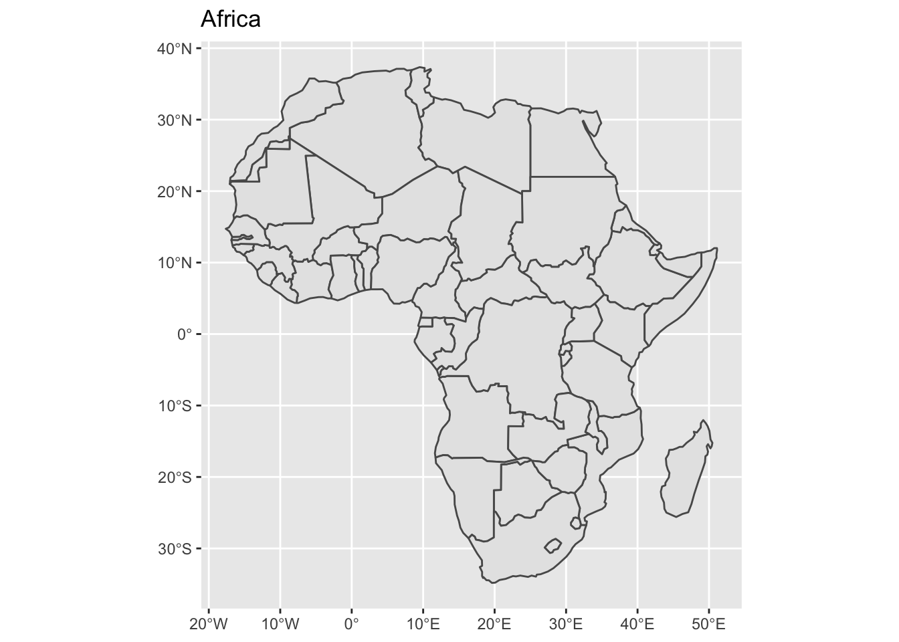


```r
ne_states(country='Ghana', returnclass = 'sf') %>% # grab provinces within Ghana
  ggplot() +
  geom_sf( ) + 
  labs(title='Ghana')
```

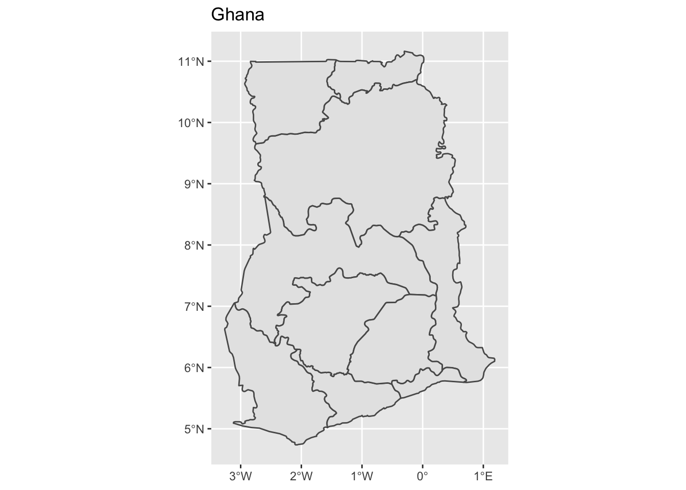


```r
# The st_centroid function takes the sf object and returns the center of 
# the polygon, again as a sf object.
Ghana <- ne_states(country='Ghana', returnclass = 'sf')  # grab provinces within Ghana
Ghana %>% ggplot() +
  geom_sf( ) + 
  geom_text( data=st_centroid(Ghana), size=2,
             aes(x=longitude, y=latitude, label=woe_name)) +
  labs(title='Ghana Administrative Regions')
```

```
## Warning in st_centroid.sf(Ghana): st_centroid assumes attributes are constant
## over geometries of x
```

```
## Warning in st_centroid.sfc(st_geometry(x), of_largest_polygon =
## of_largest_polygon): st_centroid does not give correct centroids for longitude/
## latitude data
```

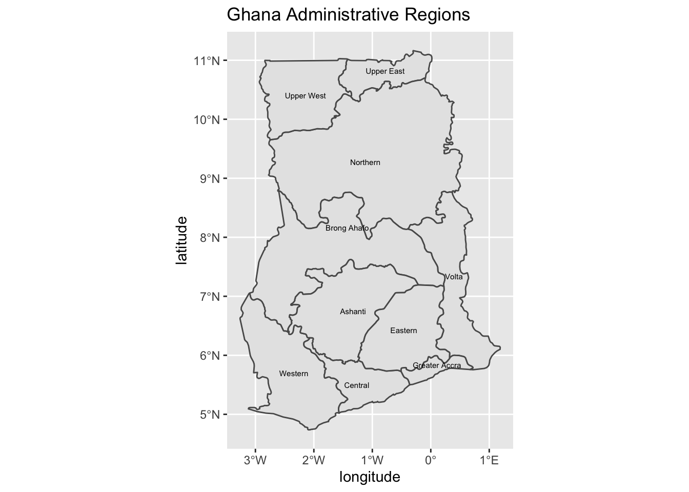


There is plenty of other geographic information that you can download from Natural Earth. In the table below, scale refers to how large the file is and so scale might more correctly be interpreted as the data resolution.

| category   |  type   |  scale `small`  |  scale `medium` | scale `large`   |
|:----------:|:-------:|:-------------:|:-------------:|:-------------:|
| `physical`  | `coastline` |          Yes | Yes | Yes |
| `physical`  | `land` |               Yes | Yes | Yes |
| `physical`  | `ocean` |              Yes | Yes | Yes |
| `physical`  | `lakes` |              Yes | Yes | Yes |
| `physical`  | `geographic_lines` |   Yes | Yes | Yes |
| `physical`  | `minor_islands` |      No  | No  | Yes |
| `physical`  | `reefs` |              No  | No  | Yes |
| `cultural` | `populated_places` |   Yes | Yes | Yes |
| `cultural` | `urban_areas`      |   No  | Yes | Yes |
| `cultural` | `roads`            |   No  | No  | Yes |


### Package `maps`{-}
The R package `maps` is one of the easiest way to draw a country or state maps because it is built into the `ggplot` package. This is one of the easiest ways I know of to get US county information. Unfortunately it is fairly US specific.

Once we have the `data.frame` of regions that we are interested in selected, all we need to do is draw polygons in `ggplot2`.

```r
# ggplot2 function to create a data.frame with world level information
geo.data <- ggplot2::map_data('world') # Using maps::world database. 

# group: which set of points are contiguous and should be connected
# order: what order should the dots be connected
# region: The name of the region of interest
# subregion: If there are sub-regions with greater region
head(geo.data)
```

```
##        long      lat group order region subregion
## 1 -69.89912 12.45200     1     1  Aruba      <NA>
## 2 -69.89571 12.42300     1     2  Aruba      <NA>
## 3 -69.94219 12.43853     1     3  Aruba      <NA>
## 4 -70.00415 12.50049     1     4  Aruba      <NA>
## 5 -70.06612 12.54697     1     5  Aruba      <NA>
## 6 -70.05088 12.59707     1     6  Aruba      <NA>
```

```r
# Now draw a nice world map, not using Simple Features,
# but just playing connect the dots.
ggplot(geo.data, aes(x = long, y = lat, group = group)) +
  geom_polygon( colour = "white", fill='grey50') 
```


The `maps` package has several data bases of geographical regions.  

|  Database    |  Description                               |
|:------------:|:-------------------------------------------|
| `world`      |  Country borders across the globe          |
| `usa`        |  The country boundary of the United States |
| `state`      |  The state boundaries of the United States |
| `county`     |  The county boundaries within states of the United States |
| `lakes`      |  Large fresh water lakes across the world  |
| `italy`      |  Provinces in Italy                        |
| `france`     |  Provinces in France                       |
| `nz`         |  North and South Islands of New Zealand    |


The `maps` package also has a `data.frame` of major US cities.  


## Example{-}

As an example of how to use the Simple Features format, we'll download some information about the state of Arizona. In particular, we'll grab the borders of the state and counties as well as some selected cities. We'll turn all of the data into `sf` objects and then graph those.


```r
# Takes the ggplot2::map_data information and turns it into a
# Simple Feature  (sf)
az.border <- 
  ggplot2::map_data('state', regions='arizona') %>%
  select(long, lat) %>% as.matrix() %>% list() %>% 
  st_polygon()   %>%  # This creates a Simple Features Geometry ( -> sfg)
  st_sfc() %>%        # Turns it into a Simple Features Geometry List Column ( -> sfc)
  st_sf(              # Join the Geometries to some other useful data. ( -> sf)
    State = 'Arizona',
    Population = 7278717,
    crs="+proj=longlat +ellps=WGS84 +no_defs")

az.border
```

```
## Simple feature collection with 1 feature and 2 fields
## geometry type:  POLYGON
## dimension:      XY
## bbox:           xmin: -114.8093 ymin: 31.34652 xmax: -109.0396 ymax: 37.00161
## CRS:            +proj=longlat +ellps=WGS84 +no_defs
##     State Population                              .
## 1 Arizona    7278717 POLYGON ((-114.6374 35.0191...
```

```r
# Fails because not all the counties have the start and end point the same.
# az.counties <-
#   ggplot2::map_data('county', region='Arizona') %>%
#   group_by(subregion) %>%
#   select(long, lat, subregion) %>% group_by() %>%
#   split(., .$subregion)  %>%            # list with elements county data.frame
#   st_polygon()                          # convert to Simple Features

# I downloaded some information about Education levels from the American Community Survey 
# website  https://www.census.gov/acs/www/data/data-tables-and-tools/
# by selecting the Education topic and then used the filter option to select the state
# and counties that I was interested in. Both the 1 year and 5 year estimates 
#  didn't include the smaller counties (too much uncertainty).
# I then had reshape the data a bit to the following
# format. I ignored the margin-of-error columns and didn't worry about the 
# the Race, Hispanic, or Gender differences.

AZ_Ed <- read_csv('data-raw/Arizona_Educational_Attainment.csv', skip=1) %>%
  select('Geographic Area Name', "Estimate!!Percent!!Population 25 years and over!!Bachelor's degree or higher") %>%
  rename(County = 1, 'BS+' = 2) 

AZ_Education <- read_csv('data-raw/AZ_Population_25+_BS_or_Higher.csv') %>%
  arrange(County) %>%
  rename(Percent_BS = 'Percent_BS+') 

# Show the County percent of 25 or older population with BS or higher 
AZ_Education
```

```
## # A tibble: 10 x 2
##    County   Percent_BS
##    <chr>         <dbl>
##  1 apache         11.6
##  2 cochise        21.8
##  3 coconino       36  
##  4 maricopa       33.2
##  5 mohave         14.3
##  6 navajo         14.3
##  7 pima           31.5
##  8 pinal          19.7
##  9 yavapai        26.4
## 10 yuma           16.8
```

```r
# Now for the county names
Counties <-   ggplot2::map_data('county', region='Arizona') %>%
  group_by(subregion) %>% slice(1) %>% 
  select(subregion) %>% rename(County=subregion)

# So for each county, add a row at the end that is the same as the first
az.counties <-
  ggplot2::map_data('county', region='Arizona') %>%
  group_by(subregion) %>%
  do({ rbind(., slice(., 1))} ) %>%       # add the first row on the end.
  select(long, lat, subregion) %>% group_by() %>%
  split(., .$subregion)  %>%              # list with elements county data.frame 
  purrr::map(select, -'subregion') %>%    # remove subregion column in each county
  purrr::map(as.matrix) %>%
  sf::st_polygon() %>% st_sfc() %>%
  st_sf(County = Counties$County,               # Include the County Name!
    crs="+proj=longlat +ellps=WGS84 +no_defs")

# Now add the Education information to the AZ county information using the 
# standard join! Notice that the ACS information doesn't include information
# from some of the smaller 
az.counties <- az.counties %>%
  left_join(AZ_Education)
az.counties
```

```
## Simple feature collection with 15 features and 2 fields
## geometry type:  POLYGON
## dimension:      XY
## bbox:           xmin: -114.8093 ymin: 31.34652 xmax: -109.0396 ymax: 37.00161
## CRS:            +proj=longlat +ellps=WGS84 +no_defs
## First 10 features:
##      County Percent_BS                              .
## 1    apache       11.6 POLYGON ((-109.0453 35.9989...
## 2   cochise       21.8 POLYGON ((-109.0453 35.9989...
## 3  coconino       36.0 POLYGON ((-109.0453 35.9989...
## 4      gila         NA POLYGON ((-109.0453 35.9989...
## 5    graham         NA POLYGON ((-109.0453 35.9989...
## 6  greenlee         NA POLYGON ((-109.0453 35.9989...
## 7    la paz         NA POLYGON ((-109.0453 35.9989...
## 8  maricopa       33.2 POLYGON ((-109.0453 35.9989...
## 9    mohave       14.3 POLYGON ((-109.0453 35.9989...
## 10   navajo       14.3 POLYGON ((-109.0453 35.9989...
```

```r
# Take the maps package us.cities and converts them to Simple Features.
az.cities <- 
  maps::us.cities %>%                            # Lat/Long of major US cities
  filter(country.etc == 'AZ') %>%                # Only the Arizona Cities
  mutate(name = str_remove(name, '\\sAZ') ) %>%  # remove ' AZ' from the city name
  sf::st_as_sf(                                  # 
    coords=c('long','lat'),
    crs="+proj=longlat +ellps=WGS84 +no_defs")   # to a Simple Features Object

# Now just grab a few cities in Arizona that I care about.
PHX <- c('Phoenix','Tempe','Scottsdale')
Rest <- c('Flagstaff','Prescott','Lake Havasu City','Yuma','Tucson','Sierra Vista')

PHX.az.cities <- az.cities %>% filter(name %in% PHX)
Rest.az.cities <- az.cities %>% filter(name %in% Rest)
```

```r
# I have no idea why the fill is not working! 
ggplot() +
  geom_sf() +
  geom_sf(data=az.border) +
  geom_sf(data=az.counties, aes(fill=Percent_BS)) +
  geom_sf(data=PHX.az.cities) +
  geom_sf(data=Rest.az.cities) +
  geom_sf_text( data = PHX.az.cities,  aes(label=name), nudge_x=.4) +
  geom_sf_label( data = Rest.az.cities, aes(label=name), nudge_y=.2) +
  labs(title = 'Percent Arizona of 25 or older with BS or higher degree')
```

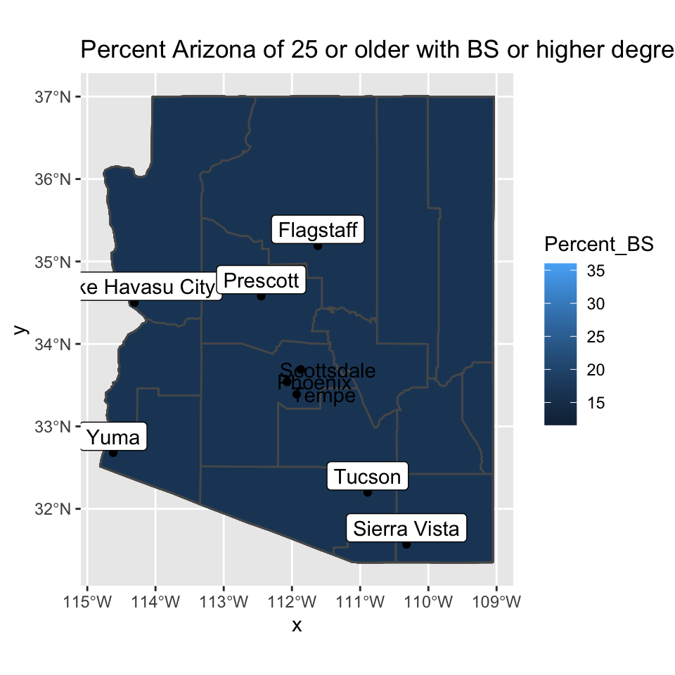


### Package `leaflet`{-}

Leaflet is a popular open-source JavaScript library for interactive maps. The package `leaflet` provides a nice interface to this package. The [tutorial](https://rstudio.github.io/leaflet/) for this package is quite good.

The basic work flow is:

1. Create a map widget by calling leaflet().
2. Create and add layers (i.e., features) to the map by using layer functions 
    a) `addTiles` - These are the background of the map that we will put stuff on top of.
    b) `addMarkers` 
    c) `addPolygons`
3. Repeat step 2 as desired.
4. Print the map widget to display it.


```r
map <- leaflet() %>%  # Build a base map
  addTiles()  %>%     # Add the default tiles 
  addMarkers(lng=-1*(111+37/60+52/3600), 
             lat=35+11/60+57/3600, 
             popup="Flagstaff, AZ")
map %>% print()
```

Because we have added only one marker, then leaflet has decided to zoom in as much as possible. If we had multiple markers, it would have scaled the map to include all of them.

As an example of an alternative, I've downloaded a GIS shape file of forest service administrative area boundaries.


```r
# The shape file that I downloaded had the CRS format messed up. I need to 
# indicate the projection so that leaflet doesn't complain.
Forest_Service <- 
  sf::st_read('data-raw/Forest_Service_Boundaries/S_USA.AdministrativeRegion.shp') %>%
  sf::st_transform('+proj=longlat +datum=WGS84')
```

```
## Reading layer `S_USA.AdministrativeRegion' from data source `/Users/dls354/GitHub/444/data-raw/Forest_Service_Boundaries/S_USA.AdministrativeRegion.shp' using driver `ESRI Shapefile'
## Simple feature collection with 9 features and 7 fields
## geometry type:  MULTIPOLYGON
## dimension:      XY
## bbox:           xmin: -179.2311 ymin: 17.92523 xmax: 179.8597 ymax: 71.44106
## geographic CRS: NAD83
```

```r
leaflet() %>%
  addTiles() %>%
  addPolygons(data = Forest_Service) %>%
  setView(-93, 42, zoom=3)
```

preserveea290b4b1be61266


<!--chapter:end:28_Maps.Rmd-->

---
output:
  html_document: default
  pdf_document: default
---
# Graphing Part II


```r
library(tidyverse)   # loading ggplot2 and dplyr
library(viridis)     # The viridis color schemes
library(latex2exp)   # For plotting math notation

library(plotly)     # for interactive hover-text

library(maps)              # package with data about country borders
library(sf)                # Simple Features for GIS
library(rnaturalearth)     # package with detailed information about country &
library(rnaturalearthdata) # state/province borders, and geographical features
# devtools::install_github('ropensci/rnaturalearthhires')
library(rnaturalearthhires)
library(leaflet)
```

I have a YouTube [Video Lecture](https://youtu.be/ua-EOe7z3fI) for this chapter.

We have already seen how to create many basic graphs using the `ggplot2` package. However we haven't addressed many common scenarios. In this chapter we cover many graphing tasks that occur.

## Multi-plots
There are several cases where it is reasonable to need to take several possibly unrelated graphs and put them together into a single larger graph. This is not possible using `facet_wrap` or `facet_grid` as they are intended to make multiple highly related graphs. Instead we have to turn to other packages that enhance the `ggplot2` package.

### `cowplot` package
Claus O. Wilke wrote a lovely [book](https://serialmentor.com/dataviz/) about data visualization and also wrote an R package to help him tweek his plots. One of the functions in his `cowplot` package is called `plot_grid` and it takes in any number of plots and lays them out on a grid.


```r
P1 <- ggplot(iris, aes(x=Sepal.Length, y=Sepal.Width, color=Species)) + 
  geom_point(size=3) + theme(legend.position='bottom')
P2 <- ggplot(trees, aes(x=Height, y=Volume, color=Girth)) + 
  geom_point() + theme(legend.position='bottom')
P3 <- ggplot(iris, aes(x=Sepal.Length)) + 
  geom_histogram(bins=30)
P4 <- ggplot(iris, aes(x=Species, y=Sepal.Length, fill=Species)) + 
  geom_boxplot() + theme(legend.position='bottom')

cowplot::plot_grid(P1, P2, P3, P4)
```

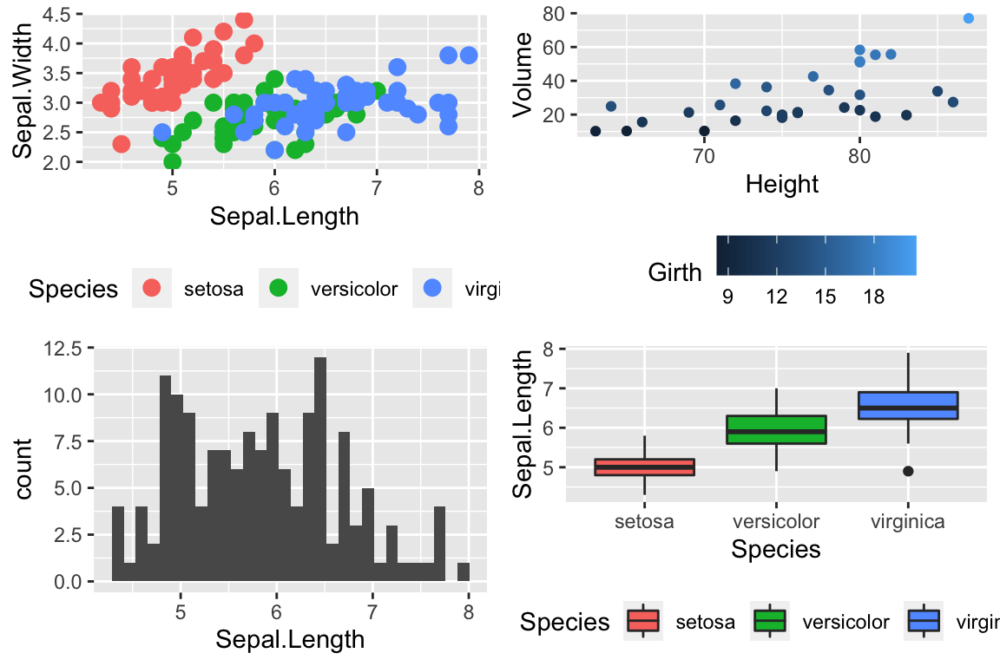

Notice that the graphs are by default are arranged in a 2x2 grid.  We could  adjust the number or rows/columns using the `nrow` and `ncol` arguments. Furthermore, we could add labels to each graph so that the figure caption to refer to "Panel A" or "Panel B" as appropriate using the `labels` option.


```r
cowplot::plot_grid(P2, P3, P4, nrow=1, labels=c('A','B','C'))
```

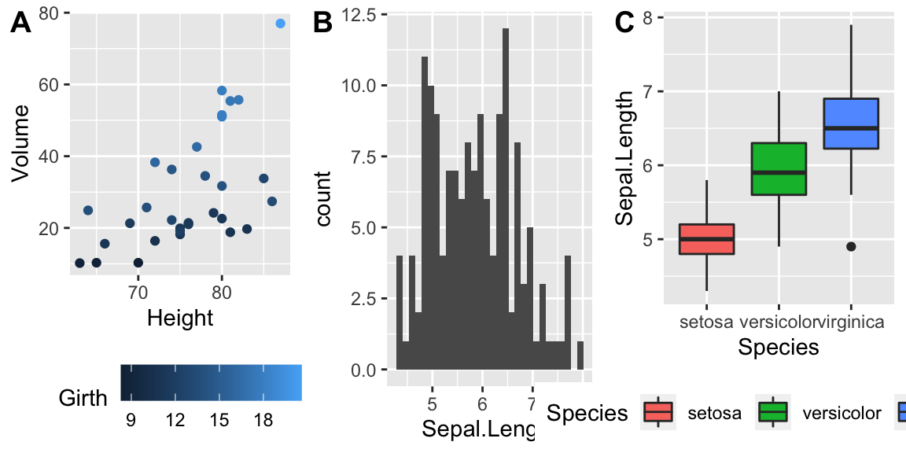

### `multiplot` in `Rmisc`
In his book, *R Graphics Cookbook* Winston Chang produced a really nice function to address this issue, but just showed the code. The folks that maintain the R miscellaneous package `Rmisc` kindly included his function. The benefit of using this function is that you can control the layout to not be on a grid.  For example we might want two graphs side by side, and then the third be short and wide underneath both. By specifying different numbers and rows and columns in my layout matrix, we can highly customize how the plot looks.


```r
# Define where the first plot goes, etc.
my.layout <- matrix(c(1, 2, 2,
                      1, 2, 2,
                      3, 3, 3), byrow = TRUE, nrow=3)

Rmisc::multiplot(P2, P3, P4, layout = my.layout )
```

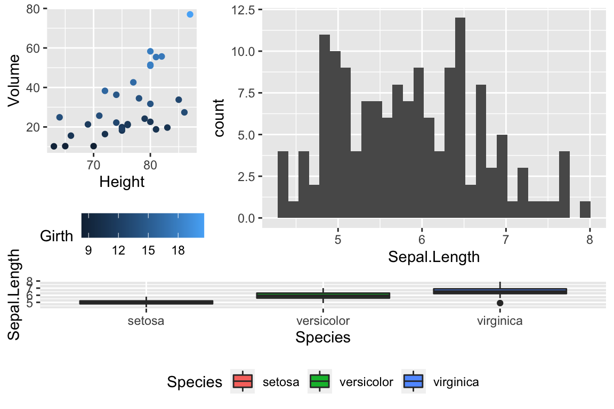

Unfortunately, `Rmisc::multiplot` doesn't have a label option, so if you want to refer to "Panel A", you need to insert the label into each plot separately.


## Customized Scales

While `ggplot` typically produces very reasonable choices for values o the axis scales and color choices for the `color` and `fill` options, we often want to tweak them.

### Color Scales


#### Manually Select Colors

For an individual graph, we might want to set the color manually.  Within `ggplot` there are a number of `scale_XXX_` functions where the `XXX` is either `color` or `fill`.


```r
cowplot::plot_grid(
  P1 + scale_color_manual( values=c('red','navy','forest green') ),
  P2 + scale_color_gradient(low = 'blue', high='red')
)
```

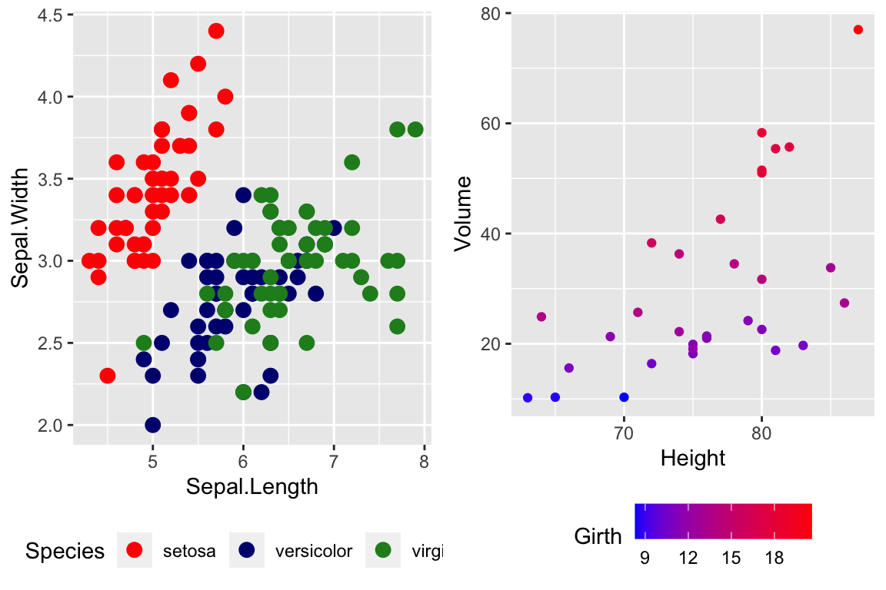

For continuous scales for fill and color, there is also a `scale_XXX_gradient2()` function which results in a *divergent* scale where you set the `low` and `high` values as well as the midpoint color and value. There is also a `scale_XXX_grandientn()` function that allows you to set as many colors as you like to move between.


```r
cowplot::plot_grid(
  P2 + scale_color_gradient2( low = 'black', mid='white', midpoint=14, high='red' ),
  P2 + scale_color_gradientn(colors = c('red','orange','yellow','green','blue','violet') )
)
```

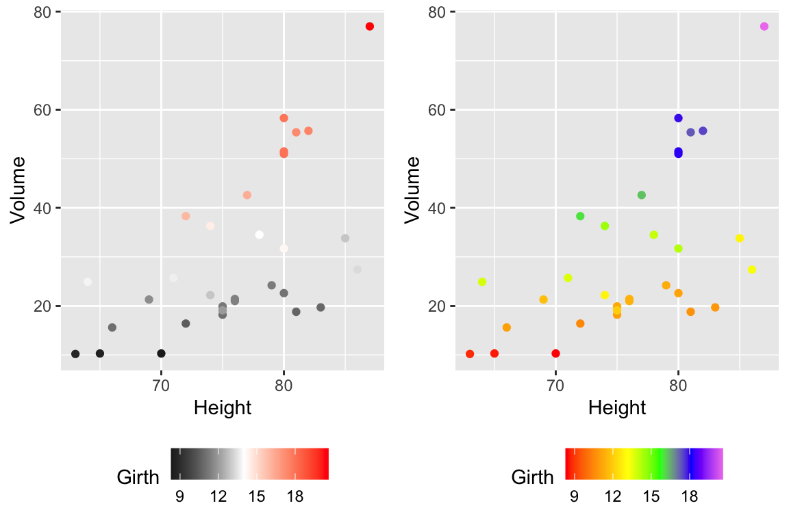

Generally I find that I make poor choices when picking colors manually, but there are times that it is appropriate.


#### Palettes
In choosing color schemes, a good approach is to use a color palette that has already been created by folks that know about how colors are displayed and what sort of color blindness is possible. There are two palette options that we'll discuss, but there are a variety of other palettes available by downloading a package.

##### `RColorBrewer` palettes
Using the `ggplot::scale_XXX_brewer()` functions, we can easily work with the package `RColorBrewer` which provides a nice set of color palettes. These palettes are separated by purpose. 

**Qualitative** palettes employ different hues to create visual differences between classes. These palettes are suggested for nominal or categorical data sets.


**Sequential** palettes progress from light to dark. When used with interval data, light colors represent low data values and dark colors represent high data values.


**Diverging** palettes are composed of darker colors of contrasting hues on the high and low extremes and lighter colors in the middle.


To use one of these palettes, we just need to pass the palette name to `scale_color_brewer` or `scale_fill_brewer`

```r
cowplot::plot_grid(
  P1 + scale_color_brewer(palette='Dark2'),
  P4 + scale_fill_brewer(palette='Dark2') )
```

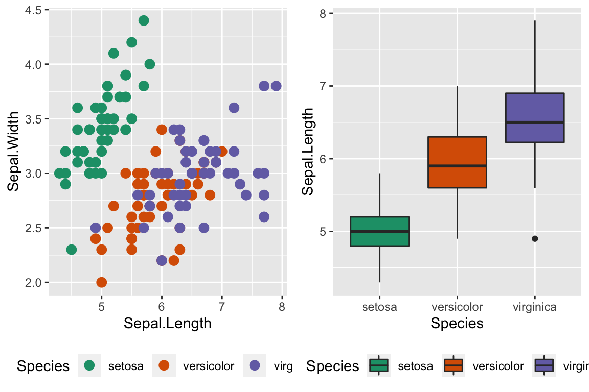


##### `viridis` palettes

The package `viridis` sets up a few different color palettes that have been well thought out and maintain contrast for people with a variety of color-blindess types as well as being converted to grey-scale.


```r
cowplot::plot_grid(
  P1 + scale_color_viridis_d(option='plasma'),      # _d for discrete
  P2 + scale_color_viridis_c( option='viridis') )   # _c for continuous
```

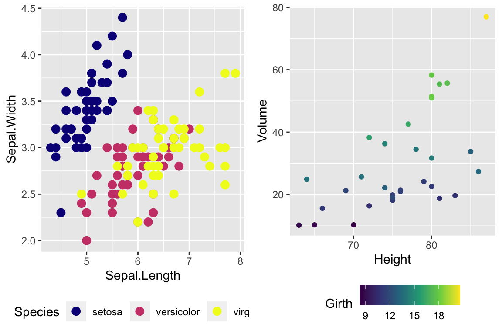


There are a bunch of other packages that manage color palettes such as `paletteer`, `ggsci` and `wesanderson`. 


### Setting major & minor ticks
For continuous variables, we need to be able to control what tick and grid lines are displayed.  In `ggplot`, there are *major* and *minor* breaks and the major breaks are labeled and minor breaks are in-between the major breaks. The break point labels can also be set.


```r
ggplot(trees, aes(x=Height, y=Volume)) + geom_point() +
  scale_x_continuous( breaks=seq(65,90, by=5), minor_breaks=65:90 ) +
  scale_y_continuous( breaks=c(30,50), labels=c('small','big') )
```

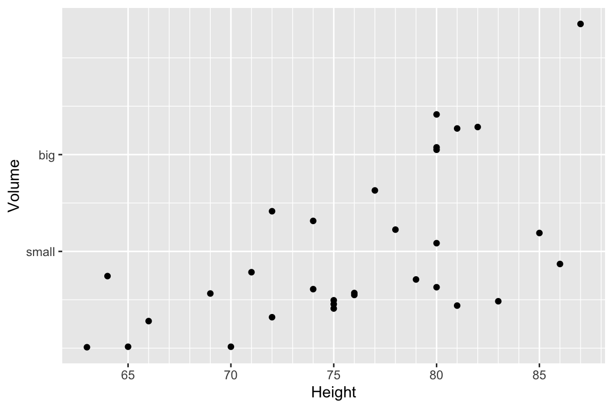

### Log Scales
For this example, we'll use the `ACS` data from the `Lock5Data` package that has information about `Income` (in thousands of dollars) and `Age`. Lets make a scatter plot of the data.

```r
# Import the data and drop any zeros
data('ACS', package='Lock5Data') 
ACS <- ACS %>%
  drop_na() %>% filter(Income > 0)

cowplot::plot_grid(
  ggplot(ACS, aes(x=Age, y=Income)) +
    geom_point(),
  ggplot(ACS, aes(x=Age, y=log10(Income))) +
    geom_point()
)
```

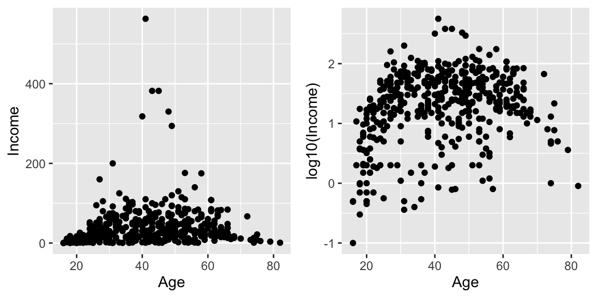

Plotting the raw data results in an ugly graph because six observations dominate the graph and the bulk of the data (income < $100,000) is squished together. One solution is to plot income on the $\log_{10}$ scale. The second graph does that, but the labeling is all done on the log-scale and most people have a hard time thinking in terms of logs.

This works quite well to see the trend of peak earning happening in a persons 40s and 50s, but the scale is difficult for me to understand (what does $\log_{10}\left(X\right)=1$ mean here? Oh right, that is $10^{1}=X$ so that is the $10,000 line). It would be really nice if we could do the transformation but have the labels on the original scale. 


```r
cowplot::plot_grid(
  ggplot(ACS, aes(x=Age, y=Income)) +
    geom_point() +
    scale_y_log10(),
  ggplot(ACS, aes(x=Age, y=Income)) +
    geom_point() +
    scale_y_log10(breaks=c(1,10,100),
                  minor=c(1:10,
                        seq( 10, 100,by=10 ),
                        seq(100,1000,by=100))) +
    ylab('Income (1000s of dollars)')
)
```

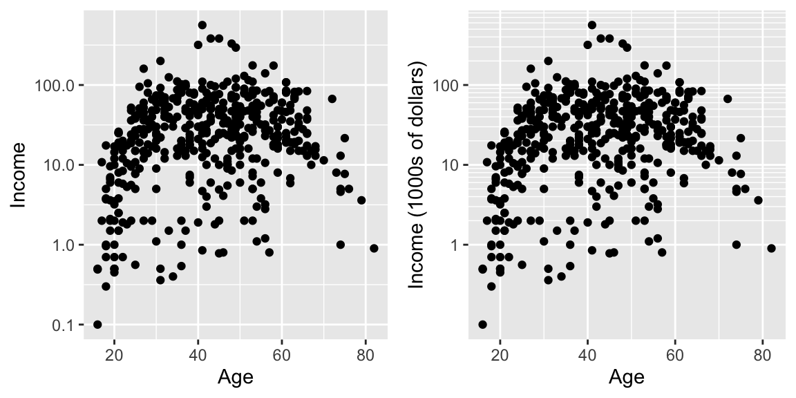

Now the y-axis is in the original units (thousands of dollars) but obnoxiously we only have two labeled values. Lets define the major break points (the white lines that have numerical labels) to be at 1,10,100 thousand dollars in salary. Likewise we will tell `ggplot2` to set minor break points at 1 to 10 thousand dollars (with steps of 1 thousand dollars) and then 10 thousand to 100 thousand but with step sizes of 10 thousand, and finally minor breaks above 100 thousand being in steps of 100 thousand.


## Themes

Many fine-tuning settings in `ggplot2` can be manipulated using the `theme()` function. I've used it previously to move the legend position, but there are many other options. 

```r
p1 <- ggplot(ChickWeight, aes(x=Time, y=weight, colour=Diet, group=Chick)) +
    geom_line() + labs(title='Chick Weight: Birth to 21 days')

# Two common examples of things to change
cowplot::plot_grid(nrow=2,
  p1 + theme(plot.title = element_text(hjust = 0.5, size=25)),  
  p1 + theme(legend.position = 'bottom')                 # legend to bottom
)
```

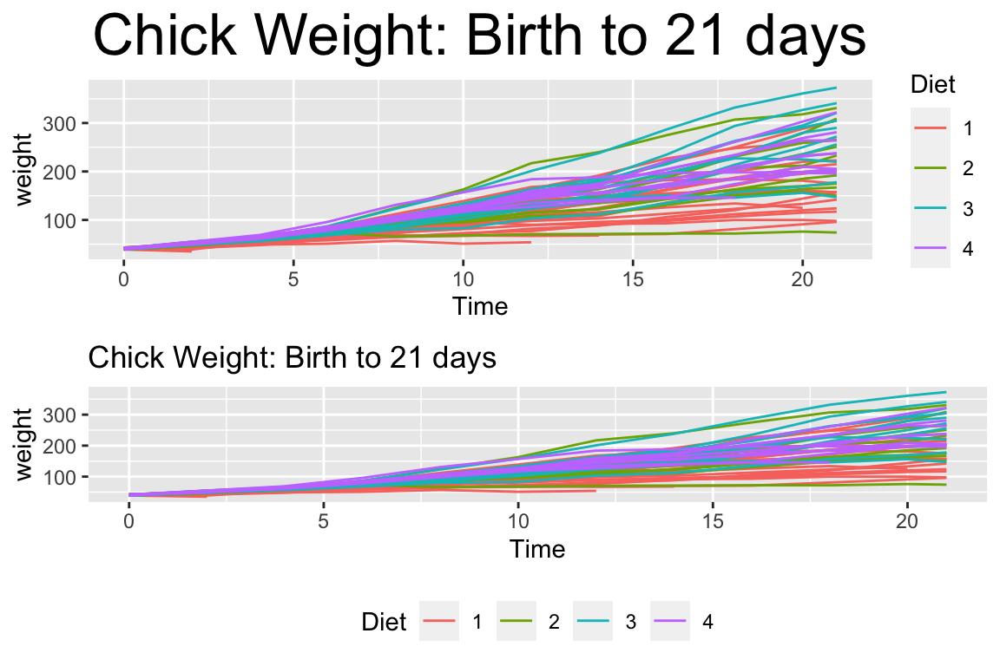

There are many things to tweak using the `theme()` command and to get a better idea of what is possible, I recommend visiting the ggplot2 web page documentation and [examples](https://ggplot2.tidyverse.org/reference/theme.html#examples). Notably, one thing that is NOT changed using the `theme` command is the color scales.  


A great deal of thought went into the default settings of ggplot2 to maximize the visual clarity of the graphs. However some people believe the defaults for many of the tiny graphical settings are poor. You can modify each of these but it is often easier to modify them all at once by selecting a different theme. The ggplot2 package includes several, `theme_bw()`, and `theme_minimal()` being the two that I use most often. Other packages, such as `cowplot` and `ggthemes`, have a bunch of other themes that you can select from. Below are a few  examples:

```r
Rmisc::multiplot( cols = 2,
  p1 + theme_bw()      + labs(title='theme_bw'), # Black and white
  p1 + theme_minimal() + labs(title='theme_minimal'),   
  p1 + theme_dark()    + labs(title='theme_dark'),        
  p1 + theme_light()   + labs(title='theme_light')
)
```

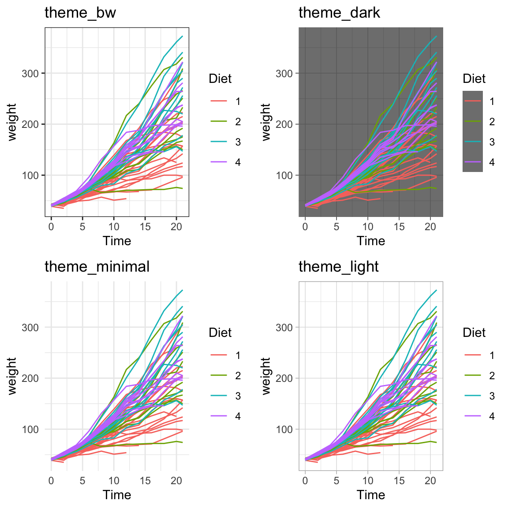


```r
Rmisc::multiplot( cols = 2,
  p1 + cowplot::theme_cowplot() + labs(title='cowplot::theme_cowplot()'),
  p1 + cowplot::theme_minimal_grid() + labs(title='cowplot::theme_minimial_grid'),
  p1 + ggthemes::theme_stata() + labs(title='ggthemes::theme_stata()'),
  p1 + ggthemes::theme_tufte() + labs(title='ggthemes::theme_tufte()'),
  p1 + ggthemes::theme_economist() + labs(title='ggthemes::theme_economist()'),
  p1 + ggthemes::theme_fivethirtyeight() + labs(title='ggthemes::theme_fivethirtyeight()'),
  p1 + ggthemes::theme_excel_new() + labs(title='ggthemes::theme_excel_new()'),
  p1 + ggthemes::theme_gdocs() + labs(title='ggthemes::theme_gdocs()')
  )
```

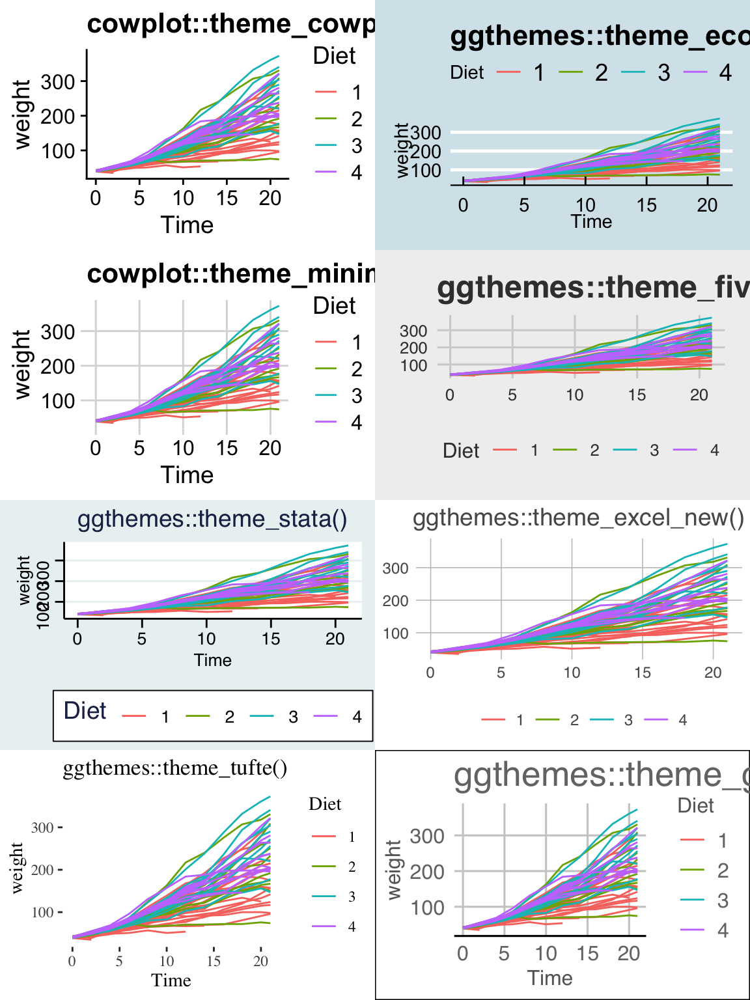


Finally, we might want to select a theme for all subsequent plots or modify a specific aspect of the theme.

|   Command                  |     Result            |
|:--------------------------:|:----------------------|
| `theme_set( theme_bw() )`  | Set the default theme to be the `theme_bw()` theme. |
| `theme_update( ... )`      | Update the current default them.  |

This will allow you to set the graphing options at the start of your Rmarkdown/R-script document. However the one thing it does not do is allow you to change the default color themes (we still have to do for each graph).


## Mathematical Notation

It would be nice to be able to include mathematical formula and notation on plot axes, titles, and text annotation. R plotting has a notation scheme which it calls `expressions`. You can learn more about how R `expressions` are defined by looking at the [plotmath help](https://stat.ethz.ch/R-manual/R-devel/library/grDevices/html/plotmath.html) help page. They are similar to LaTeX but different enough that it can be frustrating to use. It is particularly difficult to mix character strings and math symbols. I recommend not bothering to learn R expressions, but instead learn LaTeX and use the R package `latex2exp` that converts character strings written in LaTeX to be converted into R's expressions.  

LaTeX is an extremely common typesetting program for mathematics and is widely used. The key idea is that `$` will open/close the LaTeX mode and within LaTeX mode, using the backslash represents that something special should be done.  For example, just typing `$alpha$` produces $alpha$, but putting a backslash in front means that we should interpret it as the greek letter alpha. So in LaTeX, `$\alpha$` is rendered as $\alpha$. We've already seen an [introduction](https://dereksonderegger.github.io/444/rmarkdown-tricks.html#mathematical-expressions) to LaTeX in the Rmarkdown Tricks chapter.

However, because I need to write character strings with LaTeX syntax, and R also uses the backslash to represent special characters, then to get the backslash into the character string, we actually need to do the same double backslash trick we did in the string manipulations using regular expressions section.


```r
seed <- 7867
N <- 20
data <- data.frame(x=runif(N, 1, 10)) %>%    # create a data set to work with
  mutate(y = 12 - 1*x + rnorm(N, sd=1))      # with columns x, y

model <- lm( y ~ x, data=data)               # Fit a regression model
data <- data %>%                             # save the regression line yhat points
  mutate(fit=fitted(model))

ggplot(data, aes(x=x)) +
  geom_point(aes(y=y)) +
  geom_line(aes(y=fit), color='blue') +
  annotate('text', x=9, y=9.5, 
           label=latex2exp::TeX('$\\hat{\\rho}$ = 0.916') ) +   # always double \\
  labs( x=latex2exp::TeX('X-axis $\\alpha$'), 
        y=latex2exp::TeX('Y: $\\log_{10}$(Income)'),
        title=latex2exp::TeX('Linear Models use: $\\hat{\\beta} = (X^TX)^{-1}X^Ty$'))
```

```
## Warning in is.na(x): is.na() applied to non-(list or vector) of type
## 'expression'
```

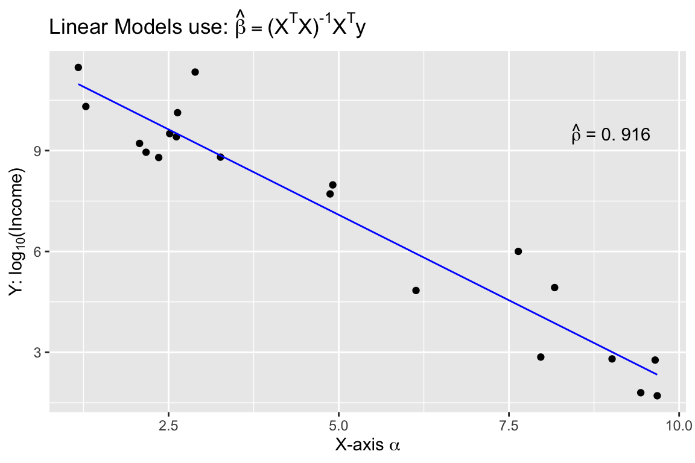

The warning message that is produced is coming from `ggplot` and I haven't figured out how to avoid it. Because it is giving us the graph we want, I'm just going to ignore the error for now.

One issue is how to add expression to a data frame. Unfortunately, neither `data.frame` nor `tibble` will allow a column of expressions, so instead we have store it as a character string. Below, we create three character strings using standard LaTeX syntax, and then convert it to a character string that represents the R expression. Finally, in `ggplot`, we tell the `geom_text` layer to parse the label and interpret it as an R expression.


```r
foo <- data.frame( x=c(1,2,3), y=c(2,2,2) ) %>%
  mutate( label1 = paste('$\\alpha$ = ', x) ) %>%       # label is a TeX character string
  mutate( label2 = latex2exp::TeX(label1, output = 'character') )  # label2 is an expression character string

ggplot(foo, aes(x=x, y=y) ) +
  geom_label( aes(label=label2), parse=TRUE )   # parse=TRUE forces an expression interpretation 
```

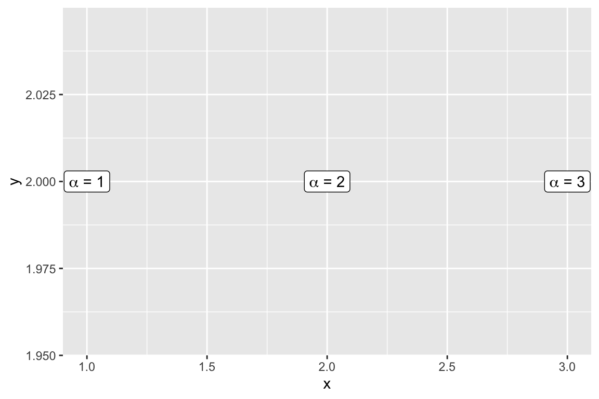

## Interactive plots with `plotly`

Plotly is technical computing company that specializes in data visualization. They have created an open source JavaScript library to produce graphs, which is confusingly referred to as plotly. Because plotly is JavaScript, and RStudio's Viewer pane is actually a web browser, it easily provides interactive abilities in RStudios Viewer pane. 

A good tutorial book about using plotly was written by [Carson Sievert](https://plotly-r.com).

The simple version is that you can take a ggplot graph and pipe it into the `ggplotly` and it will be rendered into an interactive version of the graph.


```r
P1 <- trees %>%
  ggplot(aes(y=Volume, x=Height)) +
  geom_point()

P1 %>% plotly::ggplotly()
```


<iframe width="900" height="400" frameborder="0" scrolling="no" src="//plot.ly/~zdereksonderegger/3.embed"></iframe>

We can use the widgets to zoom in and out of the graph. Notice that as we hover over the point, it tells us the x/y coordinates. To add information to the hover-text, we just need to add a `text` aesthetic mapping to the plot. 


```r
P1 <- trees %>%
  mutate(Obs_ID = row_number()) %>%  
  ggplot(aes(y=Volume, x=Height, 
             text=paste('Girth: ', Girth,   '\n',          # add some extra text
                        'Obs #: ', Obs_ID,  sep=''))) +    # to the hover information
  geom_point() 

P1 %>% ggplotly() 
```


<iframe width="900" height="400" frameborder="0" scrolling="no" src="//plot.ly/~zdereksonderegger/5.embed"></iframe>


## Geographic Maps

We often need to graph countries or U.S. States. We might then fill the color of the state or countries by some variable. To do this, we need information about the shape and location of each country within some geographic coordinate system. The easiest system to work from is Latitude (how far north or south of the equator) and Longitude (how far east or west the prime meridian). 

### Package `maps`
The R package `maps` is one of the easiest way to draw a country or state map because it is built into the `ggplot` package. Unfortunately it is fairly US specific.

Because we might be interested in continents, countries, states/provinces, or counties, in the following discussion we'll refer to the geographic area of interest as a *region*. For `ggplot2` to interact with GIS type objects, we need a way to convert a GIS database of regions into a `data.frame` of a bunch of data points about the region's borders, where each data point is a Lat/Long coordinate and the region and sub-region identifiers. Then, to produce a map, we just draw a path through the data points. For regions like Hawaii's, which are composed of several non-contiguous areas, we include sub-regions so that the boundary lines don't jump from island to island.

Once we have the `data.frame` of regions that we are interested in selected, all we need to do is draw polygons in `ggplot2`.

```r
# ggplot2 function to create a data.frame with world level information
geo.data <- ggplot2::map_data('world') # Using maps::world database. 

# group: which set of points are contiguous and should be connected
# order: what order should the dots be connected
# region: The name of the region of interest
# subregion: If there are sub-regions with greater region
head(geo.data)
```

```
##        long      lat group order region subregion
## 1 -69.89912 12.45200     1     1  Aruba      <NA>
## 2 -69.89571 12.42300     1     2  Aruba      <NA>
## 3 -69.94219 12.43853     1     3  Aruba      <NA>
## 4 -70.00415 12.50049     1     4  Aruba      <NA>
## 5 -70.06612 12.54697     1     5  Aruba      <NA>
## 6 -70.05088 12.59707     1     6  Aruba      <NA>
```

```r
# Now draw a nice world map, 
ggplot(geo.data, aes(x = long, y = lat, group = group)) +
  geom_polygon( colour = "white", fill='grey50') 
```

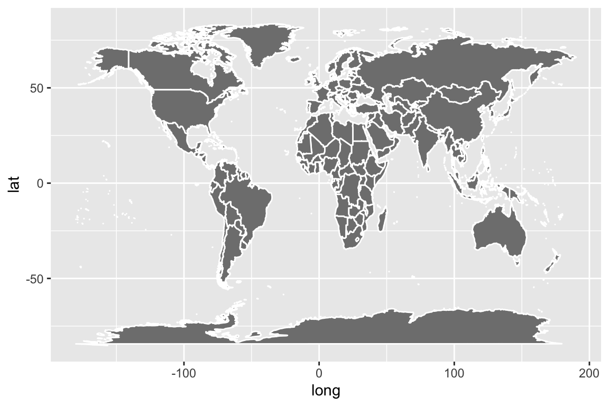

The `maps` package has several data bases of geographical regions.  

|  Database    |  Description                               |
|:------------:|:-------------------------------------------|
| `world`      |  Country borders across the globe          |
| `usa`        |  The country boundary of the United States |
| `state`      |  The state boundaries of the United States |
| `county`     |  The county boundaries within states of the United States |
| `lakes`      |  Large fresh water lakes across the world  |
| `italy`      |  Provinces in Italy                        |
| `france`     |  Provinces in France                       |
| `nz`         |  North and South Islands of New Zealand    |

From within each of these databases, we can select to just return a particular region. So for example, we can get all the information we have about Ghana using the following:

```r
ggplot2::map_data('world', regions='ghana') %>%
  ggplot( aes(x=long, y=lat, group=group)) +
  geom_polygon( color = 'white', fill='grey40')
```

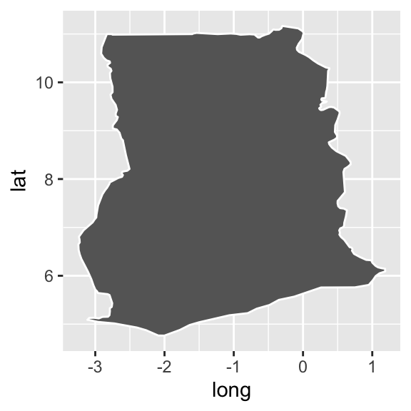

The `maps` package also has a `data.frame` of major US cities.  


```r
az.cities <- maps::us.cities %>%              # Lat/Long of major US cities
  filter(country.etc == 'AZ') %>%             # Only the Arizona Cities
  mutate(name = str_remove(name, '\\sAZ') )   # remove ' AZ' from the city name
  
small.az.cities <- az.cities %>%
  filter(name %in% c('Flagstaff','Prescott','Lake Havasu City','Yuma','Tucson',
                     'Sierra Vista','Phoenix','Tempe','Scottsdale'))

ggplot2::map_data('state', regions='arizona') %>%
  ggplot( aes(x=long, y=lat)) +
  geom_polygon( aes(group=group), color = 'white', fill='grey40') +
  geom_point(data=az.cities) +
  ggrepel::geom_label_repel(data=small.az.cities, aes(label=name))
```

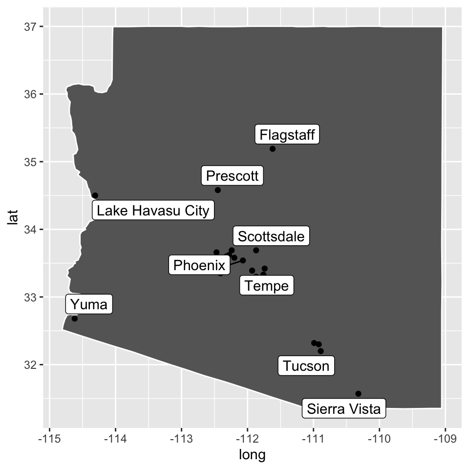


### Packages `sf` and `rnaturalearth`

The `maps` package is fairly primitive in the data it has as well as the manner in which it stores the data. Another alternative is to use the *spatial features* package `sf` along with an on-line data base of GIS information from [Natural Earth](https://www.naturalearthdata.com).

There is a nice set of tutorials for the `sf` package.
[Part 1](https://www.r-spatial.org/r/2018/10/25/ggplot2-sf.html),
[Part 2](https://www.r-spatial.org/r/2018/10/25/ggplot2-sf-2.html), and
[Part 3](https://www.r-spatial.org/r/2018/10/25/ggplot2-sf-3.html).

From the Natural Earth package, we can more easily obtain information about world countries and state/provinces. There is also information about urban areas and roads as well as geographical details such as rivers and lakes.


```r
ne_countries(continent='Africa', returnclass = 'sf') %>%  # grab country borders in Africa
  ggplot() + geom_sf() +
  labs(title='Africa')
```

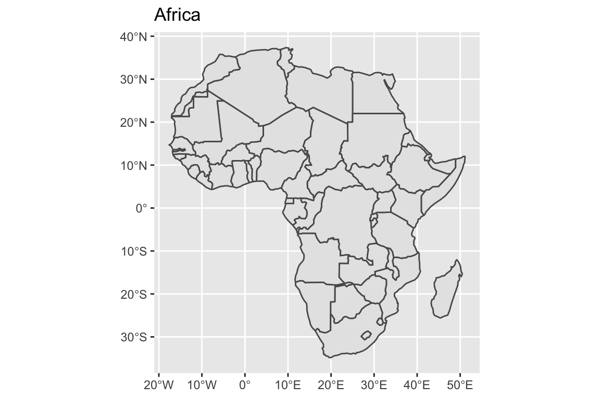


```r
ne_states(country='Ghana', returnclass = 'sf') %>% # grab provinces within Ghana
  ggplot() +
  geom_sf( ) + 
  labs(title='Ghana')
```

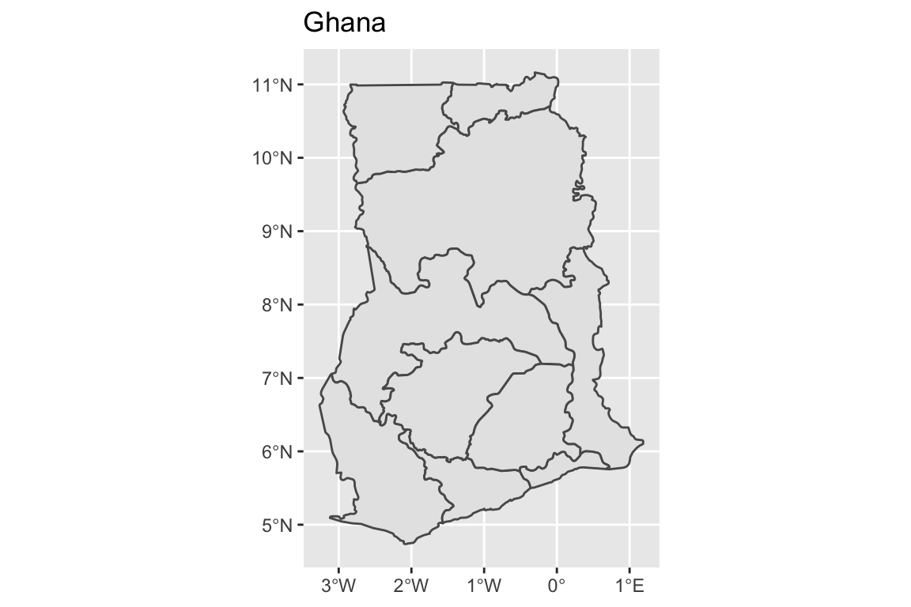


```r
# The st_centroid function takes the sf object and returns the center of 
# the polygon, again as a sf object.
Ghana <- ne_states(country='Ghana', returnclass = 'sf')  # grab provinces within Ghana
Ghana %>% ggplot() +
  geom_sf( ) + 
  geom_text( data=st_centroid(Ghana), size=2,
             aes(x=longitude, y=latitude, label=woe_name)) +
  labs(title='Ghana Administrative Regions')
```

```
## Warning in st_centroid.sf(Ghana): st_centroid assumes attributes are constant
## over geometries of x
```

```
## Warning in st_centroid.sfc(st_geometry(x), of_largest_polygon =
## of_largest_polygon): st_centroid does not give correct centroids for longitude/
## latitude data
```

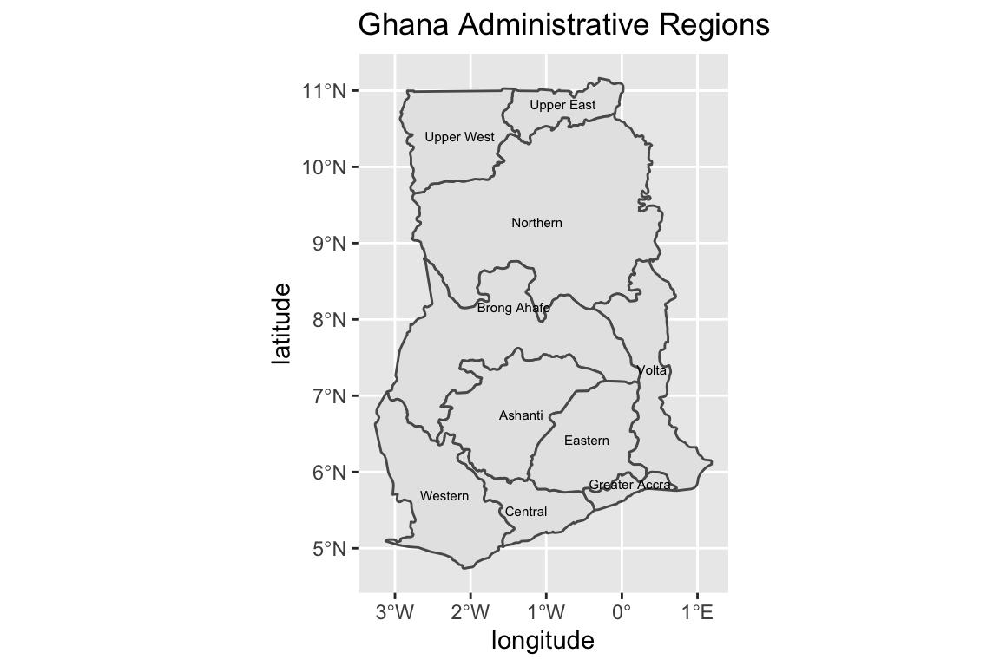


### Package `leaflet`

Leaflet is a popular open-source JavaScript library for interactive maps. The package `leaflet` provides a nice interface to this package. The [tutorial](https://rstudio.github.io/leaflet/) for this package is quite good.

The basic work flow is:

1. Create a map widget by calling leaflet().
2. Create and add layers (i.e., features) to the map by using layer functions 
    a) `addTiles`
    b) `addMarkers` 
    c) `addPolygons`
3. Repeat step 2 as desired.
4. Print the map widget to display it.


```r
map <- leaflet() %>%  # Build a base map
  addTiles()  %>%     # Add the default tiles 
  addMarkers(lng=-1*(111+37/60+52/3600), lat=35+11/60+57/3600, popup="Flagstaff, AZ")
map %>% print()
```

Because we have added only one marker, then leaflet has decided to zoom in as much as possible. If we had multiple markers, it would have scaled the map to include all of them.

As an example of an alternative, I've downloaded a GIS shape file of forest service administrative area boundaries.


```r
# The shape file that I downloaded had the CRS format messed up. I need to 
# indicate the projection so that leaflet doesn't complain.
Forest_Service <- 
  sf::st_read('data-raw/Forest_Service_Boundaries/S_USA.AdministrativeRegion.shp') %>%
  sf::st_transform('+proj=longlat +datum=WGS84')
```

```
## Reading layer `S_USA.AdministrativeRegion' from data source `/Users/dls354/GitHub/444/data-raw/Forest_Service_Boundaries/S_USA.AdministrativeRegion.shp' using driver `ESRI Shapefile'
## Simple feature collection with 9 features and 7 fields
## geometry type:  MULTIPOLYGON
## dimension:      XY
## bbox:           xmin: -179.2311 ymin: 17.92523 xmax: 179.8597 ymax: 71.44106
## epsg (SRID):    4269
## proj4string:    +proj=longlat +ellps=GRS80 +towgs84=0,0,0,0,0,0,0 +no_defs
```

```r
leaflet() %>%
  addTiles() %>%
  addPolygons(data = Forest_Service) %>%
  setView(-93, 42, zoom=3)
```

preserve6fd711c2a1768f9e


## Exercises  {#Exercises_Advanced_Graphing}

1. [Gapminder](https://www.gapminder.org) is a organization devoted to educating people about world facts and dispelling misconceptions between countries. 
    a) From their [data](https://www.gapminder.org/data/) page, download information about CO2 emissions per person. Import the data and filter out all but the latest year.
    b) Create a map of CO2 emissions per person . 

2. The `infmort` data set from the package `faraway` gives the infant mortality rate for a variety of countries. The information is relatively out of date, but will be fun to graph. T
    a) The `rownames()` of the dataset give the country names and you should create a new column that contains the country names. 
    b) Save the `ggplot2::map_data('world')` result as `geo.data`. Compare the `infmort` country names to the `region` names in the `geo.data` data set and do whatever is necessary to get the country names to concur. *Hint: `unique(x)` will return the unique items in a vector, `intersect(x,y)`returns the elements common to `x` and `y`, and `setdiff(x,y)`  returns the elements of `x` that are not in `y`. I recommend creating a `Country_Dictionary` that contains the standardized country name and all the weird versions you've run into. Every time you see some new abbreviation, just add it to the dictionary. To start with, you might consider all the ways people commonly refer to the United States of America.*
        
        ```r
        Country_Dictionary <- tribble(
          ~raw, ~standardized,
          'U.S.A',         'United States of America',
          'United States', 'United States of America',
          'US',            'United States of America')
        ```
        *After doing some simple data cleaning on the country names (e.g. swapping `_` for a space or vice versa), figure out which country names in the two data sets don't match up and decide on a standardized name and insert the translation into your dictionary table. Then join the dictionary to the `geo.data` and create a standardized country name column. Do the same for the `infmort` data and then the standardized country name levels should match up.*
    c) Join the `geo.data` with the `infmort` data.
    d) Make a map of the world where we shade in countries based on the country income. Set the color fill scale to be anything other than the default.
    e) Make a map of the world where we shade in the countries based on if they are oil exports. Color the map black if the country is an oil exporter, and a light gray if it is not.

3. The `infmort` data set can also be visualized using by faceting using `region` and `oil` export status. 
    a) Create scatter plots the countries income and infant mortality using a $log_{10}$ transformation for both axes.
    b) The package `ggrepel` contains functions `geom_text_repel()` and `geom_label_repel()` that mimic the basic `geom_text()` and `geom_label()` functions in `ggplot2`, but work to make sure the labels don't overlap. Select 10-15 countries to label and do so using the `geom_text_repel()` function.

4. Using the `datasets::trees` data, complete the following:
    a) Create a regression model for Volume as a function of Height.
    b) Using the `summary` command, get the y-intercept and slope of the regression line.
    c) Using `ggplot2`, graph the data.
    d) Create a nice white filled rectangle to add text information to using by adding the following annotation layer.
        
        ```r
          + annotate('rect', xmin=7, xmax=14.5, ymin=64, ymax=70,
                   fill='white', color='black')
        ```
    e) Add some annotation text to write the equation of the line $\hat{y}_i = -36.94 + 5.1 * x_i$ in the text area.
    f) Add annotation to add $R^2 = 0.934$
    
5. Using the `datasets::Titanic` data set, create a bar graph showing the number of individuals that survived or not. Make sure to include the passenger `Class`, `Sex`, and `Age` variable information. *Unfortunately, the data is stored as a `table` and to expand it to a data frame, the following code can be used.*
    
    ```r
    Titanic <- Titanic %>% as.data.frame()
    ```
    a) Make this graph using the default theme.
    b) Make this graph using the `theme_bw()` theme.
    c) Make this graph using the `cowplot::theme_minimal_hgrid()` theme.
    d) Why would it be beneficial to drop the vertical grid lines?
    

<!--chapter:end:29_Advanced_Graphing.Rmd-->

# R Packages

## Introduction

As usual, I have a YouTube [Video Lecture](https://youtu.be/NZK2X46Me8M) for this chapter. 

R packages are documented and consistent format for storing data, functions, documentation, and analysis. We use a consistent format so that other researchers (or ourselves in six months) know exactly where the raw data should be, where to find any functions that are written, and document the data cleaning process.

In principle, all of these steps could be accomplished by a single data file and a single analysis Rmarkdown file. However as projects get larger in scope, the number of data files, the complexity of data cleaning, and the number of people working with the data will grow. With more complexity, the need to impose order on it becomes critical.

Even if the project is small, organizing my work into a package structure provides a benefit. First, it forces me to keep my data wrangling code organized and encourages documenting any functions I create. Second, by separating the data wrangling step code from the analysis, I think more deeply about verification and initial exploration to understand how best to store the data. Finally, because all my subsequent analysis will depend on the same tidy dataset, I make few mistakes where I cleaned the data correctly in one analysis, but forgot a step in another analysis.

I recommend using an R package for any analysis more complicated than a homework assignment because the start-up is relatively simple and if the project grows, you'll appreciate that you started it in an organized fashion.


### Useful packages and books

There are several packages that make life easier.

| Package    |         Description             |
|:----------:|:--------------------------------|
| `devtools` |  Tools by Hadley, for Hadley (and the rest of us). |
| `roxygen2` |  A coherent documentation syntax |
| `testthat` |  Quality Assurance tools         |
| `usethis`  |  Automates repetitive tasks that arise during project setup and development, both for R packages and non-package projects. |


Hadley Wickham has written a book on R packages that gives a lot more information than I'm giving here. The book is available [online](http://r-pkgs.had.co.nz).


## Package Structure

### Minimal files and directories

|  File/Directory   |                   Description                      |
|:-----------------:|:---------------------------------------------------|
| `DESCRIPTION` | A file describing your package. You **should** edit this at some point. |
| `NAMESPACE`   | A file that lists all the functions and datasets available to users after loading the package. You **should not**  edit this by hand. |
| `.Rbuildignore` | A list of files that shouldn't be included when the package is built. |
| `R/`            | This directory contains documentation files for datasets. It also contains the R code and documentation for functions you create. I generally recommend one documentation file for each dataset, and one file for each function, although if you have several related functions, you might keep them in the same file. This directory can be empty, but it does have to exist. |
| `man/`    | This contains the documentation (manual) files generated by `roxygen2`. You **should not** edit these as they will be rebuilt from the source R code in the `R/` directory. |

### Optional Files and Directories

|  File/Directory   |                   Description                      |
|:-----------------:|:---------------------------------------------------|
| `data-raw/` | A directory where we store data files that are not `.RData` format. Usually these are `.csv` or `.xls` files that have not been processed. Typically I'll have R scripts in this directory that read in raw data, do whatever data wrangling and cleaning that needs to be done, and saves the result in the `data/` directory. Obnoxiously the documentation for the dataset does not live in this directory, but rather in the `R/` directory. |
| `data/` |  A directory of datasets that are saved in R's efficient `.RData` format. Each file should be an `.RData` or `.Rda` file created by the `save()` containing a single object (with the same names as the file).  Anything in this directory will be loaded and accessible to the user when the package is loaded. While it isn't necessary for this directory to exist, it often does. |
| `docs/` | A directory where any Rmarkdown analysis files that are especially time consuming and should not be executed each time the package is built. When I build a package for a data-analysis project, the reports I create go into this directory. |
| `vignettes/` | A directory where Rmarkdown files should go that introduce how to use the package. When a package is built, then Rmarkdown files in this directory will also be rebuilt.  I generally don't make a vi|
| `tests/` |  A directory for code used for package testing functions you've written.  |
| `inst/`  |  Miscellaneous stuff. In particular `inst/extdata/` is where you might put data that is not in `.RData` format (Excel files and such) but you want it available to the users. Anything in the `inst/extdata` will be available to to user via `system.file('file.xls',package='MyAwesomePackage')` |
| `src/`  |  A directory where C/C++, Fortran, Python, etc source code is stored.  |
| `exec/` | A directory where executables you might have created from the source code should go. |


## Documenting 

The `man/` directory is where the final documentation exists, but the format that was initially established is quite unwieldy. To address this, the `roxygen2` package uses a more robust and modern syntax and keeps the function documentation with the actual code in the `R\` directory. The results in a process where we write the documentation in files in the `R/` directory and then run a `roxygen2` command to build the actual documentation files in the `man/` directory. To run this, use the `Build` tab and then `More -> Document`.

Hadley Wickham has a more complete discussion of package documentation in a
[vignette](https://cran.r-project.org/web/packages/roxygen2/vignettes/rd.html) 
for `roxygen2`. If/when the information in this chapter seems insufficient, that should be your next resource.

The documentation information is built in comments and so documentation lines always start with a `#'`. For both data sets and functions, the first couple of lines give the short title and description. 


```r
#' A short title
#' 
#' A longer paragraph that describes the context of the dataset/function and 
#' discusses important aspects that will be necessary for somebody first seeing 
#' the data/function to know about. Any text in these initial paragraphs will be 
#' in the description section of the documentation file.
#' 
```


### Data Documentation
Data set documentation should contain both general information about the context of the data as well as detailed information about the data columns. Finally the documentation should also include information about where the data came from, if it is available. The title and description are given in the first paragraphs of the description, but the format and source need some indication starting the sections.


```r
#' A short title
#' 
#' A longer paragraph that describes the context of the dataset and 
#' discusses important aspects that will be necessary for somebody first seeing 
#' the data to know about. Any text in these initial paragraphs will be 
#' in the description section of the documentation file.
#' 
#' @format A data frame with XXX observations with ZZ columns.
#' \describe{
#'    \item{Column1}{Description of column 1, including units if appropriate}
#'    \item{Column2}{Description of column 2, including units if appropriate}
#' }
"DataSetName"
```

There are a few other documentation sections that can be filled in. They will all be introduced using `@Section` notation.

```r
#' @source This describes where the data came from
#' @references If we need to cite some book or journal article.
```


### Documenting Functions
Functions that you want other people to use need to be documentated. In particular, we need a general description of what the function does, a list of all function arguments and what they do, and what type of object the function returns. Finally, it is nice to have some examples that demonstrate how the function can be used.


```r
#' Sum two numeric objects.
#'
#' Because this is a very simple function, my explanation is short. These
#' paragraphs should explain everything you need to know.
#' 
#' This is still in the description part of the documentation and and it 
#' will be until we see something that indicates a new section.
#'
#' @param a A real number
#' @param b A real number
#' @return The sum of \code{a} and \code{b}
#' @examples
#' sum(12,5)
#' sum(4,-2)
#' @export
my.sum <- function( a, b ){
  return( a + b )
}
```

Each of the sections is self explanatory except for the `@export`. The purpose of this is to indicate that this function should be available to any user of the package. If a function is not exported, then it is available only to functions *within* the package. This can be convenient if there are multiple functions that help with the analysis but you don't want the user to see them because it is too much work to explain that they shouldn't be used.

Other regions that you might use: 

* `@seealso` allows you to point to other resources 
    + on the web `\url{http://www.r-project.org}`
    + in your package `\code{\link{hello}}`
    + in another package `\code{\link[package]{function}}`
* `@aliases alias_1 alias_2 ...` Other topics that when searched for will point to this documentation
* `@author` This isn't necessary if the author is the same as the package author.
* `@references` This is a text area to point to journal articles or other literature sources.


## Testing
In any package that contains R-functions, we need to make sure those functions work correctly. In particular, as I am writing the function, I am building test cases that verify that my function does exactly what I claim it does. In particular, I want to save all of those simple test cases that I've thought about and automatically run them each time I re-build the package. 

Moving from *ad-hoc* testing into a formalized *unit testing* results substantial improvements in your package and your code for a variety of reasons:

1. Cleaner functionality. Because unit testing requires you to think about how your code should respond in different instances, you think more clearly about what the appropriate inputs and outputs should be and as a result, you are less likely to have functions that do *WAY* too much and are difficult to test. Separate smaller functions are easier to write, easier to test, and ultimately more reliable.

2. Robust code. With unit testing, it is easier to make changes and feel confident that you haven't broken previously working code. In particular, it allows us to capture weird edge cases and make sure they are always tested for.


```r
# To set up your package to use the testthat package run:
usethis::use_testthat()
```

What this command does is:

1. Creates a tests/testthat directory in the package.
2. Adds `testthat` to the `Suggests` field in the DESCRIPTION.
3. Creates a file `tests/testthat.R` that runs all your tests when R CMD check runs. 

Next you create .R files in the `tests/testthat/` directory named `test_XXX.r`. In those files, you'll input your test code. 

Recently, I had to utilize a truncated distribution and the `trunc` package didn't work for the distribution I needed, so I had to create my own version of the `trunc` package. So I made my own [trunc2](https://github.com/dereksonderegger/truncdist2) 
package. However, I wanted to be absolutely certain that I was getting the correct answers, so I made some unit tests.  


```r
# Check to see if I get the same values in Poisson distribution
test_that('Unrestricted Poisson values correct', {
  expect_equal(dpois( 2, lambda=3 ),  dtrunc(2, 'pois', lambda=3) )
  expect_equal(ppois( 2, lambda=3 ),  ptrunc(2, 'pois', lambda=3) )
  expect_equal(qpois( .8, lambda=3 ), qtrunc(.8, 'pois', lambda=3) )
})

# Check to see if I get the same values in Exponential distribution
test_that('Unrestricted Exponential values correct', {
  expect_equal(dexp( 2, rate=3 ),  dtrunc(2, 'exp', rate=3) )
  expect_equal(pexp( 2, rate=3 ),  ptrunc(2, 'exp', rate=3) )
  expect_equal(qexp( .8, rate=3 ), qtrunc(.8, 'exp', rate=3) )
})
```

The idea is that each `test_that()` command tests some functionality and each `expect_XXX()` tests some atomic unit of computing. I would then have multiple files, where each file is named `test_XXX` and has some organizational rational.

The expectation functions give you a way to have your function calculate something and compare it to what you think should be the output. These functions start with `expect_` and throw an error if the expectation is not met. In the table below, the `a` and `b` represent expressions to be evaluated.

|  Function        |          Description                      |
|:----------------:|:------------------------------------------|
| `expect_equal(a,b)` | Are the two inputs equal (up to numerical tolerances). |
| `expect_match(a,b)` | Does the character string `a` match the regular expression `b` | 
| `expect_error(a)`   | Does expression `a` cause an error?  |
| `expect_is(a,b)`  | Does the object `a` have the class listed in character string `b` | 
| `expect_true(a)`  | Does `a` evaluate to TRUE? |
| `expect_false(a)` | Does `a` evaluate to FALSE?  |

The `expect_true` and `expect_false` functions are intended as a catch-all for cases that couldn't be captured using one of the other expect functions.

There are a few more `expect_XXX` functions and you can see more detail in Hadley's chapter on [testing](http://r-pkgs.had.co.nz/tests.html) in his R-packages book.

Each test should cover a single unit of functionality and if the test fails, you should easily know the underlying cause and know where/how to find/fix the issue. Each test name should complete the sentence "Test that ..." so that when we run the unit testing and something fails, we know exactly which test failed and what the underlying problem is.

Now that we have the testing setup built, the work flow is simple:

1. Edit/modify your code or test definitions.
2. Test your package with `Ctrl/Cmd + Shift + T` or `devtools::test()`. This causes all of your functions to be re-created (thus capturing any new changes to the functions) and then runs the testing commands.
3. Repeat until all tests pass and there are no new test cases to implement.


## The DESCRIPTION file
I never write the DESCRIPTION file from scratch, but rather it is generated it from a template when the package structure is initially created. It is useful to go into this file and edit it. 

```r
Package: MyAwesomePackage
Title: What the Package Does (One Line, Title Case)
Version: 0.0.0.9000
Authors@R: 
    person(given = "First",
           family = "Last",
           role = c("aut", "cre"),
           email = "first.last@example.com",
           comment = c(ORCID = "YOUR-ORCID-ID"))
Description: What the package does (one paragraph).
License: What license it uses
Encoding: UTF-8
LazyData: true  
```

Often you want to have your package include other libraries so that the packages are available to be used in any functions you use. To do this, you'll add lines to the description file. 


```r
Depends: magrittr     
Imports: dplyr, ggplot2, tidyr
Suggests: lme4
```

In this example, I've included a dependency on the `magrittr` package, which defines the `%>%` operator, while `dplyr`, `ggplot2`, `tidyr`, and `lme4` packages are included in a slightly different manner.

|  Package Dependency Type |                                  Description                |
|:----------------------:|:------------------------------------------------------------|
| `Depends` |  These packages are required to have been downloaded from CRAN and will be attached to the namespace when your package is loaded. If your package is going to be widely used, you want to keep this list as short as possible to avoid function name clashes.  |
| `Imports` |  These packages are required be present on the computer, but will **not** be attached to the namespace.  Whenever you want to use them you must use then in one of your functions, you'll need to use `PackageName::FunctionName` syntax.  |
| `Suggests` | These packages are not required. Often these are packages of data that are only used in the examples, the unit tests, or in a vignette. These are not loaded/attached by default. |

For widely distributed packages, using `Imports` is the preferred way to utilize other packages in your code to avoid namespace problems. For example, because packages `MASS` and `dplyr` both have a `select()` function, it is advisable to avoid depending on `dplyr` just in case the user also has loaded the `MASS` package. However, this choice is annoying because I then have to use `PackageName::FunctionName()` syntax within all of the functions within your package.

For a data analysis package, I usually leave the Depends/Imports/Suggests blank and just load whatever analysis packages I need in the RMarkdown files that live in the `docs/` directory.


## Sharing your Package
The last step to a package is being able to share it with other people. We could either wrap up the package into a `.tar.gz` file or we could save the package to some version control platform like `GitHub`. For packages that are in a stable form and need to be available via `CRAN` or Bioconductor, then building a `.tar.gz` file is important. However when a package is just meant for yourself and your collaborators, I prefer to save the package to `GitHub`.

I have several packages available on my `GitHub` account.  I have a repository 
[https://github.com/dereksonderegger/TestPackage](https://github.com/dereksonderegger/TestPackage) that demonstrates a very simple package. To install this package, we can install it directly using the following:


```r
devtools::install_github('dereksonderegger/TestPackage')
```

If you chose to share your package with others by sharing a `.tar.gz` file, then create the file using the `Build` tab and `More -> Build Source Package`. Then to install the package, the user will run the R command

```r
install.packages('TestPackage_0.0.0.1.tar.gz', repos=NULL, type='source')
```


## An Example Package
I find it is easiest to use RStudio to start a new package via `File -> New Project ...` and then start a project in a `new directory` and finally select that we want a new `R package`.

Alternatively we could use the `usethis::create_package()` function to build the minimal package. 

```r
usethis::create_package('~/GitHub/TestPackage')  # replace the path to where you want it...
```

Once the package is created:

1. Put any `.csv` or `.xls` data files you have in `data-raw/` sub-directory.  For this example, save the file [https://raw.githubusercontent.com/dereksonderegger/444/master/data-raw/FlagMaxTemp.csv](FlagMaxTemp.csv) from the STA 444/5 Github page. In the same `data-raw` directory, create a R script or Rmarkdown file that reads the data in, cleans it up by renaming columns, or whatever.  An example R script might look something like this:
    
    ```text
    library(tidyverse)
    
    # Read in the data.  Do some cleaning/verification
    MaxTemp <- read.csv('data-raw/FlagMaxTemp.csv') %>%
      gather('DOM', 'MaxTemp', X1:X31) %>%            
      drop_na() %>%
      mutate(DOM  = str_remove(DOM, fixed('X')) ) %>%  
      mutate(Date = lubridate::ymd( paste( Year, Month, DOM )) ) %>%
      select(Date, MaxTemp)
    
    # Save the data frame to the data/ directory as MaxTemp.rda
    usethis::use_data(MaxTemp)
    ```

2. In the `R/` directory, create file `MaxTemp.R` and when the package is built, this will document the dataset.
    
    ```text
    #' A time series of daily maximum temperatures in Flagstaff, AZ. 
    #' 
    #' @format a data frame with 10882 observations 
    #' \describe{
    #'   \item{Date}{The date of observation as a POSIX date format.}
    #'   \item{MaxTemp}{Daily maximum temperature in degrees Farhenheit.}
    #' }
    #' @source \url{www.ncdc.noaa.gov}
    "MaxTemp"
    ```

3. Build the package by going to `Build` tab.
    a) Create the Documentation.
        i) The first time, you'll need to enable `Oxygen` style documentation. Do this by clicking `Build` tab, then click `More` -> `Configure Build Tools`. Finally select the tick-box to build documentation using `ROxygen`.
        ii) Click the `More` and select `Document` to create the data frame documentation. The shortcut is `Ctrl/Cmd Shift D`.
    b) Install the package.
        i) Click the `Install and Restart` to build the package. The shortcut is `Ctrl/Cmd Shift B`.

4. Create the `docs/` directory and then create a RMarkdown file that does some analysis.
    
    ```text
    ---
    title: "My Awesome Analysis"
    author: "Derek Sonderegger"
    date: "9/18/2019"
    output: html_document
    ---
    
    This Rmarkdown file will do the analysis.
    
    ```{r, eval=FALSE}
    library(TestPackage)   # load TestPackage, which includes MaxTemp data frame.
    library(ggplot2)
    
    ggplot(MaxTemp, aex(x=Date, y=MaxTemp)) +
      geom_line()
    ```
    
    We see that the daily max temperature in Flagstaff varies quite a lot.
    ```
    
    

## Exercises  {#Exercises_Packages}

1. Build a package that contains a dataset that gives weather information at Flagstaff's Pulliam Airport from 1950 to 2019. I have the data and metadata on my [GitHub](https://github.com/dereksonderegger/444) site and I downloaded the data on 9-19-19 from https://www.ncdc.noaa.gov/cdo-web/search. In the `data-raw` directory, there are files `Pulliam_Airport_Weather_Station.csv` and its associated metadata `Pulliam_Airport_Weather_Station_Metadata.csv`. In the data, there are a bunch of columns that contain attribute information about the preceding column, I don't think those are helpful, or at least the metadata didn't explain how to interpret them. So remove those. Many of the later columns have values that are exclusively ones or zeros.  I believe those indicate if the weather phenomena was present that day. Presumably a `1` is a yes, but I don't know that. When I downloaded the data, I asked for "standard" units, so precipitation and snow amounts should be in inches, and temperature should be in Fahrenheit. For this package, we only care about a couple of variables, `DATE`, `PRCP`, `SNOW`, `TMAX`, and `TMIN`.
    a) Create a new package named `YourNameFlagWeather`. In the package, use `usethis::use_data_raw()` function to create the `data-raw/` directory. Place the data and metadata there.
    b) Also in the `data-raw` directory, create an R-script that reads in the data and does any necessary cleaning. Call your resulting data frame `Flagstaff_Weather` and save a `.rda` file to the `data/` directory using the command `usethis::use_data(Flagstaff_Weather)`. For this package, we only care about a couple of variables, `DATE`, `PRCP`, `SNOW`, `TMAX`, and `TMIN`. Keep and document only these variables.
    c) In the `R/` directory, create a file `Flagstaff_Weather.R` that documents where the data came from and what each of the columns mean.
    d) Set RStudio to build documentation using Roxygen by clicking the `Build` tab, then `More -> Configure Build Tools` and click the box for generating documentation with Roxygen. Select `OK` and then build the appropriate documentation file by clicking the `Build` tab, then `More -> Document`.
    e) Load your package and restart your session of R, again using the `Build tab`.
    f) Create a new directory in your package called `docs/`. In that directory create a RMarkdown file that loads your package and uses the weather data to make a few graphs of weather phenomena over time.
    g) Suppose that we decided to change something in the data and we need to rebuild the package. 
        i) Changing the name of one of the columns in your cleaning script.  
        ii) Re-run the cleaning script and the `usethis::use_data` command. 
        iii) Re-install the package using the `Build` tab and `Install and Restart`.
        iv) Verify that the `Flagstaff_Weather` object has changed.
        v) Verify that the documentation hasn't changed yet.
        vi) Update the documentation file for the dataset and re-run the documentation routine.
        vii) Re-install the package and check that the documentation is now correct.

2. Recall writing the function `FizzBuzz` in the chapter on functions. We will add this function to our package and include both documentation and unit tests.
    a) Copy your previously submitted `FizzBuzz` function into an R file in `R/FizzBuzz.R`. 
    b) Document what the function does, what its arguments are, and what its result should be.
    c) Force your package to use unit testing by running the `usethis::use_testthat()`.
    d) Add unit tests for testing that the length of the output is the same as the input `n`.
    e) Add unit tests that address what should happen if the user inputs a negative, zero, or infinite value for `n`.
    f) Modify your function so that if the user inputs a negative, zero, or infinite value for `n`, that the function throws and error using the command `stop('Error Message')`. Modify the error message appropriately for the input `n`. *Hint: there is a family of functions `is.XXX()` which test a variety of conditions. In particular there is a `is.infinite()` function.*
    g) Update your unit tests and make sure that the unit tests all pass.

3. Now save the package as one file by building a source package using the `Build` tab, `More -> Build Source Package`. This will create a `.tar.gz` file that you can easily upload to Bblearn. 

<!--chapter:end:31_RPackages.Rmd-->

# Data Scraping


```r
library(tidyverse)
library(rvest)     # rvest is not loaded in the tidyverse Metapackage
```

I have a YouTube [Video Lecture](https://youtu.be/_ydwXGVGtug) for this chapter, as usual.

Getting data into R often involves accessing data that is available through non-convenient formats such as web pages or .pdf files. Fortunately those formats still have structure and we can import data from those sources. However to do this, we have to understand a little bit about those file formats.

## Web Pages

Posting information on the web is incredibly common. As we first use google to find answers to our problems, it is inevitable that we'll want to grab at least some of that information and import it as data into R. There are several ways to go about this:

1. Human Copy/Paste - Sometimes it is easy to copy/paste the information into a spreadsheet. This works for small datasets, but sometimes the HTML markup attributes get passed along and this suddenly becomes very cumbersome for more than a small amount of data. Furthermore, if the data is updated, we would have to redo all of the work instead of just re-running or tweaking a script.

2. Download the page, parse the HTML, and select the information you want. The difficulty here is knowing what you want in the raw HTML tags.


Knowing how web pages are generated is certainly extremely helpful in this endeavor, but isn't absolutely necessary. It is sufficient to know that HTML has open and closing tags for things like tables and lists.


```text
# Example of HTML code that would generate a table
# Table Rows    begin and end with <tr> and </tr>
# Table Data    begin and end with <td> and </td>
# Table Headers begin and end with <th> and </th> 
<table style="width:100%">
  <tr> <th>Firstname</th> <th>Lastname</th>     <th>Age</th>  </tr>
  <tr> <td>Derek</td>     <td>Sonderegger</td>  <td>43</td>   </tr>
  <tr> <td>Aubrey</td>    <td>Sonderegger</td>  <td>39</td>   </tr>
</table>
```


```r
# Example of an unordered List, which starts and ends with <ul> and </ul>
# Each list item is enclosed by <li> </li>
<ul>
  <li>Coffee</li>
  <li>Tea</li>
  <li>Milk</li>
</ul>
```

Given this extremely clear structure it shouldn't be too hard to grab tables and/or lists from a web page. However HTML has a heirarchical structure so that tables could be nested in lists. In order to control the way the page looks, there is often a **lot** of nesting. For example, we might be in a split pane page that has a side bar, and then a block that centers everything, and then some style blocks that control fonts and colors. Add to this, the need for modern web pages to display well on both mobile devices as well as desktops and the raw HTML typically is extremely complicated. 
In summary the workflow for scraping a web page will be:

1. Find the webpage you want to pull information from.
2. Download the html file
3. Parse it for tables or lists (this step could get ugly!)
4. Convert the HTML text or table into R data objects.

Hadley Wickham wrote a package to address the need for web scraping functionality and it happily works with the usual `magrittr` pipes. The package `rvest` is intended to *harvest* data from the web and make working with html pages relatively simple.

### Example Wikipedia Table
Recently I needed to get information about U.S. state population sizes. I did a quick googling and found a
[Wikipedia](https://en.wikipedia.org/wiki/List_of_states_and_territories_of_the_United_States_by_population) 
page that has the information that I wanted. 


```r
url = 'https://en.wikipedia.org/wiki/List_of_states_and_territories_of_the_United_States_by_population'

# Download the web page and save it. I like to do this within a single R Chunk
# so that I don't keep downloading a page repeatedly while I am fine tuning 
# the subsequent data wrangling steps.
page <- read_html(url)
```


```r
# Once the page is downloaded, we need to figure out which table to work with.

# There are 5 tables on the page.
page %>%
  html_nodes('table') 
```

```
## {xml_nodeset (5)}
## [1] <table class="wikitable sortable" style="width:100%; text-align:center;"> ...
## [2] <table class="wikitable"><tbody>\n<tr><th style="text-align: left;">Legen ...
## [3] <table class="wikitable sortable" style="text-align: right;">\n<caption>P ...
## [4] <table class="nowraplinks hlist mw-collapsible autocollapse navbox-inner" ...
## [5] <table class="nowraplinks hlist mw-collapsible mw-collapsed navbox-inner" ...
```

With five tables on the page, I need to go through each table individually and decide if it is the one that I want. To do this, we'll take each table and convert it into a data.frame and view it to see what information it contains.


```r
# This chunk of code is a gigantic pain. Because Wikipedia can be edited by anybody,
# There are a couple of people that keep changing this table back and forth, sometimes
# with different numbers of columns, sometimes with the columns moved around.  This
# is generally annoying because everytime I re-create the notes, this section of code
# breaks. This is a great example of why you don't want to scrap data in scripts that
# have a long lifespan.  
State_Pop <- 
  page %>%
  html_nodes('table') %>% 
  .[[1]] %>%                              # Grab the first table and 
  html_table(header=FALSE, fill=TRUE) %>% # convert it from HTML into a data.frame 
  # magrittr::set_colnames(c('Rank_current','Rank_2010','State',
  #           'Population2020', 'Population2010',
  #           'Percent_Change','Absolute_Change',                            #
  #           'House_Seats', 'Population_Per_Electoral_Vote', #)) %>%        #
  #           'Population_Per_House_Seat', 'Population_Per_House_Seat_2010', # Wikipedia keeps changing these 
  #           'Percent_US_Population')) %>%                                  # columns.  Aaarggh!
  slice(-1 * 1:2 )

# Just grab the three columns that seem to change the least frequently.  Sheesh!
State_Pop <- State_Pop %>%
  select(3:5) %>%
  magrittr::set_colnames( c('State', 'Population2020','Population2010') )

# To view this table, we could use View() or print out just the first few
# rows and columns. Converting it to a tibble makes the printing turn out nice.
State_Pop %>% as_tibble() 
```

```
## # A tibble: 60 x 3
##    State          Population2020 Population2010
##    <chr>          <chr>          <chr>         
##  1 California     39,512,223     37,253,956    
##  2 Texas          28,995,881     25,145,561    
##  3 Florida        21,477,737     18,801,310    
##  4 New York       19,453,561     19,378,102    
##  5 Pennsylvania   12,801,989     12,702,379    
##  6 Illinois       12,671,821     12,830,632    
##  7 Ohio           11,689,100     11,536,504    
##  8 Georgia        10,617,423     9,687,653     
##  9 North Carolina 10,488,084     9,535,483     
## 10 Michigan       9,986,857      9,883,640     
## # … with 50 more rows
```

It turns out that the first table on the page is the one that I want. Now we need to just do a little bit of clean up by renaming columns, and turning the population values from character strings into numbers. To do that, we'll have to get rid of all those commas. Also, the rows for the U.S. territories have text that was part of the footnotes. So there are [7], [8], [9], and [10] values in the character strings.  We need to remove those as well.


```r
State_Pop <- State_Pop %>%
  select(State, Population2020, Population2010) %>%
  mutate_at( vars(matches('Pop')), str_remove_all, ',') %>%           # remove all commas
  mutate_at( vars(matches('Pop')), str_remove, '\\[[0-9]+\\]') %>%    # remove [7] stuff
  mutate_at( vars( matches('Pop')), as.numeric)                       # convert to numbers
```

And just to show off the data we've just imported from Wikipedia, we'll make a nice graph.


```r
State_Pop %>%
  filter( !(State %in% c('Contiguous United States', 
                        'The fifty states','Fifty states + D.C.',
                        'Total U.S. (including D.C. and territories)') ) )  %>%
  mutate( Percent_Change = (Population2020 - Population2010)/Population2010 ) %>%
  mutate( State = fct_reorder(State, Percent_Change) ) %>%
ggplot( aes(x=State, y=Percent_Change) ) +
  geom_col( ) +
  labs(x=NULL, y='% Change', title='State Population growth 2010-2020') +
  coord_flip() 
```

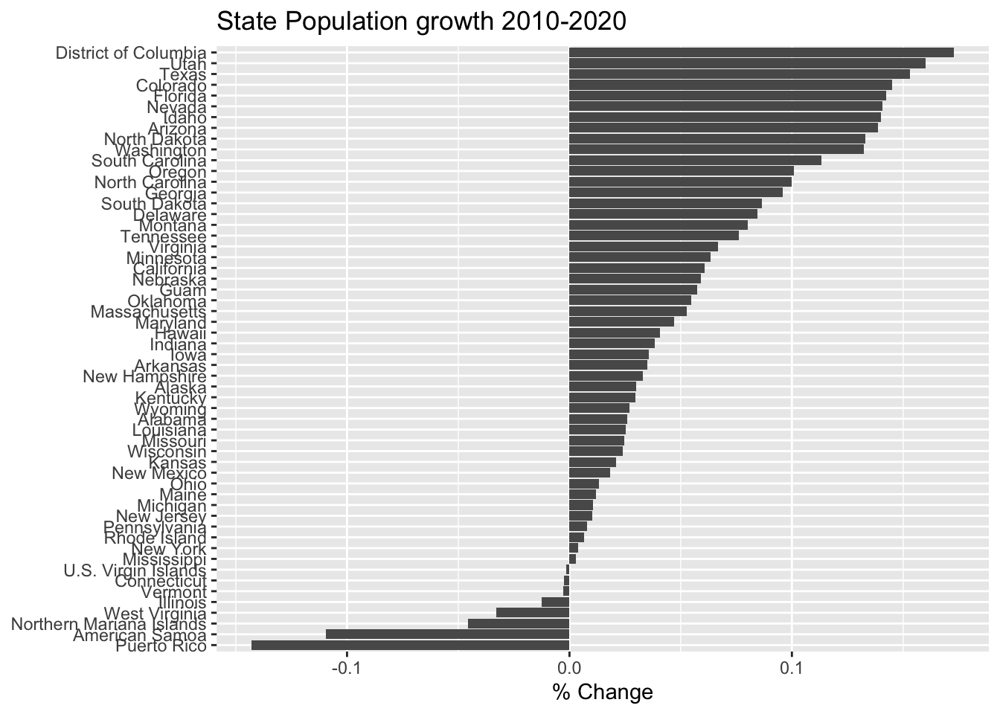


### Lists
Unfortunately, we don't always want to get information from a webpage that is nicely organized into a table. Suppose we want to gather the most recent threads on [Digg](www.digg.com).

We could sift through the HTML tags to find something that will match, but that will be challenging.  Instead we will use a CSS selector named [SelectorGadget](https://selectorgadget.com). Install the bookmarklet by dragging the following javascript code  [SelectorGadge](javascript:(function(){var%20s=document.createElement('div');s.innerHTML='Loading...';s.style.color='black';s.style.padding='20px';s.style.position='fixed';s.style.zIndex='9999';s.style.fontSize='3.0em';s.style.border='2px%20solid%20black';s.style.right='40px';s.style.top='40px';s.setAttribute('class','selector_gadget_loading');s.style.background='white';document.body.appendChild(s);s=document.createElement('script');s.setAttribute('type','text/javascript');s.setAttribute('src','https://dv0akt2986vzh.cloudfront.net/unstable/lib/selectorgadget.js');document.body.appendChild(s);})();) 
up to your browser's bookmark bar.  When you are at the site you are interested in, just click on the SelectorGadget javascript bookmarklet to engage the CSS engine. Click on something you want to capture. This will highlight a whole bunch of things that match the HTML tag listed at the bottom of the screen. Select or deselect items by clicking on them and the search string used to refine the selection will be updated. Once you are happy with the items being selected, copy the HTML node selector. Things highlighted in green are things you clicked on to select, stuff in yellow is content selected by the current html tags, and things in red are things you chose to NOT select.


```r
url <- 'http://digg.com'
page <- read_html(url)
```


```r
# Once the page is downloaded, we use the SelectorGadget Parse string
# To just give the headlines, we'll use html_text()
HeadLines <- page %>%
  html_nodes('.headline a') %>%    # Grab just the headlines
  html_text()                      # Convert the <a>Text</a> to just Text
HeadLines %>%
  head()
```

```
## [1] "\nJohn Boyega: 'I'm The Only Cast Member Whose Experience Of 'Star Wars' Was Based On Their Race'\n"
## [2] "\nThe Secret High-Risk World Of Ultra-Orthodox Jewish Porn\n"                                       
## [3] "\nWatch David Blaine Soar 18,000 Feet Into The Sky Using Nothing But Helium Balloons\n"             
## [4] "\nQuickly Collect Signatures. Anywhere And On Any Device.\n"                                        
## [5] "\nMan Takes A Hilariously Bold Stand Against 'Boneless Chicken Wings' During City Council Meeting\n"
## [6] "\nHere's What The Reviews Say About Christopher Nolan's Long-Awaited 'Tenet'\n"
```


```r
# Each headline is also a link.  I might want to harvest those as well
Links <- page %>%
  html_nodes('.headline a') %>%
  html_attr('href')  
Links %>%
  head()
```

```
## [1] "https://www.gq-magazine.co.uk/culture/article/john-boyega-interview-2020?utm_source=digg"     
## [2] "https://melmagazine.com/en-us/story/jewish-porn-frum-orthodox-nude-women-nsfw?utm_source=digg"
## [3] "/video/watch-david-blaine-ascension-live"                                                     
## [4] "https://digg.com/2019/picks-best-card-games?utm_source=digg"                                  
## [5] "/video/man-speaks-out-against-boneless-chicken-wings"                                         
## [6] "/2020/tenet-christopher-nolan-review-is-it-any-good"
```


## Scraping .pdf files
PDF documents can either be created with software that produce text that is readable, or it can be scanned and everything is effectively an image. The work flow presented in this section assumes that the text is readable as text and is not an image.


## Exercises  {#Exercises_WebScraping}
1. At the Insurance Institute for Highway Safety, they have
[data](https://www.iihs.org/topics/fatality-statistics/detail/state-by-state) 
about human fatalities in vehicle crashes. From this web page, import the data from the Fatal Crash Totals data table and produce a bar graph gives the number of deaths per 100,000 individuals.  

2. From the same IIHS website, import the data about seat belt use. Join the Fatality data with the seat belt use and make a scatter plot of seat belt use vs number of fatalities per 100,000 people.

3. From the [NAU sub-reddit](https://www.reddit.com/r/NAU), extract the most recent threads.


<!--chapter:end:36_Scraping.Rmd-->

# API Data Queries


```r
library(tidyverse)
library(censusapi)
library(jsonlite) 
library(tidycensus)
```

## Introduction

As usual, I have a YouTube [Video Lecture](https://youtu.be/BlWk25GI3HY) for the chapter.

With a standard database connection, there is quite a lot we can do. For example we could insert incorrect rows into tables, or even [delete whole tables](https://xkcd.com/327/). Many organizations that deliver data to clients require a way to minimize the types of data base actions that are allowed.  For example, consider Twitter. Twitter clients need to connect to the Twitter database, sign in, and download the latest tweets from whomever they follow and accept a database input that adds a tweet from the signed in user. However, the client must not be able to update or insert tweets from somebody else, and to prevent Denial-Of-Service attacks, there should be some limit to the number of rows of information that we ask for. Furthermore, the client shouldn't have to remember the details of how the data is stored and changes to the database configuration should be completely invisible to clients.

Application Program Interfaces (APIs) are the specification for how two programs will interface. An API that is well thought out and documented is wonderful to use. In a data query situation, the API will define how we submit a query and the manner in which the result will be returned. 

As the internet has become more sophisticated and companies have begun to understand the economics and risks associated with releasing their data, APIs have generally become more restrictive and [Tom Scott](https://www.youtube.com/watch?v=BxV14h0kFs0) has a great video about this change, titled "This Video Has XXX,XXX,XXX Views".


The US Census Bureau has a really nice Web Page interface to their data and arguable, these is the easiest way to get data from the Census Bureau.

The tool we'll be using next is still in beta version, so it might change, but using the search function at [https://data.census.gov/cedsci/](https://data.census.gov/cedsci/) we can search for whatever we want. For example we might be interested in the percent of residents that have health insurance and so we'll search for 'health insurance'.  Several tables show up and we can look through all of the results for a table that gives us what we'd like.  Note the table name!

From there we could customize the table and download it.


## Census Bureau API 

The US Census Bureau's API interface works by having users visit websites with extremely carfully craften URL strings. The following web links will cause a query on the Census web site, and then result in some data. Go ahead and click on these!

[http://api.census.gov/data/2018/pep/population?get=DATE_CODE,DATE_DESC,DENSITY,POP,GEONAME,STATE&for=state:*&DATE_CODE=1](http://api.census.gov/data/2018/pep/population?get=DATE_CODE,DATE_DESC,DENSITY,POP,GEONAME,STATE&for=state:*&DATE_CODE=1)


[http://api.census.gov/data/2018/pep/population?get=DATE_CODE,DATE_DESC,DENSITY,POP,GEONAME,STATE&in=state:01&for=county:*&DATE_CODE=1](http://api.census.gov/data/2018/pep/population?get=DATE_CODE,DATE_DESC,DENSITY,POP,GEONAME,STATE&in=state:01&for=county:*&DATE_CODE=1)

1. The base website is http://api.census.gov/data/2018/pep/population. This is effectively specifying which table we want to query from. The `pep` part stands for the *Population Estimation Program*, which is one division of the Census Bureau. The 2018 part of the base address defines the *vintage* of the estimate. This page will produce estimates for the years 2010-2018, but the Census Bureau is constantly updating those estimates based on new information. So the this is specifying that we are to use the Census' 2018 estimate of the population.
2. Modifiers are included after the `?` and different modifiers are separated by `&`
3. `get=` section defines the variables that you want 
4. The `for=state:*` denotes that we want all of the states. `for=state:01` would have been just Alabama. If we want all the county populations we can use `for=county:*`. If we just want county populations within a particular state, we would use `in=state:01&for=county:*`
5. The `DATE_CODE=1` indicates that I just want the first estimate in the decadal time series of estimates. If I didn't include this, we'd end up with estimates for each year between 2010 and 2018. 

When you go to this website, the database will read the modifier list, do the appropriate database query, and return the result via a webpage that has a very simple structure that is easy to parse into a table.

The hard part about Web APIs is understanding which tables are available and what each covariate means. For the US Census Bureau, the [developers](https://www.census.gov/data/developers/) page is a great place to start. 


## Package `censusapi`
While it is helpful to understand how the web API works, it would be nice to not have to worry about some of the fiddly aspects of parsing the result into a data frame. There are many R packages that provide a convenient interface to some database API. For our US Census Bureau example, we'll use the  R package `censusapi`. You should read the [documentation](https://github.com/hrecht/censusapi) as well. It looks like there is another package, `tidycensus` that might be even better.

The Census Bureau wants to identify which developers are accessing their data and you are required to sign up for a [Census Key](https://api.census.gov/data/key_signup.html). It is easy to give them your email and they'll email you a character string that you'll use for the rest of these examples.


```r
# I got a Census API key from https://api.census.gov/data/key_signup.html 
# and saved it as Census_API_Key in my .Rprofile file in my home directory. 
CENSUS_API_KEY = Sys.getenv('CENSUS_API_KEY')
 
# This query is the example query first given in the censusapi vignette.
censusapi::getCensus(name = "timeseries/healthins/sahie",
	vars = c("NAME", "IPRCAT", "IPR_DESC", "PCTUI_PT"),      # Define the gets=
	region = "state:01",                                     # Define the for=
	time = 2017,                                         
	key = CENSUS_API_KEY)
```

```
##   time state    NAME IPRCAT                IPR_DESC PCTUI_PT
## 1 2017    01 Alabama      0             All Incomes     11.0
## 2 2017    01 Alabama      1      <= 200% of Poverty     18.3
## 3 2017    01 Alabama      2      <= 250% of Poverty     17.3
## 4 2017    01 Alabama      3      <= 138% of Poverty     19.4
## 5 2017    01 Alabama      4      <= 400% of Poverty     14.5
## 6 2017    01 Alabama      5 138% to 400% of Poverty     11.5
```


This is now super easy to query the Census database, except that I have NO IDEA what API names (ie tables) are available and I have no clue what variables I just downloaded. We need to get a better sense of what data sets are available.

A good place to start is the [developer datasets](https://www.census.gov/data/developers/data-sets.html). In particular I'm interested in both county are municipality level population estimates over time as well as information from the American Community Survey (ACS).

### Population Estimates 
The Census Bureau's Population Estimation Program (PEP) is responsible for population estimates. On the [Census Population API page](https://www.census.gov/data/developers/data-sets/popest-popproj/popest.html), it looks like I need to use the `pep/population` tables. 


```r
# Code to grab county level population levels.
County_Populations <- getCensus(name = "pep/population",
  vars = c('STATE','COUNTY','GEONAME','DATE_CODE','DATE_DESC','POP'),
  vintage = '2018',
  regionin = 'state:04',  # Just Arizona, which is coded as 04. I don't know why...
  region = 'county:*',    # All the counties
  DATE_CODE=1,            # 2010, Leave this out to get each year 2010-2018
  key = CENSUS_API_KEY)   # If key is missing, it will look in System Environment 

County_Populations %>% head(6)  
```

```
##   state county STATE COUNTY                  GEONAME DATE_CODE
## 1    04    001    04    001   Apache County, Arizona         1
## 2    04    003    04    003  Cochise County, Arizona         1
## 3    04    005    04    005 Coconino County, Arizona         1
## 4    04    007    04    007     Gila County, Arizona         1
## 5    04    009    04    009   Graham County, Arizona         1
## 6    04    011    04    011 Greenlee County, Arizona         1
##                    DATE_DESC    POP DATE_CODE_1
## 1 4/1/2010 Census population  71518           1
## 2 4/1/2010 Census population 131346           1
## 3 4/1/2010 Census population 134421           1
## 4 4/1/2010 Census population  53597           1
## 5 4/1/2010 Census population  37220           1
## 6 4/1/2010 Census population   8437           1
```


I was looking for population divided up by Age and Sex and it took awhile to figure out that I want to use PEP's Demographic Characteristics Estimates by Age Groups tables `pep/charagegroups`. From there I looked at some of the examples and variables.


```r
County_Populations_by_AgeGender <- getCensus(name = "pep/charagegroups",
  vars = c('GEONAME','DATE_CODE','AGEGROUP','SEX','DATE_DESC','POP'),
  vintage = '2018',
  region = 'state:04', 
	key = CENSUS_API_KEY)

County_Populations_by_AgeGender %>% head(6)
```

```
##   state GEONAME DATE_CODE AGEGROUP SEX                  DATE_DESC     POP
## 1    04 Arizona         1        0   0 4/1/2010 Census population 6392017
## 2    04 Arizona         1        0   1 4/1/2010 Census population 3175823
## 3    04 Arizona         1        0   2 4/1/2010 Census population 3216194
## 4    04 Arizona         1        1   0 4/1/2010 Census population  455715
## 5    04 Arizona         1        1   1 4/1/2010 Census population  232562
## 6    04 Arizona         1        1   2 4/1/2010 Census population  223153
```

As I played around with it, it seems that I can grab Race and Sex information as well. But unfortunately the categories are numerically coded so somehow we have to figure out which are which. It looks like `SEX=0` is both but I have no idea which is men and which is women. Still looking at the [Census Population API page](https://www.census.gov/data/developers/data-sets/popest-popproj/popest.html) and following the link about the variables for demographic characteristics, we can click through each variable to see the .json file that defines the factor levels.

We can also import those into R directly

```r
# What variables are Available?
censusapi::listCensusMetadata(name='pep/charagegroups', vintage=2018)
```

```
##          name                             label          required predicateType
## 1   DATE_CODE                              Date default displayed           int
## 2      SUMLEV                     Summary Level              <NA>        string
## 3         SEX                               Sex default displayed           int
## 4       STATE                   State FIPS code              <NA>          <NA>
## 5     GEONAME All geo names seperated by commas              <NA>          <NA>
## 6    DIVISION              Census Division Code              <NA>           int
## 7      REGION              Census Regional Code              <NA>           int
## 8      GEO_ID        Geographic identifier code              <NA>        string
## 9         POP                        Population              <NA>          <NA>
## 10 LASTUPDATE                       Last Update              <NA>        string
## 11     NATION                            Nation              <NA>          <NA>
## 12   AGEGROUP                         Age Group default displayed           int
## 13       RACE                              Race default displayed           int
## 14  DATE_DESC        Description of DATE values              <NA>        string
## 15   UNIVERSE                          Universe              <NA>        string
## 16     COUNTY                  County FIPS code              <NA>          <NA>
## 17       HISP                   Hispanic Origin default displayed           int
##    group limit concept
## 1    N/A     0    <NA>
## 2    N/A     0    <NA>
## 3    N/A     0    <NA>
## 4    N/A     0    <NA>
## 5    N/A     0    <NA>
## 6    N/A     0    <NA>
## 7    N/A     0    <NA>
## 8    N/A     0    <NA>
## 9    N/A     0    <NA>
## 10   N/A     0    <NA>
## 11   N/A     0    <NA>
## 12   N/A     0    <NA>
## 13   N/A     0    <NA>
## 14   N/A     0    <NA>
## 15   N/A     0    <NA>
## 16   N/A     0    <NA>
## 17   N/A     0    <NA>
```

```r
# I can't figure out how to make the censusapi package import the factor levels. 
# So I'll just import the levels directly from the webpage .json file and then 
# clean it up into a nice data frame.
CensusFactorLevels <- function(name, vintage, variable){
  file <- str_c('https://api.census.gov/data/',vintage,'/',name,
                '/variables/',variable,'.json')
  Meta <- jsonlite::read_json(file) %>% 
    .[['values']] %>% .[['item']] %>% 
    unlist() %>% tibble::enframe() 
  colnames(Meta) <- c(variable, str_c(variable,'_DESC'))
  return(Meta)
}

CensusFactorLevels('pep/charagegroups', 2018, 'SEX') 
```

```
## # A tibble: 3 x 2
##   SEX   SEX_DESC  
##   <chr> <chr>     
## 1 0     Both Sexes
## 2 1     Male      
## 3 2     Female
```

```r
CensusFactorLevels('pep/charagegroups', 2018, 'RACE') 
```

```
## # A tibble: 12 x 2
##    RACE  RACE_DESC                                                         
##    <chr> <chr>                                                             
##  1 11    Native Hawaiian and Other Pacific Islander alone or in combination
##  2 10    Asian alone or in combination                                     
##  3 9     American Indian and Alaska Native alone or in combination         
##  4 8     Black alone or in combination                                     
##  5 7     White alone or in combination                                     
##  6 6     Two or more races                                                 
##  7 5     Native Hawaiian and Other Pacific Islander alone                  
##  8 4     Asian alone                                                       
##  9 3     American Indian and Alaska Native alone                           
## 10 2     Black alone                                                       
## 11 1     White alone                                                       
## 12 0     All races
```

```r
CensusFactorLevels('pep/charagegroups', 2018, 'AGEGROUP') 
```

```
## # A tibble: 32 x 2
##    AGEGROUP AGEGROUP_DESC    
##    <chr>    <chr>            
##  1 31       Median age       
##  2 30       15 to 44 years   
##  3 29       18 years and over
##  4 28       16 years and over
##  5 27       85 years and over
##  6 26       65 years and over
##  7 25       45 to 64 years   
##  8 24       25 to 44 years   
##  9 23       18 to 24 years   
## 10 22       18 to 64 years   
## # … with 22 more rows
```

Using these factor levels, we can add the description onto our county populations by AGE and SEX by simply doing some table joins.


```r
County_Populations_by_AgeGender %>%
  left_join(CensusFactorLevels('pep/charagegroups', 2018, 'SEX')) %>%
  left_join(CensusFactorLevels('pep/charagegroups', 2018, 'AGEGROUP')) %>%
  head(6)
```

```
## Joining, by = "SEX"
```

```
## Joining, by = "AGEGROUP"
```

```
##   state GEONAME DATE_CODE AGEGROUP SEX                  DATE_DESC     POP
## 1    04 Arizona         1        0   0 4/1/2010 Census population 6392017
## 2    04 Arizona         1        0   1 4/1/2010 Census population 3175823
## 3    04 Arizona         1        0   2 4/1/2010 Census population 3216194
## 4    04 Arizona         1        1   0 4/1/2010 Census population  455715
## 5    04 Arizona         1        1   1 4/1/2010 Census population  232562
## 6    04 Arizona         1        1   2 4/1/2010 Census population  223153
##     SEX_DESC    AGEGROUP_DESC
## 1 Both Sexes         All Ages
## 2       Male         All Ages
## 3     Female         All Ages
## 4 Both Sexes Age 0 to 4 years
## 5       Male Age 0 to 4 years
## 6     Female Age 0 to 4 years
```


## Package `tidycensus`
The `tidycensus` package is a little easier to work with. By default, `tidycensus` functions will look for the API Key in the System Environment.


```r
# The tidycensus package has a nice way of installing the 
# API key in your .Rprofile file. 
tidycensus::census_api_key('adoiYOURadsKEYmcvGOESsdljHERE', install=TRUE)
```

There are three major functions that will get used. The 

| Function  |    Description   |
|:---------:|:-------------------------|
|`get_estimates()` | Gives information from the Population Estimates Program. |
|`get_acs()`       | Gives information from the American Community Survey     |
|`load_variables()`| Gives the mapping between the variable code and the description |


For our first example, we'll grab the county population totals in Arizona broken down by sex and ethnicity. 


```r
AZ_County_Populations <- tidycensus::get_estimates(
  geography = "county",
  state=c('AZ'),  # leave this out for all state/county combinations
  product = "characteristics",
  breakdown = c('SEX','HISP'),
  breakdown_labels = TRUE)      # Give the variable labels, not the Census Variable code 

head(AZ_County_Populations)
```

```
## # A tibble: 6 x 5
##   GEOID NAME                   value SEX        HISP                 
##   <chr> <chr>                  <dbl> <chr>      <chr>                
## 1 04001 Apache County, Arizona 71818 Both sexes Both Hispanic Origins
## 2 04001 Apache County, Arizona 67228 Both sexes Non-Hispanic         
## 3 04001 Apache County, Arizona  4590 Both sexes Hispanic             
## 4 04001 Apache County, Arizona 35310 Male       Both Hispanic Origins
## 5 04001 Apache County, Arizona 32902 Male       Non-Hispanic         
## 6 04001 Apache County, Arizona  2408 Male       Hispanic
```


For our next example, we'll grab the number of people with or without Insurance in each state.

```r
# We want to get the Number of people with or without Insurance in each state
US_State_Health_Insurance <- 
  tidycensus::get_acs(
    table = 'B27003',        # Found the table from Census Website
    geography = "state",
    cache_table=TRUE)        # On multiple runs, don't ask Census Bureau over and over.
```

```
## Getting data from the 2014-2018 5-year ACS
```

```
## Loading ACS5 variables for 2018 from table B27003 and caching the dataset for faster future access.
```

```r
# Grab the Variable Names so we can convert from the variable codes
# to variable labels, i.e., something I can understand by reading.  
ACS_Variables <- tidycensus::load_variables(2018, 'acs1', cache = TRUE)
head(ACS_Variables)
```

```
## # A tibble: 6 x 3
##   name       label                           concept                            
##   <chr>      <chr>                           <chr>                              
## 1 B00001_001 Estimate!!Total                 UNWEIGHTED SAMPLE COUNT OF THE POP…
## 2 B00002_001 Estimate!!Total                 UNWEIGHTED SAMPLE HOUSING UNITS    
## 3 B01001_001 Estimate!!Total                 SEX BY AGE                         
## 4 B01001_002 Estimate!!Total!!Male           SEX BY AGE                         
## 5 B01001_003 Estimate!!Total!!Male!!Under 5… SEX BY AGE                         
## 6 B01001_004 Estimate!!Total!!Male!!5 to 9 … SEX BY AGE
```

```r
# Join the data with the readable variable names
US_State_Health_Insurance <- US_State_Health_Insurance %>%
  left_join( ACS_Variables, by=c('variable' = 'name') )

# Now for some cleaning
US_State_Health_Insurance %>%
  tidyr::separate(label, c('Estimate','Total','Gender','Age','Insurance'), sep ='!!') %>%
  tidyr::drop_na() %>%
  select(NAME, Gender, Age, Insurance, estimate, moe)
```

```
## Warning: Expected 5 pieces. Missing pieces filled with `NA` in 1092 rows [1, 2,
## 3, 6, 9, 12, 15, 18, 21, 24, 27, 30, 31, 34, 37, 40, 43, 46, 49, 52, ...].
```

```
## # A tibble: 1,872 x 6
##    NAME    Gender Age            Insurance            estimate   moe
##    <chr>   <chr>  <chr>          <chr>                   <dbl> <dbl>
##  1 Alabama Male   Under 6 years  With public coverage    88350  1955
##  2 Alabama Male   Under 6 years  No public coverage      89308  1894
##  3 Alabama Male   6 to 18 years  With public coverage   173031  2754
##  4 Alabama Male   6 to 18 years  No public coverage     241916  3076
##  5 Alabama Male   19 to 25 years With public coverage    20568  1165
##  6 Alabama Male   19 to 25 years No public coverage     209313  2169
##  7 Alabama Male   26 to 34 years With public coverage    30831  1350
##  8 Alabama Male   26 to 34 years No public coverage     229595  2077
##  9 Alabama Male   35 to 44 years With public coverage    32959  1429
## 10 Alabama Male   35 to 44 years No public coverage     244980  1613
## # … with 1,862 more rows
```


## Exercises  {#Exercises_APIs}

1. The Census Bureau is constantly running many different surveys and compiling the results. One of the most comprehensive and interesting of these is the [American Community Survey](https://www.census.gov/programs-surveys/acs/guidance.html). I'm interested in using the ACS to get information about educational attainment. Use the Census Bureau's Data  [search page](https://data.census.gov/cedsci/), find a table that gives you information about educational attainment. With this table information, use the `tidycensus` package to 
download the latest information about educational attainment. Create map or graph summarizing educational attainment in either counties in Arizona or across states within the US. Or if you are feeling ambitious, create a graph or graphs summarizing this across all counties in the US. *Perhaps you could break the educational level into high school, some college, bachelors, advanced degree. Then maybe make a map of counties/states colored by percent with BS or higher. Or maybe stacked barcharts ordered by percent BS or higher.*

2. Pick some API to investigate how to use. Utilizing your interests, pick an API and figure out how to use it.  Using the API, download some data and produce an interesting graphic. *Many government agencies have data API as well. For example, Centers for Disease Control mortality and disease information at the county level, the National Oceanic and Atmospheric Administration has weather data accessible. If you are a genomics person, the R interface to Kegg would be a fun choice. Many social media apps such as Twitter, Reddit, and  Facebook have APIs. Many municipalities are starting to create Open Data and some of them have web APIs. Explore your interests and see if there is an interface to that data!*

<!--chapter:end:37_WebAPIs.Rmd-->

# Databases


```r
library(tidyverse)
library(DBI)         # DataBase Interface Package
library(dbplyr)      # dplyr with databases!
```

There is a YouTube [Video Lecture](https://youtu.be/ElDmEwslJw0) for the chapter.

As our data grows larger and is being updated more frequently, we need to stop using static input files and instead learn to interact with databases. There are a many reasons for using a database, but these are my favorite:

1. Data Freshness. Because the database holds the definitive copy of the data, there isn't a problem of using a .csv file that is months (or years) old. That means my results are constantly being updated with new data.
2. No Local Storage. Because the data lives on the database, I don't have to occupy gigabytes of space on my laptop to hold an out-of-date copy of the data.
3. Database actions are atomic. Whenever I update the database, the action either happens or it doesn't and the database should never be left in an inconsistent state. This extremely important when processing financial transactions, for example.

Fortunately, reading information from a database instead of an in-memory table won't change our current work flow and superficially the change is trivial. However, the impact can be quite profound in the timeliness and re-usability of our work. 

The great people at Rstudio have created a [great website](https://db.rstudio.com/overview/) for using databases using their `dbplyr` package.

However, the package `dbplyr` is really only intended for *reading* from the data base and does not support *writing* to the data base. 

## Tutorial Set-Up

Databases should be run on a server that is ALWAYS on and available via an internet connection. To connect to a database, we'll need to know the internet address and be able to authenticate with a username/password combination.

To demonstrate how a database works, we unfortunately need to have a live database to connect to. In real situations this would already be done (probably by somebody else) and you would just need to install some DataBase Interface (DBI) package that will negotiate creating a connection between your R-session and the database.

However for this example, we need to start up a data base before we can start working with.


```r
# Normally, a database connection looks something like this:
con <- DBI::dbConnect(RMariaDB::MariaDB(), 
  host = "database.rstudio.com",
  user = "hadley",
  password = rstudioapi::askForPassword("Database password")
)

# For a Postgres database, it might look like this:
con <- DBI::dbConnect(dbDriver("PostgresSQL"), dbname = "postgres",
  host = "database.nau.edu", port = 5432,
  user = "dls354", 
  password = rstudioapi::askForPassword("Database password"))
```


```r
# For our little toy example, we'll use a database I'll create right now.
# Establish a connection
con <- DBI::dbConnect(RSQLite::SQLite(), dbname = ":memory:")
```

Our final step involves populating our new database with some data so that we can play with it. For this example, we'll go back to the credit card data example from the data reshaping chapter. I have it available on the book's GitHub data-raw directory.

```r
# Read in some data for the Credit Card example
stem <- 'https://raw.githubusercontent.com/dereksonderegger/444/master/data-raw/CreditCard'
stem <- '~/GitHub/444/data-raw/CreditCard'

Cards        <- read_csv(paste(stem, 'Cards.csv',        sep='_'), 
                         col_types = cols(CardID=col_character(),
                                          PersonID=col_character()))
Customers    <- read_csv(paste(stem, 'Customers.csv',    sep='_'),
                         col_types = cols(PersonID=col_character()))
Retailers    <- read_csv(paste(stem, 'Retailers.csv',    sep='_'),
                         col_types = cols(RetailID=col_character()))
Transactions <- read_csv(paste(stem, 'Transactions.csv', sep='_'),
                         col_types = cols(CardID=col_character(),
                                          RetailID=col_character()))

# Because the EXTREMELY simple RSQLite database doesn't support dates natively,
# we need to convert all the Date/Time values to be character strings. Notice
# because they are sorted as Year-Month-Day Hour:Minute:Second, sorting will
# still work.
# convert the Dates to character strings 
Cards <- Cards %>% 
  mutate(Issue_DateTime = as.character(Issue_DateTime),
         Exp_DateTime   = as.character(Exp_DateTime))
Transactions <- Transactions %>%
  mutate(DateTime = as.character(DateTime))
```

So that we remember what the data we are working with looks like:

```r
head(Customers)    # Key  is  PersonID
```

```
## # A tibble: 4 x 5
##   PersonID Name               Street             City      State
##   <chr>    <chr>              <chr>              <chr>     <chr>
## 1 1        Derek Sonderegger  231 River Run      Flagstaff AZ   
## 2 2        Aubrey Sonderegger 231 River Run      Flagstaff AZ   
## 3 3        Robert Buscaglia   754 Forest Heights Flagstaff AZ   
## 4 4        Roy St Laurent     845 Elk View       Flagstaff AZ
```

```r
head(Cards)        # Keys are PersonID and CardID  
```

```
## # A tibble: 5 x 4
##   CardID           PersonID Issue_DateTime      Exp_DateTime       
##   <chr>            <chr>    <chr>               <chr>              
## 1 9876768717278723 1        2019-09-20 00:00:00 2022-09-20 00:00:00
## 2 9876765798212987 2        2019-09-20 00:00:00 2019-10-15 16:28:21
## 3 9876765498122734 3        2019-09-28 00:00:00 2022-09-28 00:00:00
## 4 9876768965231926 4        2019-09-30 00:00:00 2022-09-30 00:00:00
## 5 9876765798212988 2        2019-10-15 16:28:45 2022-10-15 00:00:00
```

```r
head(Transactions) # Keys are CardID and RetailID
```

```
## # A tibble: 6 x 4
##   CardID           RetailID DateTime            Amount
##   <chr>            <chr>    <chr>                <dbl>
## 1 9876768717278723 1        2019-10-01 08:31:23   5.68
## 2 9876765498122734 2        2019-10-01 12:45:45  25.7 
## 3 9876768717278723 1        2019-10-02 08:26:31   5.68
## 4 9876768717278723 1        2019-10-02 08:30:09   9.23
## 5 9876765798212987 3        2019-10-05 18:58:57  68.5 
## 6 9876765498122734 2        2019-10-05 12:39:26  31.8
```

```r
head(Retailers)    # Key  is  RetailID
```

```
## # A tibble: 3 x 5
##   RetailID Name           Street             City      State
##   <chr>    <chr>          <chr>              <chr>     <chr>
## 1 1        Kickstand Kafe 719 N Humphreys St Flagstaff AZ   
## 2 2        MartAnnes      112 E Route 66     Flagstaff AZ   
## 3 3        REI            323 S Windsor Ln   Flagstaff AZ
```

Critically, using the ID columns, we can take an individual transaction figure out what customer executed it. Finally I'll take these tables and load them into my RSQLite database.


```r
# Copy the tables to our newly set up database. The dbWriteTable() function is intended
# for database examples and is NOT how you would in practice create a database.
DBI::dbWriteTable(con, 'Cards', Cards,
                  field.types=c(CardID='character',PersonID='character',
                                Issue_DateTime='time',Exp_DateTime='time') )
DBI::dbWriteTable(con, 'Customers', Customers,
                  field.types=c(PersonID='character'))
DBI::dbWriteTable(con, 'Retailers', Retailers,
                  field.types=c(RetailID='character'))
DBI::dbWriteTable(con, 'Transactions', Transactions,
                  field.types=c(CardID='character', RetailID='character',
                                DateTime='time'))

rm(Cards, Customers, Retailers, Transactions)     # Remove all the setup except `con`
```


## SQL

The traditional way to interact with a database is by using SQL syntax. SQL stands for Structured Query Language and some understanding of SQL is mandatory for anyone that interacts with databases.  There are many good introduction to SQL but we'll cover a few basics here.

To begin, lets run a simple SQL query.


```r
sql_cmd <- 'SELECT * FROM Transactions'
transactions <- DBI::dbGetQuery(con, sql_cmd)
transactions
```

```
##             CardID RetailID            DateTime Amount
## 1 9876768717278723        1 2019-10-01 08:31:23   5.68
## 2 9876765498122734        2 2019-10-01 12:45:45  25.67
## 3 9876768717278723        1 2019-10-02 08:26:31   5.68
## 4 9876768717278723        1 2019-10-02 08:30:09   9.23
## 5 9876765798212987        3 2019-10-05 18:58:57  68.54
## 6 9876765498122734        2 2019-10-05 12:39:26  31.84
## 7 9876768965231926        2 2019-10-10 19:02:20  42.83
## 8 9876765798212988        1 2019-10-16 14:30:21   4.98
```

We can examine the SQL command as follows:

|  SQL Function    |  Description                                |
|:----------------:|:--------------------------------------------|
| `SELECT`         |  A keyword that denotes that the following is a *query*. |
|  `*`             | A placeholder meaning all columns. This could be any column name(s). |
| `FROM`           | A keyword indicating that whatever follows is the table (or tables) being selected from. Any table joins need to be constrained in the WHERE clause to tell us what columns need to match.  |
| `WHERE`          | A keyword indicating the following logical statements will be used to filter rows. Boolean operators `AND`, `OR`, and `NOT` can be used to create complex filter statements. |


There is a way to insert a SQL code chunk and have it appropriately run when knitting the document together. I don't really like that method because I've found it difficult to use while working with the Rmarkdown file interactively, so I generally don't recommend doing that.


Typical SQL statements can be quite long and sometimes difficult to read because the table join instructions are mixed in with the filtering instructions. For example, the following is the SQL command to generate my credit card statement, and then saves the resulting table to the R object `DereksTransactions`.


```r
# given some other R object that specifies part of the SQL command, I can 
# generate the full SQL command string by pasting the parts together
customer = "'Derek Sonderegger'"  # Notice the quotes inside so that there are
                                  # quotes surrounding the name inside the SQL

sql_cmd <- paste('
SELECT Customers.Name, Transactions.DateTime, Retailers.Name, Transactions.Amount
  FROM Customers, Cards, Transactions, Retailers
  WHERE Customers.PersonID = Cards.PersonID AND 
        Cards.CardID = Transactions.CardID AND
        Transactions.RetailID = Retailers.RetailID AND
        Customers.Name = ', customer) 

DereksTransactions <- DBI::dbGetQuery(con, sql_cmd)
DereksTransactions
```

```
##                Name            DateTime           Name Amount
## 1 Derek Sonderegger 2019-10-01 08:31:23 Kickstand Kafe   5.68
## 2 Derek Sonderegger 2019-10-02 08:26:31 Kickstand Kafe   5.68
## 3 Derek Sonderegger 2019-10-02 08:30:09 Kickstand Kafe   9.23
```


## `dbplyr`

There are a lot of good things about SQL, but for database queries, I would really like to pretend that the tables are in memory and use all of my favorite `dplyr` tools and pipelines. This would mean that I don't have to remember all the weird SQL syntax. However, the database interface `dbplyr` is ONLY intended for queries and NOT for updating or inserting rows into the tables.

The way this will work is that we will use the previously established database connection `con` to create a virtual link between the database table and some appropriately named R object.


```r
# connect the database tables to similarly named objects in R
Cards <-        tbl(con, 'Cards')
Customers <-    tbl(con, 'Customers')
Retailers <-    tbl(con, 'Retailers')
Transactions <- tbl(con, 'Transactions')
```

However, this does NOT download the whole table into R.  Instead it grabs only a couple of rows so that we can see the format. Notice that we don't know how many rows are in the Transactions table.

```r
Transactions %>% head(3)
```

```
## # Source:   lazy query [?? x 4]
## # Database: sqlite 3.30.1 [:memory:]
##   CardID           RetailID DateTime            Amount
##   <chr>            <chr>    <chr>                <dbl>
## 1 9876768717278723 1        2019-10-01 08:31:23   5.68
## 2 9876765498122734 2        2019-10-01 12:45:45  25.7 
## 3 9876768717278723 1        2019-10-02 08:26:31   5.68
```

```r
# Transactions %>% tail(3)  # not supported because we haven't yet downloaded much information.
```

The guiding principle of `dbplyr` is to delay as much work for as long as possible actually pulling the data from the database. The rational is that we spend a great deal of time figuring out what the query should look like and too often we write a query that accidentally downloads millions of lines of data and slows down our network connection. Instead `dbplyr` returns just the first few rows of whatever query we are working on until we finish the pipeline with a `collect()` command that will cause us to download ALL of the query results and save them as a local `data.frame`.


```r
CC_statement <- 
  Customers %>% 
  filter(Name == 'Derek Sonderegger') %>% select(PersonID) %>%
  left_join(Cards) %>% left_join(Transactions) %>% left_join(Retailers) %>%
  select(DateTime, Name, Amount) %>%
  rename(Retailer = Name) 

CC_statement
```

```
## # Source:   lazy query [?? x 3]
## # Database: sqlite 3.30.1 [:memory:]
##   DateTime            Retailer       Amount
##   <chr>               <chr>           <dbl>
## 1 2019-10-01 08:31:23 Kickstand Kafe   5.68
## 2 2019-10-02 08:26:31 Kickstand Kafe   5.68
## 3 2019-10-02 08:30:09 Kickstand Kafe   9.23
```

At this point, we *still* haven't downloaded all of the rows. Instead this is still a *lazy* query. To actually download everything, we'll pipe this into the `collect` function.


```r
CC_statement %>%
  collect()
```

```
## # A tibble: 3 x 3
##   DateTime            Retailer       Amount
##   <chr>               <chr>           <dbl>
## 1 2019-10-01 08:31:23 Kickstand Kafe   5.68
## 2 2019-10-02 08:26:31 Kickstand Kafe   5.68
## 3 2019-10-02 08:30:09 Kickstand Kafe   9.23
```


It can be fun to see what the SQL code that is being generated is.


```r
CC_statement %>% show_query()
```

```
## <SQL>
## SELECT `DateTime`, `Name` AS `Retailer`, `Amount`
## FROM (SELECT `LHS`.`PersonID` AS `PersonID`, `LHS`.`CardID` AS `CardID`, `LHS`.`Issue_DateTime` AS `Issue_DateTime`, `LHS`.`Exp_DateTime` AS `Exp_DateTime`, `LHS`.`RetailID` AS `RetailID`, `LHS`.`DateTime` AS `DateTime`, `LHS`.`Amount` AS `Amount`, `RHS`.`Name` AS `Name`, `RHS`.`Street` AS `Street`, `RHS`.`City` AS `City`, `RHS`.`State` AS `State`
## FROM (SELECT `LHS`.`PersonID` AS `PersonID`, `LHS`.`CardID` AS `CardID`, `LHS`.`Issue_DateTime` AS `Issue_DateTime`, `LHS`.`Exp_DateTime` AS `Exp_DateTime`, `RHS`.`RetailID` AS `RetailID`, `RHS`.`DateTime` AS `DateTime`, `RHS`.`Amount` AS `Amount`
## FROM (SELECT `LHS`.`PersonID` AS `PersonID`, `RHS`.`CardID` AS `CardID`, `RHS`.`Issue_DateTime` AS `Issue_DateTime`, `RHS`.`Exp_DateTime` AS `Exp_DateTime`
## FROM (SELECT `PersonID`
## FROM `Customers`
## WHERE (`Name` = 'Derek Sonderegger')) AS `LHS`
## LEFT JOIN `Cards` AS `RHS`
## ON (`LHS`.`PersonID` = `RHS`.`PersonID`)
## ) AS `LHS`
## LEFT JOIN `Transactions` AS `RHS`
## ON (`LHS`.`CardID` = `RHS`.`CardID`)
## ) AS `LHS`
## LEFT JOIN `Retailers` AS `RHS`
## ON (`LHS`.`RetailID` = `RHS`.`RetailID`)
## )
```

The algorithm used to convert my `dplyr` statement into a SQL statement doesn't mind nesting SQL statements and isn't the same as what I generated by hand, but it works.


The last step of a script should be to close the database connection.

```r
# Close our database connection when we are through...
dbDisconnect(con)
```

## Exercises {#Exercises_DataBases}
1. In this exercise, you'll create a database containing the `nycflights13` data. Make sure that you've already downloaded the `nycflights13` package.
    a. Create a SQLite database and connect to it using the following code: 
    
    ```r
    library(dplyr)
    
    # Start up a SQL-Lite database with the NYCFlights13 data pre-loaded
    # 
    ## This handy function to load up the nycflights13 dataset unfortunately
    ## causes an error when we try to close the connection.  I've submitted
    ## a bug report to Hadley. We'll see what happens.
    # con <- nycflights13_sqlite( )
    # 
    ## So instead we'll use this somewhat longer and more annoying startup
    ## set of code.
    con <- DBI::dbConnect(RSQLite::SQLite(), dbname = ":memory:")
    dplyr::copy_to(con, nycflights13::airlines, 'airlines')
    dplyr::copy_to(con, nycflights13::airports, 'airports')
    dplyr::copy_to(con, nycflights13::flights,  'flights')
    dplyr::copy_to(con, nycflights13::planes,   'planes')
    dplyr::copy_to(con, nycflights13::weather,  'weather')
    ```
    b. Through the `con` connection object, create links to the `flights` and `airlines` tables.
    c. From the `flights` table, summarize the percent of flights with a departure delayed by more than 10 minutes for each airline. Produce a table that gives the airline name (not the abbreviation) and the percent of flights that are late.
    d. Using the `dbDisconnect()` command to close the connection `con`. 
    
2. For this exercise, we'll start a SQLite database and see that the SQLite application stores the data in a very specialized file structure, which usually has a file extension of `.db` or `.sqlite`.
    a. Create the SQLite database file in your current working directory using the following:
    
    ```r
    con <- DBI::dbConnect(RSQLite::SQLite(), dbname = "TestSQLiteFile.db")
    
    # Create a table using the iris data
    dbCreateTable(con, 'IRIS', iris)
    dbListTables(con)
    dbDisconnect(con)
    ```
    b) Now check the files in your current working directory as there should now be a `TestSQLiteFile.db`. The SQLite file structure for data is extremely stable and works across platform types (Unix/Windows, 32/64 bit, big/little endian, etc).  As such, it is a good file type choice for storing lots of data in a compact format across different systems (e.g. applications that work on a mobile device vs a computer)


<!--chapter:end:38_Databases.Rmd-->

# Speeding up R


```r
library(microbenchmark)  # for measuring how long stuff takes

library(doMC)      # do multi-core stuff
library(foreach)   # parallelizable for loops

library(tidyverse) # dplyr, ggplot2, etc...

library(faraway)   # some examples
library(boot)
library(caret)
library(glmnet)
```

There is a YouTube [Video Lecture](https://youtu.be/XaoYfmPbxSA) for this chapter.

Eventually if you have large enough data sets, an R user eventually writes code that is slow to execute and needs to be sped up. This chapter tries to lay out common problems and bad habits and shows how to correct them.  However, the correctness and maintainability of code should take precedence over speed. Too often, misguided attempts to obtain efficient code results in an un-maintainable mess that is no faster that the initial code.

Hadley Wickham has a book aimed at advanced R user that describes many of the finer details about R. One section in the book describes his process for building fast, maintainable software projects and if you have the time, I highly suggest reading the on-line version, 
[Advanced R](http://adv-r.had.co.nz/Performance.html).

First we need some way of measuring how long our code took to run. For this we will use the package `microbenchmark`. The idea is that we want to evaluate two or three expressions that solve a problem.


```r
# The expressions can be as many lines as you'd like, enclosed by { }. 
# For a single line, you can skip the enclosing { }.
# 
# For evaluating large chunks of code, I like to 
# just wrap the code up in a function.
x <- runif(1000)  # x vector of 1000 numbers between 0 and 1.
microbenchmark(
  sqrt(x),         # First expression to compare
  x^(0.5)          # second expression to compare
) %>% print(digits=3)
```

```
## Unit: microseconds
##     expr   min   lq  mean median    uq   max neval cld
##  sqrt(x)  2.22  2.4  3.31   2.64  3.39  12.6   100  a 
##  x^(0.5) 24.72 25.6 31.95  26.01 32.89 131.4   100   b
```

What `microbenchmark` does is run the two expressions a number of times and then
produces the 5-number summary of those times. By running it multiple times (by 
default, 100 times), we 
account for the randomness associated with a operating system that is also running 
at the same time. Being good statisticians, the `cld` column stands for compact 
letter display and if the letters are different, there is a statistically 
significant difference in the timing. If we cause the `microbenchmark()` function to 
run more times (1000s or 100,000s times), we could eventually end up with the smallest
difference to be statistically significant, but I think we shouldn't complain about 
speed differences if a sample of 100 runs can't detect the difference.


## Faster for loops?
Often we need to perform some simple action repeatedly. It is natural to write 
a `for` loop to do the action and we wish to speed the up. In this first case, 
we will consider having to do the action millions of times and each chunk of 
computation within the `for` takes very little time.

Consider frame of 4 columns, and for each of $n$ rows, we wish to know which 
column has the largest value.


```r
make.data <- function(n){
  data <- data.frame(
    Norm  = rnorm(n, mean=5, sd=2),
    Pois  = rpois(n, lambda = 5),
    Gamma = rgamma(n, shape = 2, scale = 3),
    Exp   = rexp(n, rate = 1/5))
  return(data)
}

data <- make.data(6)
data
```

```
##       Norm Pois     Gamma       Exp
## 1 5.079136    7 0.7644054  2.780193
## 2 5.598038    5 7.7653753  1.231766
## 3 3.707923    2 8.6443491 11.591930
## 4 4.661450    7 1.7702589  1.181605
## 5 5.312595    3 5.2059087  9.864848
## 6 9.158192    6 7.9529147  1.590383
```

The way that you might first think about solving this problem is to write a for 
loop and, for each row, figure it out.


```r
f1 <- function( input ){
  output <- NULL
  for( i in 1:nrow(input) ){
    output[i] <- which.max( input[i,] )
  }
  return(output)
}
```

We might consider that there are two ways to return a value from a function 
(using the `return` function and just printing it). In fact, I've always heard 
that using the `return` statement is a touch slower.


```r
f2.noReturn <- function( input ){
  output <- NULL
  for( i in 1:nrow(input) ){
    output[i] <- which.max( input[i,] )
  }
  output
}
```


```r
data <- make.data(1000)
microbenchmark(
  f1(data),
  f2.noReturn(data)
) %>% print(digits=3)
```

```
## Unit: milliseconds
##               expr  min   lq mean median   uq max neval cld
##           f1(data) 43.9 46.6 52.9   49.2 52.8 176   100   a
##  f2.noReturn(data) 44.2 46.6 50.6   48.3 51.4 105   100   a
```

In fact, it looks like it is a touch slower, but not massively compared to the run-to-run variability. I prefer to use the `return` statement for readability, but if we agree have the last line of code in the function be whatever needs to be returned, readability isn't strongly effected.

We next consider whether it would be faster to allocate the output vector once we figure out the number of rows needed, or just build it on the fly?


```r
f3.AllocOutput <- function( input ){
  n <- nrow(input)
  output <- rep(NULL, n)
  for( i in 1:nrow(input) ){
    output[i] <- which.max( input[i,] )
  }
  return(output)
}
```


```r
data <- make.data(10000)   # Moderately large sample size
microbenchmark(
  f1(data),
  f3.AllocOutput(data)
) %>% print(digits=3)
```

```
## Unit: milliseconds
##                  expr min  lq mean median  uq  max neval cld
##              f1(data) 441 470  545    482 523 2484   100   a
##  f3.AllocOutput(data) 454 477  545    506 546 1440   100   a
```
There isn't a significant improvement allocating the size of output first. So given this, we shouldn't feel to bad being lazy and using `output <- NULL` to initialize things.

## Vectorizing loops
In general, `for` loops in R are very slow and we want to avoid them as much as possible. The `apply` family of functions can be quite helpful for applying a function to each row or column of a matrix or data.frame or to each element of a list.

To test this, instead of a `for` loop, we will use `apply`.

```r
f4.apply <- function( input ){
  output <- apply(input, 1, which.max)  # 1 = apply to rows
  return(output)
}
```


```r
microbenchmark(
  f1(data),
  f4.apply(data)
) %>% print(digits=3)
```

```
## Unit: microseconds
##            expr  min   lq mean median   uq   max neval
##        f1(data) 3638 4223 5169   4697 5506 10765   100
##  f4.apply(data)  282  340  478    391  516  2959   100
```

This is the type of speed up that matters.  We have a 10-fold speed up in execution time and particularly the maximum time has dropped impressively.

Unfortunately, I have always found the `apply` functions a little cumbersome and I prefer to use `dplyr` functions for readability. For this example, we'll compare summarizing each column by calculating the mean.

First for a small sample sized data:

```r
data <- make.data(1000)
microbenchmark(
  data %>% apply(2, mean),
  data %>% summarize_all(mean) 
) %>% print(digits=3)
```

```
## Unit: microseconds
##                          expr min  lq mean median   uq  max neval cld
##       data %>% apply(2, mean) 243 280  369    337  413  855   100  a 
##  data %>% summarize_all(mean) 724 915 1334   1192 1429 7023   100   b
```

Unfortunately `dplyr` is a lot slower than `apply` in this case. I wonder if the dynamics would change with a larger `n`?


```r
data <- make.data(1000000)
microbenchmark(
  data %>% apply(2, mean),
  data %>% summarize_all(mean) 
) %>% print(digits=3)
```

```
## Unit: milliseconds
##                          expr  min   lq  mean median    uq max neval cld
##       data %>% apply(2, mean) 67.1 81.1 151.9   97.0 190.5 677   100   b
##  data %>% summarize_all(mean)  9.6 11.1  16.9   12.9  18.8 123   100  a
```

```r
data %>% apply(2, mean)
```

```
##     Norm     Pois    Gamma      Exp 
## 5.000913 5.000311 6.007382 4.993895
```

```r
data %>% summarize_all(mean) 
```

```
##       Norm     Pois    Gamma      Exp
## 1 5.000913 5.000311 6.007382 4.993895
```

```r
f5.dplyr <- function( input ){
  input %>% 
    rowwise() %>%  # equivalent to group_by( each row )
    mutate( max.col=which.max(c(Norm, Pois, Gamma, Exp) ) ) %>%
    pull(max.col) %>%
    return()
}
```


What just happened? The package `dplyr` is designed to work well for large data sets, and utilizes a modified structure, called a `tibble`, which provides massive benefits for large tables, but at the small scale, the overhead of converting the `data.frame` to a `tibble` overwhelms any speed up.  But because the small sample case is already fast enough to not be noticeable, we don't really care about the small `n` case.


## Parallel Processing
Most modern computers have multiple computing cores, and can run muliple processes at the same time. Sometimes this means that you can run multiple programs and switch back and forth easily without lag, but we are now interested in using as many cores as possible to get our statistical calculations completed by using muliple processing cores at the same time. This is referred to as running the process "in parallel" and there are many tasks in modern statistical computing that are "embarrassingly easily parallelized". In particular bootstrapping and cross validation techniques are extremely easy to implement in a parallel fashion.

However, running commands in parallel incurs some overhead cost in set up computation, as well as all the message passing from core to core. For example, to have 5 cores all perform an analysis on a set of data, all 5 cores must have access to the data, and not overwrite any of it. So parallelizing code only makes sense if the individual steps that we pass to each core is of sufficient size that the overhead incurred is substantially less than the time to run the job.

We should think of executing code in parallel as having three major steps:
1. Tell R that there are multiple computing cores available and to set up a useable cluster to which we can pass jobs to.
2. Decide what 'computational chunk' should be sent to each core and distribute all necessary data, libraries, etc to each core.
3. Combine the results of each core back into a unified object.


## Parallel Aware Functions

There are many packages that address problems that are "embarrassingly easily parallelized" and they will happily work with multiple cores. Methods that rely on re-sampling certainly fit into this category.

The first step is letting R know it has access to multiple cores.  This is quite simple using the `doMC` package (aka the *do Multi-Core* package).

The registration of multiple cores is actually pretty easy.


```r
doMC::registerDoMC(cores = 2)  # my laptop only has two cores.
```


### `boot::boot`
Bootstrapping relies on re-sampling the dataset and calculating test statistics from each re-sample.  In R, the most common way to do this is using the package `boot` and we just need to tell the `boot` function, to use the multiple cores available. (Note, we have to have registered the cores first!) 


```r
# make the trees dataset a bit larger,
# just so the overhead cost isn't as large
# compared to the computation of the regression
# coefficients.
for(i in 1:4){
  trees <- rbind(trees, trees)
}

# define the model using the original sample data
model <- lm( Volume ~ Girth, data=trees)

# define a function that calculates the model parameters
# given an index of which data points to use.
my.fun <- function(df, index){
  model.star <- lm( Volume ~ Girth, data= trees[index,] )
  model.star$coefficients 
}

# the boot::boot() function has a parallel option we just need 
# to switch on
microbenchmark(
  serial   = boot::boot( trees, my.fun, R=1000 ),
  parallel = boot::boot( trees, my.fun, R=1000, 
                         parallel='multicore', ncpus=2 ) 
) %>% print(digits=3)
```

```
## Unit: milliseconds
##      expr min  lq mean median   uq  max neval cld
##    serial 829 898  985    931 1076 1554   100   b
##  parallel 629 653  759    675  739 1391   100  a
```

In this case, we had a bit of a speed up, but not a factor of 2.  This is due to the overhead of splitting the job across both cores.

### `caret::train`
The statistical learning package `caret` also handles all the work to do cross validation in a parallel computing environment.  The functions in `caret` have an option `allowParallel` which by default is TRUE, which controls if we should use all the cores. Assuming we have already registered the number of cores, then by default `caret` will use them all. 


```r
library(caret)

# Remember to register how many cores to use!
doMC::registerDoMC(cores = 2)  # my laptop only has two cores.

caret.model <- function(parallel){
  grid <- data.frame( 
    alpha  = 1,  # 1 => Lasso Regression
    lambda = exp(seq(-6, 1, length=50)))
  ctrl <- trainControl( 
    method='repeatedcv', number=5, repeats=4,  
    preProcOptions = c('center','scale'),
    allowParallel = parallel)
  model <- train( 
    lpsa ~ . -svi, data=prostate, method='glmnet',
    trControl=ctrl, 
    tuneGrid=grid, 
    lambda = grid$lambda )
  return(model)
}
  
# make the dataset a bit larger, just so the overhead
# of moving to multi-core doesn't overwhelm the benefits
# of using two processors. You should never do this
# in a real analysis!
data('prostate', package='faraway')
for( i in 1:7 ){
  prostate <- rbind(prostate,prostate)
}

microbenchmark(
  caret.model(parallel = FALSE),
  caret.model(parallel = TRUE )
) %>% print(digits=3)
```

```
## Unit: seconds
##                           expr  min   lq mean median   uq  max neval cld
##  caret.model(parallel = FALSE) 2.68 2.72 2.87   2.77 2.91 4.42   100   b
##   caret.model(parallel = TRUE) 1.98 2.05 2.19   2.09 2.20 3.94   100  a
```

Again, we saw only moderate gains by using both cores, however it didn't really cost us anything. Because the `caret` package by default allows parallel processing, it doesn't hurt to just load the `doMC` package and register the number of cores. Even in just the two core case, it is a good habit to get into so that when you port your code to a huge computer with many cores, the only thing to change is how many cores you have access to.


## Parallelizing `for` loops

One of the easiest ways to parallelize a `for` loop is using a package called `foreach`. This package was created by R-Revolutions company that was subsequently bought by Microsoft. They have a nice introduction to the package [here](https://docs.microsoft.com/en-us/machine-learning-server/r/how-to-revoscaler-distributed-computing-foreach). 


We will consider an example that is common in modern statistics. We will examine parallel computing utilizing a bootstrap example where we create bootstrap samples for calculating confidence intervals for regression coefficients.


```r
ggplot(trees, aes(x=Girth, y=Volume)) + geom_point() + geom_smooth(method='lm')
```

```
## `geom_smooth()` using formula 'y ~ x'
```

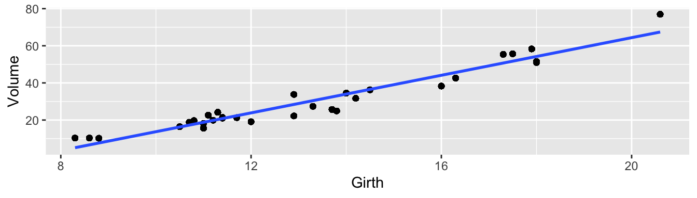

```r
model <- lm( Volume ~ Girth, data=trees)
```


This is how we would do this previously.

```r
# f is a formula
# df is the input data frame
# M is the number of bootstrap iterations
boot.for <- function( f, df, M=999){
  output <- list()
  for( i in 1:100 ){
    # Do stuff
    model.star <- lm( f, data=df %>% sample_frac(1, replace=TRUE) )
    output[[i]] <- model.star$coefficients 
  }

  # use rbind to put the list of results together into a data.frame
  output <- sapply(output, rbind) %>% t() %>% data.frame()
  return(output)
}
```

We will first ask about how to do the same thing using the function `foreach`

```r
# f is a formula
# df is the input data frame
# M is the number of bootstrap iterations
boot.foreach <- function(f, df, M=999){
  output <- foreach( i=1:100 ) %dopar% {
    # Do stuff
    model.star <- lm( f, data=df %>% sample_frac(1, replace=TRUE) )
    model.star$coefficients 
  }
  
  # use rbind to put the list of results together into a data.frame
  output <- sapply(output, rbind) %>% t() %>% data.frame()
  return(output)
}
```
Not much has changed in our code. Lets see which is faster.


```r
microbenchmark(
  boot.for( Volume~Girth, trees ),
  boot.foreach( Volume~Girth, trees )
) %>% print(digits=3)
```

```
## Unit: milliseconds
##                                 expr min  lq mean median  uq  max neval cld
##      boot.for(Volume ~ Girth, trees) 302 335  388    354 389  790   100   a
##  boot.foreach(Volume ~ Girth, trees) 272 327  406    338 393 1232   100   a
```
In this case, the overhead associated with splitting the job across two cores, copying the data over, and then combining the results back together was more than we saved by using both cores. If the nugget of computation within each pass of the `for` loop was larger, then it would pay to use both cores.


```r
# massiveTrees has 31000 observations
massiveTrees <- NULL
for( i in 1:1000 ){
  massiveTrees <- rbind(massiveTrees, trees)
}
microbenchmark(
  boot.for( Volume~Girth, massiveTrees )  ,
  boot.foreach( Volume~Girth, massiveTrees )
) %>% print(digits=3)
```

```
## Unit: seconds
##                                        expr  min    lq  mean median    uq  max
##      boot.for(Volume ~ Girth, massiveTrees) 14.2 14.87 15.35  15.21 15.58 21.3
##  boot.foreach(Volume ~ Girth, massiveTrees)  7.7  8.73  9.12   9.02  9.33 11.7
##  neval cld
##    100   b
##    100  a
```

Because we often generate a bunch of results that we want to see as a data.frame, the `foreach` function includes a `.combine` option which allows us to specify a function to do the combining.

```r
output <- foreach( i=1:1000, .combine=rbind ) %dopar% {
  # Do stuff
  model.star <- lm( Volume ~ Girth, data= trees %>% sample_frac(1, replace=TRUE) )
  model.star$coefficients %>% t() %>% as.data.frame()
}
```

It is important to recognize that the data.frame `trees` was utilized inside the `foreach` loop. So when we called the `foreach` loop and distributed the workload across the cores, it was smart enough to distribute the data to each core.  However, if there were functions that we utilized inside the for loop that came from a package, we need to tell each core to load the function.


```r
output <- foreach( i=1:1000, .combine=rbind, .packages='dplyr' ) %dopar% {
  # Do stuff
  model.star <- lm( Volume ~ Girth, data= trees %>% sample_frac(1, replace=TRUE) )
  model.star$coefficients %>% t() %>% as.data.frame()
}
```


<!--chapter:end:41_SpeedingUpR.Rmd-->

