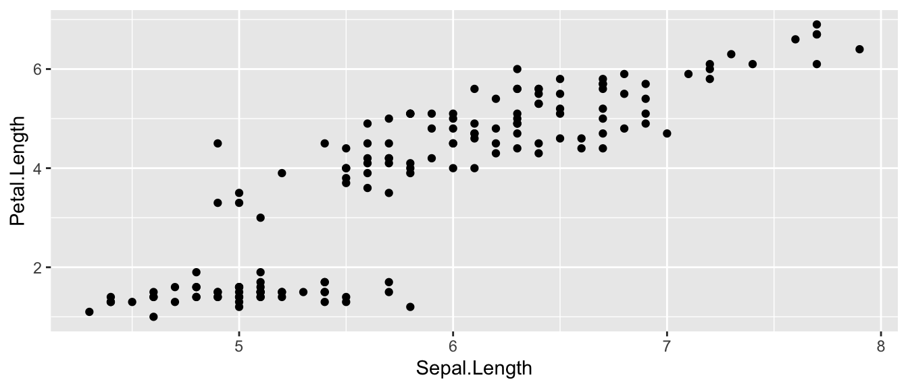
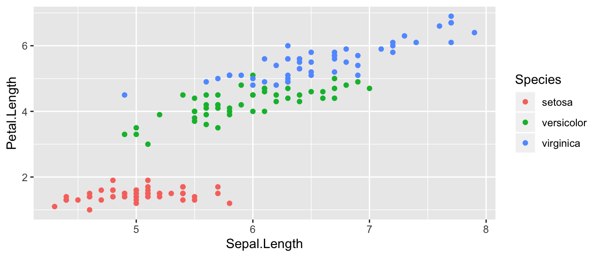
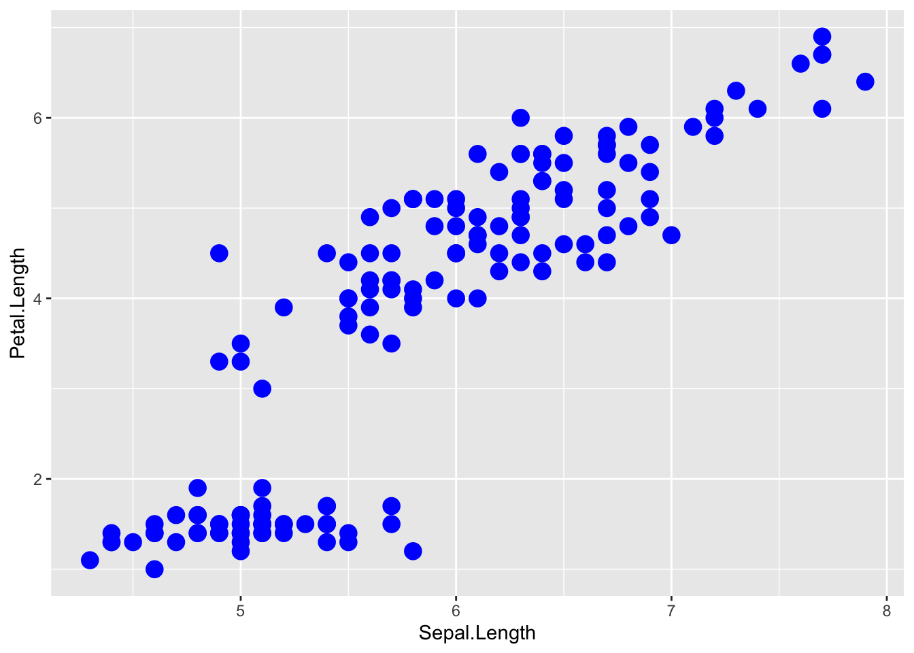
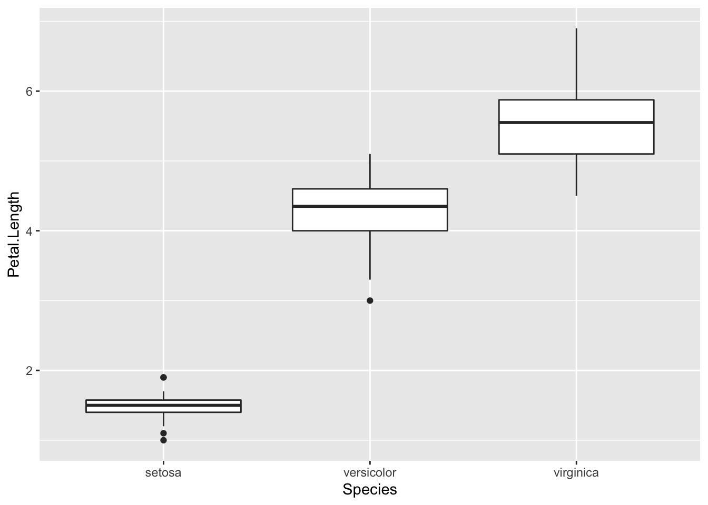
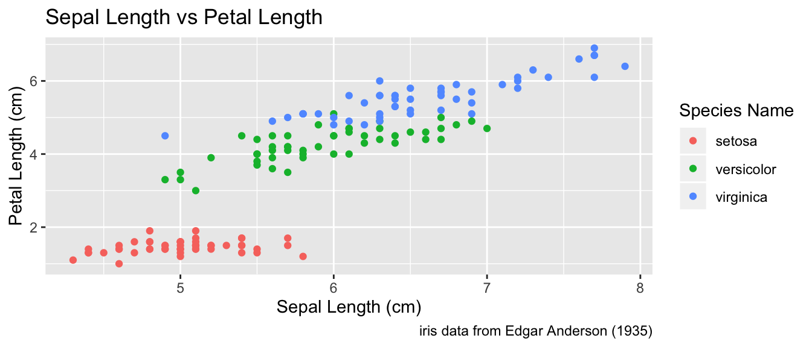
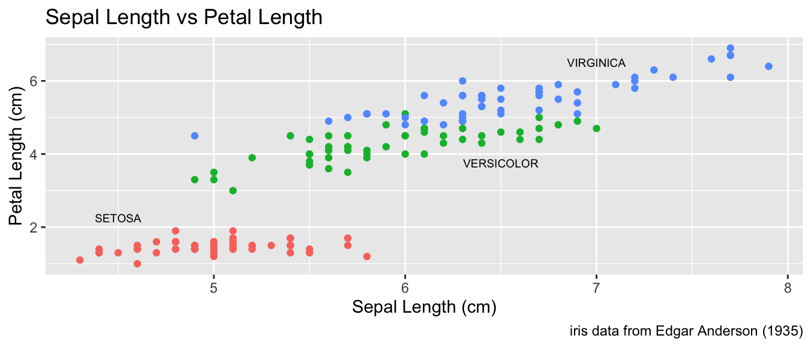
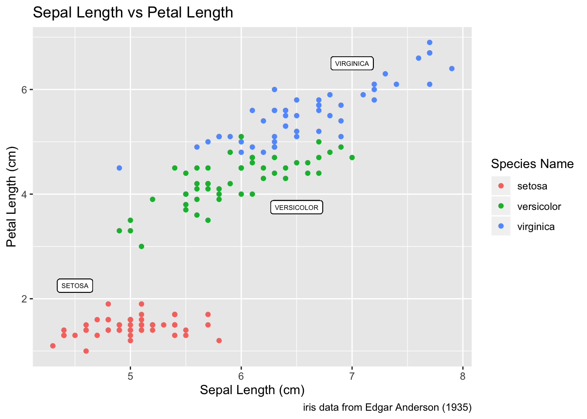
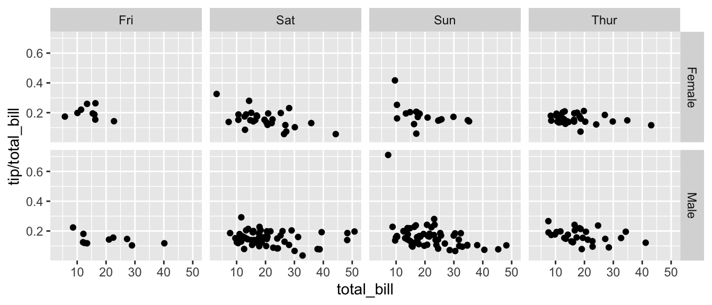
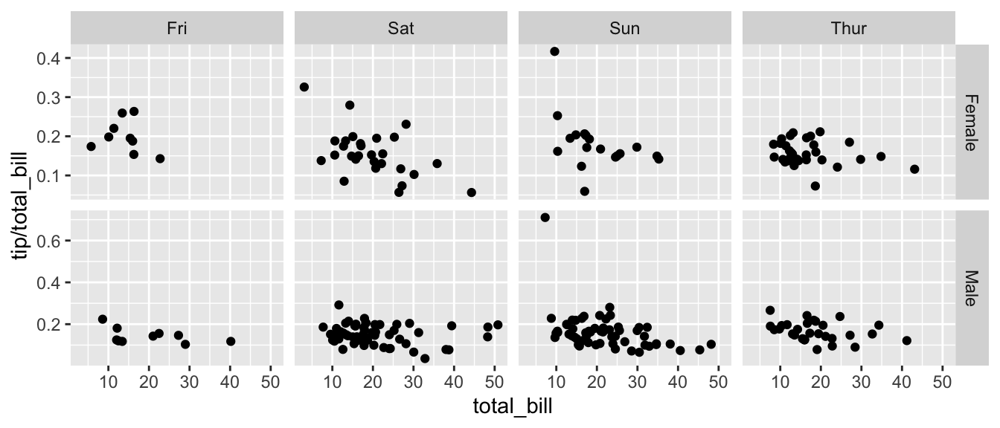
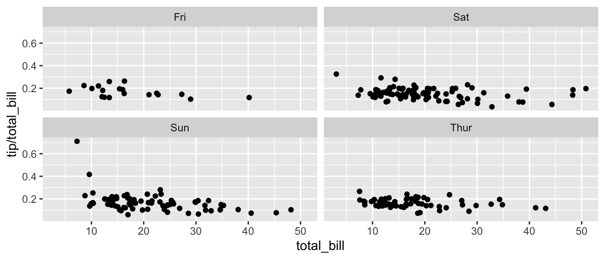

# Graphing


```r
library(tidyverse, quietly = TRUE)   # loading ggplot2 and dplyr
```

There are three major “systems” of making graphs in R. The basic plotting commands in R are quite effective but the commands do not have a way of being combined in easy ways. Lattice graphics (which the `mosaic` package uses) makes it possible to create some quite complicated graphs but it is very difficult to do make non-standard graphs. The last package, `ggplot2` tries to not anticipate what the user wants to do, but rather provide the mechanisms for pulling together different graphical concepts and the user gets to decide which elements to combine. 

To make the most of `ggplot2` it is important to wrap your mind around “The Grammar of Graphics”. Briefly, the act of building a graph can be broken down into three steps. 

1. Define what data set we are using. 

2. What is the major relationship we wish to examine? 

3. In what way should we present that relationship? These relationships can be presented in multiple ways, and the process of creating a good graph relies on building layers upon layers of information. For example, we might start with printing the raw data and then overlay a regression line over the top. 

Next, it should be noted that `ggplot2` is designed to act on data frames. It is actually hard to just draw three data points and for simple graphs it might be easier to use the base graphing system in R. However for any real data analysis project, the data will already be in a data frame and this is not an annoyance.

These notes are sufficient for creating simple graphs using `ggplot2`, but are not intended to be exhaustive. There are many places online to get help with `ggplot2`. One very nice resource is the website, [http://www.cookbook-r.com/Graphs/](http://www.cookbook-r.com/Graphs/), which gives much of the information available in the book R Graphics Cookbook which I highly recommend. Second is just googling your problems and see what you can find on websites such as StackExchange.

One way that `ggplot2` makes it easy to form very complicated graphs is that it provides a large number of basic building blocks that, when stacked upon each other, can produce extremely complicated graphs. A full list is available at [http://docs.ggplot2.org/current/](http://docs.ggplot2.org/current/) but the following list gives some idea of different building blocks. These different geometries are different ways to display the relationship between variables and can be combined in many interesting ways.

 Geom	             |    Description	                                    |   Required Aesthetics
-------------------|----------------------------------------------------|-----------------------
`geom_histogram`	 |  A histogram                                       |	`x`
`geom_bar`         |	A barplot                                         |	`x`
`geom_density`     |  A density plot of data. (smoothed histogram)      | `x`
`geom_boxplot`     | 	Boxplots                                          | `x, y`
`geom_line`	       |  Draw a line (after sorting x-values)	            | `x, y`
`geom_path`	       |  Draw a line (without sorting x-values)	          | `x, y`
`geom_point`	     |  Draw points (for a scatterplot)	                  | `x, y`
`geom_smooth`	     |  Add a ribbon that summarizes a scatterplot	      | `x, y`
`geom_ribbon`	     |  Enclose a region, and color the interior          |	`ymin, ymax`
`geom_errorbar`    |	Error bars	                                      | `ymin, ymax`
`geom_text`	       |  Add text to a graph	                              | `x, y, label`
`geom_label`	     |  Add text to a graph	                              | `x, y, label`
`geom_tile`        |  Create Heat map                                   | `x, y, fill`

A graph can be built up layer by layer, where:

* Each layer corresponds to a `geom`, each of which requires a dataset and a mapping between an aesthetic and a column of the data set.
    * If you don't specify either, then the layer inherits everything defined in the `ggplot()` command.
    * You can have different datasets for each layer!

* Layers can be added with a `+`, or you can define two plots and add them together (second one over-writes anything that conflicts).


## Basic Graphs


### Scatterplots

To start with, we'll make a very simple scatterplot using the `iris` dataset. The `iris` dataset contains observations on three species of iris plants where we've measured the length and width of both the petals and sepals.  We will make a scatterplot of `Sepal.Length` versus `Petal.Length`, which are two columns in the dataset.


```r
data(iris)  # load the iris dataset that comes with R
str(iris)   # what columns do we have to play with...
```

```
## 'data.frame':	150 obs. of  5 variables:
##  $ Sepal.Length: num  5.1 4.9 4.7 4.6 5 5.4 4.6 5 4.4 4.9 ...
##  $ Sepal.Width : num  3.5 3 3.2 3.1 3.6 3.9 3.4 3.4 2.9 3.1 ...
##  $ Petal.Length: num  1.4 1.4 1.3 1.5 1.4 1.7 1.4 1.5 1.4 1.5 ...
##  $ Petal.Width : num  0.2 0.2 0.2 0.2 0.2 0.4 0.3 0.2 0.2 0.1 ...
##  $ Species     : Factor w/ 3 levels "setosa","versicolor",..: 1 1 1 1 1 1 1 1 1 1 ...
```


```r
ggplot( data=iris, aes(x=Sepal.Length, y=Petal.Length) ) +  
	geom_point(  )
```



1. The data set we wish to use is specified using `data=iris`.

2. The relationship we want to explore is `x=Sepal.Length` and `y=Petal.Length`. This means the x-axis will be the Sepal Length and the y-axis will be the Petal Length.

3. The way we want to display this relationship is through graphing 1 point for every observation.

We can define other attributes that might reflect other aspects of the data. For example, we might want for the color of the data point to change dynamically based on the species of iris. 


```r
ggplot( data=iris, aes(x=Sepal.Length, y=Petal.Length, color=Species) ) +  
	geom_point(  )
```




The `aes()` command inside the previous section of code is quite mysterious. The way to think about the `aes()` is that it gives you a way to define relationships that are data dependent. In the previous graph, the x-value and y-value for each point was defined dynamically by the data, as was the color. If we just wanted all the data points to be colored blue and larger, then the following code would do that


```r
ggplot( data=iris, aes(x=Sepal.Length, y=Petal.Length) ) +  
	geom_point( color='blue', size=4 )
```




The important part isn't that color and size were defined in the `geom_point()` but that they were defined outside of an `aes()` function! 

1. Anything set inside an `aes()` command will be of the form `attribute=Column_Name` and will change based on the data.

2. Anything set outside an `aes()` command will be in the form `attribute=value` and will be fixed. 


### Box Plots 

Boxplots are a common way to show a categorical variable on the x-axis and continuous on the y-axis. 

```r
ggplot(iris, aes(x=Species, y=Petal.Length)) +
  geom_boxplot()
```



The boxes show the $25^{th}$, $50^{th}$, and $75^{th}$ percentile and the lines coming off the box extend to the smallest and largest non-outlier observation.  


## Labels

To make a graph more understandable, it is necessary to tweak labels for the axes and add a main title and such. Here we'll adjust labels in a graph, including the legend labels.

```r
# Treat the number of cylinders in a car as a categorical variable (4,6 or 8)
ggplot( data=iris, aes(x=Sepal.Length, y=Petal.Length, color=Species) ) +  
	geom_point(  ) +
  labs( title='Sepal Length vs Petal Length') +
  labs( x="Sepal Length (cm)", y="Petal Length (cm)" ) +
  labs( color="Species Name")     
```



You could either call the `labs()` command repeatedly with each label, or you could provide multiple arguements to just one `labs()` call.  


## Faceting

The goal with faceting is to make many panels of graphics where each panel represents the same relationship between variables, but something changes between each panel. For example using the `iris` dataset we could look at the relationship between `Sepal.Length` and `Petal.Length` either with all the data in one graph, or one panel per species.


```r
library(ggplot2)
ggplot(iris, aes(x=Sepal.Length, y=Petal.Length)) +
  geom_point() +
  facet_grid( . ~ Species )
```



The line `facet_grid( formula )` tells `ggplot2` to make panels, and the formula tells how to orient the panels. In R formulas are always interpretated in the order `y ~ x`. Because I want the species to change as we go across the page, but don't have anything I want to change vertically we use `. ~ Species` to represent that. If we had wanted three graphs stacked then we could use `Species ~ .`. 

For a second example, we look at a dataset that examines the amount a waiter was tipped by 244 parties. Covariates that were measured include the day of the week, size of the party, total amount of the bill, amount tipped, whether there were smokers in the group and the gender of the person paying the bill


```r
data(tips, package='reshape')
head(tips)
```

```
##   total_bill  tip    sex smoker day   time size
## 1      16.99 1.01 Female     No Sun Dinner    2
## 2      10.34 1.66   Male     No Sun Dinner    3
## 3      21.01 3.50   Male     No Sun Dinner    3
## 4      23.68 3.31   Male     No Sun Dinner    2
## 5      24.59 3.61 Female     No Sun Dinner    4
## 6      25.29 4.71   Male     No Sun Dinner    4
```

It is easy to look at the relationship between the size of the bill and the percent tipped.


```r
ggplot(tips, aes(x = total_bill, y = tip / total_bill )) +
  geom_point()
```



Next we ask if there is a difference in tipping percent based on gender or day of the week by plotting this relationship for each combination of gender and day.


```r
ggplot(tips, aes(x = total_bill, y = tip / total_bill )) +
  geom_point() +
  facet_grid( sex ~ day )
```



Sometimes we want multiple rows and columns of facets, but there is only one categorical variable with many levels. In that case we use facet_wrap which takes a one-sided formula.

```r
ggplot(tips, aes(x = total_bill, y = tip / total_bill )) +
  geom_point() +
  facet_wrap( ~ day )
```




Finally we can allow the x and y scales to vary between the panels by setting “free”, “free_x”, or “free_y”. In the following code, the y-axis scale changes between the gender groups.

```r
ggplot(tips, aes(x = total_bill, y = tip / total_bill )) +
  geom_point() +
  facet_grid( sex ~ day, scales="free_y" )
```




## Exercises

1. For the dataset `trees`, which should already be pre-loaded. Look at the help file using `?trees` for more information about this data set. We wish to build a scatterplot that compares the height and girth of these cherry trees to the volume of lumber that was produced.  
    
    a) Create a graph using ggplot2 with Height on the x-axis, Volume on the y-axis, and Girth as the either the size of the data point or the color of the data point. Which do you think is a more intuitive representation?
    b) Add appropriate labels for the main title and the x and y axes.
    
2. Consider the following small dataset that represents the number of times per day my wife played "Ring around the Rosy” with my daughter relative to the number of days since she has learned this game. The column `yhat` represents the best fitting line through the data, and `lwr` and `upr` represent a 95% confidence interval for the predicted value on that day.
    
    ```r
    Rosy <- data.frame(
      times = c(15, 11, 9, 12, 5, 2, 3),
      day   = 1:7,
      yhat  = c(14.36, 12.29, 10.21, 8.14, 6.07, 4.00,  1.93),
      lwr   = c( 9.54,  8.5,   7.22, 5.47, 3.08, 0.22, -2.89),
      upr   = c(19.18, 16.07, 13.2, 10.82, 9.06, 7.78,  6.75))
    ```
    
    a) Using `ggplot()` and `geom_point()`, create a scatterplot with `day` along the x-axis and `times` along the y-axis.
    
    b) Add a line to the graph where the x-values are the `day` values but now the y-values are the predicted values which we've called `yhat`. Notice that you have to set the aesthetic y=times for the points and y=yhat for the line. Because each `geom_` will accept an `aes()` command, you can specify the `y` attribute to be different for different layers of the graph.
    
    c) Add a ribbon that represents the confidence region of the regression line. The `geom_ribbon()` function requires an `x`, `ymin`, and `ymax` columns to be defined. For examples of using `geom_ribbon()` see the online documentation: [http://docs.ggplot2.org/current/geom_ribbon.html](http://docs.ggplot2.org/current/geom_ribbon.html).
        
        ```r
        ggplot(Rosy, aes(x=day)) +
          geom_point(aes(y=times)) +
          geom_line( aes(y=yhat)) +
          geom_ribbon( aes(ymin=lwr, ymax=upr), fill='salmon')
        ```
    d) What happened when you added the ribbon? Did some points get hidden? If so, why?
    e) Reorder the statements that created the graph so that the ribbon is on the bottom and the data points are on top and the regression line is visible.
    f) The color of the ribbon fill is ugly. Use Google to find a list of named colors available to `ggplot2`. For example, I googled “ggplot2 named colors” and found the following link: [http://sape.inf.usi.ch/quick-reference/ggplot2/colour](http://sape.inf.usi.ch/quick-reference/ggplot2/colour). Choose a color for the fill that is pleasing to you.
    g) Add labels for the x-axis and y-axis that are appropriate along with a main title.


3. We'll next make some density plots that relate several factors towards the birthweight of a child.
    a) The `MASS` package contains a dataset called `birthwt` which contains information about 189 babies and their mothers. In particular there are columns for the mother's race and smoking status during the pregnancy. Load the `birthwt` by either using the `data()` command or loading the `MASS` library. 
    b) Read the help file for the dataset using `MASS::birthwt`. The covariates `race` and `smoke` are not stored in a user friendly manner. For example, smoking status is labeled using a 0 or a 1. Because it is not obvious which should represent that the mother smoked, we'll add better labels to the `race` and `smoke` variables. For more information about dealing with factors and their levels, see the `Factors` chapter in these notes.
        
        ```r
        library(tidyverse)
        data('birthwt', package='MASS')
        birthwt <- birthwt %>% mutate(
          race  = factor(race,  labels=c('White','Black','Other')),
          smoke = factor(smoke, labels=c('No Smoke', 'Smoke')))
        ```
    c) Graph a histogram of the birthweights `bwt` using `ggplot(birthwt, aes(x=bwt)) + geom_histogram()`.
    d) Make separate graphs that denote whether a mother smoked during pregnancy by appending `+ facet_grid()` command to your original graphing command.
    e) Perhaps race matters in relation to smoking. Make our grid of graphs vary with smoking status changing vertically, and race changing horizontally (that is the formula in `facet_grid()` should have smoking be the y variable and race as the x).
    f) Remove `race` from the facet grid, (so go back to the graph you had in part d). I'd like to next add an estimated density line to the graphs, but to do that, I need to first change the y-axis to be density (instead of counts), which we do by using `aes(y=..density..)` in the `ggplot()` aesthetics command.
    g) Next we can add the estimated smooth density using the `geom_density()` command.
    h) To really make this look nice, lets change the fill color of the histograms to be something less dark, lets use `fill='cornsilk'` and `color='grey60'`. To play with different colors that have names, check out the following: [http://www.stat.columbia.edu/~tzheng/files/Rcolor.pdf].
    i) Change the order in which the histogram and the density line are added to the plot. Does it matter and which do you prefer?
    j) Finally consider if you should have the histograms side-by-side or one ontop of the other (i.e. `. ~ smoke` or `smoke ~ .`). Which do you think better displayes the decrease in mean birthweight and why?

4. Load the dataset `ChickWeight` which comes preloaded in R and get the background on the dataset by reading the manual page `?ChickWeight`. 
    a) Produce a separate scatter plot of weight vs age for each chick. Use color to distinguish the four different `Diet` treatments.
    b) We could examine this data by producing a scatterplot for each diet. Most of the code below is readable, but if we don't add the `group` aesthetic the lines would not connect the dots for each Chick but would instead connect the dots across different chicks.
        
        ```r
        data(ChickWeight)
        ggplot(ChickWeight, aes(x=Time, y=weight, group=Chick )) +
          geom_point() + geom_line() +
          facet_grid( ~ Diet) 
        ```
  

