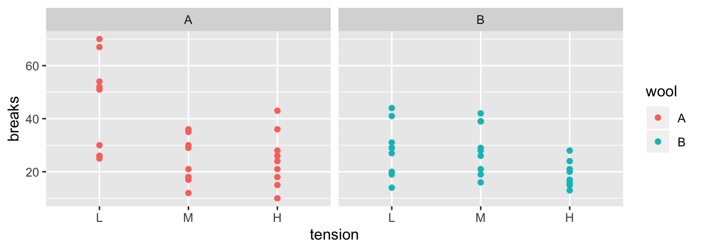

# Data Manipulation


```r
# library(tidyverse)   # Could load several of Dr Wickham's commonly used packages all at once.
library(dplyr)         # or just the one we'll use today.
```

Most of the time, our data is in the form of a data frame and we are interested in exploring the relationships. This chapter explores how to manipulate data frames and methods. 

## Classical functions for summarizing rows and columns

### `summary()`

The first method is to calculate some basic summary statistics (minimum, 25th, 50th, 75th percentiles, maximum and mean) of each column. If a column is categorical, the summary function will return the number of observations in each category.

```r
# use the iris data set which has both numerical and categorical variables
data( iris )
str(iris)    # recall what columns we have 
```

```
## 'data.frame':	150 obs. of  5 variables:
##  $ Sepal.Length: num  5.1 4.9 4.7 4.6 5 5.4 4.6 5 4.4 4.9 ...
##  $ Sepal.Width : num  3.5 3 3.2 3.1 3.6 3.9 3.4 3.4 2.9 3.1 ...
##  $ Petal.Length: num  1.4 1.4 1.3 1.5 1.4 1.7 1.4 1.5 1.4 1.5 ...
##  $ Petal.Width : num  0.2 0.2 0.2 0.2 0.2 0.4 0.3 0.2 0.2 0.1 ...
##  $ Species     : Factor w/ 3 levels "setosa","versicolor",..: 1 1 1 1 1 1 1 1 1 1 ...
```

```r
# display the summary for each column
summary( iris )
```

```
##   Sepal.Length    Sepal.Width     Petal.Length    Petal.Width   
##  Min.   :4.300   Min.   :2.000   Min.   :1.000   Min.   :0.100  
##  1st Qu.:5.100   1st Qu.:2.800   1st Qu.:1.600   1st Qu.:0.300  
##  Median :5.800   Median :3.000   Median :4.350   Median :1.300  
##  Mean   :5.843   Mean   :3.057   Mean   :3.758   Mean   :1.199  
##  3rd Qu.:6.400   3rd Qu.:3.300   3rd Qu.:5.100   3rd Qu.:1.800  
##  Max.   :7.900   Max.   :4.400   Max.   :6.900   Max.   :2.500  
##        Species  
##  setosa    :50  
##  versicolor:50  
##  virginica :50  
##                 
##                 
## 
```


### `apply()`

The summary function is convenient, but we want the ability to pick another function to apply to each column and possibly to each row. To demonstrate this, suppose we have data frame that contains students grades over the semester.

```r
# make up some data
grades <- data.frame(
  l.name = c('Cox', 'Dorian', 'Kelso', 'Turk'),
  Exam1 = c(93, 89, 80, 70),
  Exam2 = c(98, 70, 82, 85),
  Final = c(96, 85, 81, 92) )
```

The `apply()` function will apply an arbitrary function to each row (or column) of a matrix or a data frame and then aggregate the results into a vector.

```r
# Because I can't take the mean of the last names column,
# remove the name column
scores <- grades[,-1]
scores
```

```
##   Exam1 Exam2 Final
## 1    93    98    96
## 2    89    70    85
## 3    80    82    81
## 4    70    85    92
```

```r
# Summarize each column by calculating the mean.
apply( scores,      # what object do I want to apply the function to
       MARGIN=2,    # rows = 1, columns = 2, (same order as [rows, cols]
       FUN=mean     # what function do we want to apply     
     )
```

```
## Exam1 Exam2 Final 
## 83.00 83.75 88.50
```

To apply a function to the rows, we just change which margin we want. We might want to calculate the average exam score for person.

```r
apply( scores,      # what object do I want to apply the function to
       MARGIN=1,    # rows = 1, columns = 2, (same order as [rows, cols]
       FUN=mean     # what function do we want to apply
     )
```

```
## [1] 95.66667 81.33333 81.00000 82.33333
```

This is useful, but it would be more useful to concatenate this as a new column in my grades data frame.

```r
average <- apply( 
  scores,      # what object do I want to apply the function to
  MARGIN=1,    # rows = 1, columns = 2, (same order as [rows, cols]
  FUN=mean     # what function do we want to apply
)
grades <- cbind( grades, average ) # squish together 
grades
```

```
##   l.name Exam1 Exam2 Final  average
## 1    Cox    93    98    96 95.66667
## 2 Dorian    89    70    85 81.33333
## 3  Kelso    80    82    81 81.00000
## 4   Turk    70    85    92 82.33333
```

There are several variants of the `apply()` function, and the variant I use most often is the function `sapply()`, which will apply a function to each element of a list or vector and returns a corresponding list or vector of results. 

## Package `dplyr`

Many of the tools to manipulate data frames in R were written without a consistent syntax and are difficult use together. To remedy this, Hadley Wickham (the writer of `ggplot2`) introduced a package called plyr which was quite useful. As with many projects, his first version was good but not great and he introduced an improved version that works exclusively with data.frames called `dplyr` which we will investigate. The package `dplyr` strives to provide a convenient and consistent set of functions to handle the most common data frame manipulations and a mechanism for chaining these operations together to perform complex tasks. 

The Dr Wickham has put together a very nice introduction to the package that explains in more detail how the various pieces work and I encourage you to read it at some point. [http://cran.rstudio.com/web/packages/dplyr/vignettes/introduction.html].

One of the aspects about the `data.frame` object is that R does some simplification for you, but it does not do it in a consistent manner. Somewhat obnoxiously character strings are always converted to factors and subsetting might return a `data.frame` or a `vector` or a `scalar`.  This is fine at the command line, but can be problematic when programming. Furthermore, many operations are pretty slow using `data.frame`. To get around this, Dr Wickham introduced a modified version of the `data.frame` called a `tibble`. A `tibble` is a `data.frame` but with a few extra bits. For now we can ignore the differences.

The pipe command `%>%` allows for very readable code. The idea is that the `%>%` operator works by translating the command `a %>% f(b)` to the expression `f(a,b)`. This operator works on any function and was introduced in the `magrittr` package. The beauty of this comes when you have a suite of functions that takes input arguments of the same type as their output. 

For example, if we wanted to start with `x`, and first apply function `f()`, then `g()`, and then `h()`, the usual R command would be `h(g(f(x)))` which is hard to read because you have to start reading at the *innermost* set of parentheses. Using the pipe command `%>%`, this sequence of operations becomes `x %>% f() %>% g() %>% h()`.


|     Written         |  Meaning       |
|:-------------------:|:--------------:|
| `a %>% f(b)`        |   `f(a,b)`     |
| `b %>% f(a, .)`     |   `f(a, b)`    |
| `x %>% f() %>% g()` |  `g( f(x) )`   |

In `dplyr`, all the functions below take a _data set as its first argument_ and _outputs an appropriately modified data set_. This will allow me to chain together commands in a readable fashion. The pipe command works with any function, not just the `dplyr` functions and I often find myself using it all over the place.


### Verbs

The foundational operations to perform on a data set are:

* Subsetting - Returns a  with only particular columns or rows

    – `select` - Selecting a subset of columns by name or column number.

    – `filter` - Selecting a subset of rows from a data frame based on logical expressions.

    – `slice` - Selecting a subset of rows by row number.

* `arrange` - Re-ordering the rows of a data frame.

* `mutate` - Add a new column that is some function of other columns.

* `summarise` - calculate some summary statistic of a column of data. This collapses a set of rows into a single row.

Each of these operations is a function in the package `dplyr`. These functions all have a similar calling syntax, the first argument is a data set, subsequent arguments describe what to do with the input data frame and you can refer to the columns without using the `df$column` notation. All of these functions will return a data set.

#### Subsetting with `select`, `filter`, and `slice`

These function allows you select certain columns and rows of a data frame.

##### `select()`

Often you only want to work with a small number of columns of a data frame. It is relatively easy to do this using the standard `[,col.name]` notation, but is often pretty tedious. 

```r
# recall what the grades are
grades
```

```
##   l.name Exam1 Exam2 Final  average
## 1    Cox    93    98    96 95.66667
## 2 Dorian    89    70    85 81.33333
## 3  Kelso    80    82    81 81.00000
## 4   Turk    70    85    92 82.33333
```


I could select the columns Exam columns by hand, or by using an extension of the `:` operator

```r
# select( grades,  Exam1, Exam2 )   # select from `grades` columns Exam1, Exam2
grades %>% select( Exam1, Exam2 )   # Exam1 and Exam2
```

```
##   Exam1 Exam2
## 1    93    98
## 2    89    70
## 3    80    82
## 4    70    85
```

```r
grades %>% select( Exam1:Final )    # Columns Exam1 through Final
```

```
##   Exam1 Exam2 Final
## 1    93    98    96
## 2    89    70    85
## 3    80    82    81
## 4    70    85    92
```

```r
grades %>% select( -Exam1 )         # Negative indexing by name works
```

```
##   l.name Exam2 Final  average
## 1    Cox    98    96 95.66667
## 2 Dorian    70    85 81.33333
## 3  Kelso    82    81 81.00000
## 4   Turk    85    92 82.33333
```

```r
grades %>% select( 1:2 )            # Can select column by column position
```

```
##   l.name Exam1
## 1    Cox    93
## 2 Dorian    89
## 3  Kelso    80
## 4   Turk    70
```

The `select()` command has a few other tricks. There are functional calls that describe the columns you wish to select that take advantage of pattern matching. I generally can get by with `starts_with()`, `ends_with()`, and `contains()`, but there is a final operator `matches()` that takes a regular expression.

```r
grades %>% select( starts_with('Exam') )   # Exam1 and Exam2
```

```
##   Exam1 Exam2
## 1    93    98
## 2    89    70
## 3    80    82
## 4    70    85
```

The `dplyr::select` function is quite handy, but there are several other packages out there that have a `select` function and we can get into trouble with loading other packages with the same function names.  If I encounter the `select` function behaving in a weird manner or complaining about an input argument, my first remedy is to be explicit about it is the `dplyr::select()` function by appending the package name at the start. 

##### `filter()`

It is common to want to select particular rows where we have some logically expression to pick the rows. 

```r
# select students with Final grades greater than 90
grades %>% filter(Final > 90)
```

```
##   l.name Exam1 Exam2 Final  average
## 1    Cox    93    98    96 95.66667
## 2   Turk    70    85    92 82.33333
```

You can have multiple logical expressions to select rows and they will be logically combined so that only rows that satisfy all of the conditions are selected. The logicals are joined together using `&` (and) operator or the `|` (or) operator and you may explicitly use other logicals. For example a factor column type might be used to select rows where type is either one or two via the following: `type==1 | type==2`.

```r
# select students with Final grades above 90 and
# average score also above 90
grades %>% filter(Final > 90, average > 90)
```

```
##   l.name Exam1 Exam2 Final  average
## 1    Cox    93    98    96 95.66667
```

```r
# we could also use an "and" condition
grades %>% filter(Final > 90 & average > 90)
```

```
##   l.name Exam1 Exam2 Final  average
## 1    Cox    93    98    96 95.66667
```

##### `slice()`

When you want to filter rows based on row number, this is called slicing.

```r
# grab the first 2 rows
grades %>% slice(1:2)
```

```
##   l.name Exam1 Exam2 Final  average
## 1    Cox    93    98    96 95.66667
## 2 Dorian    89    70    85 81.33333
```

#### `arrange()`

We often need to re-order the rows of a data frame. For example, we might wish to take our grade book and sort the rows by the average score, or perhaps alphabetically. The `arrange()` function does exactly that. The first argument is the data frame to re-order, and the subsequent arguments are the columns to sort on. The order of the sorting column determines the precedent... the first sorting column is first used and the second sorting column is only used to break ties.

```r
grades %>% arrange(l.name)
```

```
##   l.name Exam1 Exam2 Final  average
## 1    Cox    93    98    96 95.66667
## 2 Dorian    89    70    85 81.33333
## 3  Kelso    80    82    81 81.00000
## 4   Turk    70    85    92 82.33333
```

The default sorting is in ascending order, so to sort the grades with the highest scoring person in the first row, we must tell arrange to do it in descending order using `desc(column.name)`.

```r
grades %>% arrange(desc(Final))
```

```
##   l.name Exam1 Exam2 Final  average
## 1    Cox    93    98    96 95.66667
## 2   Turk    70    85    92 82.33333
## 3 Dorian    89    70    85 81.33333
## 4  Kelso    80    82    81 81.00000
```

In a more complicated example, consider the following data and we want to order it first by Treatment Level and secondarily by the y-value. I want the Treatment level in the default ascending order (Low, Medium, High), but the y variable in descending order.

```r
# make some data
dd <- data.frame(
  Trt = factor(c("High", "Med", "High", "Low"),        
               levels = c("Low", "Med", "High")),
  y = c(8, 3, 9, 9),      
  z = c(1, 1, 1, 2)) 
dd
```

```
##    Trt y z
## 1 High 8 1
## 2  Med 3 1
## 3 High 9 1
## 4  Low 9 2
```

```r
# arrange the rows first by treatment, and then by y (y in descending order)
dd %>% arrange(Trt, desc(y))
```

```
##    Trt y z
## 1  Low 9 2
## 2  Med 3 1
## 3 High 9 1
## 4 High 8 1
```

#### mutate()

I often need to create a new column that is some function of the old columns. This was often cumbersome. Consider code to calculate the average grade in my grade book example.

```r
grades$average <- (grades$Exam1 + grades$Exam2 + grades$Final) / 3
```

Instead, we could use the `mutate()` function and avoid all the `grades$` nonsense. 

```r
grades %>% mutate( average = (Exam1 + Exam2 + Final)/3 )
```

```
##   l.name Exam1 Exam2 Final  average
## 1    Cox    93    98    96 95.66667
## 2 Dorian    89    70    85 81.33333
## 3  Kelso    80    82    81 81.00000
## 4   Turk    70    85    92 82.33333
```

You can do multiple calculations within the same `mutate()` command, and you can even refer to columns that were created in the same `mutate()` command.

```r
grades %>% mutate( 
  average = (Exam1 + Exam2 + Final)/3,
  grade = cut(average, c(0, 60, 70, 80, 90, 100),  # cut takes numeric variable
                       c( 'F','D','C','B','A')) )  # and makes a factor
```

```
##   l.name Exam1 Exam2 Final  average grade
## 1    Cox    93    98    96 95.66667     A
## 2 Dorian    89    70    85 81.33333     B
## 3  Kelso    80    82    81 81.00000     B
## 4   Turk    70    85    92 82.33333     B
```

We might look at this data frame and want to do some rounding. For example, I might want to take each numeric column and round it. In this case, the functions `mutate_at()` and `mutate_if()` allow us to apply a function to a particular column and save the output.


```r
# for each column, if it is numeric, apply the round() function to the column
# while using any additional arguments.  So round two digits.
grades %>%
  mutate_if( is.numeric, round, digits=2 )
```

```
##   l.name Exam1 Exam2 Final average
## 1    Cox    93    98    96   95.67
## 2 Dorian    89    70    85   81.33
## 3  Kelso    80    82    81   81.00
## 4   Turk    70    85    92   82.33
```

The `mutate_at()` function works similarly, but we just have to specify with columns.


```r
# round columns 2 through 5
grades %>%
  mutate_at( 2:5, round, digits=2 )
```

```
##   l.name Exam1 Exam2 Final average
## 1    Cox    93    98    96   95.67
## 2 Dorian    89    70    85   81.33
## 3  Kelso    80    82    81   81.00
## 4   Turk    70    85    92   82.33
```

```r
# round columns that start with "ave"
grades %>%
  mutate_at( vars(starts_with("ave")), round )
```

```
##   l.name Exam1 Exam2 Final average
## 1    Cox    93    98    96      96
## 2 Dorian    89    70    85      81
## 3  Kelso    80    82    81      81
## 4   Turk    70    85    92      82
```

```r
# These do not work because they doesn't evaluate to column indices.
# I can only hope that at some point, this syntax works
# 
# grades %>%
#   mutate_at( starts_with("ave"), round )
#    
# grades %>%
#   mutate_at( Exam1:average, round, digits=2 )
```

Another situation I often run into is the need to select many columns, and calculate a sum or mean across them. Unfortunately the natural _tidyverse_ way of doing this is a bit clumsy and I often resort to the following trick of using the base `apply()` function inside of a mutate command.  Remember the `.` represents the data frame passed into the `mutate` function, so in each line we grab the appropriate columns and then stuff the result into `apply` and assign the output of the apply function to the new column.

```r
grades %>%
  mutate( Exam.Total = select(., Exam1:Final) %>% apply(1, sum) ) %>%
  mutate( Exam.Avg   = select(., Exam1:Final) %>% apply(1, mean))
```

```
##   l.name Exam1 Exam2 Final  average Exam.Total Exam.Avg
## 1    Cox    93    98    96 95.66667        287 95.66667
## 2 Dorian    89    70    85 81.33333        244 81.33333
## 3  Kelso    80    82    81 81.00000        243 81.00000
## 4   Turk    70    85    92 82.33333        247 82.33333
```


#### summarise()

By itself, this function is quite boring, but will become useful later on. Its purpose is to calculate summary statistics using any or all of the data columns. Notice that we get to chose the name of the new column. The way to think about this is that we are collapsing information stored in multiple rows into a single row of values.

```r
# calculate the mean of exam 1
grades %>% summarise( mean.E1=mean(Exam1))
```

```
##   mean.E1
## 1      83
```

We could calculate multiple summary statistics if we like.

```r
# calculate the mean and standard deviation 
grades %>% summarise( mean.E1=mean(Exam1), stddev.E1=sd(Exam1) )
```

```
##   mean.E1 stddev.E1
## 1      83  10.23067
```

If we want to apply the same statistic to each column, we use the `summarise_all()` command. We have to be a little careful here because the function you use has to work on every column (that isn't part of the grouping structure (see `group_by()`)). There are two variants `summarize_at()` and `summarize_if()` that give you a bit more flexibility.

```r
# calculate the mean and stddev of each column - Cannot do this to Names!
grades %>% 
  select( Exam1:Final ) %>%
  summarise_all( funs(mean, sd) )
```

```
## Warning: funs() is soft deprecated as of dplyr 0.8.0
## Please use a list of either functions or lambdas: 
## 
##   # Simple named list: 
##   list(mean = mean, median = median)
## 
##   # Auto named with `tibble::lst()`: 
##   tibble::lst(mean, median)
## 
##   # Using lambdas
##   list(~ mean(., trim = .2), ~ median(., na.rm = TRUE))
## This warning is displayed once per session.
```

```
##   Exam1_mean Exam2_mean Final_mean Exam1_sd Exam2_sd Final_sd
## 1         83      83.75       88.5 10.23067     11.5 6.757712
```


```r
grades  %>%
  summarise_if(is.numeric, funs(Xbar=mean, SD=sd) )
```

```
##   Exam1_Xbar Exam2_Xbar Final_Xbar average_Xbar Exam1_SD Exam2_SD Final_SD
## 1         83      83.75       88.5     85.08333 10.23067     11.5 6.757712
##   average_SD
## 1   7.078266
```


#### Miscellaneous functions

There are some more function that are useful but aren't as commonly used. For sampling the functions `sample_n()` and `sample_frac()` will take a sub-sample of either n rows or of a fraction of the data set. The function `n()` returns the number of rows in the data set. Finally `rename()` will rename a selected column.

### Split, apply, combine

Aside from unifying the syntax behind the common operations, the major strength of the `dplyr` package is the ability to split a data frame into a bunch of sub-data frames, apply a sequence of one or more of the operations we just described, and then combine results back together. We'll consider data from an experiment from spinning wool into yarn. This experiment considered two different types of wool (A or B) and three different levels of tension on the thread. The response variable is the number of breaks in the resulting yarn. For each of the 6 `wool:tension` combinations, there are 9 replicated observations per `wool:tension` level.

```r
data(warpbreaks)
str(warpbreaks)
```

```
## 'data.frame':	54 obs. of  3 variables:
##  $ breaks : num  26 30 54 25 70 52 51 26 67 18 ...
##  $ wool   : Factor w/ 2 levels "A","B": 1 1 1 1 1 1 1 1 1 1 ...
##  $ tension: Factor w/ 3 levels "L","M","H": 1 1 1 1 1 1 1 1 1 2 ...
```



The first we must do is to create a data frame with additional information about how to break the data into sub-data frames. In this case, I want to break the data up into the 6 wool-by-tension combinations. Initially we will just figure out how many rows are in each wool-by-tension combination.

```r
# group_by:  what variable(s) shall we group on.
# n() is a function that returns how many rows are in the 
#   currently selected sub-dataframe
warpbreaks %>% 
  group_by( wool, tension) %>%    # grouping
  summarise(n = n() )             # how many in each group
```

```
## # A tibble: 6 x 3
## # Groups:   wool [2]
##   wool  tension     n
##   <fct> <fct>   <int>
## 1 A     L           9
## 2 A     M           9
## 3 A     H           9
## 4 B     L           9
## 5 B     M           9
## 6 B     H           9
```


The `group_by` function takes a data.frame and returns the same data.frame, but with some extra information so that any subsequent function acts on each unique combination defined in the `group_by`.  If you wish to remove this behavior, use `group_by()` to reset the grouping to have no grouping variable.

Using the same `summarise` function, we could calculate the group mean and standard deviation for each wool-by-tension group.

```r
warpbreaks %>% 
  group_by(wool, tension) %>%
  summarise( n           = n(),             # I added some formatting to show the
             mean.breaks = mean(breaks),    # reader I am calculating several
             sd.breaks   = sd(breaks))      # statistics.
```

```
## # A tibble: 6 x 5
## # Groups:   wool [2]
##   wool  tension     n mean.breaks sd.breaks
##   <fct> <fct>   <int>       <dbl>     <dbl>
## 1 A     L           9        44.6     18.1 
## 2 A     M           9        24        8.66
## 3 A     H           9        24.6     10.3 
## 4 B     L           9        28.2      9.86
## 5 B     M           9        28.8      9.43
## 6 B     H           9        18.8      4.89
```

If instead of summarizing each split, we might want to just do some calculation and the output should have the same number of rows as the input data frame. In this case I'll tell `dplyr` that we are mutating the data frame instead of summarizing it. For example, suppose that I want to calculate the residual value $$e_{ijk}=y_{ijk}-\bar{y}_{ij\cdot}$$ where $\bar{y}_{ij\cdot}$ is the mean of each `wool:tension` combination.

```r
warpbreaks %>% 
   group_by(wool, tension) %>%                 # group by wool:tension
   mutate(resid = breaks - mean(breaks)) %>%   # mean(breaks) of the group!
   head(  )                                    # show the first couple of rows
```

```
## # A tibble: 6 x 4
## # Groups:   wool, tension [1]
##   breaks wool  tension  resid
##    <dbl> <fct> <fct>    <dbl>
## 1     26 A     L       -18.6 
## 2     30 A     L       -14.6 
## 3     54 A     L         9.44
## 4     25 A     L       -19.6 
## 5     70 A     L        25.4 
## 6     52 A     L         7.44
```


### Chaining commands together 
In the previous examples we have used the `%>%` operator to make the code more readable but to really appreciate this, we should examine the alternative.

Suppose we have the results of a small 5K race. The data given to us is in the order that the runners signed up but we want to calculate the results for each gender, calculate the placings, and the sort the data frame by gender and then place. We can think of this process as having three steps: 

1. Splitting 
2. Ranking 
3. Re-arranging.


```r
# input the initial data
race.results <- data.frame(
  name=c('Bob', 'Jeff', 'Rachel', 'Bonnie', 'Derek', 'April','Elise','David'),
  time=c(21.23, 19.51, 19.82, 23.45, 20.23, 24.22, 28.83, 15.73),
  gender=c('M','M','F','F','M','F','F','M'))
```

We could run all the commands together using the following code:

```r
arrange( 
  mutate(
    group_by( 
      race.results,         # using race.results
      gender),              # group by gender     
    place = rank( time )),  # mutate to calculate the place column
  gender, place)            # arrange the result by gender and place
```

```
## # A tibble: 8 x 4
## # Groups:   gender [2]
##   name    time gender place
##   <fct>  <dbl> <fct>  <dbl>
## 1 Rachel  19.8 F          1
## 2 Bonnie  23.4 F          2
## 3 April   24.2 F          3
## 4 Elise   28.8 F          4
## 5 David   15.7 M          1
## 6 Jeff    19.5 M          2
## 7 Derek   20.2 M          3
## 8 Bob     21.2 M          4
```
This is very difficult to read because you have to read the code *from the inside out*.

Another (and slightly more readable) way to complete our task is to save each intermediate step of our process and then use that in the next step:

```r
temp.df0 <- race.results %>% group_by( gender)
temp.df1 <- temp.df0 %>% mutate( place = rank(time) )
temp.df2 <- temp.df1 %>% arrange( gender, place )
```

It would be nice if I didn't have to save all these intermediate results because keeping track of temp1 and temp2 gets pretty annoying if I keep changing the order of how things or calculated or add/subtract steps. This is exactly what `%>%` does for me.


```r
race.results %>%
  group_by( gender ) %>%
  mutate( place = rank(time)) %>%
  arrange( gender, place )
```

```
## # A tibble: 8 x 4
## # Groups:   gender [2]
##   name    time gender place
##   <fct>  <dbl> <fct>  <dbl>
## 1 Rachel  19.8 F          1
## 2 Bonnie  23.4 F          2
## 3 April   24.2 F          3
## 4 Elise   28.8 F          4
## 5 David   15.7 M          1
## 6 Jeff    19.5 M          2
## 7 Derek   20.2 M          3
## 8 Bob     21.2 M          4
```


## Exercises

1. The dataset `ChickWeight` tracks the weights of 48 baby chickens (chicks) feed four different diets.
    a. Load the dataset using  
        
        ```r
        data(ChickWeight)
        ```
    b. Look at the help files for the description of the columns.
    c) Remove all the observations except for observations from day 10 or day 20.
    d) Calculate the mean and standard deviation of the chick weights for each diet group on days 10 and 20. 

2. The OpenIntro textbook on statistics includes a data set on body dimensions. 
    a) Load the file using 
        
        ```r
        Body <- read.csv('http://www.openintro.org/stat/data/bdims.csv')
        ```
    b) The column sex is coded as a 1 if the individual is male and 0 if female. This is a non-intuitive labeling system. Create a new column `sex.MF` that uses labels Male and Female. _Hint: recall either the `factor()` or `cut()` command!_
    c) The columns `wgt` and `hgt` measure weight and height in kilograms and centimeters (respectively). Use these to calculate the Body Mass Index (BMI) for each individual where 
    $$BMI=\frac{Weight\,(kg)}{\left[Height\,(m)\right]^{2}}$$ 
    d) Double check that your calculated BMI column is correct by examining the summary statistics of the column. BMI values should be between 18 to 40 or so.  Did you make an error in your calculation?  
    e) The function `cut` takes a vector of continuous numerical data and creates a factor based on your give cut-points. 
        
        ```r
        # Define a continuous vector to convert to a factor
        x <- 1:10
        
        # divide range of x into three groups of equal length
        cut(x, breaks=3)
        ```
        
        ```
        ##  [1] (0.991,4] (0.991,4] (0.991,4] (0.991,4] (4,7]     (4,7]     (4,7]    
        ##  [8] (7,10]    (7,10]    (7,10]   
        ## Levels: (0.991,4] (4,7] (7,10]
        ```
        
        ```r
        # divide x into four groups, where I specify all 5 break points 
        cut(x, breaks = c(0, 2.5, 5.0, 7.5, 10))
        ```
        
        ```
        ##  [1] (0,2.5]  (0,2.5]  (2.5,5]  (2.5,5]  (2.5,5]  (5,7.5]  (5,7.5] 
        ##  [8] (7.5,10] (7.5,10] (7.5,10]
        ## Levels: (0,2.5] (2.5,5] (5,7.5] (7.5,10]
        ```
        
        ```r
        # (0,2.5] (2.5,5] means 2.5 is included in first group
        # right=FALSE changes this to make 2.5 included in the second  
        
        # divide x into 3 groups, but give them a nicer
        # set of group names
        cut(x, breaks=3, labels=c('Low','Medium','High'))
        ```
        
        ```
        ##  [1] Low    Low    Low    Low    Medium Medium Medium High   High   High  
        ## Levels: Low Medium High
        ```
        Create a new column of in the data frame that divides the age into decades (10-19, 20-29, 30-39, etc). Notice the oldest person in the study is 67.
        
        ```r
        Body <- Body %>%
          mutate( Age.Grp = cut(age,
                                breaks=c(10,20,30,40,50,60,70),
                                right=FALSE))
        ```
    f) Find the average BMI for each Sex-by-Age combination.
    
    
