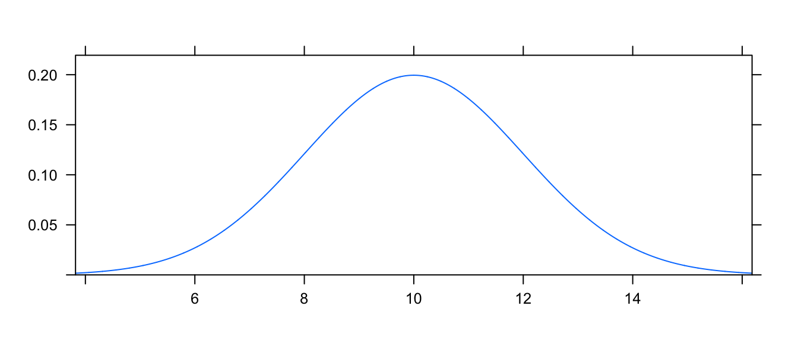
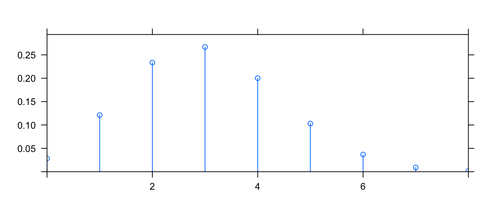
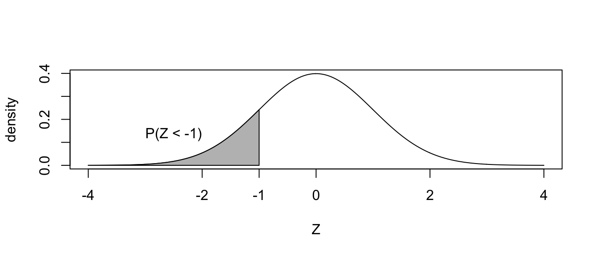
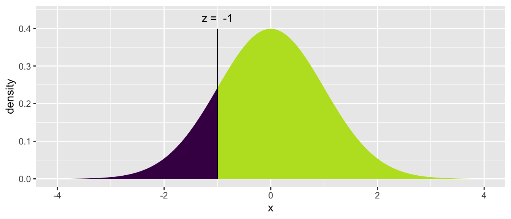
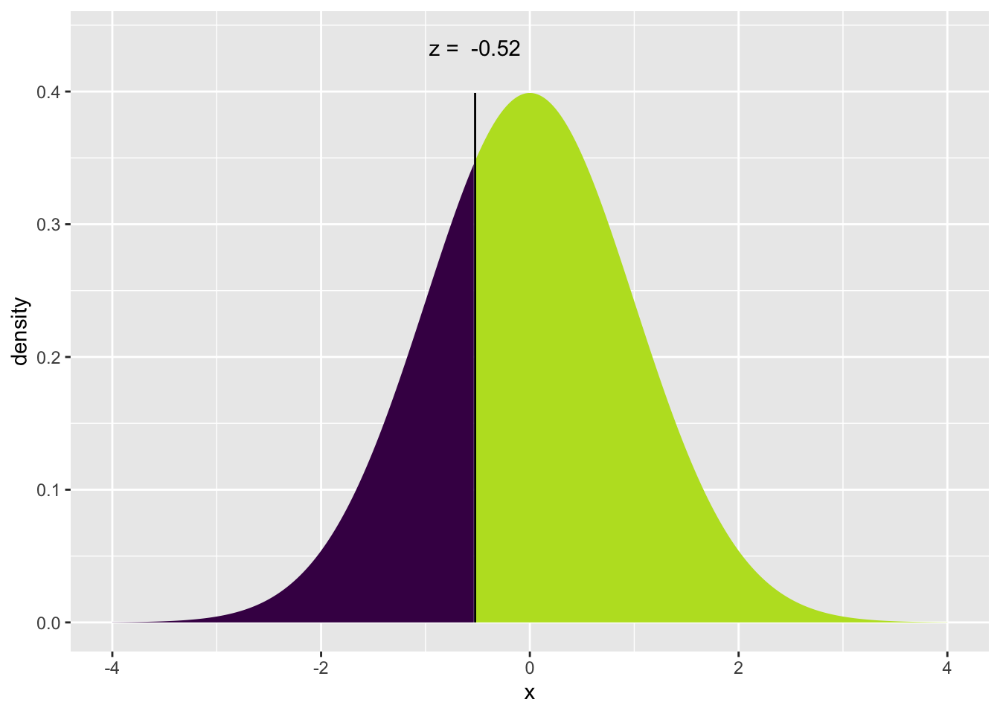

# (PART\*) Miscellaneous{-}

# Statistical Tables{-}


```r
library(tidyverse)
```

Statistics makes use of a wide variety of distributions and before the days of personal computers, every statistician had books with hundreds and hundreds of pages of tables allowing them to look up particular values. Fortunately in the modern age, we don't need those books and tables, but we do still need to access those values. To make life easier and consistent for R users, every distribution is accessed in the same manner. 

## Example Distributions{-}

+--------------+-------------+---------------+------------------------------------+
| Distribution |  R Stem     | Parameters    | Parameter Interpretation           |
+==============+=============+===============+====================================+
| Binomial     | `binom`     | `size` <br>   | Number of Trials                   |
|              |             | `prob`        | Probability of Success (per Trial) |
+--------------+-------------+---------------+------------------------------------+
| Exponential  | `exp`       | `rate`        | Mean of the distribution           |
+--------------+-------------+---------------+------------------------------------+
| Normal       | `norm`      | `mean=0`      | Center of the distribution         |
|              |             | `sd=1`        | Standard deviation                 |
+--------------+-------------+---------------+------------------------------------+
| Uniform      | `unif`      | `min=0`       | Minimum of the distribution        |
|              |             | `max=1`       | Maximum of the distribution        | 
+--------------+-------------+---------------+------------------------------------+
| t            | `t`         | `df`          | Degrees of freedom                 |
+--------------+-------------+---------------+------------------------------------+
| F            | `f`         | `df1`  <br>   | Numerator Degrees of freedom       |
|              |             | `df2`         | Denominator Degrees of freedom     |
+--------------+-------------+---------------+------------------------------------+


All of the functions in R to manipulate distributions have a similar naming scheme. They begin with a `d`,`p`,`q`, or `r` and then the stem of the distribution.  For example, I might use a function called `pnorm()`. The above table lists the most common distributions you might see in an introductory statistics course.

## `mosaic::plotDist()` function{-}

The `mosaic` package provides a very useful routine for understanding a distribution. The `plotDist()` function takes the R name of the distribution along with whatever parameters are necessary for that function and show the distribution. For reference below is a list of common distributions and their R name and a list of necessary parameters.

For example, to see the normal distribution with mean $\mu=10$ and standard deviation $\sigma=2$, we use

```r
mosaic::plotDist('norm', mean=10, sd=2)
```



This function works for discrete distributions as well.

```r
mosaic::plotDist('binom', size=10, prob=.3)
```




## Base R functions{-}

All the probability distributions available in R are accessed in exactly the same way, using a `d`-function, `p`-function, `q`-function, and `r`-function. For the rest of this section suppose that $X$ is a random variable from the distribution of interest and $x$ is some possible value that $X$ could take on. Notice that the `p`-function is the inverse of the `q`-function. 


+--------------------+-------------------------------------------------------------------+
| Function           |    Result                                                         |
+====================+===================================================================+
| `d`-function(x)    | The height of the probability distribution/density at given $x$   |
+--------------------+-------------------------------------------------------------------+
| `p`-function(x)    |  Probability less than or equal to `x`                            |
+--------------------+-------------------------------------------------------------------+
| `q`-function(q)    |  The `q` quantile of the distribution.                            |
+--------------------+-------------------------------------------------------------------+
| `r`-function(n)    |  Generate $n$ random observations from the distribution           |
+--------------------+-------------------------------------------------------------------+

For each distribution in R, there will be this set of functions but we replace the “-function” with the distribution name or a shortened version. `norm`, `exp`, `binom`, `t`, `f` are the names for the normal, exponential, binomial, T and F distributions. Furthermore, most distributions have additional parameters that define the distribution and will also be passed as arguments to these functions, although, if a reasonable default value for the parameter exists, there will be a default.

### d-function{-}

The purpose of the d-function is to calculate the height of a probability mass function or a density function (The “d” actually stands for density).  Notice that for discrete distributions, this is the probability of observing that particular value, while for continuous distributions, the height doesn't have a nice physical interpretation.

We start with an example of the Binomial distribution. For $X\sim Binomial\left(n=10,\pi=.2\right)$ suppose we wanted to know $P(X=0)$? We know the probability mass function is 
$$P\left(X=x\right)={n \choose x}\pi^{x}\left(1-\pi\right)^{n-x}$$ 
thus 
$$P\left(X=0\right)	=	{10 \choose 0}\,0.2^{0}\left(0.8\right)^{10} =	1\cdot1\cdot0.8^{10} \approx	0.107$$
but that calculation is fairly tedious. To get R to do the same calculation, we just need the height of the probability mass function at $0$. To do this calculation, we need to know the x
  value we are interested in along with the distribution parameters $n$
  and $\pi$.

The first thing we should do is check the help file for the binomial distribution functions to see what parameters are needed and what they are named.

```r
?dbinom
```

The help file shows us the parameters $n$ and $\pi$ are called size and prob respectively. So to calculate the probability that $X=0$ we would use the following command:

```r
dbinom(0, size=10, prob=.2)
```

```
## [1] 0.1073742
```


### p-function{-}

Often we are interested in the probability of observing some value or anything less (In probability theory, we call this the cumulative density function or CDF). P-values will be calculated this way, so we want a nice easy way to do this.

To start our example with the binomial distribution, again let $X\sim Binomial\left(n=10,\pi=0.2\right)$. Suppose I want to know what the probability of observing a 0, 1, or 2? That is, what is $P\left(X\le2\right)$? I could just find the probability of each and add them up.

```r
dbinom(0, size=10, prob=.2)   +       #   P(X==0) +
  dbinom(1, size=10, prob=.2) +       #     P(X==1) +
  dbinom(2, size=10, prob=.2)         #     P(X==2)
```

```
## [1] 0.6777995
```

but this would get tedious for binomial distributions with a large number of trials. The shortcut is to use the `pbinom()` function.

```r
pbinom(2, size=10, prob=.2)
```

```
## [1] 0.6777995
```

For discrete distributions, you must be careful because R will give you the probability of less than or equal to 2. If you wanted less than two, you should use `dbinom(1,10,.2)`. 

The normal distribution works similarly. Suppose for $Z\sim N\left(0,1\right)$
  and we wanted to know $P\left(Z\le-1\right)$? 


The answer is easily found via `pnorm()`. 

```r
pnorm(-1)
```

```
## [1] 0.1586553
```

Notice for continuous random variables, the probability $P\left(Z=-1\right)=0$ so we can ignore the issue of “less than” vs “less than or equal to”.

Often times we will want to know the probability of greater than some value. That is, we might want to find $P\left(Z \ge -1\right)$. For the normal distribution, there are a number of tricks we could use. Notably 
$$P\left(Z\ge-1\right)	=	P\left(Z\le1\right)=1-P\left(Z<-1\right)$$
but sometimes I'm lazy and would like to tell R to give me the area to the right instead of area to the left (which is the default). This can be done by setting the argument $lower.tail=FALSE$.

The `mosaic` package includes an augmented version of the `pnorm()` function called `xpnorm()` that calculates the same number but includes some extra information and produces a pretty graph to help us understand what we just calculated and do the tedious “1 minus” calculation to find the upper area. Fortunately this x-variant exists for the Normal, Chi-squared, F, Gamma continuous distributions and the discrete Poisson, Geometric, and Binomial distributions.


```r
mosaic::xpnorm(-1)
```

```
## 
```

```
## If X ~ N(0, 1), then
```

```
## 	P(X <= -1) = P(Z <= -1) = 0.1587
```

```
## 	P(X >  -1) = P(Z >  -1) = 0.8413
```

```
## 
```



```
## [1] 0.1586553
```


### `q`-function{-}

In class, we will also find ourselves asking for the quantiles of a distribution. Percentiles are by definition 1/100, 2/100, etc but if I am interested in something that isn't and even division of 100, we get fancy can call them quantiles. This is a small semantic quibble, but we ought to be precise. That being said, I won't correct somebody if they call these percentiles. For example, I might want to find the 0.30 quantile, which is the value such that 30\% of the distribution is less than it, and 70\% is greater. Mathematically, I wish to find the value $z$ such that $P(Z<z)=0.30$.

To find this value in the tables in a book, we use the table in reverse. R gives us a handy way to do this with the `qnorm()` function and the mosaic package provides a nice visualization using the augmented `xqnorm()`. 

Below, I specify that I'm using a function in the `mosaic` package by specifying it via `PackageName::FunctionName()` format because I haven't loaded the `mosaic` package because some of its functions conflict with `dplyr`. 


```r
mosaic::xqnorm(0.30)   # Give me the value along with a pretty picture
```

```
## 
```

```
## If X ~ N(0, 1), then
```

```
## 	P(X <= -0.5244005) = 0.3
```

```
## 	P(X >  -0.5244005) = 0.7
```

```
## 
```



```
## [1] -0.5244005
```

```r
qnorm(.30)             # No pretty picture, just the value
```

```
## [1] -0.5244005
```


### r-function{-}

Finally, I often want to be able to generate random data from a particular distribution. R does this with the r-function. The first argument to this function the number of random variables to draw and any remaining arguments are the parameters of the distribution.

```r
rnorm(5, mean=20, sd=2)
```

```
## [1] 19.48630 20.29895 20.30956 21.06535 16.38402
```

```r
rbinom(4, size=10, prob=.8)
```

```
## [1]  9  9 10 10
```


## Exercises{-}

1. We will examine how to use the probability mass functions (a.k.a. d-functions) and cumulative probability function (a.k.a. p-function) for the Poisson distribution.
    a) Create a graph of the distribution of a Poisson random variable with rate parameter $\lambda=2$ using the mosaic function `plotDist()`.
    b) Calculate the probability that a Poisson random variable (with rate parameter $\lambda=2$
 ) is exactly equal to 3 using the `dpois()` function. Be sure that this value matches the graphed distribution in part (a).
    c) For a Poisson random variable with rate parameter $\lambda=2$, calculate the probability it is less than or equal to 3, by summing the four values returned by the Poisson `d`-function.
    d) Perform the same calculation as the previous question but using the cumulative probability function `ppois()`.

2. We will examine how to use the cumulative probability functions (a.k.a. p-functions) for the normal and exponential distributions.
    a) Use the mosaic function `plotDist()` to produce a graph of the standard normal distribution (that is a normal distribution with mean $\mu=0$ and standard deviation $\sigma=1$.
    b) For a standard normal, use the `pnorm()` function or its `mosaic` augmented version `xpnorm()` to calculate
        i. $P\left(Z<-1\right)$
        ii. $P\left(Z\ge1.5\right)$
    c) Use the mosaic function `plotDist()` to produce a graph of an exponential distribution with rate parameter 2.
    d) Suppose that $Y\sim Exp\left(2\right)$, as above, use the `pexp()` function to calculate $P\left(Y \le 1 \right)$. (Unfortunately there isn't a mosaic augmented `xpexp()` function.)

3. We next examine how to calculate quantile values for the normal and exponential distributions using R's q-functions.
    a) Find the value of a standard normal distribution ($\mu=0$, $\sigma=1$) such that 5% of the distribution is to the left of the value using the `qnorm()` function or the mosaic augmented version `xqnorm()`.
    b) Find the value of an exponential distribution with rate 2 such that 60% of the distribution is less than it using the `qexp()` function.

4. Finally we will look at generating random deviates from a distribution.
    a) Generate a single value from a uniform distribution with minimum 0, and maximum 1 using the `runif()` function. Repeat this step several times and confirm you are getting different values each time.
    b) Generate a sample of size 20 from the same uniform distribution and save it as the vector `x` using the following:
        
        ```r
        x <- runif(20, min=0, max=1)
        ```
        Then produce a histogram of the sample using the function `hist()` or `geom_histogram`
        
        ```r
        data.frame(x=x) %>% 
          ggplot(aes(x=x)) + 
          geom_histogram(bins=10)
        ```
    c) Generate a sample of 2000 from a normal distribution with `mean=10` and standard deviation `sd=2` using the `rnorm()` function. Create a histogram the the resulting sample.
    
