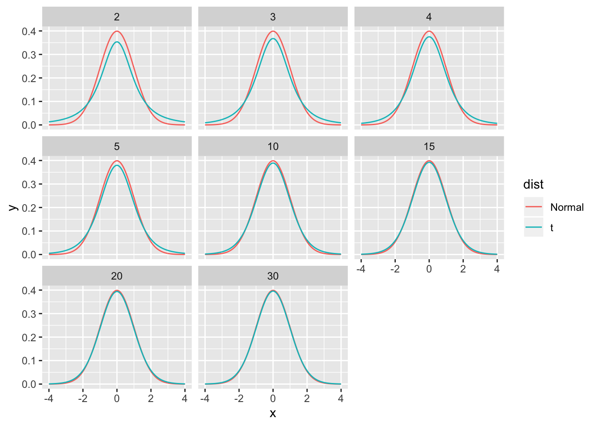

# (PART\*) Deeper Details {-}

# Data Structures


```r
library(tidyverse)
```

In the introduction section of these notes, we concentrated on `data.frame`s created and manipulated using `dplyr`. There are other data structures that are used in R and it is useful to learn how to manipulate those other data structures. Furthermore, it is also useful to be able to use base R functionality to do certain manipulations on `data.frame`s.


## Vectors
R operates on vectors where we think of a vector as a collection of objects, usually numbers. The first thing we need to be able to do is define an arbitrary collection using the `c()` function. The “c” stands for collection.


```r
# Define the vector of numbers 1, ..., 4
c(1,2,3,4)
```

```
## [1] 1 2 3 4
```

There are many other ways to define vectors. The function `rep(x, times)` just repeats `x` a the number times specified by `times`.


```r
rep(2, 5)              # repeat 2 five times... 2 2 2 2 2
```

```
## [1] 2 2 2 2 2
```

```r
rep( c('A','B'), 3 )   # repeat A B three times  A B A B A B
```

```
## [1] "A" "B" "A" "B" "A" "B"
```

Finally, we can also define a sequence of numbers using the `seq(from, to, by, length.out)` function which expects the user to supply 3 out of 4 possible arguments. The possible arguments are `from`, `to`, `by`, and `length.out`. From is the starting point of the sequence, to is the ending point, by is the difference between any two successive elements, and `length.out` is the total number of elements in the vector.


```r
seq(from=1, to=4, by=1)
```

```
## [1] 1 2 3 4
```

```r
seq(1,4)        # 'by' has a default of 1   
```

```
## [1] 1 2 3 4
```

```r
1:4             # a shortcut for seq(1,4)
```

```
## [1] 1 2 3 4
```

```r
seq(1,5, by=.5)
```

```
## [1] 1.0 1.5 2.0 2.5 3.0 3.5 4.0 4.5 5.0
```

```r
seq(1,5, length.out=11) 
```

```
##  [1] 1.0 1.4 1.8 2.2 2.6 3.0 3.4 3.8 4.2 4.6 5.0
```

If we have two vectors and we wish to combine them, we can again use the `c()` function.


```r
vec1 <- c(1,2,3)
vec2 <- c(4,5,6)
vec3 <- c(vec1, vec2)
vec3
```

```
## [1] 1 2 3 4 5 6
```

### Accessing Vector Elements

Suppose I have defined a vector


```r
foo <- c('A', 'B', 'C', 'D', 'F')
```

and I am interested in accessing whatever is in the first spot of the vector. Or perhaps the 3rd or 5th element. To do that we use the `[]` notation, where the square bracket represents a subscript.


```r
foo[1]  # First element in vector foo
```

```
## [1] "A"
```

```r
foo[4]  # Fourth element in vector foo
```

```
## [1] "D"
```

This sub-scripting notation can get more complicated. For example I might want the 2nd and 3rd element or the 3rd through 5th elements.


```r
foo[c(2,3)]  # elements 2 and 3
```

```
## [1] "B" "C"
```

```r
foo[ 3:5 ]   # elements 3 to 5
```

```
## [1] "C" "D" "F"
```

Finally, I might be interested in getting the entire vector except for a certain element. To do this, R allows us to use the square bracket notation with a negative index number. 

```r
foo[-1]          # everything but the first element
```

```
## [1] "B" "C" "D" "F"
```

```r
foo[ -1*c(1,2) ] # everything but the first two elements
```

```
## [1] "C" "D" "F"
```

Now is a good time to address what is the `[1]` doing in our output? Because vectors are often very long and might span multiple lines, R is trying to help us by telling us the index number of the left most value. If we have a very long vector, the second line of values will start with the index of the first value on the second line.

```r
# The letters vector is a vector of all 26 lower-case letters
letters
```

```
##  [1] "a" "b" "c" "d" "e" "f" "g" "h" "i" "j" "k" "l" "m" "n" "o" "p" "q" "r" "s"
## [20] "t" "u" "v" "w" "x" "y" "z"
```
Here the `[1]` is telling me that `a` is the first element of the vector and the `[18]` is telling me that `r` is the 18th element of the vector.

### Scalar Functions Applied to Vectors

It is very common to want to perform some operation on all the elements of a vector simultaneously. For example, I might want take the absolute value of every element. Functions that are inherently defined on single values will almost always apply the function to each element of the vector if given a vector. 

```r
x <- -5:5
x
```

```
##  [1] -5 -4 -3 -2 -1  0  1  2  3  4  5
```

```r
abs(x)
```

```
##  [1] 5 4 3 2 1 0 1 2 3 4 5
```

```r
exp(x)
```

```
##  [1] 6.737947e-03 1.831564e-02 4.978707e-02 1.353353e-01 3.678794e-01
##  [6] 1.000000e+00 2.718282e+00 7.389056e+00 2.008554e+01 5.459815e+01
## [11] 1.484132e+02
```

### Vector Algebra

All algebra done with vectors will be done element-wise by default.For matrix and vector multiplication as usually defined by mathematicians, use `%*%` instead of `*`.  So two vectors added together result in their individual elements being summed. 

```r
x <- 1:4
y <- 5:8
x + y
```

```
## [1]  6  8 10 12
```

```r
x * y
```

```
## [1]  5 12 21 32
```

R does another trick when doing vector algebra. If the lengths of the two vectors don't match, R will recycle the elements of the shorter vector to come up with vector the same length as the longer. This is potentially confusing, but is most often used when adding a long vector to a vector of length 1.

```r
x <- 1:4
x + 1
```

```
## [1] 2 3 4 5
```

### Commonly Used Vector Functions

 
Function       | Result
-------------- | ------------------------
`min(x)`       | Minimum value in vector x
`max(x)`       | Maximum value in vector x
`length(x)`    | Number of elements in vector x
`sum(x)`       | Sum of all the elements in vector x
`mean(x)`      | Mean of the elements in vector x
`median(x)`    | Median of the elements in vector x
`var(x)`      | Variance of the elements in vector x
`sd(x)`        | Standard deviation of the elements in x

Putting this all together, we can easily perform tedious calculations with ease. To demonstrate how scalars, vectors, and functions of them work together, we will calculate the variance of 5 numbers. Recall that variance is defined as 
$$ Var\left(x\right)=\frac{\sum_{i=1}^{n}\left(x_{i}-\bar{x}\right)^{2}}{n-1} $$

```r
x <- c(2,4,6,8,10)
xbar <- mean(x)         # calculate the mean
xbar
```

```
## [1] 6
```

```r
x - xbar                # calculate the errors 
```

```
## [1] -4 -2  0  2  4
```

```r
(x-xbar)^2
```

```
## [1] 16  4  0  4 16
```

```r
sum( (x-xbar)^2 )
```

```
## [1] 40
```

```r
n <- length(x)          # how many data points do we have
n
```

```
## [1] 5
```

```r
sum((x-xbar)^2)/(n-1)   # calculating the variance by hand
```

```
## [1] 10
```

```r
var(x)                  # Same thing using the built-in variance function
```

```
## [1] 10
```

## Matrices

We often want to store numerical data in a square or rectangular format and mathematicians will call these “matrices”. These will have two dimensions, rows and columns. To create a matrix in R we can create it directly using the `matrix()` command which requires the data to fill the matrix with, and optionally, some information about the number of rows and columns:


```r
W <- matrix( c(1,2,3,4,5,6), nrow=2, ncol=3 )
W
```

```
##      [,1] [,2] [,3]
## [1,]    1    3    5
## [2,]    2    4    6
```
Notice that because we only gave it six values, the information the number of columns is redundant and could be left off and R would figure out how many columns are needed.  Next notice that the order that R chose to fill in the matrix was to fill in the first column then the second, and then the third. If we wanted to fill the matrix in order of the rows first, then we'd use the optional `byrow=TRUE` argument.


```r
W <- matrix( c(1,2,3,4,5,6), nrow=2, byrow=TRUE )
W
```

```
##      [,1] [,2] [,3]
## [1,]    1    2    3
## [2,]    4    5    6
```


The alternative to the `matrix()` command  is we could create two columns as individual vectors and just push them together. Or we could have made three rows and lump them by rows instead. To do this we'll use a group of functions that bind vectors together. To join two column vectors together, we'll use `cbind` and to bind rows together we'll use the `rbind` function 

```r
a <- c(1,2,3)
b <- c(4,5,6)
cbind(a,b)  # Column Bind:  a,b are columns in resultant matrix 
```

```
##      a b
## [1,] 1 4
## [2,] 2 5
## [3,] 3 6
```

```r
rbind(a,b)  # Row Bind:     a,b are   rows  in resultant matrix    
```

```
##   [,1] [,2] [,3]
## a    1    2    3
## b    4    5    6
```


Notice that doing this has provided R with some names for the individual rows and columns. I can change these using the commands `colnames()` and `rownames()`. 


```r
M <- matrix(1:6, nrow=3, ncol=2, byrow=TRUE) 
colnames(M) <- c('Column1', 'Column2')       # set column labels
rownames(M) <- c('Row1', 'Row2','Row3')      # set row labels
M
```

```
##      Column1 Column2
## Row1       1       2
## Row2       3       4
## Row3       5       6
```

This is actually a pretty peculiar way of setting the *attributes* of the object `M` because it looks like we are evaluating a function and assigning some value to the function output.  Yes it is weird, but R was developed in the 70s and it seemed like a good idea at the time.

Accessing a particular element of a matrix is done in a similar manner as with vectors, using the `[ ]` notation, but this time we must specify which row and which column. Notice that this scheme always is `[row, col]`.


```r
M1 <- matrix(1:6, nrow=3, ncol=2)
M1
```

```
##      [,1] [,2]
## [1,]    1    4
## [2,]    2    5
## [3,]    3    6
```

```r
M1[1,2]     # Grab row 1, column 2 value
```

```
## [1] 4
```

```r
M1[1, 1:2]  # Grab row 1, and columns 1 and 2.
```

```
## [1] 1 4
```


I might want to grab a single row or a single column out of a matrix, which is sometimes referred to as taking a slice of the matrix. I could figure out how long that vector is, but often I'm too lazy. Instead I can just specify the specify the particular row or column I want.


```r
M1
```

```
##      [,1] [,2]
## [1,]    1    4
## [2,]    2    5
## [3,]    3    6
```

```r
M1[1, ]    # grab the 1st row 
```

```
## [1] 1 4
```

```r
M1[ ,2]    # grab second column (the spaces are optional...)
```

```
## [1] 4 5 6
```


## Data Frames

Matrices are great for mathematical operations, but I also want to be able to store data that is numerical. For example I might want to store a categorical variable such as manufacturer brand. To generalize our concept of a matrix to include these types of data, we will create a structure called a `data.frame`. These are very much like a simple Excel spreadsheet where each column represents a different trait or measurement type and each row will represent an individual.

Perhaps the easiest way to create a data frame is to just type the columns of data


```r
data <- data.frame(
  Name  = c('Bob','Jeff','Mary'), 	
  Score = c(90, 75, 92)
)
# Show the data.frame 
data
```

```
##   Name Score
## 1  Bob    90
## 2 Jeff    75
## 3 Mary    92
```

Because a data frame feels like a matrix, R also allows matrix notation for accessing particular values. 

  Format  |   Result
--------- | --------------------------------------
`[a,b]`   |  Element in row `a` and column `b`
`[a,]`    |  All of row `a`
`[,b]`    |  All of column `b`

Because the columns have meaning and we have given them column names, it is desirable to want to access an element by the name of the column as opposed to the column number.In large Excel spreadsheets I often get annoyed trying to remember which column something was in and muttering “Was total biomass in column P or Q?” A system where I could just name the column `Total.Biomass` and be done with it is much nicer to work with and I make fewer dumb mistakes.


```r
data$Name       # The $-sign means to reference a column by its label
```

```
## [1] Bob  Jeff Mary
## Levels: Bob Jeff Mary
```

```r
data$Name[2]    # Notice that data$Name results in a vector, which I can manipulate
```

```
## [1] Jeff
## Levels: Bob Jeff Mary
```

I can mix the `[ ]` notation with the column names. The following is also acceptable:


```r
data[, 'Name']   # Grab the column labeled 'Name'
```

```
## [1] Bob  Jeff Mary
## Levels: Bob Jeff Mary
```


The next thing we might wish to do is add a new column to a preexisting data frame. There are two ways to do this. First, we could use the `cbind()` function to bind two data frames together. Second we could reference a new column name and assign values to it.


```r
Second.score <- data.frame(Score2=c(41,42,43))  # another data.frame
data <-  cbind( data, Second.score )            # squish them together
data
```

```
##   Name Score Score2
## 1  Bob    90     41
## 2 Jeff    75     42
## 3 Mary    92     43
```

```r
# if you assign a value to a column that doesn't exist, R will create it
data$Score3 <- c(61,62,63) # the Score3 column will created
data
```

```
##   Name Score Score2 Score3
## 1  Bob    90     41     61
## 2 Jeff    75     42     62
## 3 Mary    92     43     63
```

Data frames are very commonly used and many commonly used functions will take a `data=` argument and all other arguments are assumed to be in the given data frame. Unfortunately this is not universally supported by all functions and you must look at the help file for the function you are interested in.

Data frames are also very restrictive in that the shape of the data must be rectangular. If I try to create a new column that doesn't have enough rows, R will complain.


```r
data$Score4 <- c(1,2)
```

```
## Error in `$<-.data.frame`(`*tmp*`, Score4, value = c(1, 2)): replacement has 2 rows, data has 3
```


### `data.frames` vs `tibbles`
Previously we've been using `data.frame` and `tibble` objects interchangeably, but now is a good time make a distinction. Essentially a `tibble` is a `data.frame` that does more type checking and less coercion during creation and manipulation. So a `tibble` does less (automatically) and complains more. The rational for this is that while coercion between data types can be helpful, it often disguises errors that take a long time to track down. On the whole, is better to force the user to do the coercion explicitly rather than hope that R magically does the right thing.

Second, the printing methods for `tibbles` prevent it from showing too many rows or columns. This is a very convenient and more user-friendly way to show the data. We can control how many rows or columns are printed using the `options()` command, which sets all of the global options.

|  Options            |    Result                           |
|:--------------------------------------:|:-----------------|
| `options(tibble.print_max = n, tibble.print_min = m)`  | if there are more than `n` rows, print only the first `m`. 
| `options(tibble.print_max = Inf)` |  Always print all the rows. |
| `options(tibble.width = Inf)` | Always print all columns, regardless of the width of the display device. |

Third, `tibbles` support column names that would be rejected by a data frame.  For example, a data frame will not allow columns to begin with a number, nor can column names contain a space. These are allowable by `tibbles`, although they are required to be enclosed by back-quotes when referring to them.


```r
# the tribble() function just creates a tibble, but specifying the information
# in rows. This can be beneficial in creating small data sets by hand.
example <- tribble(
  ~'1984', ~"Is Awesome",
  'George',   20,
  'Orwell',   87)

example %>% select( `1984`, `Is Awesome` )
```

```
## # A tibble: 2 x 2
##   `1984` `Is Awesome`
##   <chr>         <dbl>
## 1 George           20
## 2 Orwell           87
```


## Lists

Data frames are quite useful for storing data but sometimes we'll need to store a bunch of different pieces of information and it won't fit neatly as a data frame. The most general form of a data structure is called a list. This can be thought of as a vector of objects where there is no requirement for each element to be the same type of object.

Consider that I might need to store information about person. For example, suppose that I want make an object that holds information about my immediate family. This object should have my spouse's name (just one name) as well as my siblings. But because I have many siblings, I want the siblings to be a vector of names. Likewise I might also include my pets, but we don't want any requirement that the number of pets is the same as the number of siblings (or spouses!). 


```r
wife <- 'Aubrey'
sibs <- c('Tina','Caroline','Brandon','John')
pets <- c('Beau','Tess','Kaylee')
Derek <- list(Spouse=wife, Siblings=sibs, Pets=pets) # Create the list
str(Derek) # show the structure of object
```

```
## List of 3
##  $ Spouse  : chr "Aubrey"
##  $ Siblings: chr [1:4] "Tina" "Caroline" "Brandon" "John"
##  $ Pets    : chr [1:3] "Beau" "Tess" "Kaylee"
```

Notice that the object `Derek` is a list of three elements. The first is the single string containing my wife's name. The next is a vector of my siblings' names and it is a vector of length four. Finally the vector of pets' names is only of length three.

To access any element of this list we can use an indexing scheme similar to matrices and vectors. The only difference is that we'll use two square brackets instead of one.


```r
Derek[[ 1 ]]    # First element of the list is Spouse!
```

```
## [1] "Aubrey"
```

```r
Derek[[ 3 ]]    # Third element of the list is the vector of pets
```

```
## [1] "Beau"   "Tess"   "Kaylee"
```


There is a second way I can access elements. For data frames it was convenient to use the notation `DataFrame$ColumnName` and we will use the same convention for lists. Actually a data frame is just a list with the requirement that each list element is a vector and all vectors are of the same length. To access my pets names we can use the following notation:


```r
Derek$Pets         # Using the '$' notation
```

```
## [1] "Beau"   "Tess"   "Kaylee"
```

```r
Derek[[ 'Pets' ]]  # Using the '[[ ]]' notation
```

```
## [1] "Beau"   "Tess"   "Kaylee"
```


To add something new to the list object, we can just make an assignment in a similar fashion as we did for `data.frame` and just assign a value to a slot that doesn't (yet!) exist.


```r
Derek$Spawn <- c('Elise', 'Casey')
```


We can also add extremely complicated items to my list. Here we'll add a `data.frame` as another list element.


```r
# Recall that we previous had defined a data.frame called "data"
Derek$RandomDataFrame <- data  # Assign it to be a list element
str(Derek)
```

```
## List of 5
##  $ Spouse         : chr "Aubrey"
##  $ Siblings       : chr [1:4] "Tina" "Caroline" "Brandon" "John"
##  $ Pets           : chr [1:3] "Beau" "Tess" "Kaylee"
##  $ Spawn          : chr [1:2] "Elise" "Casey"
##  $ RandomDataFrame:'data.frame':	3 obs. of  4 variables:
##   ..$ Name  : Factor w/ 3 levels "Bob","Jeff","Mary": 1 2 3
##   ..$ Score : num [1:3] 90 75 92
##   ..$ Score2: num [1:3] 41 42 43
##   ..$ Score3: num [1:3] 61 62 63
```

Now we see that the list `Derek` has five elements and some of those elements are pretty complicated.  In fact, I could happily have lists of lists and have a very complicated nesting structure.

The place that most users will run into lists is that the output of many statistical procedures will return the results in a list object. When a user asks R to perform a regression, the output returned is a list object, and we'll need to grab particular information from that object afterwards. For example, the output from a t-test in R is a list:


```r
x <- c(5.1, 4.9, 5.6, 4.2, 4.8, 4.5, 5.3, 5.2)   # some toy data
results <- t.test(x, alternative='less', mu=5)   # do a t-test
str(results)                                     # examine the resulting object
```

```
## List of 10
##  $ statistic  : Named num -0.314
##   ..- attr(*, "names")= chr "t"
##  $ parameter  : Named num 7
##   ..- attr(*, "names")= chr "df"
##  $ p.value    : num 0.381
##  $ conf.int   : num [1:2] -Inf 5.25
##   ..- attr(*, "conf.level")= num 0.95
##  $ estimate   : Named num 4.95
##   ..- attr(*, "names")= chr "mean of x"
##  $ null.value : Named num 5
##   ..- attr(*, "names")= chr "mean"
##  $ stderr     : num 0.159
##  $ alternative: chr "less"
##  $ method     : chr "One Sample t-test"
##  $ data.name  : chr "x"
##  - attr(*, "class")= chr "htest"
```


We see that result is actually a list with 9 elements in it. To access the p-value we could use:

```r
results$p.value
```

```
## [1] 0.3813385
```

If I ask R to print the object `results`, it will hide the structure from you and print it in a “pretty” fashion because there is a `print` function defined specifically for objects created by the `t.test()` function.


```r
results
```

```
## 
## 	One Sample t-test
## 
## data:  x
## t = -0.31399, df = 7, p-value = 0.3813
## alternative hypothesis: true mean is less than 5
## 95 percent confidence interval:
##      -Inf 5.251691
## sample estimates:
## mean of x 
##      4.95
```


## Exercises
1. Create a vector of three elements (2,4,6) and name that vector `vec_a`. Create a second vector, `vec_b`, that contains (8,10,12). Add these two vectors together and name the result `vec_c`.

2. Create a vector, named `vec_d`, that contains only two elements (14,20). Add this vector to `vec_a`. What is the result and what do you think R did (look up the recycling rule using Google)? What is the warning message that R gives you?

3. Next add 5 to the vector vec_a. What is the result and what did R do? Why doesn't in give you a warning message similar to what you saw in the previous problem?

4. Generate the vector of integers $\left\{ 1,2,\dots5\right\}$ in two different ways. 
    a) First using the `seq()` function 
    b) Using the `a:b` shortcut.

5. Generate the vector of even numbers $\left\{ 2,4,6,\dots,20\right\}$ 
    a) Using the seq() function and 
    b) Using the a:b shortcut and some subsequent algebra. *Hint: Generate the vector 1-10 and then multiple it by 2*.

6. Generate a vector of 21 elements that are evenly placed between 0 and 1 using the `seq()` command and name this vector `x`. 

7. Generate the vector $\left\{ 2,4,8,2,4,8,2,4,8\right\}$ 
  using the `rep()` command to replicate the vector c(2,4,8). 

8. Generate the vector $\left\{ 2,2,2,2,4,4,4,4,8,8,8,8\right\}$
  using the `rep()` command. You might need to check the help file for rep() to see all of the options that rep() will accept. In particular, look at the optional argument `each=`.

9. The vector `letters` is a built-in vector to R and contains the lower case English alphabet. 
    a) Extract the 9th element of the letters vector.
    b) Extract the sub-vector that contains the 9th, 11th, and 19th elements.
    c) Extract the sub-vector that contains everything except the last two elements.
    

10. In this problem, we will work with the matrix 

    \[ \left[\begin{array}{ccccc}
    2 & 4 & 6 & 8 & 10\\
    12 & 14 & 16 & 18 & 20\\
    22 & 24 & 26 & 28 & 30
    \end{array}\right]\]
    
    a) Create the matrix in two ways and save the resulting matrix as `M`.
        i. Create the matrix using some combination of the `seq()` and `matrix()` commands.
        ii. Create the same matrix by some combination of multiple `seq()` commands and either the `rbind()` or `cbind()` command. 

    b) Extract the second row out of `M`.
    c) Extract the element in the third row and second column of `M`.

11. Create and manipulate a data frame.
    a) Create a `data.frame` named `my.trees` that has the following columns:
        + Girth = {8.3, 8.6, 8.8, 10.5, 10.7, 10.8, 11.0}
        + Height= {70, 65, 63, 72, 81, 83, 66}
        + Volume= {10.3, 10.3, 10.2, 16.4, 18.8, 19.7, 15.6}
    b) Without using `dplyr` functions, extract the third observation (i.e. the third row)
    c) Without using `dplyr` functions, extract the Girth column referring to it by name (don't use whatever order you placed the columns in).
    d) Without using `dplyr` functions, print out a data frame of all the observations *except* for the fourth observation. (i.e. Remove the fourth observation/row.)
    e) Without using `dplyr` functions, use the `which()` command to create a vector of row indices that have a `girth` greater than 10. Call that vector `index`.
    f) Without using `dplyr` functions, use the `index` vector to create a small data set with just the large girth trees.
    g) Without using `dplyr` functions, use the `index` vector to create a small data set with just the small girth trees.

12. The following code creates a `data.frame` and then has two different methods for removing the rows with `NA` values in the column `Grade`. Explain the difference between the two.
    
    ```r
    df <- data.frame(name= c('Alice','Bob','Charlie','Daniel'),
                     Grade = c(6,8,NA,9))
    
    df[ -which(  is.na(df$Grade) ), ]
    df[  which( !is.na(df$Grade) ), ]
    ```
    
13. Creation of data frames is usually done by binding together vectors while using `seq` and `rep` commands. However often we need to create a data frame that contains all possible combinations of several variables. The function `expand.grid()` addresses this need.
    
    ```r
    expand.grid( F1=c('A','B'), F2=c('x','w','z'), replicate=1:2 )
    ```
    A fun example of using this function is making several graphs of the standard normal distribution versus the t-distribution. Use the `expand.grid` function to create a `data.frame` with all combinations of `x=seq(-4,4,by=.01)`, `dist=c('Normal','t')`, and `df=c(2,3,4,5,10,15,20,30)`. Use the `dplyr::mutate` command with the `if_else` command to generate the function heights `y` using either `dt(x,df)` or `dnorm(x)` depending on what is in the distribution column.
    
    ```r
    expand.grid( x=seq(-4,4,by=.01), 
                 dist=c('Normal','t'), 
                 df=c(2,3,4,5,10,15,20,30) ) %>%
      mutate( y = if_else(dist == 't', dt(x, df), dnorm(x) ) ) %>%
      ggplot( aes( x=x, y=y, color=dist) ) + 
      geom_line() + 
      facet_wrap(~df)
    ```
    
    
    

14. Create and manipulate a list.
    a) Create a list named my.test with elements
        + x = c(4,5,6,7,8,9,10)
        + y = c(34,35,41,40,45,47,51)
        + slope = 2.82
        + p.value = 0.000131
    b) Extract the second element in the list.
    c) Extract the element named `p.value` from the list.

15. The function `lm()` creates a linear model, which is a general class of model that includes both regression and ANOVA. We will call this on a data frame and examine the results. For this problem, there isn't much to figure out, but rather the goal is to recognize the data structures being used in common analysis functions.
    a) There are many data sets that are included with R and its packages. One of which is the `trees` data which is a data set of $n=31$ cherry trees. Load this dataset into your current workspace using the command:
    
    ```r
    data(trees)     # load trees data.frame
    ```
    b) Examine the data frame using the `str()` command. Look at the help file for the data using the command `help(trees)` or `?trees`.
    c) Perform a regression relating the volume of lumber produced to the girth and height of the tree using the following command
    
    ```r
    m <- lm( Volume ~ Girth + Height, data=trees)
    ```
    d) Use the str() command to inspect `m`. Extract the model coefficients from this list.


