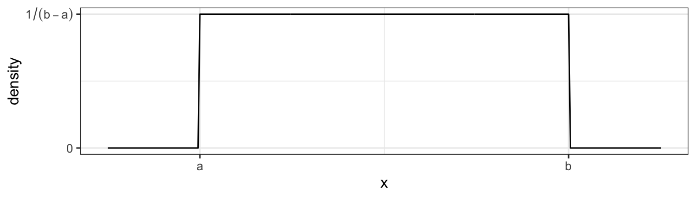

# User Defined Functions


```r
library(tidyverse)  
```

```
## ── Attaching packages ────────────────────────────────────────── tidyverse 1.2.1 ──
```

```
## ✔ ggplot2 3.2.1     ✔ purrr   0.3.2
## ✔ tibble  2.1.3     ✔ dplyr   0.8.3
## ✔ tidyr   0.8.3     ✔ stringr 1.4.0
## ✔ readr   1.3.1     ✔ forcats 0.4.0
```

```
## ── Conflicts ───────────────────────────────────────────── tidyverse_conflicts() ──
## ✖ dplyr::filter() masks stats::filter()
## ✖ dplyr::lag()    masks stats::lag()
```


It is very important to be able to define a piece of programing logic that is repeated often. For example, I don't want to have to always program the mathematical code for calculating the sample variance of a vector of data. Instead I just want to call a function that does everything for me and I don't have to worry about the details. 

While hiding the computational details is nice, fundamentally writing functions allows us to think about our problems at a higher layer of abstraction. For example, most scientists just want to run a t-test on their data and get the appropriate p-value out; they want to focus on their problem and not how to calculate what the appropriate degrees of freedom are. Functions let us do that. 

## Basic function definition

In the course of your analysis, it can be useful to define your own functions. The format for defining your own function is 

```r
function.name <- function(arg1, arg2, arg3){
  statement1
  statement2
}
```

where `arg1` is the first argument passed to the function and `arg2` is the second.

To illustrate how to define your own function, we will define a variance calculating function.


```r
# define my function
my.var <- function(x){
  n <- length(x)                # calculate sample size
  xbar <- mean(x)               # calculate sample mean
  SSE <- sum( (x-xbar)^2 )      # calculate sum of squared error
  v <- SSE / ( n - 1 )          # "average" squared error
  return(v)                     # result of function is v
}
```


```r
# create a vector that I wish to calculate the variance of
test.vector <- c(1,2,2,4,5)

# calculate the variance using my function
calculated.var <- my.var( test.vector )
calculated.var
```

```
## [1] 2.7
```

Notice that even though I defined my function using `x` as my vector of data, and passed my function something named `test.vector`, R does the appropriate renaming.If my function doesn't modify its input arguments, then R just passes a pointer to the inputs to avoid copying large amounts of data when you call a function. If your function modifies its input, then R will take the input data, copy it, and then pass that new copy to the function. This means that a function cannot modify its arguments. In Computer Science parlance, R does not allow for procedural side effects. Think of the variable `x` as a placeholder, with it being replaced by whatever gets passed into the function.

When I call a function, the function might cause something to happen (e.g. draw a plot) or it might do some calculates the result is returned by the function and we might want to save that. Inside a function, if I want the result of some calculation saved, I return the result as the output of the function. The way I specify to do this is via the `return` statement. (Actually R doesn't completely require this. But the alternative method is less intuitive and I strongly recommend using the `return()` statement for readability.)

By writing a function, I can use the same chunk of code repeatedly. This means that I can do all my tedious calculations inside the function and just call the function whenever I want and happily ignore the details. Consider the function `t.test()` which we have used to do all the calculations in a t-test. We could write a similar function using the following code:


```r
# define my function
one.sample.t.test <- function(input.data, mu0){
  n    <- length(input.data)
  xbar <- mean(input.data)
  s    <- sd(input.data)
  t    <- (xbar - mu0)/(s / sqrt(n))
  if( t < 0 ){
    p.value <- 2 * pt(t, df=n-1)
  }else{
    p.value <- 2 * (1-pt(t, df=n-1))
  }
  # we haven't addressed how to print things in a organized 
  # fashion, the following is ugly, but works...
  # Notice that this function returns a character string
  # with the necessary information in the string.
  return( paste('t =', round(t, digits=3), ' and p.value =', round(p.value, 3)) )
}
```


```r
# create a vector that I wish apply a one-sample t-test on.
test.data <- c(1,2,2,4,5,4,3,2,3,2,4,5,6)
one.sample.t.test( test.data, mu0=2 )
```

```
## [1] "t = 3.157  and p.value = 0.008"
```

Nearly every function we use to do data analysis is written in a similar fashion. Somebody decided it would be convenient to have a function that did an ANOVA analysis and they wrote something similar to the above function, but is a bit grander in scope. Even if you don't end up writing any of your own functions, knowing how to will help you understand why certain functions you use are designed the way they are. 

## Parameter Defaults

When I define a function and can let it take as many arguments as I want and I can also give default values to the arguments. For example we can define the normal density function using the following code which gives a default mean of $0$ and default standard deviation of $1$.


```r
# a function that defines the shape of a normal distribution.
# by including mu=0, we give a default value that the function
# user can override
dnorm.alternate <- function(x, mu=0, sd=1){
  out <- 1 / (sd * sqrt(2*pi)) * exp( -(x-mu)^2 / (2 * sd^2) )
  return(out)
}
```


```r
# test the function to see if it works
dnorm.alternate(1)
```

```
## [1] 0.2419707
```

```r
dnorm.alternate(1, mu=1)
```

```
## [1] 0.3989423
```


```r
# Lets test the function a bit more by drawing the height
# of the normal distribution a lots of different points
# ... First the standard normal!
data.frame( x = seq(-3, 3, length=601) ) %>%
  mutate( y = dnorm.alternate(x) )       %>% # use default mu=0, sd=1
  ggplot( aes(x=x, y=y) ) + geom_line()
```


```r
# next a normal with mean 1, and standard deviation 1
data.frame( x = seq(-3, 3, length=601) ) %>%
  mutate( y = dnorm.alternate(x, mu=1) )       %>% # use mu=1, sd=1
  ggplot( aes(x=x, y=y) ) + geom_line()
```


Many functions that we use have defaults that we don't normally mess with. For example, the function `mean()` has an option the specifies what it should do if your vector of data has missing data. The common solution is to remove those observations, but we might have wanted to say that the mean is unknown one component of it was unknown. 


```r
x <- c(1,2,3,NA)     # fourth element is missing
mean(x)              # default is to return NA if any element is missing
```

```
## [1] NA
```

```r
mean(x, na.rm=TRUE)  # Only average the non-missing data
```

```
## [1] 2
```

As you look at the help pages for different functions, you'll see in the function definitions what the default values are. For example, the function `mean` has another option, `trim`, which specifies what percent of the data to trim at the extremes. Because we would expect mean to not do any trimming by default, the authors have appropriately defined the default amount of trimming to be zero via the definition `trim=0`.

## Ellipses

When writing functions, I occasionally have a situation where I call function `a()` and function `a()` needs to call another function, say `b()`, and I want to pass an unusual parameter to that function. To do this, I'll use a set of three periods called an *ellipses*. What these do is represent a set of parameter values that will be passed along to a subsequent function.For example the following code takes the result of a simple linear regression and plots the data and the regression line and confidence region (basically I'm recreating a function that does the same thing as ggplot2's geom_smooth() layer). I might not want to specify (and give good defaults) to every single graphical parameter that the plot() function supports. Instead I'll just use the '...' argument and pass any additional parameters to the plot function.


```r
# a function that draws the regression line and confidence interval
# notice it doesn't return anything... all it does is draw a plot
show.lm <- function(m, interval.type='confidence', fill.col='light grey', ...){
  df <- data.frame(
    x = m$model[,2],     # extract the predictor variable
    y = m$model[,1]       # extract the response
  )
  df <- df %>% cbind( predict(m, interval=interval.type) )
  P <- ggplot(df, aes(x=x) ) +
    geom_ribbon( aes(ymin=lwr, ymax=upr), fill=fill.col ) +
    geom_line( aes(y=fit), ... ) +
    geom_point( aes(y=y), ... ) +
    labs(...)
  print(P)
} 
```

This function looks daunting, but we experiment to see what it does.


```r
# first define a simple linear model from our cherry tree data
m <- lm( Volume ~ Girth, data=trees )

# call the function with no extraneous parameters
show.lm( m )
```


```r
# Pass arguments that will just be passed along to the geom layers 
show.lm( m, color='Red', title='Relationship between Girth and Volume')
```

```
## Warning: Ignoring unknown parameters: title

## Warning: Ignoring unknown parameters: title
```


This type of trick is done commonly. Look at the help files for `hist()` and `qqnorm()` and you'll see the ellipses used to pass graphical parameters along to sub-functions. Functions like `lm()` use the ellipses to pass arguments to the low level regression fitting functions that do the actual calculations. By only including these parameters via the ellipses, must users won't be tempted to mess with the parameters, but experts who know the nitty-gritty details can still modify those parameters. 

## Function Overloading

Frequently the user wants to inspect the results of some calculation and display a variable or object to the screen. The `print()` function does exactly that, but it acts differently for matrices than it does for vectors. It especially acts different for lists that I obtained from a call like `lm()` or `aov()`. 

The reason that the print function can act differently depending on the object type that I pass it is because the function `print()` is *overloaded*. What this means is that there is a `print.lm()` function that is called whenever I call `print(obj)` when `obj` is the output of an `lm()` command.

Recall that we initially introduced a few different classes of data, Numerical, Factors, and Logicals. It turns out that I can create more types of classes.


```r
x <- seq(1:10)
y <- 3+2*x+rnorm(10)

h <- hist(y)  # h should be of class "Histogram"
```


```r
class(h)
```

```
## [1] "histogram"
```

```r
model <- lm( y ~ x ) # model is something of class "lm"
class(model)
```

```
## [1] "lm"
```

Many common functions such as `plot()` are overloaded so that when I call the plot function with an object, it will in turn call `plot.lm()` or `plot.histogram()` as appropriate. When building statistical models I am often interested in different quantities and would like to get those regardless of the model I am using. Below are a list of functions that work whether I fit a model via `aov()`, `lm()`, `glm()`, or `gam()`. 

+----------------------+----------------------+
|    Quantity          |   Function Name      |
+======================+======================+
|  Residuals           |  `resid( obj )`      |
+----------------------+----------------------+
|  Model Coefficients  |  `coef( obj )`       |
+----------------------+----------------------+
|  Summary Table       |  `summary( obj )`    |
+----------------------+----------------------+
|  ANOVA Table         |  `anova( obj )`      |
+----------------------+----------------------+
|  AIC value           |  `AIC( obj )`        |
+----------------------+----------------------+

  
For the residual function, there exists a `resid.lm()` function, and `resid.gam()` and it is these functions are called when we run the command `resid( obj )`. 

## Scope

Consider the case where we make a function that calculates the trimmed mean. A good implementation of the function is given here.


```r
# Define a function for the trimmed mean
# x: vector of values to be averaged
# k: the number of elements to trim on either side
trimmed.mean <- function(x, k=0){
  x <- sort(x)      # arrange the input according magnitude
  n <- length(x)    # n = how many observations
  if( k > 0){
    x <- x[c(-1*(1:k), -1*((n-k+1):n))]  # remove first k, last k
  }
  tm <- sum(x) / length(x)  # mean of the remaining observations
  return( tm )
} 

x <- c(10:1,50)                        # 10, 9, 8, ..., 1
output <- trimmed.mean(x, k=2)
output
```

```
## [1] 6
```

```r
x                                # x is unchanged
```

```
##  [1] 10  9  8  7  6  5  4  3  2  1 50
```

Notice that even though I passed `x` into the function and then sorted it, `x` remained unsorted outside the function. When I modified `x`, R made a copy of `x` and sorted the *copy* that belonged to the function so that I didn't modify a variable that was defined outside of the scope of my function. But what if I didn't bother with passing x and k. If I don't pass in the values of x and k, then R will try to find them in my current workspace.


```r
# a horribly defined function that has no parameters
# but still accesses something called "x"
trimmed.mean <- function(){
  x <- sort(x)
  n <- length(x)
  if( k > 0){
    x <- x[c(-1*(1:k), -1*((n-k+1):n))]
  }
  tm <- sum(x)/length(x)
  return( tm )
} 

x <- c( 1:10, 50 )    # data to trim
k <- 2

trimmed.mean()  # amazingly this still works
```

```
## [1] 6
```

```r
# but what if k wasn't defined?
rm(k)           # remove k 
trimmed.mean()  # now the function can't find anything named k and throws and error.
```

```
## Error in trimmed.mean(): object 'k' not found
```


So if I forget to pass some variable into a function, but it happens to be defined outside the function, R will find it. It is not good practice to rely on that because how do I take the trimmed mean of a vector named z? Worse yet, what if the variable x changes between runs of your function? What should be consistently giving the same result keeps changing. This is especially insidious when you have defined most of the arguments the function uses, but missed one. Your function happily goes to the next higher scope and sometimes finds it. 

When executing a function, R will have access to all the variables defined in the function, all the variables defined in the function that called your function and so on until the base workspace. However, you should never let your function refer to something that is not either created in your function or passed in via a parameter.

## Exercises

1. Write a function that calculates the density function of a Uniform continuous variable on the interval $\left(a,b\right)$. The function is defined as 
    $$f\left(x\right)=\begin{cases}
    \frac{1}{b-a} & \;\;\;\textrm{if }a\le x\le b\\
    0 & \;\;\;\textrm{otherwise}
    \end{cases}$$
    which looks like this
    
    We want to write a function `duniform(x, a, b)` that takes an arbitrary value of `x` and parameters a and b and return the appropriate height of the density function. For various values of `x`, `a`, and `b`, demonstrate that your function returns the correct density value. 
    a) Write your function without regard for it working with vectors of data. Demonstrate that it works by calling the function three times, once where x< a, once where a < x and x < b, and finally once where b < x.
    b) Next we force our function to work correctly for a vector of `x` values. Modify your function in part (a) so that the core logic is inside a `for` statement and the loop moves through each element of `x` in succession. Your function should look something like this:
        
        ```r
        duniform <- function(x, a, b){
          output <- NULL
          for( i in ??? ){  # Set the for loop to look at each element of x
            if( x[i] ??? ){  # What should this logical expression be?
              # ???  Something ought to be saved in output[i]
            }else{
              # ???  Something else ought to be saved in output[i]
            }
          }
          return(output)
        }
        ```
        Verify that your function works correctly by running the following code:
        
        ```r
        data.frame( x=seq(-1, 12, by=.001) ) %>%
          mutate( y = duniform(x, 4, 8) ) %>%
          ggplot( aes(x=x, y=y) ) +
          geom_step()
        ```
    c) Install the R package `microbenchmark`. We will use this to discover the average duration your function takes.
        
        ```r
        microbenchmark::microbenchmark( duniform( seq(-4,12,by=.0001), 4, 8) )
        ```
        In particular, look at the median time for evaluation.
    d) Instead of using a `for` loop, it might have been easier to use our standard `dplyr::mutate` command with an `ifelse()` command. Rewrite your code to make a data frame, then run the `dplyr::mutate` command with an `ifelse()` command to produce a new results column and return that results column. Verify that your function works correctly by producing a plot, and also run the microbenchmark.  Which version of your function was easier to write? Which ran faster?

2. I very often want to provide default values to a parameter that I pass to a function. For example, it is so common for me to use the `pnorm()` and `qnorm()` functions on the standard normal, that R will automatically use `mean=0` and `sd=1` parameters unless you tell R otherwise. To get that behavior, we just set the default parameter values in the definition. When the function is called, the user specified value is used, but if none is specified, the defaults are used. Look at the help page for the functions `dunif()`, and notice that there are a number of default parameters. For your `duniform()` function provide default values of `0` and `1` for `a` and `b`. Demonstrate that your function is appropriately using the given default values. 
