# Graphing Part II


```r
library(tidyverse)   # loading ggplot2 and dplyr
library(viridis)
```

We have already seen how to create many basic graphs using the `ggplot2` package. However we haven't addressed many common scenarios. In this chapter we cover many graphing tasks that occur.

## Multi-plots
There are several cases where it is reasonable to need to take several possibly unrelated graphs and put them together into a single larger graph. This is not possible using `facet_wrap` or `facet_grid` as they are intended to make multiple highly related graphs. Instead we have to turn to other packages that enhance the `ggplot2` package.

### `cowplot` package
Claus O. Wilke wrote a lovely [book](https://serialmentor.com/dataviz/) about data visualization and also wrote an R package to help him tweek his plots. One of the functions in his `cowplot` package is called `plot_grid` and it takes in any number of plots and lays them out on a grid.


```r
P1 <- ggplot(iris, aes(x=Sepal.Length, y=Sepal.Width, color=Species)) + 
  geom_point(size=3) + theme(legend.position='bottom')
P2 <- ggplot(trees, aes(x=Height, y=Volume, color=Girth)) + 
  geom_point() + theme(legend.position='bottom')
P3 <- ggplot(iris, aes(x=Sepal.Length)) + 
  geom_histogram(bins=30)
P4 <- ggplot(iris, aes(x=Species, y=Sepal.Length, fill=Species)) + 
  geom_boxplot() + theme(legend.position='bottom')

cowplot::plot_grid(P1, P2, P3, P4)
```


Notice that the graphs are by default are arranged in a 2x2 grid.  We could  adjust the number or rows/columns using the `nrow` and `ncol` arguments. Furthermore, we could add labels to each graph so that the figure caption to refer to "Panel A" or "Panel B" as appropriate using the `labels` option.


```r
cowplot::plot_grid(P2, P3, P4, nrow=1, labels=c('A','B','C'))
```


### `multiplot` in `Rmisc`
In his book, *R Graphics Cookbook* Winston Chang produced a really nice function to address this issue, but just showed the code. The folks that maintain the R miscellaneous package `Rmisc` kindly included his function. The benefit of using this function is that you can control the layout to not be on a grid.  For example we might want two graphs side by side, and then the third be short and wide underneath both. By specifying different numbers and rows and columns in my layout matrix, we can highly customize how the plot looks.


```r
# Define where the first plot goes, etc.
my.layout <- matrix(c(1, 2, 2,
                      1, 2, 2,
                      3, 3, 3), byrow = TRUE, nrow=3)

Rmisc::multiplot(P2, P3, P4, layout = my.layout )
```


Unfortunately, `Rmisc::multiplot` doesn't have a label option, so if you want to refer to "Panel A", you need to insert the label into each plot seperately.


## Customized Scales

While `ggplot` typically produces very reasonable choices for values o the axis scales and color choices for the `color` and `fill` options, we often want to tweak them.

### Color Scales


#### Manually Select Colors

For an individual graph, we might want to set the color manually.  Within `ggplot` there are a number of `scale_XXX_` functions where the `XXX` is either `color` or `fill`.


```r
cowplot::plot_grid(
  P1 + scale_color_manual( values=c('red','navy','forest green') ),
  P2 + scale_color_gradient(low = 'blue', high='red')
)
```

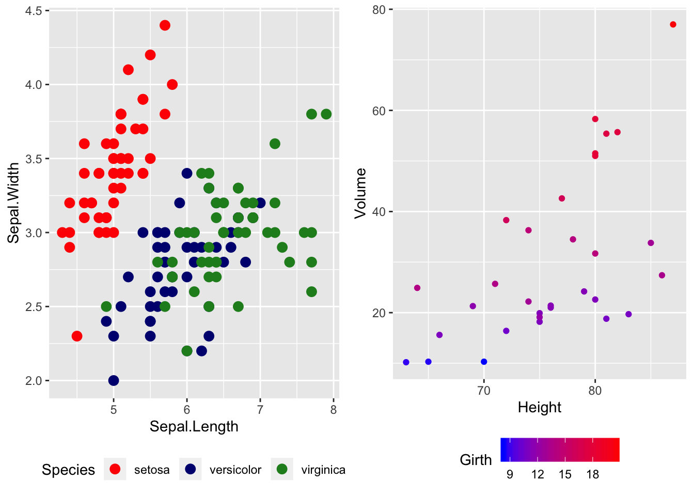

For continuous scales for fill and color, there is also a `scale_XXX_gradient2()` function which results in a *divergent* scale where you set the `low` and `high` values as well as the midpoint color and value. There is also a `scale_XXX_grandientn()` function that allows you to set as many colors as you like to move between.


```r
cowplot::plot_grid(
  P2 + scale_color_gradient2( low = 'black', mid='white', midpoint=14, high='red' ),
  P2 + scale_color_gradientn(colors = c('red','orange','yellow','green','blue','violet') )
)
```

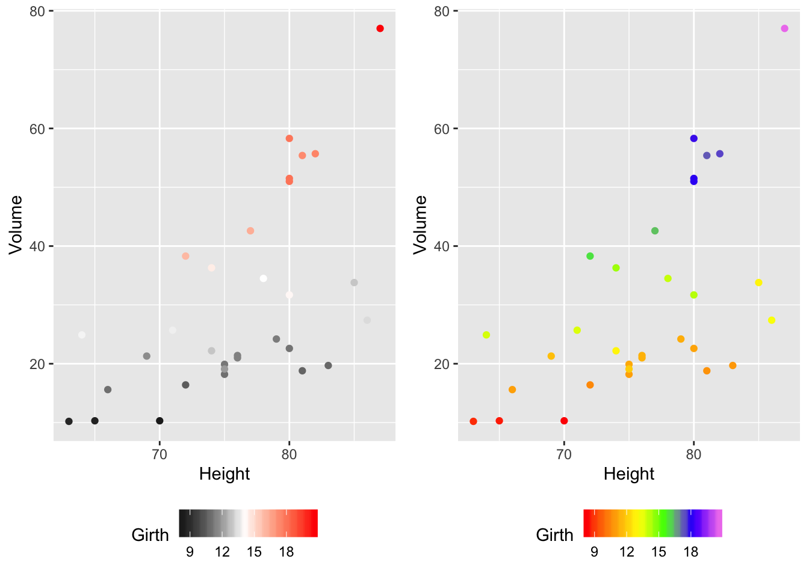

Generally I find that I make poor choices when picking colors manually, but there are times that it is appropriate.


#### Palettes
In choosing color schemes, a good approach is to use a color palette that has already been created by folks that know about how colors are displayed and what sort of color blindness is possible. There are two palette options that we'll discuss, but there are a variety of other palettes available by downloading a package.

##### `RColorBrewer` palettes
Using the `ggplot::scale_XXX_brewer()` functions, we can easily work with the package `RColorBrewer` which provides a nice set of color palettes. These palettes are separated by purpose. 

**Qualitative** palettes employ different hues to create visual differences between classes. These palettes are suggested for nominal or categorical data sets.
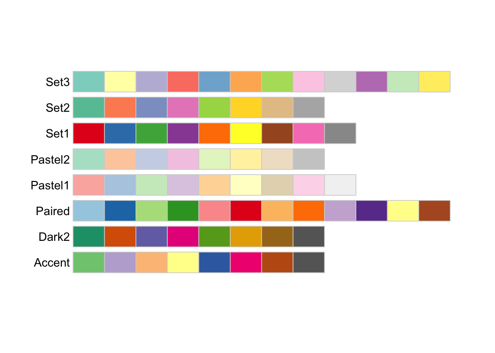

**Sequential** palettes progress from light to dark. When used with interval data, light colors represent low data values and dark colors represent high data values.
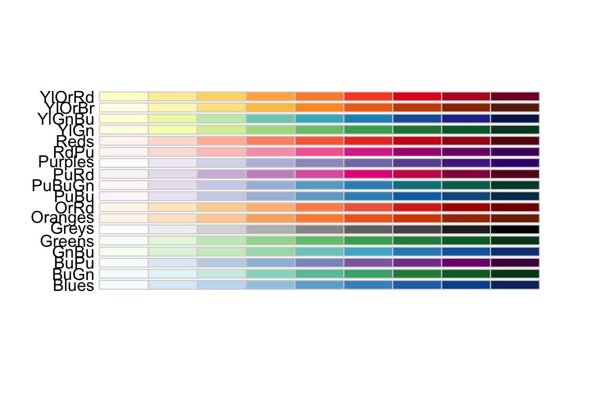

**Diverging** palettes are composed of darker colors of contrasting hues on the high and low extremes and lighter colors in the middle.
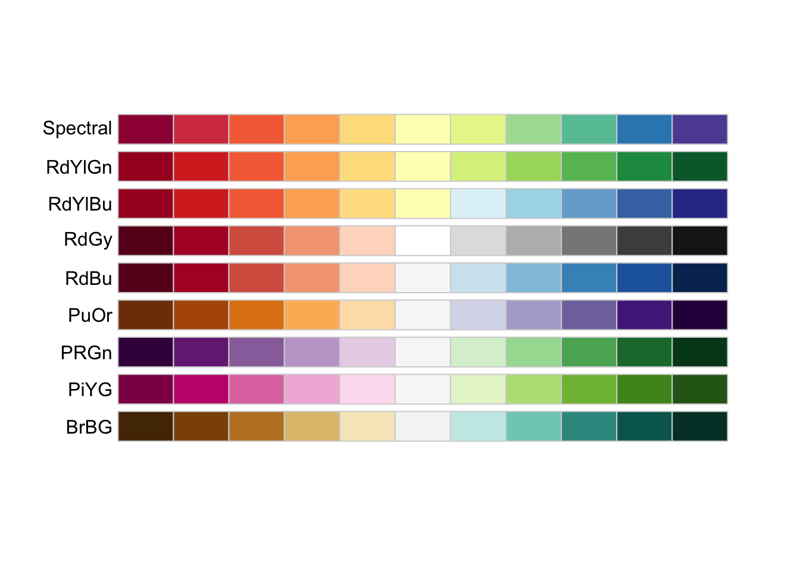


To use one of these palettes, we just need to pass the palette name to `scale_color_brewer` or `scale_fill_brewer`

```r
cowplot::plot_grid(
  P1 + scale_color_brewer(palette='Dark2'),
  P4 + scale_fill_brewer(palette='Dark2') )
```

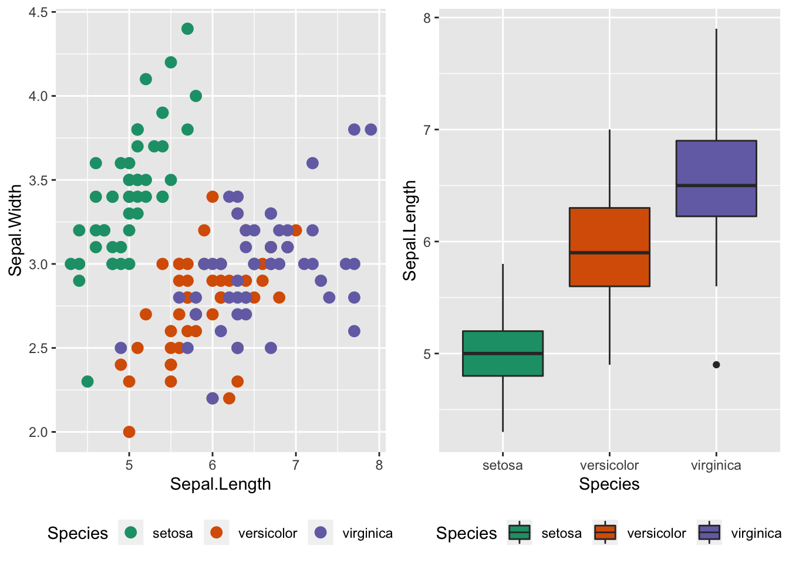


##### `viridis` palettes

The package `viridis` sets up a few different color palettes that have been well thought out and maintain contrast for people with a variety of color-blindess types as well as being converted to grey-scale.

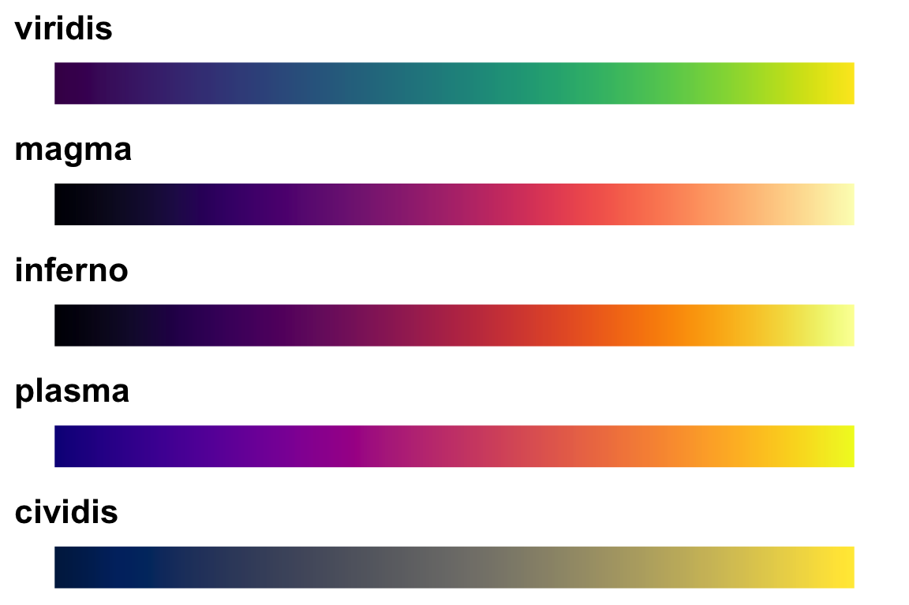


```r
cowplot::plot_grid(
  P1 + scale_color_viridis_d(option='plasma'),      # _d for discrete
  P2 + scale_color_viridis_c( option='viridis') )   # _c for continuous
```

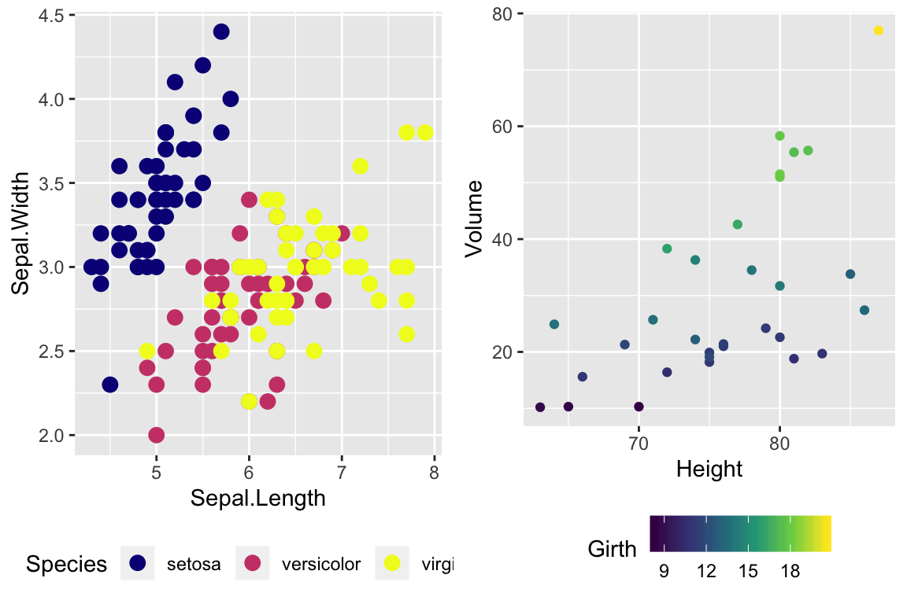


There are a bunch of other packages that manage color palettes such as `paletteer`, `ggsci` and `wesanderson`. 


### Setting major & minor ticks
For continuous variables, we need to be able to control what tick and grid lines are displayed.  In `ggplot`, there are *major* and *minor* breaks and the major breaks are labeled and minor breaks are in-between the major breaks. The break point labels can also be set.


```r
ggplot(trees, aes(x=Height, y=Volume)) + geom_point() +
  scale_x_continuous( breaks=seq(65,90, by=5) ) +
  scale_y_continuous( breaks=c(30,50), labels=c('small','big') )
```

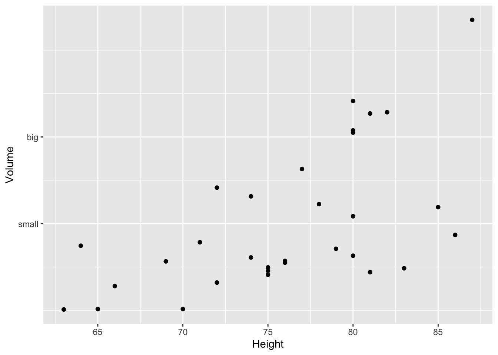

### Log Scales
For this example, we'll use the `ACS` data from the `Lock5Data` package that has information about `Income` (in thousands of dollars) and `Age`. Lets make a scatterplot of the data.

```r
# Import the data and drop any zeros
data('ACS', package='Lock5Data') 
ACS <- ACS %>%
  drop_na() %>% filter(Income > 0)

cowplot::plot_grid(
  ggplot(ACS, aes(x=Age, y=Income)) +
    geom_point(),
  ggplot(ACS, aes(x=Age, y=log10(Income))) +
    geom_point()
)
```

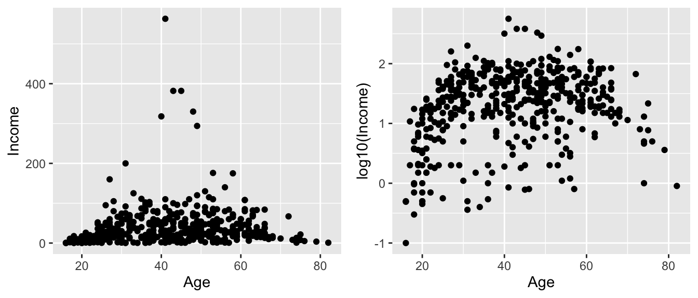

Plotting the raw data results in an ugly graph because six observations dominate the graph and the bulk of the data (income < $100,000) is squished together. One solution is to plot income on the $\log_{10}$ scale. The second graph does that, but the labeling is all done on the log-scale and most people have a hard time thinking in terms of logs.

This works quite well to see the trend of peak earning happening in a persons 40s and 50s, but the scale is difficult for me to understand (what does $\log_{10}\left(X\right)=1$ mean here? Oh right, that is $10^{1}=X$ so that is the $10,000 line). It would be really nice if we could do the transformation but have the labels on the original scale. 


```r
cowplot::plot_grid(
  ggplot(ACS, aes(x=Age, y=Income)) +
    geom_point() +
    scale_y_log10(),
  ggplot(ACS, aes(x=Age, y=Income)) +
    geom_point() +
    scale_y_log10(breaks=c(1,10,100),
                  minor=c(1:10,
                        seq( 10, 100,by=10 ),
                        seq(100,1000,by=100))) +
    ylab('Income (1000s of dollars)')
)
```

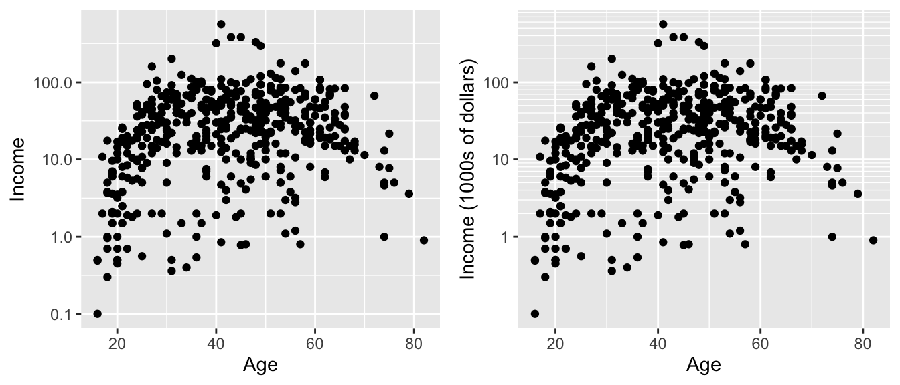

Now the y-axis is in the original units (thousands of dollars) but obnoxiously we only have two labeled values. Lets define the major break points (the white lines that have numerical labels) to be at 1,10,100 thousand dollars in salary. Likewise we will tell `ggplot2` to set minor break points at 1 to 10 thousand dollars (with steps of 1 thousand dollars) and then 10 thousand to 100 thousand but with step sizes of 10 thousand, and finally minor breaks above 100 thousand being in steps of 100 thousand.


## Geographic Maps

We often need to graph countries or U.S. States. We might then fill the color of the state or countries by some variable. To do this, we need information about the shape and location of each country within some geographic coordinate system. The easiest system to work from is Latitude (how far north or south of the equator) and Longitude (how far east or west the prime meridian). 

### Package `maps`
The R package `maps` is one of the easiest way to draw a country or state map. I tend to use this package first because I can access world and regional maps fairly easily and I don't have to worry about map projections or coordinate systems or any fancy GIS encoding. Unfortunately it is fairly US specific.

Because we might be interested in continents, countries, states/provinces, or counties, in the following discussion we'll refer to the geographic area of interest as a *region*. For `ggplot2` to interact with GIS type objects, we need a way to convert a GIS database of regions into a `data.frame` of a bunch of data points about the region's borders, where each data point is a Lat/Long coordinate and the region and sub-region identifiers. Then, to produce a map, we just draw a path through the data points. For regions like Hawaii's, which are composed of several non-contiguous areas, we include sub-regions so that the boundary lines don't jump from island to island.

Once we have the `data.frame` of regions that we are interested in selected, all we need to do is draw polygons in `ggplot2`.

```r
# ggplot2 function to create a data.frame with world level information
geo.data <- ggplot2::map_data('world') # Using maps::world database. 

# group: which set of points are contiguous and should be connected
# order: what order should the dots be connected
# region: The name of the region of interest
# subregion: If there are sub-regions with greater region
head(geo.data)
```

```
##        long      lat group order region subregion
## 1 -69.89912 12.45200     1     1  Aruba      <NA>
## 2 -69.89571 12.42300     1     2  Aruba      <NA>
## 3 -69.94219 12.43853     1     3  Aruba      <NA>
## 4 -70.00415 12.50049     1     4  Aruba      <NA>
## 5 -70.06612 12.54697     1     5  Aruba      <NA>
## 6 -70.05088 12.59707     1     6  Aruba      <NA>
```

```r
# Now draw a nice world map, 
ggplot(geo.data, aes(x = long, y = lat, group = group)) +
  geom_polygon( colour = "white", fill='grey50') 
```


The `maps` package has several data bases of geographical regions.  

|  Database    |  Description                               |
|:------------:|:-------------------------------------------|
| `world`      |  Country borders across the globe          |
| `usa`        |  The country boundary of the United States |
| `state`      |  The state boundaries of the United States |
| `county`     |  The county boundaries within states of the United States |
| `lakes`      |  Large fresh water lakes across the world  |
| `italy`      |  Provinces in Italy                        |
| `france`     |  Provinces in France                       |
| `nz`         |  North and South Islands of New Zealand    |

From within each of these databases, we can select to just return a particular region. So for example, we can get all the information we have about Ghana using the following:

```r
ggplot2::map_data('world', regions='ghana') %>%
  ggplot( aes(x=long, y=lat, group=group)) +
  geom_polygon( color = 'white', fill='grey40')
```

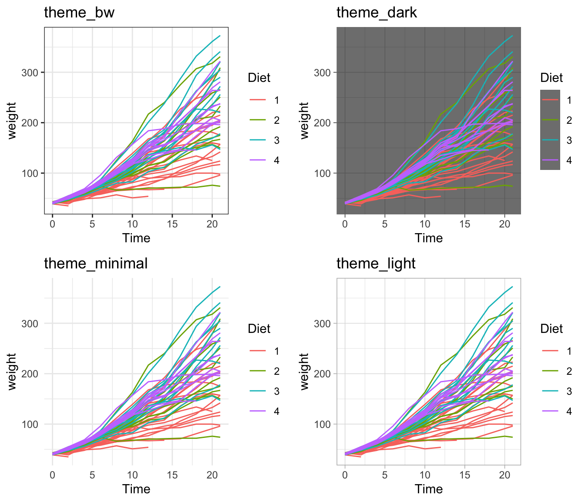

The `maps` package also has a `data.frame` of major US cities.  


```r
az.cities <- maps::us.cities %>%             # Lat/Long of major US cities
  filter(country.etc == 'AZ') %>%            # Only the Arizona Cities
  mutate(name = str_remove(name, '\\sAZ') )  # remove ' AZ' from the city name

ggplot2::map_data('state', regions='arizona') %>%
  ggplot( aes(x=long, y=lat)) +
  geom_polygon( aes(group=group), color = 'white', fill='grey40') +
  geom_point(data=az.cities) +
  ggrepel::geom_text_repel(data=az.cities, aes(label=name))
```

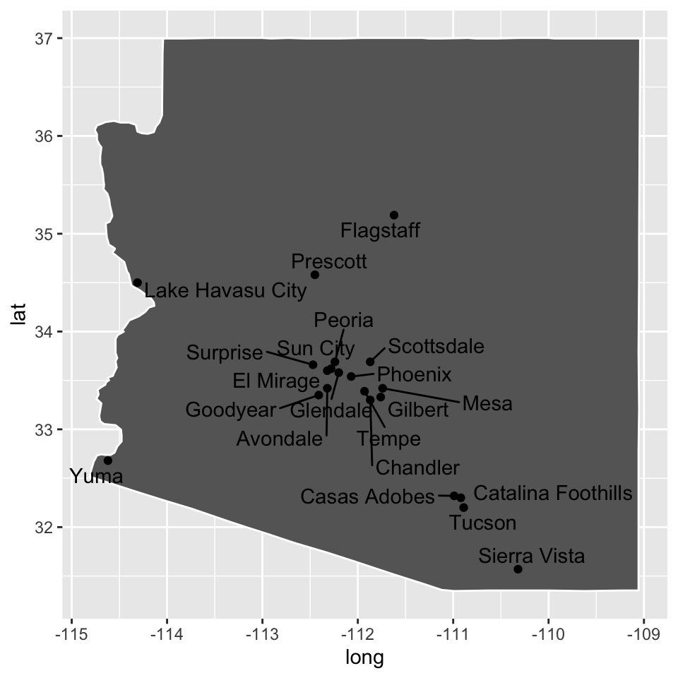

The `maps` package is fairly primitive in the data it has as well as the manner in which it stores the data. Another alternative is to use the *spatial features* package `sf` along with an on-line data base of GIS information from [Natural Earth](https://www.naturalearthdata.com).

There is a nice [tutorial](https://www.r-spatial.org/r/2018/10/25/ggplot2-sf.html) for the `sf` package. 


## Exercises


