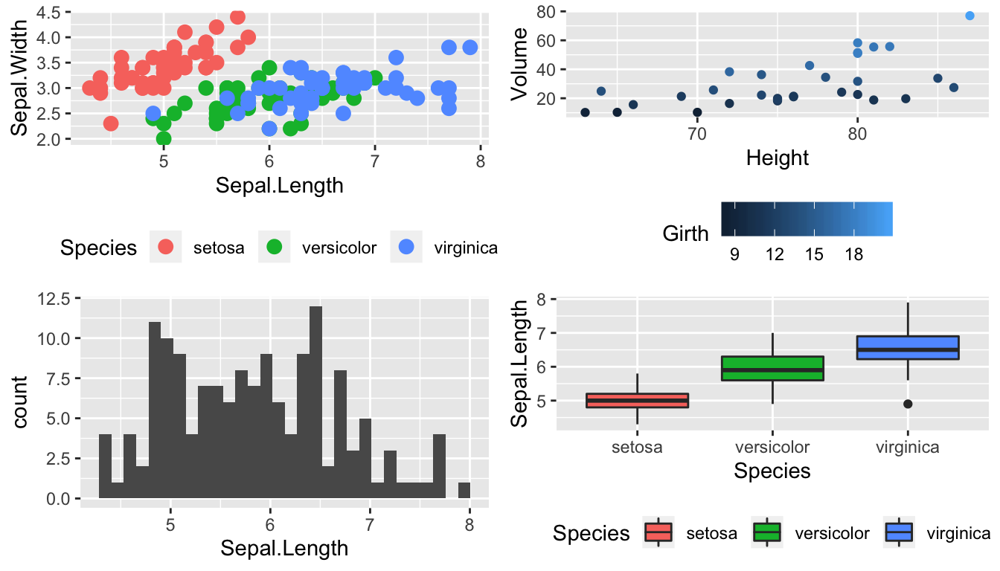
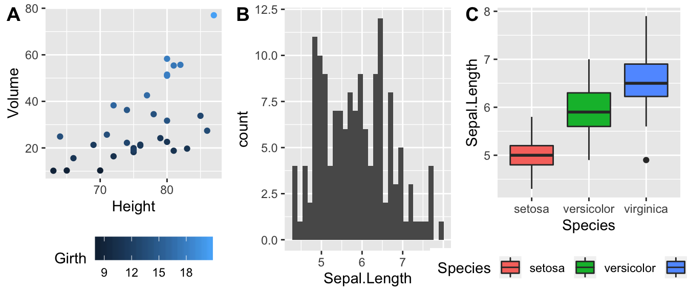
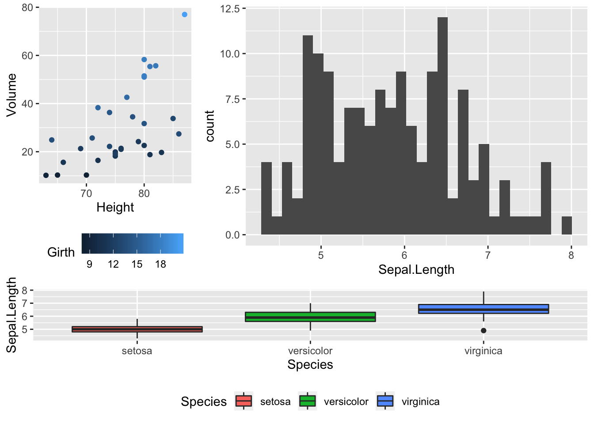

# Graphing Part II


```r
library(tidyverse)   # loading ggplot2 and dplyr
```

We have already seen how to create many basic graphs using the `ggplot2` package. However we haven't addressed many common scenarios. In this chapter we cover many graphing tasks that occur.

## Multi-plots

## Customized Scales
### Color Scales
### Setting major & minor ticks
### Log Scales

## Theme Elements

## Package `ggrepel`

## Geographic Maps

We often need to graph countries or U.S. States. We might then fill the color of the state or countries by some variable. To do this, we need information about the shape and location of each country within some geographic coordinate system. The easiest system to work from is Latitude (how far north or south of the equator) and Longitude (how far east or west the prime meridian). 

### Package `maps`
The R package `maps` is one of the easiest way to draw a country or state map. I tend to use this package first because I can access world and regional maps fairly easily and I don't have to worry about map projections or coordinate systems or any fancy GIS encoding. Unfortunately it is fairly US specific.

Because we might be interested in continents, countries, states/provinces, or counties, in the following discussion we'll refer to the geographic area of interest as a *region*. For `ggplot2` to interact with GIS type objects, we need a way to convert a GIS database of regions into a `data.frame` of a bunch of data points about the region's borders, where each data point is a Lat/Long coordinate and the region and sub-region identifiers. Then, to produce a map, we just draw a path through the data points. For regions like Hawaii's, which are composed of several non-contiguous areas, we include sub-regions so that the boundary lines don't jump from island to island.

Once we have the `data.frame` of regions that we are interested in selected, all we need to do is draw polygons in `ggplot2`.

```r
# ggplot2 function to create a data.frame with world level information
geo.data <- ggplot2::map_data('world') # Using maps::world database. 

# group: which set of points are contiguous and should be connected
# order: what order should the dots be connected
# region: The name of the region of interest
# subregion: If there are sub-regions with greater region
head(geo.data)
```

```
##        long      lat group order region subregion
## 1 -69.89912 12.45200     1     1  Aruba      <NA>
## 2 -69.89571 12.42300     1     2  Aruba      <NA>
## 3 -69.94219 12.43853     1     3  Aruba      <NA>
## 4 -70.00415 12.50049     1     4  Aruba      <NA>
## 5 -70.06612 12.54697     1     5  Aruba      <NA>
## 6 -70.05088 12.59707     1     6  Aruba      <NA>
```

```r
# Now draw a nice world map, 
ggplot(geo.data, aes(x = long, y = lat, group = group)) +
  geom_polygon( colour = "white", fill='grey50') 
```



The `maps` package has several data bases of geographical regions.  

|  Database    |  Description                               |
|:------------:|:-------------------------------------------|
| `world`      |  Country borders across the globe          |
| `usa`        |  The country boundary of the United States |
| `state`      |  The state boundaries of the United States |
| `county`     |  The county boundaries within states of the United States |
| `lakes`      |  Large fresh water lakes across the world  |
| `italy`      |  Provinces in Italy                        |
| `france`     |  Provinces in France                       |
| `nz`         |  North and South Islands of New Zealand    |

From within each of these databases, we can select to just return a particular region. So for example, we can get all the information we have about Ghana using the following:

```r
ggplot2::map_data('world', regions='ghana') %>%
  ggplot( aes(x=long, y=lat, group=group)) +
  geom_polygon( color = 'white', fill='grey40')
```



The `maps` package also has a `data.frame` of major US cities.  


```r
az.cities <- maps::us.cities %>%             # Lat/Long of major US cities
  filter(country.etc == 'AZ') %>%            # Only the Arizona Cities
  mutate(name = str_remove(name, '\\sAZ') )  # remove ' AZ' from the city name

ggplot2::map_data('state', regions='arizona') %>%
  ggplot( aes(x=long, y=lat)) +
  geom_polygon( aes(group=group), color = 'white', fill='grey40') +
  geom_point(data=az.cities) +
  ggrepel::geom_text_repel(data=az.cities, aes(label=name))
```




## Exercises
