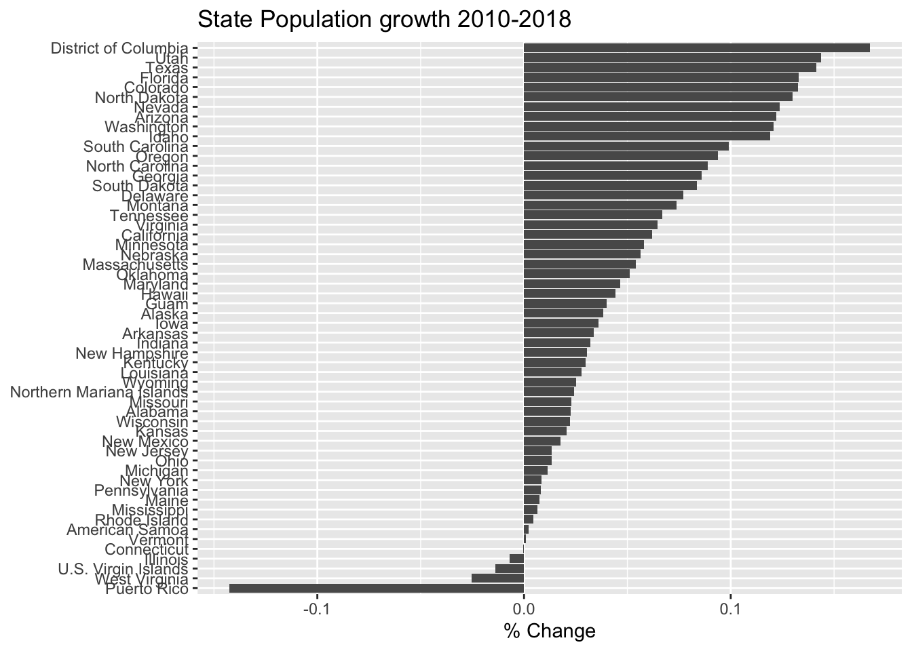

# Data Scraping


```r
library(tidyverse)
library(rvest)     # rvest is not loaded in the tidyverse Metapackage
```

Getting data into R often involves accessing data that is available through non-convenient formats such as web pages or .pdf files. Fortunately those formats still have structure and we can import data from those sources. However to do this, we have to understand a little bit about those file formats.

## Web Pages

Posting information on the web is incredibly common. As we first use google to find answers to our problems, it is inevitable that we'll want to grab at least some of that information and import it as data into R. There are several ways to go about this:

1. Human Copy/Paste - Sometimes it is easy to copy/paste the information into a spreadsheet. This works for small datasets, but sometimes the HTML markup attributes get passed along and this suddenly becomes very cumbersome for more than a small amount of data. Furthermore, if the data is updated, we would have to redo all of the work instead of just re-running or tweaking a script.

2. Download the page, parse the HTML, and select the information you want. The difficulty here is knowing what you want in the raw HTML tags.


Knowing how web pages are generated is certainly extremely helpful in this endeavor, but isn't absolutely necessary. It is sufficient to know that HTML has open and closing tags for things like tables and lists.


```text
# Example of HTML code that would generate a table
# Table Rows    begin and end with <tr> and </tr>
# Table Data    begin and end with <td> and </td>
# Table Headers begin and end with <th> and </th> 
<table style="width:100%">
  <tr> <th>Firstname</th> <th>Lastname</th>     <th>Age</th>  </tr>
  <tr> <td>Derek</td>     <td>Sonderegger</td>  <td>43</td>   </tr>
  <tr> <td>Aubrey</td>    <td>Sonderegger</td>  <td>39</td>   </tr>
</table>
```


```r
# Example of an unordered List, which starts and ends with <ul> and </ul>
# Each list item is enclosed by <li> </li>
<ul>
  <li>Coffee</li>
  <li>Tea</li>
  <li>Milk</li>
</ul>
```

Given this extremely clear structure it shouldn't be too hard to grab tables and/or lists from a web page. However HTML has a heirarchical structure so that tables could be nested in lists. In order to control the way the page looks, there is often a **lot** of nesting. For example, we might be in a split pane page that has a side bar, and then a block that centers everything, and then some style blocks that control fonts and colors. Add to this, the need for modern web pages to display well on both mobile devices as well as desktops and the raw HTML typically is extremely complicated. 
In summary the workflow for scraping a web page will be:

1. Find the webpage you want to pull information from.
2. Download the html file
3. Parse it for tables or lists (this step could get ugly!)
4. Convert the HTML text or table into R data objects.

Hadley Wickham wrote a package to address the need for web scraping functionality and it happily works with the usual `magrittr` pipes. The package `rvest` is intended to *harvest* data from the web and make working with html pages relatively simple.

### Example Wikipedia Table
Recently I needed to get information about U.S. state population sizes. I did a quick googling and found a
[Wikipedia](https://en.wikipedia.org/wiki/List_of_states_and_territories_of_the_United_States_by_population) 
page that has the information that I wanted. 


```r
url = 'https://en.wikipedia.org/wiki/List_of_states_and_territories_of_the_United_States_by_population'

# Download the web page and save it. I like to do this within a single R Chunk
# so that I don't keep downloading a page repeatedly while I am fine tuning 
# the subsequent data wrangling steps.
page <- read_html(url)
```


```r
# Once the page is downloaded, we need to figure out which table to work with.

# There are 5 tables on the page.
page %>%
  html_nodes('table') 
```

```
## {xml_nodeset (5)}
## [1] <table class="wikitable sortable" style="width:100%; text-align:cent ...
## [2] <table class="wikitable"><tbody>\n<tr><th style="text-align: left;"> ...
## [3] <table class="wikitable sortable" style="text-align: right;">\n<capt ...
## [4] <table class="nowraplinks hlist mw-collapsible autocollapse navbox-i ...
## [5] <table class="nowraplinks hlist mw-collapsible mw-collapsed navbox-i ...
```

With five tables on the page, I need to go through each table individually and decide if it is the one that I want. To do this, we'll take each table and convert it into a data.frame and view it to see what information it contains.


```r
State_Pop <- page %>%
  html_nodes('table') %>% 
  .[[1]] %>%        # Grab the first table and 
  html_table()      # convert it from HTML into a data.frame 

# To view this table, we could use View() or print out just the first few
# rows and columns. Converting it to a tibble makes the printing turn out nice.
State_Pop %>% as_tibble()  
```

```
## # A tibble: 60 x 12
##    `Rank in the fi… `Rank in states… Name  `Population est…
##    <chr>            <chr>            <chr> <chr>           
##  1 1                1                Cali… 39,557,045      
##  2 2                2                Texas 28,701,845      
##  3 3                4                Flor… 21,299,325      
##  4 4                3                New … 19,542,209      
##  5 5                6                Penn… 12,807,060      
##  6 6                5                Illi… 12,741,080      
##  7 7                7                Ohio  11,689,442      
##  8 8                9                Geor… 10,519,475      
##  9 9                10               Nort… 10,383,620      
## 10 10               8                Mich… 9,995,915       
## # … with 50 more rows, and 8 more variables: `Census population, April 1,
## #   2010[6]` <chr>, `Percent change, 2010–2018[note 1]` <chr>, `Absolute
## #   change, 2010-2018` <chr>, `Total seats in the U.S. House of
## #   Representatives, 2013–2023` <chr>, `Estimated population per electoral
## #   vote, 2018[note 2]` <chr>, `Estimated population per House seat,
## #   2018` <chr>, `Census population per House seat, 2010` <chr>, `Percent
## #   of the total U.S. population, 2018[note 3]` <chr>
```

It turns out that the first table on the page is the one that I want. Now we need to just do a little bit of clean up by renaming columns, and turning the population values from character strings into numbers. To do that, we'll have to get rid of all those commas. Also, the rows for the U.S. territories have text that was part of the footnotes. So there are [7], [8], [9], and [10] values in the character strings.  We need to remove those as well.


```r
State_Pop <- page %>%
  html_nodes('table') %>% .[[1]] %>%   # First table on the page
  html_table()  %>%                    # as a data.frame
  rename(Population2018 = `Population estimate, July 1, 2018[5]`,
         Population2010 = `Census population, April 1, 2010[6]`)  %>%
  select(Name, Population2018, Population2010) %>%
  mutate_at( vars(matches('Pop')), str_remove_all, ',') %>%           # remove all commas
  mutate_at( vars(matches('Pop')), str_remove, '\\[[0-9]+\\]') %>%    # remove [7] stuff
  mutate_at( vars( matches('Pop')), as.numeric)                       # convert to numbers
```

And just to show off the data we've just imported from Wikipedia, we'll make a nice graph.


```r
State_Pop %>%
  filter( !(Name %in% c('Contiguous United States', 
                        'The fifty states','Fifty states + D.C.',
                        'Total U.S. (including D.C. and territories)') ) )  %>%
  mutate( Percent_Change = (Population2018 - Population2010)/Population2010 ) %>%
  mutate( Name = fct_reorder(Name, Percent_Change) ) %>%
ggplot( aes(x=Name, y=Percent_Change) ) +
  geom_col( ) +
  labs(x=NULL, y='% Change', title='State Population growth 2010-2018') +
  coord_flip() 
```




### Lists
Unfortunately, we don't always want to get information from a webpage that is nicely organized into a table. Suppose we want to gather the most recent threads on [Digg](www.digg.com).

We could sift through the HTML tags to find something that will match, but that will be challenging.  Instead we will use a CSS selector named [SelectorGadget](https://selectorgadget.com). Install the bookmarklet by dragging this [bookmarklet](javascript:(function(){var%20s=document.createElement('div');s.innerHTML='Loading...';s.style.color='black';s.style.padding='20px';s.style.position='fixed';s.style.zIndex='9999';s.style.fontSize='3.0em';s.style.border='2px%20solid%20black';s.style.right='40px';s.style.top='40px';s.setAttribute('class','selector_gadget_loading');s.style.background='white';document.body.appendChild(s);s=document.createElement('script');s.setAttribute('type','text/javascript');s.setAttribute('src','https://dv0akt2986vzh.cloudfront.net/unstable/lib/selectorgadget.js');document.body.appendChild(s);})();) 
up to your browsers bookmark bar.  When you are at the site you are interested in, just click on the bookmarklet to engage the CSS engine. Click on something you want to capture. This will highlight a whole bunch of things that match the HTML tag listed at the bottom of the screen. Select or deselect items by clicking on them and the search string used to refine the selection will be updated. Once you are happy with the items being selected, copy the HTML node selector.


```r
url <- 'http://digg.com'
page <- read_html(url)
```


```r
# Once the page is downloaded, we use the SelectorGadget Parse string
# To just give the headlines, we'll use html_text()
HeadLines <- page %>%
  html_nodes('.headline a') %>%    # Grab just the headlines
  html_text()                      # Convert the <a>Text</a> to just Text
HeadLines %>%
  head()
```

```
## [1] "\nEpidemic, Economic Collapse, War: How Members Of A Survivalist Camp In West Virginia Are Preparing\n"
## [2] "\nIs It Worth It To Be Loyal To One Airline?\n"                                                        
## [3] "\nElizabeth Warren Gives Brilliant, Savage Response To Marriage Equality Question\n"                   
## [4] "\nThe Watch Brand Everyone Is Talking About\n"                                                         
## [5] "\nHelicopter Flies Too Low During Indonesian Military Parade, Ends Up Destroying VIP Podium\n"         
## [6] "\nThe Navy’s Patent For A Compact Nuclear Fusion Reactor Is Wild\n"
```


```r
# Each headline is also a link.  I might want to harvest those as well
Links <- page %>%
  html_nodes('.headline a') %>%
  html_attr('href')  
Links %>%
  head()
```

```
## [1] "https://www.washingtonpost.com/local/at-fortitude-ranch-the-cabin-is-for-vacationing-the-shelters-are-for-surviving/2019/10/08/643bff30-d597-11e9-9610-fb56c5522e1c_story.html?utm_source=digg"
## [2] "https://melmagazine.com/en-us/story/is-it-worth-it-to-be-loyal-to-one-airline?utm_source=digg"                                                                                                 
## [3] "/2019/elizabeth-warren-funny-response-marriage-equality"                                                                                                                                       
## [4] "//srv.buysellads.com/ads/click/x/GTND42QUCTSIK5QJCWY4YKQMCAYI6K3UCK7DCZ3JCWSI4KJJF6SDKKQKC6BI5K3YCT7DVK3EHJNCLSIZ?utm_source=digg"                                                             
## [5] "/video/helicopter-indonesia-military-parade-podium-wrecked-fail"                                                                                                                               
## [6] "https://www.popularmechanics.com/science/energy/a29427713/navy-compact-fusion-reactor/?utm_source=digg"
```


## Scraping .pdf files
PDF documents can either be created with software that produce text that is readable, or it can be scanned and everything is effectively an image. The work flow presented in this section assumes that the text is readable as text and is not an image.


## Exercises
1. At the Insurance Institute for Highway Safety, they have
[data](https://www.iihs.org/topics/fatality-statistics/detail/state-by-state) 
about human fatalities in vehicle crashes. From this web page, import the data from the Fatal Crash Totals data table and produce a bar graph gives the number of deaths per 100,000 individuals.  

2. From the same IIHS website, import the data about seat belt use. Join the Fatality data with the seat belt use and make a scatter plot of seat belt use vs number of fatalities per 100,000 people.

3. From the [NAU sub-reddit](https://www.reddit.com/r/NAU), extract the most recent threads.

